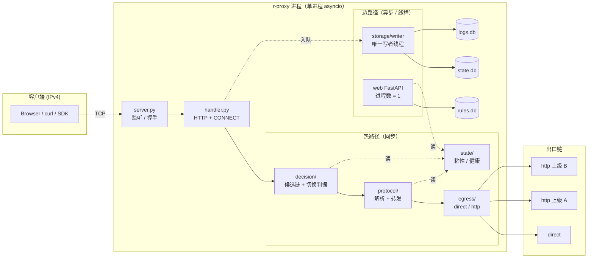
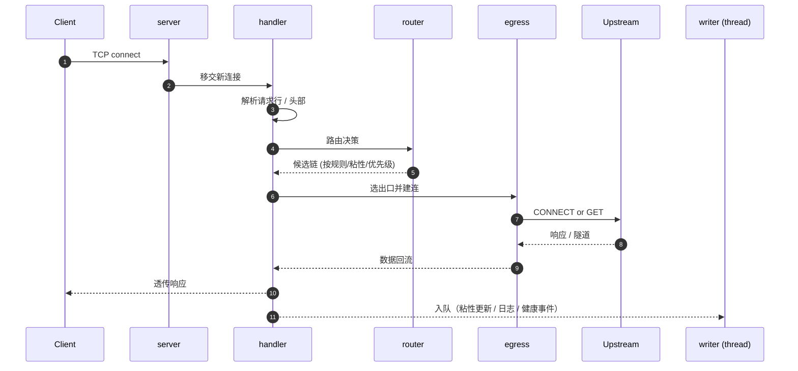

# r-proxy

[](https://www.python.org/)
[](pyproject.toml)
[](#%E5%BF%AB%E9%80%9F%E5%BC%80%E5%A7%8B)
[](#%E8%AE%B8%E5%8F%AF%E8%AF%81)

轻量级 HTTP/HTTPS 正向代理，具备多上级代理优先级故障切换、规则路由、粘性会话记忆、熔断保护与 Web 管理界面。代理核心使用 Python 3.12 标准库实现，**零运行时第三方依赖**；Web 管理界面作为可选组件按需安装。

## 特性

- **HTTP / HTTPS 正向代理**：支持 `GET`/`POST` 等常规方法与 `CONNECT` 隧道
- **多上级代理与优先级故障切换**：出口按 `priority`（数字越小越优先）排序，同优先级组内轮询；出口不可用时按判据自动切换到下一个
- **稳健的切换判据**：区分传输层失败与 HTTP 响应、区分"代理不可用"与"目标已处理"、非幂等方法不重试、大请求体流式转发后不可切换、CONNECT 建立前的客户端字节会缓存并在新隧道重放
- **规则路由**：按主机名的有序规则表，支持精确匹配、`*.domain` 域名及子域、`host.*` 通配符、IP/IPv6 字面量、正则六种条件类型，首条命中即强制路由（跳过粘性与切换逻辑），只经 Web 界面维护
- **粘性会话记忆**：同一 host 自动复用上次成功的出口，减少每次请求都重新遍历候选链的开销；支持手动绑定（`manual`，优先级高于自动记忆）并可持久化跨重启
- **熔断保护**：出口连续失败达到阈值后短暂剔除出候选链；`direct` 出口永不参与全局熔断，避免个别被墙站点拖垮内网直连
- **IPv4 → IPv6 网关**：入向仅接受 IPv4 客户端，出向支持连接纯 IPv6 目标，对 `direct` 出口启用 Happy Eyeballs（`RFC 8305`）
- **SQLite 持久化**：`state.db`（粘性映射、健康状态，不可丢失）与 `logs.db`（请求审计、切换事件，可丢弃）分库存储，热路径不做同步磁盘 I/O，全部写入经唯一写者线程批量落盘
- **Web 管理界面**（可选）：监控看板、上级代理管理、粘性映射管理、规则编辑、全局配置，均通过 REST API 驱动
- **配置热重载**：`SIGHUP` 或 Web 界面保存配置后无需重启进程；飞行中的请求继续持有旧配置快照直到结束

## 架构总览

整套设计围绕三条主线展开，完整描述见 [`docs/design/ARCH_OVERVIEW.md`](docs/design/ARCH_OVERVIEW.md)：

| 主线 | 约束 | 关键设计 |
|------|------|----------|
| **热路径不阻塞** | `sqlite3` 与 `getaddrinfo` 是同步阻塞调用，在事件循环中调用会卡住所有连接转发 | 路由决策只读内存；DB 写入经队列由独立线程落盘；DNS 解析走 `loop.getaddrinfo`；Web 查询走 `asyncio.to_thread` |
| **唯一写者** | 多 SQLite 写者会触发 `SQLITE_BUSY` 并丢更新（实测 4 并发写者丢失 75% 计数） | `state.db` / `logs.db` 各自一个写者线程，`rules.db` 归 Web 配置写入器；Web 进程数固定为 1 |
| **失败归因** | 「代理坏了」「经这个代理到不了这个目标」「地址族不匹配」是三件不同的事 | 熔断只统计 `upstream_error`；`route_error` 只记 `(host, upstream)`；地址族不匹配在候选链构造阶段过滤 |



请求生命周期（HTTP 正向代理示例）：



## 性能基准

引用 [`study/sqlite-storage-benchmark.md`](study/sqlite-storage-benchmark.md)（NVMe XFS，`journal_mode=WAL`、`synchronous=NORMAL`）：

| 场景 | 实测 | 含义 |
|------|-----:|------|
| 单行自动提交吞吐 | 8,948 rows/s | 受 fsync 主导，换磁盘差异 33× |
| 批量 500 行 / 事务 | 393,411 rows/s | 与磁盘基本无关，≈ 0.0025 ms/行 |
| 粘性 UPSERT（单条） | 22,925 ops/s | 满足代理请求级更新需求 |
| `BEGIN` deferred + Python 读改写 | 509 / 期望 2000 | **丢 75%**，禁止写法 |
| `UPDATE ... SET c = c + 1`（SQL 侧自增） | 2000 / 期望 2000 | 零丢失，也无需显式事务 |

**结论**：热路径走内存读写，所有持久化写入进队列由**唯一写者线程**批量落盘；计数器一律 `SET c = c + 1`，严禁 Python 侧读改写。

## 快速开始

### 安装

```bash
# 仅代理核心（零第三方依赖）
pip install -e .

# 含 Web 管理界面
pip install -e ".[web]"

# 开发环境（含 ruff/mypy/pytest）
pip install -e ".[web,dev]"
```

### 最小配置

创建 `config.toml`：

```toml
[[upstreams]]
name = "direct"
type = "direct"
```

未显式配置的项均使用内置默认值：代理监听 `127.0.0.1:6060`，Web 界面监听 `127.0.0.1:6061`，数据库落在 `~/.r-proxy/`。

### 运行

```bash
r-proxy --config config.toml

# 只校验配置，不绑定端口
r-proxy --config config.toml --check

# 不启动 Web 管理界面，仅代理
r-proxy --config config.toml --no-web
```

### 验证

```bash
curl -x http://127.0.0.1:6060 http://example.com
curl -x http://127.0.0.1:6060 https://example.com
```

## 命令行参数

| 参数 | 说明 |
|------|------|
| `--config PATH` | 配置文件路径，默认取环境变量 `R_PROXY_CONFIG`，再默认取 `./config.toml` |
| `--host` | 覆盖 `listen.host` |
| `--port` | 覆盖 `listen.port` |
| `--no-web` | 不启动 Web 管理界面（等价于 `webui.enabled = false`） |
| `--check` | 只加载并校验配置，成功则退出码 `0`，不监听任何端口 |
| `--log-level` | `DEBUG`/`INFO`/`WARNING`/`ERROR`，默认 `INFO` |
| `--version` | 打印版本号 |

配置优先级：**命令行参数 > 环境变量 > 配置文件 > 内置默认值**。

## 配置

配置为 TOML 格式（核心用标准库 `tomllib` 读取，Web 界面写回用 `tomlkit` 以保留注释）。完整字段以 [`docs/requirements/PRD_OVERVIEW.md`](docs/requirements/PRD_OVERVIEW.md) §4.2.1 为准，常用节如下：

```toml
[listen]
host = "127.0.0.1"   # 仅接受 IPv4；配置 IPv6 地址会启动失败
port = 6060

[webui]
enabled = true
host = "127.0.0.1"   # 绑定非回环地址时 auth_token 必填，否则拒绝启动
port = 6061
# auth_token = "替换为随机字符串"
workers = 1           # 固定为 1：多进程会产生第二个数据库写者，破坏单一写者假设

[database]
state_path = "~/.r-proxy/state.db"   # 粘性、健康状态，不可丢失
logs_path = "~/.r-proxy/logs.db"     # 请求日志、切换事件，可丢弃
rules_path = "~/.r-proxy/rules.db"   # 规则表，只经 Web 界面写入
retention_days = 30

[rules]
enabled = true   # 救场开关：改为 false 时忽略全部规则，所有流量走自动路由

[routing]
connect_timeout = 10.0
read_timeout = 30.0
switch_on_status = [403, 407, 408, 429, 451, 502, 503, 504, 511]

[[upstreams]]
name = "direct"
type = "direct"
priority = 100

[[upstreams]]
name = "home-proxy"
type = "http"
address = "198.51.100.100:7890"
priority = 10
```

路由规则不写在配置文件里，只能通过 Web 界面维护并存入 `rules.db`；这是为了支持首匹配胜出的有序表语义与在线编辑，详见 [`docs/requirements/RULES_CONFIG.md`](docs/requirements/RULES_CONFIG.md)。

### 环境变量

| 变量 | 说明 |
|------|------|
| `R_PROXY_CONFIG` | 配置文件路径，未传 `--config` 时生效 |
| `R_PROXY_WEB_TOKEN` | Web 界面认证 token，优先级高于配置文件中的 `webui.auth_token` |

## 路由决策顺序

```
1. 规则命中（rules.db，首匹配胜出，只按主机名）→ 强制使用指定出口，跳过以下步骤
2. manual 粘性映射 → 手动绑定的出口
3. auto 粘性映射 → 上次成功的出口
4. 出口优先级链 → priority 升序，同优先级组内轮询
```

规则强制路由失败时**不切换**、原样返回错误，也不读写粘性映射——规则是硬约束，粘性只是偏好。切换判据、状态码分类与幂等性约束详见 [`docs/design/DD_SWITCHING.md`](docs/design/DD_SWITCHING.md)。

## Web 管理界面

默认监听 `127.0.0.1:6061`，需要 `[web]` extra。

| 页面 | 路径 | 功能 |
|------|------|------|
| 监控看板 | `/` | 概览卡片、出口健康表、实时请求日志、切换事件流 |
| 上级代理管理 | `/upstreams` | 增删改、优先级拖拽排序、启用开关、连通性测试 |
| 粘性映射管理 | `/sticky` | 查看/清除自动记忆、手动改绑、固化为规则、负面记忆管理 |
| 规则编辑 | `/rules` | 有序规则表的增删改、拖拽排序、语法校验 |
| 全局设置 | `/settings` | 监听地址、超时、切换策略等配置项的表单编辑 |

安全要求：非回环绑定必须配置 `auth_token`，否则拒绝启动；启用认证后 `/api/*` 全部需要 token（包含只读接口）；比较用 `secrets.compare_digest`；日志中只记 token 哈希前 8 位。详见 [`docs/requirements/WEBUI_SPEC.md`](docs/requirements/WEBUI_SPEC.md) §7。

## 容器部署

```bash
docker compose up -d --build   # 部署（代理 6060、Web 界面 6061）
docker compose logs -f         # 日志
docker compose down            # 停止；配置与数据在宿主目录，不受影响
docker kill -s HUP r-proxy     # 热重载配置
```

配置与数据挂载在宿主 `/var/lib/r-proxy-docker/{config,data}`，容器与镜像整体重建后不丢失。容器使用 host 网络，以便代理端口的访问控制继续由宿主防火墙的源网段规则承担。完整方案（卷布局、迁移流程、已知问题）见 [`docs/design/DD_DEPLOY.md`](docs/design/DD_DEPLOY.md)。

## 项目结构

```
r_proxy/
├── cli.py              # 命令行入口、信号处理、热重载
├── server.py            # 服务器生命周期
├── handler.py            # 请求处理入口（HTTP + CONNECT）
├── protocol/             # 请求/响应解析、连接层
├── routing/              # 候选链构造、粘性、健康与熔断状态机
├── egress/                # 出口连接器（direct / http 上级）
├── storage/               # 三库 schema、写者线程、写队列
├── config/                # 配置模型、加载、校验、热重载
└── web/                   # 可选的 FastAPI 管理界面（[web] extra）
tests/                      # 单元测试
docs/
├── requirements/           # 需求文档
└── design/                 # 架构与模块详细设计
study/                      # 技术预研与基准测试
```

## 开发

```bash
ruff check .
mypy r_proxy
pytest
```

约束：代理核心（`protocol`/`routing`/`storage`/`egress`）仅使用标准库，禁止引入第三方运行时依赖；`fastapi`/`uvicorn`/`tomlkit` 仅限 `r_proxy/web`。

## 文档

| 文档 | 说明 |
|------|------|
| [docs/requirements/index.md](docs/requirements/index.md) | 产品需求、规则语法、Web 界面需求 |
| [docs/design/index.md](docs/design/index.md) | 架构概览、各模块详细设计、阅读顺序 |
| [study/index.md](study/index.md) | 技术选型预研与实测基准（如 SQLite 并发） |

## AI 助手配置

| 文件 | 用途 |
|------|------|
| `CLAUDE.md` | Claude Code 项目指令 |
| `AGENTS.md` | 通用 Agent 指令 |
| `.cursor/rules/` | Cursor IDE 规则 |

## 故障排查 / FAQ

| 现象 | 可能原因 | 处置 |
|------|----------|------|
| 启动报 `auth_token is required when binding to non-loopback` | Web 绑定非 `127.0.0.1` 但未配 token | 在 `[webui]` 中填 `auth_token`，或回退到 `host = "127.0.0.1"` |
| 启动报 `listen.host must be IPv4` | `listen.host` 或 `webui.host` 写成 IPv6 | r-proxy 入向仅接受 IPv4；IPv6 仅在出向目标支持 |
| 客户端拿到 `502 Bad Gateway` 且无更多信息 | 候选链耗尽 | 出口名称/失败原因不回显（防探测内网），查 `logs.db` 的切换事件；多数情况是上游断网或 `direct` 出口对纯 IPv6 目标本机无 v6 能力 |
| 规则改了不生效 | `rules.enabled = false` 或 `SIGHUP` 未送达 | 配置 `[rules] enabled = true`；`docker kill -s HUP` 会让 dockerd 放弃 restart-manager，应用 `docker exec kill -HUP 1` 或重启容器 |
| 写者线程告警 `queue depth > N` | 磁盘卡顿或并发写者 | 确认 Web 进程数为 1；`uvicorn workers > 1` 会 fork 第二个写者，立刻毁掉单一写者假设 |
| SQLite 报 `database is locked` | 多个进程同时打开 `state.db` / `logs.db` | 关掉任何外部 sqlite 客户端；写者线程已经做 `busy_timeout=5000`，正常负载下不应出现 |
| 计数偏差（健康表里的 fail_count 远小于实际失败） | 用了 Python 读改写而非 SQL 侧自增 | 严禁 `row.c = row.c + 1; row.save()`；必须 `UPDATE ... SET c = c + 1` |
| 容器重建后 db 权限错误 | 容器内 UID 与宿主不一致 | `Dockerfile` 固定 `uid/gid=10001`；宿主 bind mount 目录预先 `chown -R 10001:10001` |
| `pip install -e .` 之后 Web 界面打开全白 | 静态资源未打进 wheel | `pyproject.toml` 的 `[tool.setuptools.package-data]` 漏配 `r_proxy.web.static.*`；重新安装即可 |

更完整的排障经验沉淀在 [`experience/`](experience/) 与 `.learnings/experience/`（本地知识库，不入库）。

## 许可证

> ⚠️ 待定：项目尚未在仓库根目录声明 `LICENSE` 文件。在添加之前，默认为「保留所有权利」（All rights reserved）。如需以开源协议发布，可在 `LICENSE` 中选择 MIT / Apache-2.0 / BSD-3-Clause 等常见协议后再行调整。
