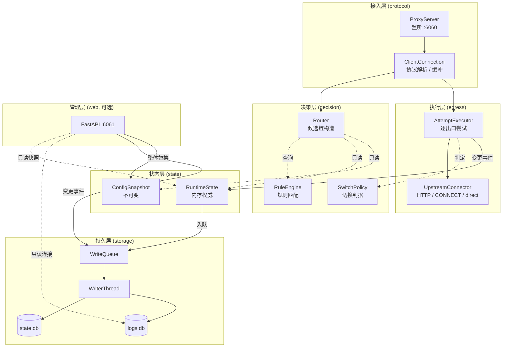
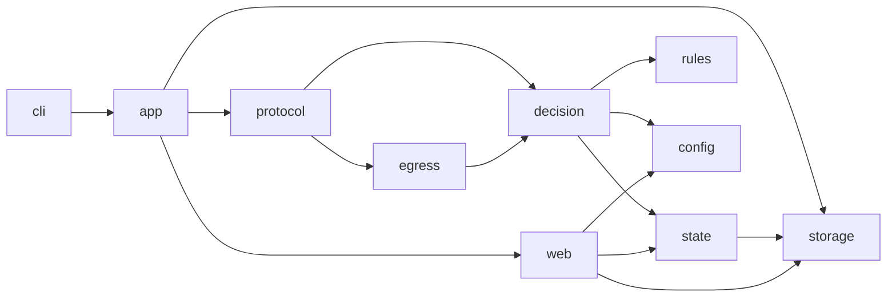
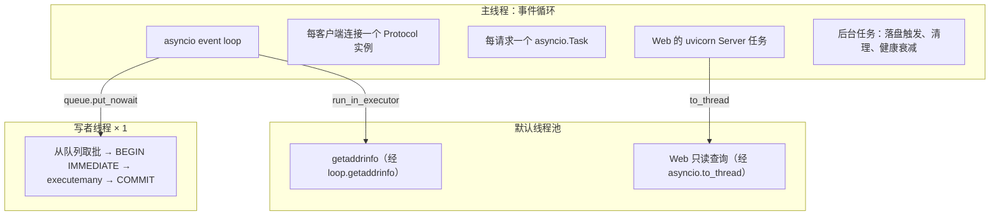
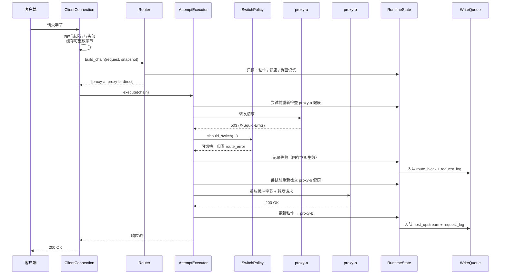
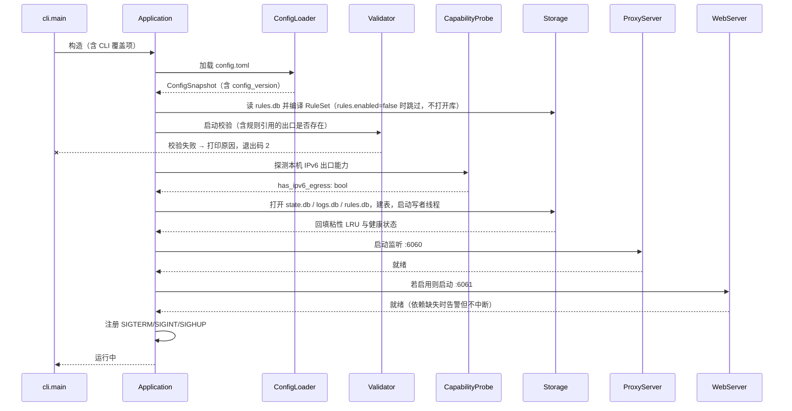
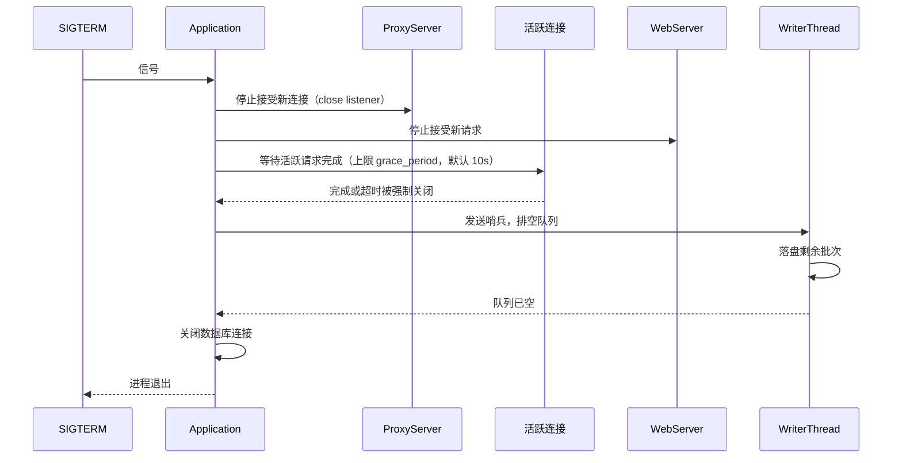

# ARCH_OVERVIEW.md - r-proxy 架构概览

| 版本 | 日期 | 变更说明 | 作者 |
| :--- | :--- | :--- | :--- |
| v1.0.0 | 2026-08-12 | 初始版本，描述最小可用代理（无路由能力） | Agent |
| v2.0.0 | 2026-08-13 | 全面重写以对齐 [PRD_OVERVIEW.md](../requirements/PRD_OVERVIEW.md) v1.5.0：新增分层模型、模块边界、并发模型（单进程 asyncio + 唯一写者线程 + 解析线程池）、启动与关闭时序、包结构、跨模块数据契约 | Agent |
| v2.1.0 | 2026-08-13 | 配置格式定案为 TOML：代理核心依赖收敛为纯标准库（`tomllib`），`tomlkit` 归入 `[web]` extra | Agent |
| v2.2.0 | 2026-08-14 | M3 实现回写：§4 包结构补 `persistence.py` 与 `storage/service.py` | Agent |
| v2.2.1 | 2026-08-14 | §4 补 `storage/metrics.py`；§11 可观测性补存储指标的周期日志上报通道 | Agent |
| v2.3.0 | 2026-08-16 | M5 实现回写：§2 的「唯一写者」改述为「每个库只有一个写者」并点明 `rules.db` 的写者；§4 包结构补 `storage/rules_store.py`；§7 启动时序中规则改为从 `rules.db` 编译，`rules.enabled = false` 时不打开库 | Agent |
| v2.3.1 | 2026-08-21 | §8 补充：`cli._serve` 的重载分支扩大到捕获任意 `Exception`（此前只捕获 `StartupError`），避免 `reload()` 中未预期的异常打断信号循环、使 `app.run()` 永远等不到停止信号 | Agent |

## 1. 项目定位

r-proxy 是一个**单机本地** HTTP/HTTPS 正向代理，核心能力是「一个出口访问不了就自动换一个」。它面向一台机器上的浏览器与开发工具，不是集群入口网关。

| 属性 | 取值 |
|------|------|
| 语言 | Python 3.12+ |
| 并发模型 | 单进程、单事件循环 asyncio |
| 代理核心依赖 | 仅标准库（配置读取用 `tomllib`） |
| Web 界面依赖 | `fastapi`、`uvicorn`、`tomlkit`（可选 extra `[web]`） |
| 配置格式 | TOML，见 [PRD §4.2.1b](../requirements/PRD_OVERVIEW.md) |
| 入向地址族 | 仅 IPv4 |
| 出向地址族 | IPv4 + IPv6 |
| 默认端口 | 代理 `6060`，Web `6061` |

**地址族定位**：客户端全为 IPv4，目标可能是纯 IPv6，因此 r-proxy 事实上是应用层的 IPv4→IPv6 网关。详见 [PRD §4.2.4](../requirements/PRD_OVERVIEW.md) 与 [DD_ROUTING.md](./DD_ROUTING.md) §5。

## 2. 架构的三条主线

整套设计由三个约束推导而来，后续所有模块划分都服务于它们：

| 主线 | 约束 | 推导出的设计 |
|------|------|-------------|
| **热路径不阻塞** | `sqlite3` 与 `getaddrinfo` 都是同步阻塞调用，在事件循环中直接调用会卡住**所有**代理连接的数据转发 | 路由决策只读内存；数据库写入进队列由独立线程落盘；DNS 解析走 `loop.getaddrinfo`；Web 查询走 `asyncio.to_thread` |
| **唯一写者** | 多个 SQLite 写者会触发 `SQLITE_BUSY` 并丢更新（实测 4 并发写者丢失 75% 计数） | **每个库只有一个写者**：`state.db` / `logs.db` 归写者线程，`rules.db` 归 Web 的配置写入器（经 `storage/rules_store.py`，见 [DD_STORAGE §2.1](./DD_STORAGE.md)）；Web 不直连写这两个库；Web 进程数固定为 1 |
| **失败归因** | 「代理坏了」「经这个代理到不了这个目标」「这个代理结构上到不了这类目标」是三件不同的事 | 熔断只统计 `upstream_error`；`route_error` 只记 `(host, upstream)`；地址族不匹配在候选链构造阶段过滤且两种计数都不计 |

实测依据见 [study/sqlite-storage-benchmark.md](../../study/sqlite-storage-benchmark.md)。

## 3. 分层模型



### 3.1 各层职责与禁止事项

| 层 | 职责 | 禁止 |
|----|------|------|
| 接入层 | 解析客户端请求、管理缓冲与背压、双向中继 | 做路由决策；直接访问存储 |
| 决策层 | 依据规则、粘性、健康、地址族产出候选链；判定失败是否值得切换 | 任何 I/O（包括 DNS 与数据库） |
| 执行层 | 按候选链逐个尝试、连接出口、重放缓冲字节 | 决定「下一个是谁」（由决策层给出） |
| 状态层 | 持有内存权威状态与不可变配置快照 | 阻塞调用；被多个写者修改 |
| 持久层 | 批量落盘、清理过期数据 | 参与路由决策的同步读 |
| 管理层 | 查询展示、配置写回、审计 | 直连写库；多进程运行 |

**决策层禁止 I/O 是最重要的一条**。它使决策成为纯函数（给定配置快照 + 运行时状态 + 请求特征 → 候选链），因而可以脱离网络做单元测试，也不可能在决策过程中卡住事件循环。

## 4. 包结构

```
r_proxy/
├── __init__.py                 # 版本号
├── cli.py                      # 参数解析、日志配置、信号处理、组件装配
├── app.py                      # Application：生命周期编排（启动/关闭/重载）
│
├── contracts.py                # 跨层数据契约：Method、Headers、RequestTarget、FailureKind
├── persistence.py              # state 与 storage 的粘合：启动回填装配、健康计数周期落盘
│
├── config/
│   ├── __init__.py
│   ├── model.py                # ConfigSnapshot 等不可变数据类
│   ├── loader.py               # tomllib 加载、未知键检查、默认值填充、config_version 计算
│   └── validate.py             # 启动校验（含地址族与 RLIMIT 检查）
│
├── rules/
│   ├── __init__.py
│   ├── model.py                # Rule、RuleSet
│   ├── condition.py            # 条件文本 → PatternKind（加载与 Web 校验共用）
│   ├── loader.py               # 从 rules.db 读取并编译为 RuleSet
│   └── matcher.py              # first-match-wins 匹配、IP 规范化
│
├── decision/
│   ├── __init__.py
│   ├── router.py               # Router：候选链构造
│   ├── switching.py            # SwitchPolicy：三道判据
│   └── classify.py             # 状态码分类、来源判定
│
├── egress/
│   ├── __init__.py
│   ├── executor.py             # AttemptExecutor：候选链驱动
│   ├── connector.py            # 出口连接（http 上级 / direct）
│   └── capability.py           # IPv6 出口能力探测
│
├── protocol/
│   ├── __init__.py
│   ├── server.py               # ProxyServer：监听与连接数限制
│   ├── connection.py           # ClientConnection：单连接生命周期
│   ├── parse.py                # 请求行/头部解析、IPv6 字面量处理
│   ├── body.py                 # 请求体边界判定与流式读取、请求走私防护
│   └── relay.py                # pump 背压中继 + CONNECT 双向中继
│
├── state/
│   ├── __init__.py
│   ├── runtime.py              # RuntimeState：内存权威状态聚合
│   ├── health.py               # 出口健康与熔断状态机
│   ├── sticky.py               # 粘性 LRU 缓存
│   └── memory.py               # 路由级负面记忆 LRU
│
├── storage/
│   ├── __init__.py
│   ├── schema.py               # DDL 与迁移
│   ├── writer.py               # 唯一写者线程 + 批量事务
│   ├── queue.py                # 有界写入队列与分级丢弃
│   ├── reader.py               # 只读连接（供 Web 经 to_thread 使用）+ 启动回填查询
│   ├── retention.py            # 日志清理任务
│   ├── metrics.py              # StorageMetrics 契约 + 周期性日志上报
│   ├── rules_store.py          # rules.db 的唯一写者门面：整表替换 + revision 乐观锁
│   └── service.py              # StorageService：队列 + 写者线程 + 只读池的唯一持有者
│
└── web/                        # 可选，import 失败不影响代理核心
    ├── __init__.py
    ├── app.py                  # FastAPI 应用装配
    ├── deps.py                 # 认证依赖、状态注入
    ├── routers/                # 按功能模块划分的路由
    ├── config_writer.py        # 原子写回 + 备份轮转 + 审计
    └── static/                 # 单页应用产物
```

### 4.1 依赖方向



依赖只能从上往下。**`decision` 不得导入 `protocol`、`egress` 或 `storage`**——这是保证决策层可测试性的硬约束，用 import 检查测试守住（见 [MIGRATION.md](./MIGRATION.md) §6）。

`web` 是唯一可选包。`webui.enabled: false` 或 `--no-web` 时完全不导入，代理核心保持零第三方依赖。

## 5. 并发模型

进程内共存三类执行体，各自的职责边界必须清晰：



### 5.1 竞态的性质与对策

单进程 asyncio 下，**不含 `await` 的内存读改写相对事件循环是原子的**，无需加锁。竞态只在跨 `await` 的读改写中出现。因此对策是「把状态收敛到内存、把写入收敛到单一写者」，而非广泛加锁。

| 需要同步的场景 | 机制 |
|----------------|------|
| 配置热重载与请求并发 | 配置对象不可变，整体替换引用；请求开始时取一次快照并沿用 |
| Web 配置写入并发 | `asyncio.Lock` + 写前重读磁盘校验 `config_version` |
| 内存状态与落盘 | 单向：内存先生效 → 事件入队 → 写者线程落盘。落盘失败不回滚内存 |
| `half_open` 探测并发 | 内存计数器 + 同步比较赋值，无 `await` 介入 |

详见 [PRD §4.9](../requirements/PRD_OVERVIEW.md)。

### 5.2 线程池的两个用途与容量

| 用途 | 提交方式 | 说明 |
|------|----------|------|
| DNS 解析 | `loop.getaddrinfo(...)` | asyncio 内部即走默认 executor；不要自己调 `socket.getaddrinfo` |
| Web 只读查询 | `await asyncio.to_thread(...)` | 每线程各自创建 `mode=ro` 连接（`sqlite3` 连接不可跨线程） |

线程池大小显式设置为 `min(32, os.cpu_count() + 4)` 的默认值即可，但需注意：**DNS 解析与 Web 查询共用同一个池**。若 Web 出现慢查询占满线程，DNS 解析会排队，表现为「打开 Web 界面后新连接变慢」。因此 Web 查询必须强制 `LIMIT`（默认 50、上限 1000），见 [DD_WEB.md](./DD_WEB.md) §4.2。

## 6. 一次请求的完整路径

以「无规则命中、有粘性、首个出口失败后切换成功」为例：



关键点：

1. **候选链不在请求开始时固化**。`EX` 每次尝试下一跳前重新向 `ST` 确认该出口健康，因此飞行中的请求能跳过刚被其他请求判定为失效的出口（[PRD §4.9.4](../requirements/PRD_OVERVIEW.md)）
2. **内存先生效，落盘异步**。失败认知在并发请求间即时传播，不等待 I/O
3. **规则命中走另一条路径**：候选链长度恒为 1，失败不切换，见 [DD_ROUTING.md](./DD_ROUTING.md) §2.1

## 7. 启动时序



### 7.1 启动失败与降级的边界

| 情况 | 行为 |
|------|------|
| 配置文件语法错误、规则引用了不存在的出口 | **拒绝启动**，退出码 2 |
| 没有任何 `enabled: true` 的出口 | **拒绝启动** |
| `listen.host` 配置为 IPv6 地址 | **拒绝启动**（入向仅 IPv4） |
| `webui` 绑定非回环地址但未配置 `auth_token` | **拒绝启动** |
| `webui.workers != 1` | **拒绝启动** |
| 上级代理地址为 IPv6 而本机无 IPv6 能力 | 告警，正常启动（该出口运行时不可用） |
| `RLIMIT_NOFILE` 低于所需值 | 告警并给出 `ulimit -n` 建议，正常启动 |
| `webui.enabled: true` 但 `fastapi` 未安装 | 告警并提示安装命令，**代理服务正常启动** |

原则：**影响正确性的问题拒绝启动，影响可用性的问题告警后降级**。配置错误如果只是告警，用户会在几周后才发现代理一直没按预期工作。

## 8. 关闭时序



**必须排空队列后再关库**，否则会丢失粘性映射与健康状态的最后一批变更。审计日志可丢，但 `state.db` 的内容不可丢。

`SIGHUP` 触发重载而非退出：重新加载配置与规则、重新探测 IPv6 能力、重新计算 `config_version`，通过单次引用赋值替换快照。

`cli._serve` 里驱动这个循环的 `while not task.done(): ...` 只应该在 `app.run()` 自然结束时退出。`app.reload()` 的失败契约原本只覆盖 `StartupError`（配置/规则非法），但重载路径里任何未预期的异常（编程 bug、极端 I/O 错误）如果不被兜住，会直接从 `while` 循环里抛出——循环退出后 `finally` 会摘掉全部信号处理器再 `await task`，而没有任何路径会调用 `app.request_stop()`，进程因此挂起且不再响应 `Ctrl-C` 的优雅关停。修复是把 `except StartupError` 之后再加一层 `except Exception`，未预期异常同样只记日志、沿用旧配置继续跑。

## 9. 跨模块数据契约

以下类型在多个模块间传递，集中定义以避免各处重复：

```python
# r_proxy/decision/model.py
from __future__ import annotations
from dataclasses import dataclass
from enum import Enum, auto
from typing import Literal

class Method(Enum):
    """HTTP 方法及其幂等性。"""
    GET = auto(); HEAD = auto(); PUT = auto(); DELETE = auto()
    OPTIONS = auto(); TRACE = auto(); POST = auto(); PATCH = auto()
    CONNECT = auto(); OTHER = auto()

    @property
    def idempotent(self) -> bool:
        return self not in (Method.POST, Method.PATCH, Method.OTHER)


class AddressFamily(Enum):
    """目标 host 的地址族。UNKNOWN 表示域名且尚未解析。"""
    IPV4_ONLY = auto()
    IPV6_ONLY = auto()
    DUAL = auto()
    UNKNOWN = auto()


@dataclass(frozen=True, slots=True)
class RequestTarget:
    """路由决策所需的请求特征。不含请求体、不含敏感头。"""
    host: str                    # 规范化后的 host（IP 字面量已归一）
    port: int
    method: Method
    url: str | None              # CONNECT 时为 None
    is_connect: bool
    family: AddressFamily        # 仅 direct 场景下可能非 UNKNOWN


@dataclass(frozen=True, slots=True)
class Decision:
    """Router 的输出。"""
    chain: tuple[str, ...]       # 出口名称有序列表
    source: Literal["rule", "manual", "auto", "priority"]
    rule_origin: tuple[str, int] | None   # (文件名, 行号)，仅 source="rule"
    switchable: bool             # source="rule" 时为 False


class FailureKind(Enum):
    """失败归类，决定计入哪种计数。见 PRD §4.3.6。"""
    UPSTREAM_ERROR = auto()      # 计入全局熔断
    ROUTE_ERROR = auto()         # 只记 (host, upstream) 负面记忆
    CAPABILITY_MISMATCH = auto() # 两者都不计
    NOT_A_FAILURE = auto()       # 如空闲连接回收的 408


@dataclass(frozen=True, slots=True)
class AttemptOutcome:
    """单次出口尝试的结果。由 egress 层产出。"""
    upstream: str
    ok: bool
    status: int | None           # 收到 HTTP 响应时的状态码
    error: str | None            # 传输层错误的类型名，不含地址信息
    kind: FailureKind            # 传输层失败的初步归类，见下
    response_headers: Headers    # 供来源判定使用；无响应时为空
    elapsed_ms: int
    bytes_up: int
    bytes_down: int
```

`kind` 由 `egress` 层依据 `errno` 做**初步**归类（区分 `CAPABILITY_MISMATCH` 与普通传输失败，见 [DD_PROXY.md](./DD_PROXY.md) §7.1）。收到 HTTP 响应时的最终归类由 `SwitchPolicy` 决定，因为那需要请求上下文（是不是 CONNECT、是不是 `direct`）——见 [DD_SWITCHING.md](./DD_SWITCHING.md) §9。

约定：

- **`RequestTarget` 不含请求体与 `Authorization` / `Proxy-Authorization` 头**。决策层拿不到敏感数据，从类型层面排除了误记日志的可能
- **`AttemptOutcome.error` 只存异常类型名**（如 `TimeoutError`、`ENETUNREACH`），不含出口地址。这样即便有人把它拼进响应体也不会泄露内网拓扑
- 所有跨层数据类 `frozen=True`，防止下游意外修改上游状态

## 10. 错误处理策略

| 层 | 异常处理 |
|----|----------|
| 接入层 | 捕获全部异常，向客户端返回通用错误并关闭连接；异常详情只进日志 |
| 决策层 | 不应抛异常（纯函数、输入已校验）。抛出即为 bug，记 `ERROR` 并按「无可用出口」处理 |
| 执行层 | `OSError` 与 `asyncio.TimeoutError` 是预期的，转为 `AttemptOutcome`；其他异常上抛 |
| 持久层 | 写入失败记 `ERROR` 并计数，**不重试、不阻塞**（数据可丢，代理不能停） |
| 管理层 | 异常不得传播到代理核心；Web 任务崩溃时记录并保持代理运行 |

**给客户端的错误响应一律不含内部细节**：不含堆栈、路径、出口名称、出口地址、各出口失败原因。候选链耗尽时只回通用描述与 `request_id`，见 [PRD §4.3.9](../requirements/PRD_OVERVIEW.md)。

## 11. 可观测性

| 通道 | 内容 | 目标读者 |
|------|------|----------|
| 结构化日志（stderr） | 启动校验结果、规则命中、切换事件、熔断迁移、资源超限告警 | 运维排查 |
| 存储指标周期上报（stderr） | 每 300 秒一行吞吐与水位摘要；丢弃关键操作、写入失败、写者卡死升级为 `ERROR` | 长跑观测，见 [DD_STORAGE §8.3](./DD_STORAGE.md) |
| `logs.db` 的 `request_log` | 每次出口尝试的完整记录（含失败原因、耗时、字节数） | Web 界面追溯 |
| `logs.db` 的 `config_audit` | 配置变更审计 | 变更追溯 |
| `state.db` 的 `upstream_health` | 出口健康与熔断状态的持久化副本 | 重启后恢复展示 |
| 内存状态快照（Web API） | 实时健康、熔断、限流、队列水位 | 监控看板 |

本期**不导出 Prometheus / OpenTelemetry 指标**，理由见 [PRD §1.3](../requirements/PRD_OVERVIEW.md)。日志敏感字段约束：不记录请求体、`Authorization`、`Proxy-Authorization`、token 明文。

## 12. 模块详细设计索引

| 文档 | 覆盖 |
|------|------|
| [DD_CONFIG.md](./DD_CONFIG.md) | 配置加载、校验、不可变快照、热重载、`config_version` |
| [DD_RULES.md](./DD_RULES.md) | 条件编译、first-match-wins 匹配、从 `rules.db` 加载、IP 规范化 |
| [DD_ROUTING.md](./DD_ROUTING.md) | 候选链构造、粘性、健康与熔断状态机、地址族能力过滤 |
| [DD_SWITCHING.md](./DD_SWITCHING.md) | 三道切换判据、状态码分类、来源判定、字节重放 |
| [DD_PROXY.md](./DD_PROXY.md) | 协议解析、HTTP 转发、CONNECT 隧道、连接与缓冲管理 |
| [DD_STORAGE.md](./DD_STORAGE.md) | 拆库 schema、唯一写者、批量事务、LRU 回填、清理 |
| [DD_WEB.md](./DD_WEB.md) | FastAPI 分层、`to_thread` 查询、配置写回、审计、认证 |
| [MIGRATION.md](./MIGRATION.md) | 从现有实现演进到目标形态的重构路径（M1–M4） |

需求侧入口见 [docs/requirements/index.md](../requirements/index.md)。
