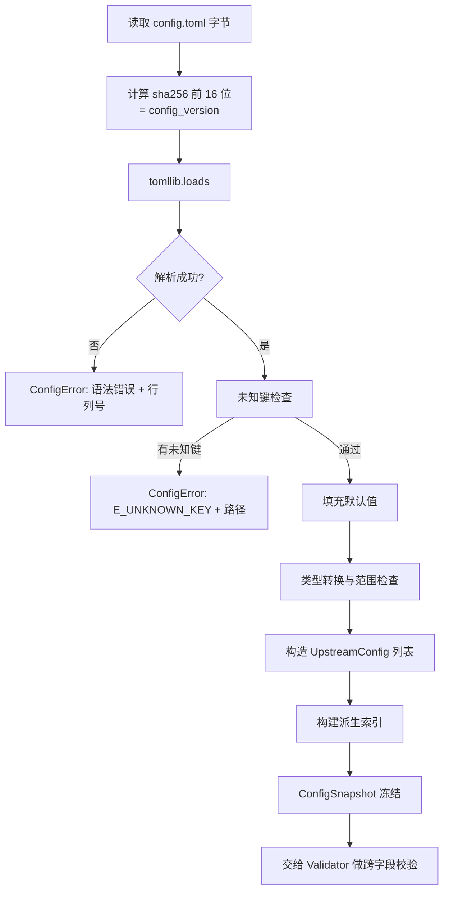
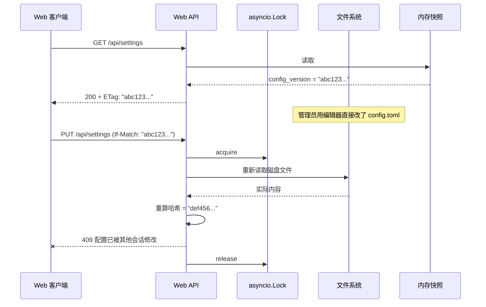
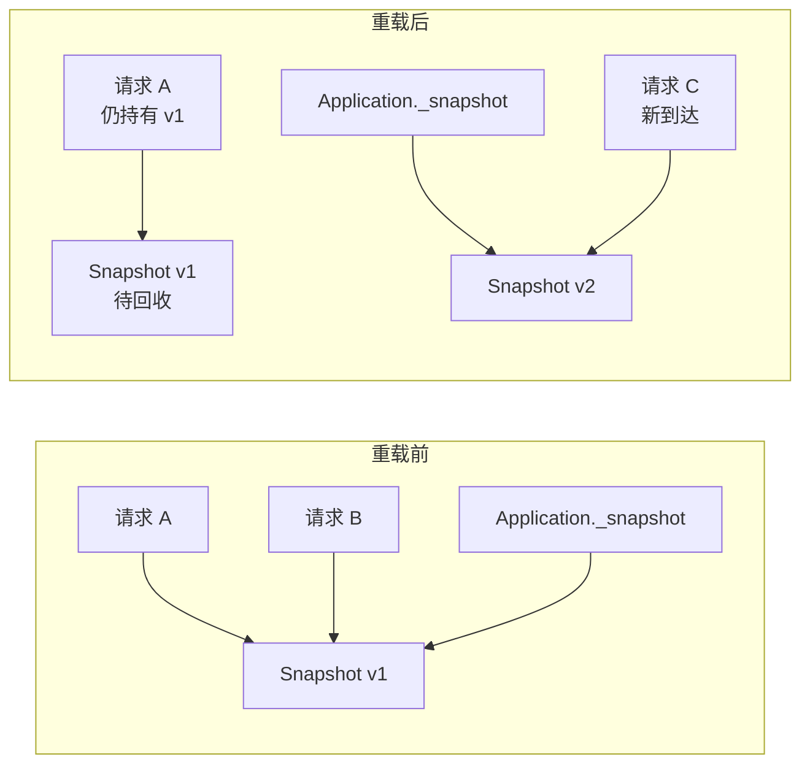

# DD_CONFIG.md - 配置模块详细设计

| 版本 | 日期 | 变更说明 | 作者 |
| :--- | :--- | :--- | :--- |
| v1.0.0 | 2026-08-13 | 初始版本：不可变快照模型、启动校验清单、`config_version` 计算与并发修改检测、热重载引用替换 | Agent |
| v1.1.0 | 2026-08-13 | 分歧定案：配置格式改为 TOML，读用标准库 `tomllib`、写用 `tomlkit`（§1.1 全面重写）；新增未知键拒绝（`E_UNKNOWN_KEY`）；`W_RULE_DISABLED_TARGET` 的降级理由改为「拆分条件」的正式表述并要求持续可见 | Agent |
| v1.4.0 | 2026-08-15 | M4 切片 d 回写：新增 `load_text()`（从内存文本构建候选快照，不落盘，供 Web 写前校验）；§5.2 关键路径改为 `edit_config(transform)`——基线在锁内读、生效走 `Application.reload()` 而非 `reload_from(candidate)` | Agent |
| v1.3.0 | 2026-08-14 | M4 切片 a 回写：新增 `E_WEB_TOKEN_NON_ASCII`（在回环短路之前检查）；`E_PORT_CONFLICT` 排除两端均为 `0` 的情形 | Agent |
| v1.2.0 | 2026-08-13 | 实现回写：`by_name` 改为只读 `Mapping`（`MappingProxyType`），新增 `ConfigSnapshot.build()` 作为唯一构造入口；报错统一补文件名前缀；`validate()` 增加 `nofile_limit` 与 `rule_targets` 参数以避免校验层直接触碰系统调用与规则文件 | Agent |
| v2.0.0 | 2026-08-15 | 规则改由 `rules.db` 存储：`ConfigSnapshot.rule_files` / `rule_versions` 两字段删除，新增 `rules_enabled`；`rules.files` 键废弃且残留时报 `E_RULES_FILES_REMOVED`（取代 `E_DUP_RULE_FILENAME`）；`rule_targets` 的形状由「目标 → 文件:行号」改为「出口名 → `rules[i]`」；§6.2/§6.3 重载改为从库读并编译，`rules.enabled = false` 时不打开库 | Agent |

**对应需求**：[PRD §4.2](../requirements/PRD_OVERVIEW.md)（上级代理池与优先级）、[PRD §4.9.6](../requirements/PRD_OVERVIEW.md)（配置快照）、[PRD §5](../requirements/PRD_OVERVIEW.md)（文件布局）、[WEBUI §6](../requirements/WEBUI_SPEC.md)（配置持久化）

**上游依赖**：无（最底层模块）
**下游使用者**：`decision`、`egress`、`protocol`、`storage`、`web`

---

## 1. 设计目标与约束

| 目标 | 约束来源 |
|------|----------|
| 配置对象**完全不可变**，请求生命周期内看到一致的视图 | [PRD §4.9.2](../requirements/PRD_OVERVIEW.md) RC-05 |
| 热重载不中断服务、不产生半更新状态 | 同上 |
| 能检测到**任何来源**的文件改动，包括编辑器直接改 | [WEBUI §6.4.1](../requirements/WEBUI_SPEC.md) |
| 影响正确性的配置错误在启动阶段拒绝，不留到运行时 | [ARCH §7.1](./ARCH_OVERVIEW.md) |
| 代理核心读配置**零第三方依赖** | [PRD §4.8](../requirements/PRD_OVERVIEW.md) |

### 1.1 格式选型：TOML

配置格式为 TOML，理由见 [PRD §4.2.1b](../requirements/PRD_OVERVIEW.md)。对本模块而言，关键是读写路径使用不同的库：

| 路径 | 库 | 归属 | 位置 |
|------|-----|------|------|
| 读 | `tomllib` | **Python 3.11+ 标准库** | `config/loader.py` |
| 写 | `tomlkit` | `[web]` extra | `web/config_writer.py` |

`tomllib` 只提供 `load` / `loads`，没有写入能力。这个不对称恰好与依赖边界重合：代理核心只读配置，只有 Web 界面需要写回。因此 `--no-web` 部署形态真正零第三方运行时依赖。

**`config` 包严禁导入 `tomlkit`**。写回逻辑全部位于 `web/config_writer.py`，`config` 包只负责「从文本得到 `ConfigSnapshot`」。这条边界由 [MIGRATION §6.2](./MIGRATION.md) 的 import 检查测试守住。

两个库读出的数据等价（`tomlkit.parse(x).unwrap() == tomllib.loads(x)`，已实测），但**写回路径不复用这个等价性**：`web/config_writer.py` 写完文件后触发热重载，重载走标准的 `tomllib` 读路径。这样「Web 写入的配置」与「用户手写的配置」经过完全相同的校验与构建流程，不存在两条路径行为不一致的风险。

#### 1.1.1 TOML 的手写陷阱与对策

TOML 有一个与 YAML 不同的失败模式：**表头之后的裸键归属于该表**。用户手写时容易出错：

```toml
[[upstreams]]
name = "home-proxy"
address = "192.168.1.100:7890"

read_timeout = 60          # 本意是全局配置，实际成了 home-proxy 的字段
```

这个例子还算「幸运」——`read_timeout` 恰好是合法的出口字段，只是作用范围错了。更糟的是这种：

```toml
[[upstreams]]
name = "direct"
type = "direct"

sticky_fail_threshold = 5  # 本意是 [routing] 下的项，成了 direct 的未知字段
```

对策是**拒绝未知键**（`E_UNKNOWN_KEY`）。宽容地忽略未知键会让这类错配完全静默——用户以为改了配置，实际什么都没发生，且没有任何提示。报错的代价是用户不能在配置里写自定义字段做备注，这个代价可以接受（TOML 有注释语法）。

---

## 2. 数据契约

```python
# r_proxy/config/model.py
from __future__ import annotations
from dataclasses import dataclass, field
from pathlib import Path
from typing import Literal

UpstreamType = Literal["http", "direct"]


@dataclass(frozen=True, slots=True)
class UpstreamConfig:
    name: str
    type: UpstreamType
    address: str | None            # host:port；type="direct" 时为 None
    priority: int = 100            # 1..999，数字越小越优先
    enabled: bool = True
    connect_timeout: float | None = None   # None 表示继承全局
    read_timeout: float | None = None
    auth: UpstreamAuth | None = None       # 本期预留，不实现

    @property
    def is_direct(self) -> bool:
        return self.type == "direct"


@dataclass(frozen=True, slots=True)
class UpstreamAuth:
    username: str
    password: str = field(repr=False)      # repr=False 防止意外打印进日志


@dataclass(frozen=True, slots=True)
class RateLimitConfig:
    max_switches_per_host: int = 10
    window_seconds: int = 60


@dataclass(frozen=True, slots=True)
class CircuitBreakerConfig:
    enabled: bool = True
    fail_threshold: int = 5
    cooldown_seconds: int = 60


@dataclass(frozen=True, slots=True)
class RoutingConfig:
    connect_timeout: float = 10.0
    read_timeout: float = 30.0
    switch_on_status: frozenset[int] = frozenset(
        {403, 407, 408, 429, 451, 502, 503, 504, 511}
    )
    sticky_fail_threshold: int = 3
    route_block_ttl: int = 600
    tunnel_probe_window: float = 5.0
    switch_buffer_bytes: int = 65536
    happy_eyeballs_delay: float = 0.25     # 0 表示关闭
    status_switch_rate_limit: RateLimitConfig = RateLimitConfig()
    circuit_breaker: CircuitBreakerConfig = CircuitBreakerConfig()


@dataclass(frozen=True, slots=True)
class LimitsConfig:
    max_client_connections: int = 1000
    max_connections_per_upstream: int = 200
    sticky_cache_size: int = 10000
    route_block_cache_size: int = 50000


@dataclass(frozen=True, slots=True)
class DatabaseConfig:
    state_path: Path
    logs_path: Path
    retention_days: int = 30
    max_log_rows: int = 100000
    write_queue_size: int = 10000
    flush_interval_ms: int = 200
    flush_batch_size: int = 500
    backup_keep: int = 10


@dataclass(frozen=True, slots=True)
class ListenConfig:
    host: str = "127.0.0.1"        # 仅 IPv4
    port: int = 6060


@dataclass(frozen=True, slots=True)
class WebUIConfig:
    enabled: bool = True
    host: str = "127.0.0.1"        # 仅 IPv4
    port: int = 6061
    auth_token: str | None = field(default=None, repr=False)
    workers: int = 1               # 只允许 1


@dataclass(frozen=True, slots=True)
class ConfigSnapshot:
    """不可变配置快照。热重载时整体替换，绝不原地修改。"""
    listen: ListenConfig
    webui: WebUIConfig
    database: DatabaseConfig
    routing: RoutingConfig
    limits: LimitsConfig
    upstreams: tuple[UpstreamConfig, ...]
    rules_enabled: bool            # [rules] enabled，救场开关

    config_version: str            # config.toml 内容哈希前 16 位
    source_path: Path
    loaded_at: float

    # 派生索引，加载时一次性构建，避免热路径重复计算。
    # 类型是只读 Mapping：快照被所有并发请求共享，普通 dict 可被任意持有者改写。
    by_name: Mapping[str, UpstreamConfig] = field(compare=False)
    priority_groups: tuple[tuple[int, tuple[str, ...]], ...] = field(compare=False)

    @classmethod
    def build(cls, **fields: object) -> ConfigSnapshot:
        """唯一的构造入口，负责派生索引的计算与冻结。

        直接调用 ``ConfigSnapshot(...)`` 需要手工传入 by_name 与 priority_groups，
        容易与 upstreams 不同步。走 build 才能保证两者一致。
        """
        return cls(
            **fields,
            by_name=MappingProxyType({u.name: u for u in fields["upstreams"]}),
            priority_groups=_priority_groups(fields["upstreams"]),
        )

    def upstream(self, name: str) -> UpstreamConfig | None:
        return self.by_name.get(name)

    def timeout_for(self, name: str) -> tuple[float, float]:
        """返回该出口生效的 (connect_timeout, read_timeout)。"""
        u = self.by_name[name]
        return (
            u.connect_timeout if u.connect_timeout is not None
            else self.routing.connect_timeout,
            u.read_timeout if u.read_timeout is not None
            else self.routing.read_timeout,
        )
```

### 2.1 派生索引为何在加载时构建

`by_name` 与 `priority_groups` 是从 `upstreams` 推导的，本可在使用时计算。但候选链构造在**每个请求**都会执行，重复分组排序是纯浪费。加载时构建一次、随快照一起冻结，热路径只做查表。

`field(compare=False)` 使这两个字段不参与相等性比较——它们是 `upstreams` 的函数，纳入比较是冗余的。

`priority_groups` 的结构是 `((10, ("home-proxy", "office-proxy")), (50, ("backup-proxy",)), (100, ("direct",)))`，已按优先级升序、组内按配置顺序排列。

---

## 3. 加载流程



```python
# r_proxy/config/loader.py（关键路径伪代码）

import tomllib

def load(path: Path, cli_overrides: dict[str, object]) -> ConfigSnapshot:
    raw_bytes = path.read_bytes()
    version = hashlib.sha256(raw_bytes).hexdigest()[:16]

    try:
        data = tomllib.loads(raw_bytes.decode("utf-8"))
    except tomllib.TOMLDecodeError as exc:
        raise ConfigError(f"{path}: {exc}") from exc
    except UnicodeDecodeError as exc:
        raise ConfigError(f"{path}: 配置文件必须是 UTF-8 编码") from exc

    _reject_unknown_keys(data, path)               # E_UNKNOWN_KEY
    data = _apply_overrides(data, cli_overrides)   # CLI 参数优先级最高

    upstreams = tuple(_build_upstream(item, i) for i, item in
                      enumerate(data.get("upstreams", [])))

    # `rules.files` 已废弃。残留时明确报错，不静默忽略——静默忽略会让用户
    # 以为文件里的规则还在生效，而实际上全部流量都在走自动路由。
    _reject_removed_rules_files(data, path)         # E_RULES_FILES_REMOVED
    rules_enabled = bool(data.get("rules", {}).get("enabled", True))

    by_name = {u.name: u for u in upstreams}
    groups = _build_priority_groups(upstreams)

    return ConfigSnapshot(
        listen=_build_listen(data.get("listen", {})),
        webui=_build_webui(data.get("webui", {})),
        database=_build_database(data.get("database", {})),
        routing=_build_routing(data.get("routing", {})),
        limits=_build_limits(data.get("limits", {})),
        upstreams=upstreams,
        rules_enabled=rules_enabled,
        config_version=version,
        source_path=path,
        loaded_at=time.time(),
        by_name=by_name,
        priority_groups=groups,
    )


def _build_priority_groups(
    upstreams: tuple[UpstreamConfig, ...],
) -> tuple[tuple[int, tuple[str, ...]], ...]:
    buckets: dict[int, list[str]] = {}
    for u in upstreams:
        buckets.setdefault(u.priority, []).append(u.name)
    return tuple((p, tuple(buckets[p])) for p in sorted(buckets))
```

### 3.0 未知键检查

```python
_SCHEMA: dict[str, frozenset[str]] = {
    "": frozenset({"listen", "webui", "database", "limits",
                   "routing", "rules", "upstreams"}),
    "listen": frozenset({"host", "port"}),
    "webui": frozenset({"enabled", "host", "port", "auth_token", "workers"}),
    "routing": frozenset({
        "connect_timeout", "read_timeout", "switch_on_status",
        "sticky_fail_threshold", "route_block_ttl", "tunnel_probe_window",
        "switch_buffer_bytes", "happy_eyeballs_delay",
        "status_switch_rate_limit", "circuit_breaker",
    }),
    "upstreams[]": frozenset({"name", "type", "address", "priority",
                              "enabled", "connect_timeout", "read_timeout",
                              "auth"}),
    # database / limits / rules / routing.* / upstreams[].auth 同理
}


def _reject_unknown_keys(data: dict, path: Path) -> None:
    issues: list[str] = []
    for section, keys in _walk(data):
        allowed = _SCHEMA.get(section)
        if allowed is None:
            continue
        for key in keys - allowed:
            hint = _suggest(key, allowed)         # 编辑距离最近的合法键
            loc = f"{section}.{key}" if section else key
            issues.append(f"{loc}: 未知配置项"
                          + (f"，是否想写 {hint}？" if hint else ""))
    if issues:
        raise ConfigError(f"{path}:\n  " + "\n  ".join(issues))
```

`_suggest` 用编辑距离给出最接近的合法键名。TOML 的表头陷阱（§1.1.1）产生的错误往往表现为「一个合法但放错位置的键」，此时提示应当是「`routing` 下有这个项，你把它写进了 `upstreams` 里」而非单纯的「未知」。这个区分对用户排查很有价值：

```
config.toml:
  upstreams[3].sticky_fail_threshold: 未知配置项，该项属于 [routing]
```

### 3.1 环境变量与 CLI 的优先级

```
CLI 参数  >  环境变量  >  config.toml  >  内置默认值
```

| 项 | 环境变量 | CLI |
|----|----------|-----|
| Web token | `R_PROXY_WEB_TOKEN` | — |
| Web 端口 | — | `--web-port` |
| 是否启用 Web | — | `--no-web` |
| 配置文件路径 | `R_PROXY_CONFIG` | `--config` |

**`auth_token` 优先取环境变量**，这样容器部署时不必把密钥写进配置文件。CLI 不提供 `--auth-token`：命令行参数会出现在 `ps` 输出中，对所有本机用户可见。

---

## 4. 启动校验

校验与加载分离：加载只负责「把文件变成对象」，校验负责「判断这份配置能不能跑」。分开的好处是 Web 界面写回配置时可以复用同一套校验，而不必真正加载生效。

```python
# r_proxy/config/validate.py

@dataclass(frozen=True, slots=True)
class ValidationIssue:
    level: Literal["error", "warning"]
    code: str                    # 稳定标识，供 Web 界面做本地化
    message: str
    location: str | None         # 如 "upstreams[2].address"


def validate(
    snapshot: ConfigSnapshot,
    *,
    has_ipv6_egress: bool,
    nofile_limit: int | None = None,
    rule_targets: Mapping[str, str] | None = None,
) -> list[ValidationIssue]:
    ...
```

`nofile_limit` 与 `rule_targets` 由调用方注入，而不是让校验层自己去调 `getrlimit`
或查 `rules.db`。这样校验是纯函数：给定相同输入必得相同输出，测试不必伪造系统状态，
`config` 包也不必依赖 `storage`。
`rule_targets` 的形式是「出口名 → 首次引用它的规则位置（`rules[3]`）」，规则尚未加载时传 `None`。

取首次出现而非全部：出口不存在时报错只需指一处，指最靠前的那处最便于修改。

### 4.1 校验清单

| 编号 | 检查项 | 级别 | 依据 |
|------|--------|------|------|
| `E_UNKNOWN_KEY` | 无未知配置项（含放错表的合法项） | error | §1.1.1 |
| `E_RULES_FILES_REMOVED` | 配置中**不得**出现已废弃的 `rules.files` | error | [RULES §2.2](../requirements/RULES_CONFIG.md) |
| `E_NO_UPSTREAM` | 至少 1 个 `enabled = true` 的出口 | error | [PRD §4.2.3](../requirements/PRD_OVERVIEW.md) |
| `E_DUP_NAME` | `name` 全局唯一 | error | 同上 |
| `E_DIRECT_TYPE` | 名为 `direct` 的出口必须 `type: direct` | error | 同上 |
| `E_ADDRESS_REQUIRED` | `type: http` 必须有 `address` | error | [PRD §4.2.2](../requirements/PRD_OVERVIEW.md) |
| `E_ADDRESS_FORMAT` | `address` 可解析为 `host:port`；IPv6 必须带方括号 | error | [PRD §4.2.4](../requirements/PRD_OVERVIEW.md) |
| `E_PRIORITY_RANGE` | `priority` 落在 `1..999` | error | [PRD §4.2.2](../requirements/PRD_OVERVIEW.md) |
| `E_LISTEN_IPV6` | `listen.host` / `webui.host` 不得为 IPv6 地址 | error | [PRD §4.2.4](../requirements/PRD_OVERVIEW.md) |
| `E_WEB_TOKEN_REQUIRED` | 非回环绑定必须配 `auth_token` | error | [WEBUI §7.1](../requirements/WEBUI_SPEC.md) |
| `E_WEB_TOKEN_SHORT` | token 少于 16 字符 | error | [WEBUI §7.1.2](../requirements/WEBUI_SPEC.md) |
| `E_WEB_TOKEN_NON_ASCII` | token 含非 ASCII 字符 | error | 见下 |
| `E_WEB_WORKERS` | `webui.workers != 1` | error | [WEBUI §1.2.1](../requirements/WEBUI_SPEC.md) |
| `E_PORT_CONFLICT` | 代理端口与 Web 端口相同（两者均非 `0`） | error | — |

`E_WEB_TOKEN_NON_ASCII` 与「绑在哪」无关，因此在回环短路之前就检查：HTTP 头部按 latin-1 传输，非 ASCII 的 token 客户端根本发不出去。不在启动时拒绝，用户看到的是「token 配了但认证永远失败」，而且没有任何线索指向配置。它同时挡住了 `secrets.compare_digest` 对非 ASCII `str` 抛 `TypeError` 的路径——那条路径会让认证失败从 `401` 变成 `500`。

`E_PORT_CONFLICT` 对 `port = 0` 不成立：`0` 表示「由内核分配」，两次分配必然得到不同端口。两个 `0` 判成冲突会让「代理与 Web 都用临时端口」这种完全合法的配置无法启动。
| `E_RULE_TARGET` | 规则中 `forward` 的目标存在于 `upstreams` | error | [RULES §6.1](../requirements/RULES_CONFIG.md) |
| `E_RULE_REGEX` | 规则正则可编译 | error | 同上 |
| `E_SWITCH_STATUS_2XX` | `switch_on_status` 不含 2xx/3xx | error | [WEBUI §2.5](../requirements/WEBUI_SPEC.md) |
| `E_TIMEOUT_POSITIVE` | 各超时为正数 | error | — |
| `W_TOKEN_WEAK` | token 长度 16–31 字符 | warning | [WEBUI §7.1.2](../requirements/WEBUI_SPEC.md) |
| `W_UPSTREAM_IPV6` | 上级代理地址为 IPv6 而本机无 IPv6 能力 | warning | [PRD §4.2.4](../requirements/PRD_OVERVIEW.md) |
| `W_NOFILE_LOW` | `RLIMIT_NOFILE` 软限制 < `max_client_connections × 2 + 64` | warning | [PRD §7.2](../requirements/PRD_OVERVIEW.md) |
| `W_SWITCH_STATUS_FUTILE` | `switch_on_status` 含 `500`/`404`/`520`–`526` | warning | [PRD §4.3.2.2](../requirements/PRD_OVERVIEW.md) |
| `W_RULE_DISABLED_TARGET` | 规则指向已 `enabled: false` 的出口 | warning | [RULES §4.4.1](../requirements/RULES_CONFIG.md) |
| `W_ALL_SAME_PRIORITY` | 所有出口同优先级（退化为纯轮询，无故障降级层次） | warning | — |

任一 `error` 即拒绝启动，退出码 `2`，输出全部问题而非只报第一个——用户改配置时希望一次看到所有错误。

```
$ r-proxy
配置校验失败（2 个错误，1 个警告）：

  [error] upstreams[1].address
      E_ADDRESS_FORMAT: IPv6 地址必须使用方括号，如 [2001:db8::1]:8080

  [error] webui.workers
      E_WEB_WORKERS: 必须为 1。多进程会产生第二个数据库写者，
      破坏单一写者约束（详见 docs/requirements/WEBUI_SPEC.md §1.2.1）

  [warning] limits.max_client_connections
      W_NOFILE_LOW: 当前 RLIMIT_NOFILE=1024，建议 ≥ 2064。
      执行 `ulimit -n 4096` 或调低 max_client_connections
```

### 4.2 规则目标不可用：拆分为两个条件

这里容易被理解成「把错误降级为警告」，实际是**把一个被混为一谈的条件拆成两个**（[RULES §4.4.1](../requirements/RULES_CONFIG.md)）：

| 校验码 | 条件 | 级别 |
|--------|------|------|
| `E_RULE_TARGET` | 规则指定的出口**不在** `upstreams` 中 | **error** |
| `W_RULE_DISABLED_TARGET` | 出口存在但 `enabled = false` | warning |

真正危险的那一类（拼写错误）没有被削弱。放行的只是「用户明知故犯」的那一类：临时禁用出口排查问题、上级代理计划维护、一份配置多环境使用——这些场景中用户不会同时改规则，因为 `enabled` 是高频运维开关而规则是低频的意图声明。

降级的唯一风险是用户忽略警告。因此警告必须是**持续状态而非一次性日志**：

```python
@dataclass(frozen=True, slots=True)
class ValidationIssue:
    level: Literal["error", "warning"]
    code: str
    message: str
    location: str | None
```

`Application` 持有最近一次校验产生的 `list[ValidationIssue]`，`GET /api/status` 返回其中的 `warning` 项，Web 界面渲染为常驻横幅直到重载后问题消失。这与「启动时打一行日志然后滚走」是完全不同的可见性等级。

### 4.3 三种不可用形态的归属

`enabled = false` 只是「不可用」的一种。另外两种在**启动校验阶段不可知**，属于运行时职责：

| 形态 | 归属 |
|------|------|
| 熔断 `open`、有负面记忆 | 运行时；规则命中时**不检查**（[DD_ROUTING §2.1](./DD_ROUTING.md)） |
| `direct` + 纯 IPv6 目标 + 本机无 IPv6 能力 | 运行时；不发起连接，返回 `502` + `ipv6_unavailable` |

`W_UPSTREAM_IPV6` 是它们中唯一能在启动时给出线索的：上级代理地址本身是 IPv6 字面量而本机无 IPv6 能力，这在启动时就能判定该出口永久不可用。

---

## 5. config_version 与并发修改检测

### 5.1 计算方式

| 项目 | 定义 |
|------|------|
| 算法 | `sha256(文件字节)` 取前 16 个十六进制字符 |
| 粒度 | `config.toml` 与每个 rules 文件**各自独立**计算 |
| 计算时机 | 每次从磁盘读取后 |

不用 mtime：同秒内的两次修改 mtime 可能相同。不用文件大小：等长修改不敏感。内容哈希能捕获所有情况，配置文件是 KB 级，成本可忽略。

### 5.2 检测外部编辑

这是最容易做错的地方。



**校验必须在获得写锁后重读磁盘**，而不是比对内存中缓存的 `config_version`。若比对内存值：内存里存的是上次加载时的哈希 `abc123`，客户端提交的也是 `abc123`，校验通过，磁盘上管理员的修改被静默覆盖。

```python
# r_proxy/web/config_writer.py（关键路径）

async def edit_config(transform: Callable[[str], str], *, expected_version: str) -> str:
    async with self._lock:
        current = await asyncio.to_thread(self._path.read_bytes)
        actual = hashlib.sha256(current).hexdigest()[:16]
        if actual != expected_version:
            raise ConfigConflict(expected=expected_version, actual=actual)

        text = transform(current.decode("utf-8"))          # 基线在锁内读
        candidate = load_text(text, self._path)            # 解析，不落盘
        issues = validate(candidate, has_ipv6_egress=...)  # 校验
        if any(i.level == "error" for i in issues):
            raise ConfigInvalid(issues)                    # 文件未改动

        await asyncio.to_thread(self._replace, self._path, text)
        await self._app.reload()                           # 重走标准读路径
        self._audit(actual, hashlib.sha256(text.encode()).hexdigest()[:16])
```

顺序不可调换：**先校验版本，再校验内容，最后才碰文件**。任一步失败时磁盘文件保持原样。

实现相对本节初稿有两处收紧，理由见 [DD_WEB §6.6](./DD_WEB.md)：

1. 收 `transform` 而非最终文本，**基线必须在锁内读**。调用方先读好再传进来时，它读到的可能是上一个版本，变换会以它为基准把别人刚写进去的改动抹掉。
2. 生效走 `Application.reload()` 而非 `reload_from(candidate)`。候选快照只用于「写之前判断能不能用」，真正生效的那一份重新从磁盘读——Web 写入与手工编辑因此共用同一条加载路径，不存在两条路径行为不一致的风险。

`load_text(text, path)` 从内存文本构建快照，**不读也不写** `path`；`path` 仍要传，因为 `database.*` 的相对路径以配置文件所在目录为基准，且报错信息要带上文件名。

> v2.0.0 之前 `path` 的主要用途是解析 `rules.files` 的相对路径。该键废弃后这个理由不再成立，但另两个理由仍然成立，签名不变。

### 5.3 原子写入

```python
def _atomic_write(self, text: str, previous: bytes) -> None:
    backup_dir = self._backup_dir
    backup_dir.mkdir(parents=True, exist_ok=True)
    stamp = time.strftime("%Y%m%d-%H%M%S")
    (backup_dir / f"config-{stamp}.toml").write_bytes(previous)
    self._rotate_backups(keep=self._cfg.database.backup_keep)

    tmp = self._path.with_suffix(".toml.tmp")
    with open(tmp, "w", encoding="utf-8") as f:
        f.write(text)
        f.flush()
        os.fsync(f.fileno())
    os.replace(tmp, self._path)

    dir_fd = os.open(self._path.parent, os.O_DIRECTORY)
    try:
        os.fsync(dir_fd)          # 否则崩溃时目录项可能仍指向旧文件
    finally:
        os.close(dir_fd)
```

对父目录 `fsync` 容易被遗漏：`os.replace` 保证了原子性，但目录项本身的落盘需要单独同步，否则断电后可能出现「新文件内容已写入但目录仍指向旧 inode」。

备份策略见 [WEBUI §6.2.1](../requirements/WEBUI_SPEC.md)：保留 `backup_keep`（默认 10）份，按时间倒序淘汰。

---

## 6. 热重载

### 6.1 引用替换模型



```python
# r_proxy/app.py

class Application:
    def __init__(self) -> None:
        self._snapshot: ConfigSnapshot = ...     # 唯一可变引用

    def current(self) -> ConfigSnapshot:
        """请求开始时调用一次，之后整个生命周期沿用返回值。"""
        return self._snapshot

    def reload_from(self, snapshot: ConfigSnapshot) -> None:
        self._snapshot = snapshot                # 单次引用赋值，不会被打断
        self._on_snapshot_changed(snapshot)
```

事件循环中的引用赋值不会被打断（无 `await`），因此无需锁。飞行中的请求继续使用旧快照直到结束，旧快照在最后一个持有者结束后被 GC 回收。

**请求必须在开始时取一次快照并全程沿用**，不能每次用到时重新调 `current()`——否则重载发生在请求中途时，候选链构造用的是 v1 而超时值取自 v2，出现不自洽。

### 6.2 重载触发源与生效范围

| 触发源 | 说明 |
|--------|------|
| `SIGHUP` | 重新读取 `config.toml` 与 `rules.db` |
| `r-proxy reload` 命令 | 向运行中进程发 `SIGHUP` |
| `POST /api/reload` | 同上 |
| Web 修改配置后 | 写回成功即自动触发 |

| 配置项 | 热生效 | 处理 |
|--------|--------|------|
| 上级代理增删改、优先级、启用状态 | 是 | 新快照生效；见 §6.3 状态保留规则 |
| 规则（`rules.db`） | 是 | 重新读库并编译 `RuleSet` |
| `[rules] enabled` | 是 | 由 `true` 改 `false` 时立即换成空规则集 |
| 超时、`switch_on_status`、阈值、熔断参数 | 是 | 随快照替换 |
| `limits.*` 各项容量 | 是 | LRU 容量变更时按新容量裁剪 |
| 日志保留策略 | 是 | 下次清理任务生效 |
| `listen.*`、`webui.*` | **否** | 需重启；Web 界面标注「需重启生效」 |

### 6.3 重载时的运行时状态保留

配置变了，但内存中的粘性映射、健康状态、轮询游标怎么办？

| 状态 | 重载后 | 理由 |
|------|--------|------|
| 粘性映射（出口仍存在） | **保留** | [PRD §4.6](../requirements/PRD_OVERVIEW.md) 规则 4：优先级变更不影响已有粘性，直到该出口失败才按新优先级重选 |
| 粘性映射（出口已删除或禁用） | **清除该条** | 指向不存在的出口，保留会导致每次都要 fallback |
| 出口健康与熔断状态（出口仍存在） | **保留** | 出口是否健康与配置无关 |
| 出口健康（出口已删除） | 清除 | — |
| 路由级负面记忆 | **保留** | 与配置无关 |
| 轮询游标 | **重置为 0** | 分组成员变了，旧游标的语义不再有效 |
| 切换频率限流计数 | 保留 | 窗口很短，无所谓 |

```python
def _on_snapshot_changed(self, new: ConfigSnapshot) -> None:
    known = set(new.by_name)
    usable = {n for n, u in new.by_name.items() if u.enabled}

    self._state.sticky.drop_if(lambda _host, up: up not in usable)
    self._state.health.drop_if(lambda up: up not in known)
    self._state.memory.drop_if(lambda _host, up: up not in known)
    self._state.cursors.reset_all()

    self._rules = load_rules(self._storage.rules_conn(),
                             enabled=new.rules_enabled)
    self._capability.refresh()          # 重新探测 IPv6 出口能力
```

**规则编译失败时不替换**：保留旧 `RuleSet` 并记 `ERROR`。理由是热重载失败不应让正在工作的代理失去规则能力——半个规则集比旧规则集更危险。

`rules_enabled = false` 时不打开库，直接换成空规则集（[DD_RULES §6.1](./DD_RULES.md)）。这是救场路径，不该依赖一个可能已损坏的库。

---

## 7. 与其他模块的接口

```python
# 供 decision 层使用（只读）
snapshot.upstream(name) -> UpstreamConfig | None
snapshot.priority_groups -> tuple[tuple[int, tuple[str, ...]], ...]
snapshot.routing -> RoutingConfig
snapshot.limits -> LimitsConfig

# 供 egress 层使用
snapshot.timeout_for(name) -> tuple[float, float]

# 供 web 层使用
snapshot.config_version -> str
snapshot.rules_enabled -> bool
validate(snapshot, has_ipv6_egress=...) -> list[ValidationIssue]

# 供 app 层使用
load(path, cli_overrides) -> ConfigSnapshot
```

**`web` 层读取上级代理配置时必须过滤凭据**：API 只返回 `has_auth: bool`，不返回 `auth` 对象。`UpstreamAuth.password` 已设 `repr=False`，但序列化仍需显式排除——`repr=False` 只影响 `repr()`，不影响 `dataclasses.asdict()`。

---

## 8. 测试要点

| 场景 | 期望 | 对应验收 |
|------|------|----------|
| 配置文件语法错误 | `ConfigError` 含文件名与 TOML 解析器给出的行列号 | — |
| 配置文件非 UTF-8 编码 | 明确报编码错误，不是难懂的解码异常 | — |
| 未知配置项 | `E_UNKNOWN_KEY`，含最接近的合法键名建议 | — |
| 合法项写错了表（如 `sticky_fail_threshold` 落在 `[[upstreams]]` 下） | 报错并指出该项属于 `[routing]` | — |
| 配置中残留 `rules.files` | `E_RULES_FILES_REMOVED`，提示该键已废弃及应改成什么 | WT-26 |
| `[rules] enabled` 缺省 | 视为 `true` | — |
| `config` 包导入 `tomlkit` | import 检查测试失败 | — |
| 未装 `tomlkit` 时读配置 | 正常（读路径只用 `tomllib`） | — |
| 校验发现多个错误 | 一次性返回全部，不是只报第一个 | — |
| `listen.host: "::1"` | `E_LISTEN_IPV6`，拒绝启动 | AF-10 |
| `webui.workers: 4` | `E_WEB_WORKERS`，拒绝启动 | Q-26 |
| 上级代理 IPv6 地址 + 无 IPv6 能力 | `W_UPSTREAM_IPV6` 警告，正常启动 | AF-11 |
| 规则指向不存在的出口名 | `E_RULE_TARGET`，拒绝启动 | — |
| 规则指向已禁用的出口 | `W_RULE_DISABLED_TARGET`，**正常启动** | — |
| 上述警告的可见性 | `GET /api/status` 持续返回该项，直到重载后消失 | — |
| 提交时 `config_version` 不匹配 | `409`，磁盘文件未改动 | — |
| 提交前用编辑器改了文件 | 检测到并返回 `409`（**重读磁盘**，非比对内存） | — |
| 校验失败的提交 | `400`，磁盘文件未改动，无备份产生 | TC-14 |
| 写回后崩溃恢复 | 文件要么是旧版要么是新版，无截断 | — |
| 备份超过 `backup_keep` | 最旧的被删除，数量稳定 | — |
| 重载后出口被删除 | 指向它的粘性映射被清除，健康状态被清除 | — |
| 重载后优先级变更 | 已有粘性**保持不变** | [PRD §4.6](../requirements/PRD_OVERVIEW.md) 规则 4 |
| 重载时规则条件非法 | 保留旧 `RuleSet`，记 `ERROR`，代理继续工作 | — |
| 重载时把 `rules.enabled` 改为 `false` | 立即换成空规则集，且不打开 `rules.db` | WT-27 |
| `config` 包导入 `storage` 或查库 | 架构守卫失败（`rule_targets` 由调用方注入） | — |
| 重载期间持续请求 | 无请求读到半更新配置 | CC-05 |
| `asdict()` 序列化上级代理 | 不含 `password` 明文 | — |
