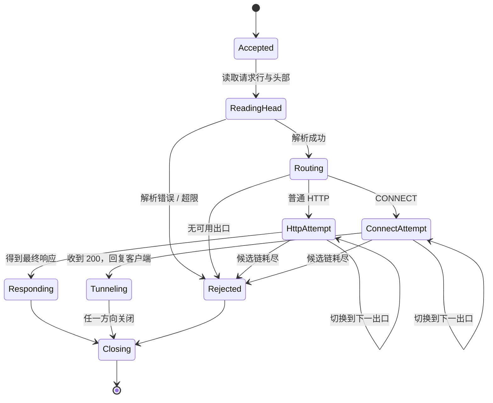
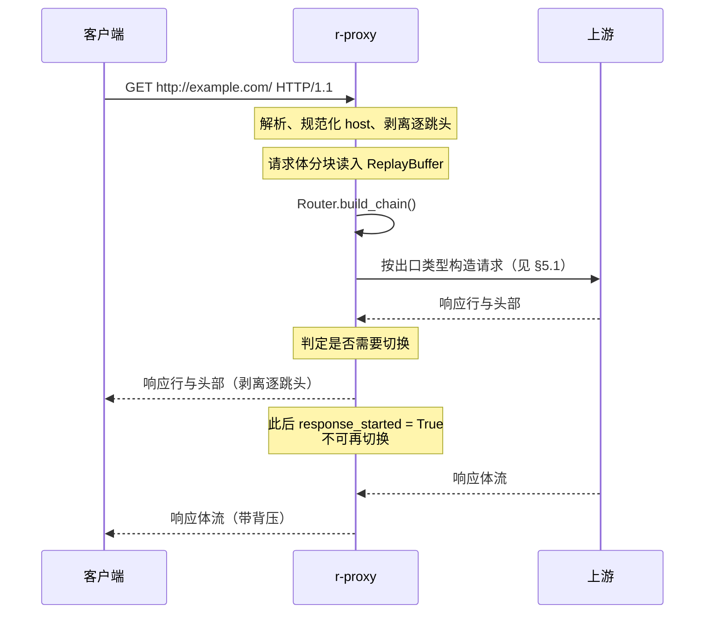

# DD_PROXY.md - 协议层详细设计

| 版本 | 日期 | 变更说明 | 作者 |
| :--- | :--- | :--- | :--- |
| v1.0.0 | 2026-08-13 | 初始版本：连接生命周期、请求解析与 host 规范化、HTTP 转发、CONNECT 隧道、背压与资源限制、出口连接器 | Agent |
| v1.1.0 | 2026-08-14 | M2 实现回填：`classify_transport` 改为按连接对象（`is_direct`）区分 `route_error` 与 `upstream_error`，补 §7.2 | Agent |
| v1.2.0 | 2026-08-21 | 代码评审整改：新增 §7.3，`_parse_handshake_response` 解码改用 `latin-1`（与 `parse_response_head` 统一）、两处状态行解析改用无参 `split()` 容忍多余空格 | Agent |
| v1.3.0 | 2026-08-21 | 安全修复：新增 §3.1.1，`parse_head` 拒绝裸露 CR/LF——此前请求行 target 中嵌入的裸 `\n` 能一路活到 `RequestTarget.host`，被 `connector.py`/`connection.py` 原样拼进发往出口的请求，构成 HTTP 请求走私/头部注入 | Agent |
| v1.4.0 | 2026-08-31 | Bug 修复：§3.4 更正——`transfer-encoding` 从 `HOP_BY_HOP` 固定摘除集合中移除。请求体（`body.py`）与响应体（`pump`）都只原样转发 `chunked` 编码的分块字节、从不解码重编码，若摘掉该头部会让对端收到的头部与线上实际字节框架自相矛盾（对端把分块长度行当成消息体内容），表现为经代理访问带 `Transfer-Encoding: chunked` 响应的接口时客户端解析失败（真实案例：内网 Web 应用某个 JSON 接口经代理后前端报「Failed to load this section」）。新增 `tests/test_protocol_chunked_response.py` 端到端复现 | Agent |
| v1.5.0 | 2026-09-05 | 代码评审整改两处：①§4.3 补「读取客户端请求体」超时行——`_send_body` 此前读客户端 body 完全没有超时，慢速/挂起的客户端会让连接与已建立的出口 socket 一起永久挂起，`max_client_connections` 防不了这种单连接卡死，现复用 `head_read_timeout` 兜底；②§5.2 新增 §5.2.1「1xx 中间响应必须跳过」——`_attempt_http` 此前把上游的 `100 Continue`/`103 Early Hints` 当成最终响应转发，真正的响应被当成它的 body 混入客户端，现循环跳过 1xx 直至读到最终响应。新增 §11「已知限制与后续工作」记录评审中发现但暂未修的两处待观察点。两处修复均新增端到端回归测试（`tests/test_protocol_server.py`） | Agent |

**对应需求**：[PRD §4.1](../requirements/PRD_OVERVIEW.md)、[§4.3.11](../requirements/PRD_OVERVIEW.md)、[§4.3.13](../requirements/PRD_OVERVIEW.md)、[§7.2](../requirements/PRD_OVERVIEW.md)

**上游依赖**：`config`、`decision`、`egress`
**下游使用者**：无（最外层）

---

## 1. 职责边界

协议层负责「把字节变成请求、把请求变回字节」，以及所有与 socket 相关的资源管理。它**不做路由决策**，只调用决策层并按结果执行。

| 组件 | 职责 |
|------|------|
| `ProxyServer` | 监听套接字、连接数限制、优雅关闭 |
| `ClientConnection` | 单个客户端连接的状态机、解析、缓冲、背压 |
| `HttpForwarder` | 普通 HTTP 请求的转发与响应回传 |
| `TunnelRelay` | CONNECT 隧道的双向中继与早夭统计 |
| `UpstreamConnector` | 建立到上级代理或目标的连接 |

---

## 2. 为何从 Protocol 改为 Streams

现有实现基于 `asyncio.Protocol`（`handler.py`）。目标形态改用 `asyncio.StreamReader` / `StreamWriter`。

| 维度 | Protocol | Streams |
|------|----------|---------|
| 读取「直到 `\r\n\r\n`」 | 手工累积 `bytearray` 并反复搜索 | `await reader.readuntil(b"\r\n\r\n")` |
| 读取定长请求体 | 手工计数与拼接 | `await reader.readexactly(n)` |
| 背压 | 手工 `pause_reading` / `resume_reading` | `await writer.drain()` 自动处理 |
| 多次顺序尝试（切换） | 回调式，状态机横跨多个方法 | 顺序 `await`，控制流线性 |
| 超时 | 手工 `call_later` + 取消 | `async with asyncio.timeout(...)` |

切换逻辑是决定性因素：「试 A，失败了试 B，再失败试 C」在 Streams 下就是一个 `for` 循环，在 Protocol 下要拆成一串回调并手工维护「现在试到第几个」的状态。现有 `handler.py` 中 `_handle_connect` 与 `_RelayProtocol.send_initial` 之间的时序耦合，已经能看出这条路会走向何处。

代价是 Streams 每连接多约 2 个对象与一层 `Protocol` 包装。在 1000 连接的目标规模下可忽略。

**隧道中继例外**：`TunnelRelay` 内部仍可考虑 `Protocol`（`loop.sock_sendfile` 或裸 transport 转发效率更高），但本期先用 Streams 统一实现，性能不达标再优化。过早优化在这里没有依据——[PRD §7.1](../requirements/PRD_OVERVIEW.md) 的目标是 500 req/s，Streams 足以支撑。

---

## 3. 请求解析

### 3.1 解析限制

所有限制都必须在**读取时**生效，而不是读完再检查——否则恶意客户端一行不换地发 1GB 数据就能耗尽内存。

| 项 | 上限 | 超限响应 |
|----|------|----------|
| 请求行长度 | 8192 字节 | `414 URI Too Long` |
| 单个头部行长度 | 8192 字节 | `431 Request Header Fields Too Large` |
| 头部总长度 | 65536 字节 | `431` |
| 头部数量 | 100 | `431` |
| 读取完整请求头的超时 | 30 秒 | `408`，关闭连接 |

```python
# r_proxy/protocol/parse.py

async def read_head(reader: StreamReader, *, timeout: float) -> RawHead:
    try:
        async with asyncio.timeout(timeout):
            data = await reader.readuntil(b"\r\n\r\n")
    except asyncio.LimitOverrunError as exc:
        raise HeaderTooLarge(...) from exc      # reader 的 limit 已拦截
    except asyncio.IncompleteReadError as exc:
        raise ClientDisconnected() from exc
    return _parse_head(data)
```

`StreamReader` 的 `limit` 参数在创建时设为 `MAX_HEAD_BYTES`（65536）。超限时 `readuntil` 抛 `LimitOverrunError`，无需自己计数——这是 Streams 相比手工累积 `bytearray` 的另一处收益。

#### 3.1.1 裸露 CR/LF 必须拒绝（安全修复，v1.3.0）

`readuntil(b"\r\n\r\n")` 只保证缓冲区里出现过这个四字节序列，不保证中间没有夹带**没有配对成行终止符**的裸露 `\r` 或 `\n`——例如请求行的 target 里嵌了单独一个 `\n`。`_parse_request_line` 只检查 `split(" ")` 后是不是三段，不检查段内字符；`normalize_host` 也只 `strip()` 两端，不检查中间。这条裸露的 `\n` 因此能一路活到 `RequestTarget.host`，而 `egress/connector.py`（CONNECT 握手）与 `protocol/connection.py`（`build_request`）都直接把 `target.host` / `target.authority` / `target.url` 拼进发往出口的请求文本——这就是一条 HTTP 请求走私/头部注入通道：

```
CONNECT evil\ncom:443 HTTP/1.1     ← 客户端发来的请求行，target 里嵌了裸 \n
```

`_split_authority` 拆出 `host = "evil\ncom"`（`\n` 落在字符串中间，`normalize_host` 的 `strip()` 够不到），`connector.py` 的 `_handshake` 原样拼成 `f"CONNECT {authority} HTTP/1.1\r\n..."` 发给上级代理——相当于在发给出口的请求里插进了一整行客户端指定的任意内容。

修复在最早的读取点、对**全部**字段一次性堵死，而不是在每个使用 `host`/`target` 的下游调用点分别打补丁：

```python
lines = text.split("\r\n")
if any("\r" in line or "\n" in line for line in lines):
    raise BadRequest("请求头包含裸露的 \\r 或 \\n")
```

按字面 `"\r\n"` 切分后，任何一行还残留 `\r` 或 `\n`，就说明存在没有配对的控制字符——不管它出现在请求行的 target 里，还是某个头部的名字或值里，一律拒绝。选在这里而不是在 `connector.py`/`connection.py` 各自转义，是因为客户端可控的字符串不止 `host` 一条路径会被拼进出口请求（头部值同样会被 `build_request` 原样转发），下游拼接点越多，逐一堵漏就越容易漏一个；单一入口校验才能保证「凡是通过 `parse_head` 的字符串都不含裸露换行」这个不变量始终成立。

### 3.2 host 规范化

规范化在此处**一次性完成**，结果供规则匹配、粘性键、负面记忆键、日志四处共用。分散归一化必然导致不一致（[DD_RULES §5.5](./DD_RULES.md)）。

```python
def normalize_host(raw: str) -> str:
    h = raw.strip()
    if h.startswith("[") and h.endswith("]"):
        h = h[1:-1]                      # 去方括号
    h = h.rstrip(".")                    # FQDN 绝对写法的末尾点
    h = h.lower()
    try:
        return str(ip_address(h))        # IPv6 压缩形式规范化
    except ValueError:
        return h
```

`str(ip_address(...))` 是 IPv6 规范化的关键：

| 输入 | 输出 |
|------|------|
| `2001:0db8:0000:0000:0000:0000:0000:0001` | `2001:db8::1` |
| `2001:DB8::1` | `2001:db8::1` |
| `[2001:db8::1]` | `2001:db8::1` |
| `Example.COM.` | `example.com` |

这保证了 `[2001:db8::1]` 与 `[2001:0db8::1]` 共用一条粘性记录（[PRD §4.2.4](../requirements/PRD_OVERVIEW.md)）。

### 3.3 目标解析

```python
def parse_target(method: str, target: str, headers: Headers) -> RequestTarget:
    if method == "CONNECT":
        host, port = _split_authority(target, default_port=None)
        if port is None:
            raise BadRequest("CONNECT 目标必须为 host:port")
        url = None
    elif target.startswith(("http://", "https://")):
        parsed = urlsplit(target)
        host, port = _split_authority(parsed.netloc, default_port=80)
        url = target
    else:
        # 原始形式（origin-form），host 取自 Host 头
        if (hv := headers.get("host")) is None:
            raise BadRequest("缺少 Host 头")
        host, port = _split_authority(hv, default_port=80)
        url = f"http://{hv}{target}"

    return RequestTarget(
        host=normalize_host(host),
        port=port,
        method=Method[method] if method in Method.__members__ else Method.OTHER,
        url=url,
        is_connect=(method == "CONNECT"),
        family=_family_of(host),
    )
```

#### 无方括号的 IPv6 必须拒绝

```python
def _split_authority(authority: str, *, default_port: int | None
                     ) -> tuple[str, int | None]:
    a = authority.strip()

    if a.startswith("["):
        end = a.find("]")
        if end < 0:
            raise BadRequest("IPv6 地址缺少右方括号")
        host = a[1 : end]
        rest = a[end + 1 :]
        if not rest:
            port = default_port
        elif rest.startswith(":"):
            port = _parse_port(rest[1:])
        else:
            raise BadRequest("方括号后存在非法字符")
        ipaddress.IPv6Address(host)          # 校验，失败抛 ValueError
        return host, port

    if a.count(":") > 1:
        # 多个冒号且无方括号：无法无歧义确定端口边界
        raise BadRequest(
            "IPv6 地址必须使用方括号，如 [2001:db8::1]:443"
        )

    if ":" in a:
        host, _, port_s = a.partition(":")
        return host, _parse_port(port_s)
    return a, default_port
```

`a.count(":") > 1` 是这段的核心判定。`CONNECT 2001:db8::1:443` 中，最后一个 `:` 后面的 `443` 既可能是端口，也可能是地址的最后一段（`...::1:443`）。**猜测是错的**——猜错时会连到完全不同的地址，且失败信息毫无提示价值。返回 `400` 并明确说明写法要求，是 [PRD §4.2.4](../requirements/PRD_OVERVIEW.md) 的硬要求。

单个冒号的情况（`192.168.1.1:8080`、`example.com:443`）无歧义，正常解析。

### 3.4 逐跳头部处理

按 RFC 9110 §7.6.1，代理必须移除逐跳头部：

```python
_HOP_BY_HOP = frozenset({
    "connection", "keep-alive", "proxy-authenticate", "proxy-authorization",
    "te", "trailer", "upgrade", "proxy-connection",
})

def strip_hop_by_hop(headers: Headers) -> Headers:
    drop = set(_HOP_BY_HOP)
    # Connection 头中列出的字段同样是逐跳的
    for token in headers.get("connection", "").split(","):
        if (t := token.strip().lower()):
            drop.add(t)
    return Headers((k, v) for k, v in headers.items() if k.lower() not in drop)
```

`Connection: X-Custom-Thing` 声明 `X-Custom-Thing` 也是逐跳头部，必须一并移除。漏掉这条会把本应终止于代理的头部转发出去。

`proxy-authorization` 在移除列表中，这同时满足了「不记录敏感头」的安全要求——它在解析后立即被丢弃，不会进入 `RequestTarget` 或日志。

**`transfer-encoding` 不在固定摘除集合中**（v1.4.0 修正，此前误列入，是一个已确认的线上 bug）。它不是纯粹的连接元数据，而是描述消息体实际字节框架的头部：§3.5 与 §5.2 的响应体转发都是把 `chunked` 编码的分块长度行、数据、结尾 `0\r\n\r\n` **原样转发**，从不解码再重新编码。若转发头部时把它摘掉，对端收到的头部会说「定长消息」或「以连接关闭为界」，但线上字节仍然带着分块长度行——对端的 HTTP 解析器会把十六进制长度行当成消息体内容，产生的消息在语义上已经损坏。

只要转发逻辑不解码分块编码，`Transfer-Encoding` 就必须与它描述的字节框架一起传递到下一跳；`Connection` 头中显式列出 `Transfer-Encoding`（罕见但合法）时仍会按上面第二条规则被摘除，这是请求方/上游自己声明该字段仅对当前这一跳有效，语义上不冲突。

**真实故障案例**：经 r-proxy 访问某内网 Web 应用（`http://` 而非 `https://`，因此走的是本节的 HTTP 转发路径而非 CONNECT 隧道）时，其某个 JSON 接口用 `Transfer-Encoding: chunked` 返回动态长度的响应体（未知长度时常见做法）。修复前，代理把响应头里的 `Transfer-Encoding` 摘除、再补一个 `Connection: close`，客户端只能靠连接关闭判断消息边界，于是把分块长度行当成了 JSON 的一部分，前端 `JSON.parse()` 失败，页面报「Failed to load this section. Please try again.」一类的通用错误。端到端复现见 `tests/test_protocol_chunked_response.py`。

### 3.5 请求体的读取方式

| `Transfer-Encoding` / `Content-Length` | 处理 |
|-----------------------------------------|------|
| 无（GET/HEAD 等） | 无请求体 |
| `Content-Length: n` | `readexactly(n)`，但分块读入 `ReplayBuffer` |
| `Transfer-Encoding: chunked` | 逐块解析，累积到 `ReplayBuffer` |
| 两者同时出现 | `400`（请求走私风险） |
| `Content-Length` 出现多次且值不同 | `400`（同上） |

**同时出现 `Content-Length` 与 `Transfer-Encoding` 必须拒绝**。这是 HTTP 请求走私（request smuggling）的经典入口：代理按其中一个解释边界、上游按另一个解释，攻击者可以把第二个请求偷渡进去。RFC 9112 §6.1 要求此时以 `Transfer-Encoding` 为准并「应当」拒绝，作为代理我们直接拒绝。

请求体分块读入而非一次 `readexactly(n)`：`Content-Length` 可能声明 1GB，一次读入会直接耗尽内存。分块读取时每块交给 `ReplayBuffer.append()`，超过 `switch_buffer_bytes` 后缓冲区自动放弃并转为流式（[DD_SWITCHING §7.2](./DD_SWITCHING.md)）。

---

## 4. 连接生命周期

### 4.1 状态机



`HttpAttempt` 与 `ConnectAttempt` 的自环就是切换。**`Tunneling` 没有回到 `ConnectAttempt` 的边**——`200 Connection Established` 一旦发出就不可撤回。

### 4.2 连接不复用

本期客户端连接与上游连接均为**短连接**：

| 方向 | 处理 |
|------|------|
| 客户端 → r-proxy | 处理完一个请求即关闭；响应带 `Connection: close` |
| r-proxy → 上游 | 每次尝试新建连接；请求带 `Connection: close` |

不做连接复用的理由：

1. 复用连接后，切换时无法确定「这个连接上是否已发出过请求字节」，`ctx.request_sent` 的判定变复杂
2. 上游连接池需要按 `(upstream, target_host)` 分桶，且要处理服务端主动关闭的竞态（[DD_SWITCHING §4.2](./DD_SWITCHING.md) 的 `408` 场景正源于此）
3. [PRD §7.1](../requirements/PRD_OVERVIEW.md) 的 500 req/s 目标下，短连接的握手开销可以承受

这是明确的取舍而非疏漏。连接复用列为后续优化项，届时 `408` 空闲回收分支（已预留）会真正派上用场。

### 4.3 超时分层

```python
async def handle(self) -> None:
    async with asyncio.timeout(cfg.head_read_timeout):          # 30s
        head = await read_head(self._reader)

    for upstream in decision.chain:
        connect_to, read_to = snapshot.timeout_for(upstream)
        async with asyncio.timeout(connect_to):                 # per-upstream
            conn = await connector.connect(upstream, target)
        async with asyncio.timeout(read_to):                    # per-upstream
            response = await conn.send_and_read_head(request)
        ...
```

| 阶段 | 超时 | 来源 |
|------|------|------|
| 读取客户端请求头 | 30s 固定 | 防止慢速攻击 |
| 读取客户端请求体（v1.5.0 新增） | 复用 `head_read_timeout`（30s 固定） | 见下方说明 |
| 连接上游 | `connect_timeout` | 可按出口覆盖 |
| 读取上游响应头 | `read_timeout` | 可按出口覆盖 |
| 转发响应体 | **无整体超时** | 大文件下载可能持续很久 |
| 隧道 | **无整体超时** | 长连接是 CONNECT 的正常用法 |

响应体转发与隧道不设整体超时，但设**空闲超时**：连续 300 秒无任何字节流动则关闭。整体超时会误杀大文件下载与长轮询，空闲超时只杀真正卡死的连接。

per-upstream 超时覆盖对应 [PRD §4.3.12](../requirements/PRD_OVERVIEW.md)：`direct` 配 3 秒可以让被墙站点快速失败并切换，而不是卡满 10 秒。

**读取客户端请求体为何此前没有超时、又为何补上（v1.5.0 修复）**：`stream_body()` 从客户端读 body 时，早期实现只有响应阶段（`pump`）与读响应头阶段设了超时，`_send_body` 里对客户端的读取是裸的 `reader.read(...)`——客户端声明 `Content-Length`/chunked 之后慢吞吞地发、或干脆不再发，这个读取会无限期挂起。`max_client_connections` 限的是**同时存在多少个连接**，挡不住「每个连接各自卡死在读 body 这一步」——少量慢体请求就能把连接槽位占满，是一个真实的资源枯竭点。现在用 `head_read_timeout` 包一层：超时按普通传输层失败处理（`request_sent` 仍是 `False`，候选链可以正常切到下一个出口），并记一条 `WARNING`。之所以复用 `head_read_timeout` 而不新增一个专门的配置项：两者本质都是「愿意等客户端把这次请求交代清楚多久」，没有必要为同一语义拆两个旋钮。

---

## 5. HTTP 转发



### 5.1 出口类型决定请求行形式

```python
def build_request(target: RequestTarget, head: RawHead,
                  upstream: UpstreamConfig) -> bytes:
    if upstream.is_direct:
        # 直连目标：origin-form，路径部分
        request_line = f"{head.method} {target.path_qs} HTTP/1.1"
    else:
        # 经上级代理：absolute-form，完整 URL
        request_line = f"{head.method} {target.url} HTTP/1.1"

    headers = strip_hop_by_hop(head.headers)
    headers["host"] = _host_header(target)
    headers["connection"] = "close"
    return _serialize(request_line, headers)
```

这是 `direct` 与上级代理的**唯一**协议差异，但它是必须的：向目标服务器发 `GET http://example.com/ HTTP/1.1` 时，符合规范的服务器应当接受（RFC 9112 §3.2.2 要求服务器必须接受 absolute-form），但实践中不少服务器会返回 `400`。反过来向上级代理发 origin-form，代理无从知道目标是谁。

`_host_header` 需要正确处理 IPv6 与默认端口：

```python
def _host_header(t: RequestTarget) -> str:
    host = f"[{t.host}]" if ":" in t.host else t.host
    return host if t.port == 80 else f"{host}:{t.port}"
```

规范化时去掉的方括号，在写回 `Host` 头时必须加回来。

### 5.2 响应转发与背压

```python
async def pump(src: StreamReader, dst: StreamWriter, *,
               idle_timeout: float, on_bytes: Callable[[int], None]) -> None:
    while True:
        async with asyncio.timeout(idle_timeout):
            chunk = await src.read(65536)
        if not chunk:
            break
        on_bytes(len(chunk))
        dst.write(chunk)
        await dst.drain()          # 背压：对端慢时在此挂起
```

`await dst.drain()` 是全部所需的背压机制。客户端读得慢时，`drain()` 挂起当前任务直到写缓冲降到低水位，上游的读取自然随之减速（TCP 窗口收缩）。不需要手工 `pause_reading`。

漏掉 `drain()` 会导致写缓冲无限增长——慢客户端下载大文件时内存被吃光。这是代理实现中最常见的内存问题。

### 5.2.1 1xx 中间响应必须跳过（v1.5.0 修复）

读上游响应头此前只做一次 `readuntil(b"\r\n\r\n")`：读到第一个以空行结尾的头部就当成了这次请求的最终响应。这个假设对绝大多数响应成立，但 HTTP/1.1 允许服务器在最终响应之前先回一个或多个 **1xx 信息性响应**（最常见的是客户端带 `Expect: 100-continue` 时服务器回的 `100 Continue`，其次是 `103 Early Hints`）——`Expect` 头不在 `HOP_BY_HOP` 剥离列表里，会原样转发给上游，因此上游完全可能按这个头的存在决定回一个 1xx。

r-proxy 从不实现 `Expect: 100-continue` 的握手优化（`_send_body` 无条件把请求体全部发出去，不等上游确认），但这不妨碍上游仍然按标准礼节先回一个 `100 Continue`。此前的实现会把这个 `100 Continue` 当成最终响应转发给客户端，而紧随其后的真正响应（状态行 + 头 + body）会被当作这次「响应」的 body 一并转发出去——客户端看到的状态码是 `100`，body 里却混进一段 HTTP 头部文本，是一个能被真实站点触发的协议正确性缺陷，不是假设场景。

修复：读到响应头后先判断状态码，若落在 `[100, 200)` 区间就继续读下一段头部，循环直到拿到真正的最终响应，全程仍在同一个 `read_timeout` 窗口内（不会因为多跳 1xx 而无界等待）；连续跳过的 1xx 超过 8 次视为上游行为异常，判为失败。跳过 1xx 时记一条 `INFO` 日志，便于观察这条路径是否被频繁触发（正常情况下应当很少见到）。

### 5.3 请求体已发出后失败：为何不能无脑重投（v1.5.0 相关，判据见 [DD_SWITCHING.md](./DD_SWITCHING.md)）

`_attempt_http` 把「连接失败」与「请求已发出但等响应失败（超时/对端悄悄断开）」归并成同一种 `outcome.status is None` 的传输层失败上报给判据层。这两者风险完全不同：前者字节没发出去，换个出口重投绝对安全；后者（尤其是非幂等的 POST/PATCH）请求体可能已经被出口完整收到并处理，无脑重投等价于让一次下单/扣款类调用被执行两次。DD_SWITCHING.md v1.4.0 已经在判据层补上 `request_sent`/方法幂等性的门控，本节记录这一约束对协议层的要求：`ClientConnection._request_sent` 必须严格在「请求行、头部、请求体全部写入 socket 且 `drain()` 成功」之后才置位，提前置位会让判据层误以为字节没发出去而放行本不该发生的重投；置位太晚（例如漏掉 `drain()` 失败的分支）则会让本可以安全重投的请求被误判为「已发出」而放弃重试。

---

## 6. CONNECT 隧道

### 6.1 建立

```python
async def handle_connect(self, target, decision, ctx) -> None:
    for upstream in decision.chain:
        try:
            conn = await self._connector.connect_tunnel(upstream, target)
        except OSError as exc:
            if self._should_continue(exc, ctx): continue
            break

        if conn.status != 200:
            # CONNECT 的非 2xx 必然来自上级代理（DD_SWITCHING §5）
            if self._should_continue_status(conn.status, ctx): continue
            break

        # 关键时点：从这里开始不可再切换
        self._writer.write(b"HTTP/1.1 200 Connection Established\r\n\r\n")
        await self._writer.drain()
        ctx.tunnel_established = True

        ctx.replay.replay_into(conn.write)      # 重放抢跑字节
        await conn.drain()

        await self._relay(conn, ctx)
        return

    self._send_exhausted(ctx.request_id)
```

顺序不可调换：**先回 `200` 给客户端，再重放抢跑字节给上游**。反过来的话，若重放过程中上游连接断开，我们还没告诉客户端隧道已建立，理论上还能切换——但实际上重放失败几乎必然意味着上游刚刚挂掉，此时切换需要重新走一遍 CONNECT，而 `ctx.replay` 的内容仍然完好，是可行的。

这是一个可以走两条路的设计点。选择「先回 200」的理由是简单性：`tunnel_established` 这个不可逆标志的置位点与 `200` 的发出严格对齐，不存在「已经发了 200 但标志还没置」的中间态。多挽救那一个极窄窗口的请求，不值得引入这种时序歧义。

### 6.2 双向中继

```python
async def _relay(self, conn: UpstreamConn, ctx: RequestContext) -> None:
    stats = TunnelStats(established_at=time.monotonic())

    up = asyncio.create_task(pump(self._reader, conn.writer,
                                  idle_timeout=IDLE,
                                  on_bytes=stats.add_to_upstream))
    down = asyncio.create_task(pump(conn.reader, self._writer,
                                    idle_timeout=IDLE,
                                    on_bytes=stats.add_from_upstream))
    try:
        done, pending = await asyncio.wait(
            {up, down}, return_when=asyncio.FIRST_COMPLETED
        )
        for t in pending:
            t.cancel()
        await asyncio.gather(*pending, return_exceptions=True)
    finally:
        self._on_tunnel_closed(stats, ctx)
```

`FIRST_COMPLETED` 而非 `ALL_COMPLETED`：任一方向关闭即结束隧道。严格来说 TCP 半关闭（`shutdown(SHUT_WR)`）后另一方向仍可传输，但在 HTTPS 隧道场景下这种用法极罕见，而等待两个方向都结束会让「客户端关了但服务端不关」的连接一直挂着。

`asyncio.gather(..., return_exceptions=True)` 必须有：取消任务后要等它们真正结束，否则 `finally` 中统计的字节数可能还在变化，且会产生「Task was destroyed but it is pending」告警。

### 6.3 早夭统计

隧道关闭时的判定见 [DD_SWITCHING §8](./DD_SWITCHING.md)。协议层只负责准确统计字节数与存活时长，判定逻辑在决策层。

`on_bytes` 回调而非在 `pump` 内部直接累加：`pump` 是通用函数（HTTP 响应体转发也用它），不应该知道隧道统计的存在。

---

## 7. 出口连接器

```python
# r_proxy/egress/connector.py

class UpstreamConnector:
    async def connect(self, upstream: UpstreamConfig, target: RequestTarget,
                      cfg: RoutingConfig) -> UpstreamConn:
        connect_to, _ = self._snapshot.timeout_for(upstream.name)
        if upstream.is_direct:
            return await self._connect_direct(target.host, target.port,
                                              cfg, connect_to)
        host, port = split_address(upstream.address)
        return await self._connect_plain(host, port, connect_to)

    async def connect_tunnel(self, upstream, target, cfg) -> TunnelConn:
        if upstream.is_direct:
            conn = await self._connect_direct(target.host, target.port,
                                              cfg, ...)
            return TunnelConn(conn, status=200)     # 直连无 CONNECT 握手
        conn = await self._connect_plain(*split_address(upstream.address), ...)
        status = await self._do_connect_handshake(conn, target)
        return TunnelConn(conn, status=status)
```

`direct` 的 CONNECT 处理需要注意：直连时没有上级代理可以发 CONNECT 请求，直接建立 TCP 连接到目标即可，`status` 人为置为 200。把它统一到 `TunnelConn` 接口下，让上层的切换逻辑不必区分两种情况。

### 7.1 地址族错误的识别

```python
_CAPABILITY_ERRNOS = frozenset({
    errno.ENETUNREACH, errno.EAFNOSUPPORT, errno.EHOSTUNREACH,
})

def classify_transport(exc: BaseException, *, is_direct: bool) -> FailureKind:
    if isinstance(exc, OSError) and exc.errno in _CAPABILITY_ERRNOS:
        return FailureKind.CAPABILITY_MISMATCH
    return FailureKind.ROUTE_ERROR if is_direct else FailureKind.UPSTREAM_ERROR
```

`ENETUNREACH` 与 `EAFNOSUPPORT` 明确表示地址族不可达，归为 `CAPABILITY_MISMATCH`：记入 `request_log` 便于诊断，但不写负面记忆、不累加熔断计数（[PRD §4.3.6](../requirements/PRD_OVERVIEW.md)）。

### 7.2 连接对象决定失败归类

`is_direct` 不是可有可无的上下文参数，而是归类的**唯一**依据：同一个 `ECONNREFUSED` 在两种连接对象下含义完全相反。

| 连接对象 | 连接的是 | 连不上意味着 | 归类 |
| :--- | :--- | :--- | :--- |
| `direct` | 目标服务器 | 这条路走不通 | `route_error`（且 direct 永不熔断） |
| 上级代理 | 代理进程自己 | 这个出口整体不可用 | `upstream_error`（计入熔断） |

只看 errno 无法区分二者。归类错误的后果不是「日志分类不准」而是**熔断失效**：把上级代理的 TCP 失败记成 `route_error`，代理进程挂掉后每个新 host 都要先白试一遍这个死出口，熔断永远不会打开（验收点 M2-11）。

`EHOSTUNREACH` 的归类有争议——它也可能是目标主机真的下线。归入 `CAPABILITY_MISMATCH` 的后果是「不记负面记忆」，即下次请求还会尝试同一出口。对于真正下线的主机，这意味着每次都白试一次；对于地址族问题，这是正确行为。考虑到两者都会通过候选链顺延到其他出口，误判的代价有限，取「不污染负面记忆」这一边。

### 7.3 响应头解析的健壮性（v1.2.0）

两处响应头解析——`connector._parse_handshake_response`（CONNECT 握手应答）与 `connection.parse_response_head`（普通请求的响应）——解析的都是「已经收到字节，但不确定对端是不是一个规范实现」的输入，健壮性优先于严格性：

- **解码用 `latin-1` 而非 `ascii`**：单字节编码对任何字节序列都不会抛异常。`connector.py` 曾用 `ascii` 严格解码 CONNECT 应答，遇到非标代理在 `Server` 等头里塞非 ASCII 字节时会抛 `UnicodeDecodeError`，被归为 `UPSTREAM_ERROR` 并计入全局熔断——代理本身是通的，不该因为一个头的字节值被拉黑。`connection.py` 一直用的是 `latin-1`，改的只是 `connector.py`，统一成同一种解码方式。
- **状态行按任意空白切分（`str.split()` 不传参数）**：`HTTP-version SP status-code SP reason-phrase` 规定单个 SP，但非标实现可能连发多个空格。原先用 `split(" ", 2)` 在遇到连续空格时会切出空字符串，`parts[1].isdigit()` 判假退化成 502——把一个本可正常解析的响应误判为「对端不像 HTTP」。两处都不使用 `reason-phrase`（`parts[2]`），因此把它一并拆碎不影响功能。

两处都只是放宽了**输入容忍度**，没有改变「无法解析即归 502 / `UPSTREAM_ERROR`」的兜底语义。

---

## 8. 资源限制

### 8.1 连接数上限

```python
# r_proxy/protocol/server.py

class ProxyServer:
    async def _on_client(self, reader, writer) -> None:
        if len(self._active) >= self._cfg.limits.max_client_connections:
            writer.write(b"HTTP/1.1 503 Service Unavailable\r\n"
                         b"Connection: close\r\n\r\n")
            await writer.drain()
            writer.close()
            self._metrics.rejected_connections += 1
            return

        conn = ClientConnection(reader, writer, self._app)
        task = asyncio.create_task(conn.handle())
        self._active.add(task)
        task.add_done_callback(self._active.discard)
```

**必须保持对 task 的强引用**（`self._active.add(task)`）。`asyncio.create_task` 返回的 Task 只被事件循环弱引用，不持有强引用时可能在运行中被 GC 回收，表现为随机的连接中断。这是 asyncio 中最容易踩的坑之一。

`add_done_callback(self._active.discard)` 同时承担了「计数」与「清理」两个职责，不需要额外的计数器。

| 限制 | 默认值 | 超限行为 |
|------|--------|----------|
| `max_client_connections` | 1000 | `503` 并立即关闭 |
| `max_connections_per_upstream` | 200 | 该出口视为暂时不可用，顺延候选链 |

per-upstream 限制通过 `asyncio.Semaphore` 实现，`try_acquire`（非阻塞）失败即顺延，不排队等待。排队会让请求卡在一个已经过载的出口上，而候选链里可能有空闲的出口。

### 8.2 内存上界

| 项 | 上界 |
|----|------|
| 重放缓冲 | `max_client_connections × switch_buffer_bytes` = 64MB |
| 请求头缓冲 | `max_client_connections × 64KB` = 64MB（但实际远小于此，头部通常 < 2KB） |
| 中继缓冲 | `max_client_connections × 64KB × 2` |
| 粘性 LRU | `sticky_cache_size × ~200B` ≈ 2MB |
| 负面记忆 LRU | `route_block_cache_size × ~150B` ≈ 7.5MB |
| 写入队列 | `write_queue_size × ~300B` ≈ 3MB |

[PRD §7.1](../requirements/PRD_OVERVIEW.md) 的 150MB 目标在典型负载（数十并发）下有充分余量；1000 并发满载且全部触及缓冲上限是理论最坏情况，实践中不会出现（触及 64KB 缓冲上限的请求会立即清空缓冲）。

---

## 9. 错误响应

```python
def _send_error(self, status: int, message: str, request_id: str) -> None:
    body = f"{message}\n请求 ID: {request_id}\n".encode()
    head = (
        f"HTTP/1.1 {status} {HTTP_REASON[status]}\r\n"
        f"Content-Type: text/plain; charset=utf-8\r\n"
        f"Content-Length: {len(body)}\r\n"
        f"Connection: close\r\n"
        f"X-R-Proxy-Request-Id: {request_id}\r\n"
        f"\r\n"
    ).encode("ascii")
    self._writer.write(head + body)
```

`message` 只能来自**预定义的常量集合**，绝不能拼接异常信息、出口名称或地址（[PRD §4.3.9](../requirements/PRD_OVERVIEW.md)）：

| 状态 | 响应体文本 |
|------|-----------|
| 候选链耗尽 | `所有可用出口均未能完成该请求。` |
| 无可用出口 | `没有可用的出口。` |
| 规则目标不可用 | `路由规则指定的出口当前不可用。` |
| 解析失败 | `请求格式不正确。` |
| IPv6 写法错误 | `IPv6 地址必须使用方括号，如 [2001:db8::1]:443` |

最后一行是唯一带具体信息的：它描述的是**客户端自己发来的请求**的格式问题，不泄露任何服务端信息，而且不给出正确写法的话用户无从改起。

现有实现的 `_send_error(502, f"cannot connect to {host}:{port}")` 正是需要修掉的反例——它把目标地址回显给了客户端。虽然目标地址本来就是客户端提供的，但这个模式一旦存在，很容易被扩展成回显出口地址。

---

## 10. 测试要点

| 场景 | 期望 | 对应验收 |
|------|------|----------|
| `CONNECT [2001:db8::1]:443` | 正常解析，host 规范化为 `2001:db8::1` | AF-01 |
| `CONNECT 2001:db8::1:443` | `400`，提示需要方括号 | AF-02 |
| `CONNECT [2001:db8::1` | `400`（缺右括号） | — |
| `GET http://[2001:db8::1]:8080/x` | 正常解析 | AF-03 |
| `[2001:0db8::1]` 与 `[2001:db8::1]` | 规范化为同一 host，共用粘性 | ST-10 |
| `Example.COM.` | 规范化为 `example.com` | — |
| `Host` 头缺失的 origin-form 请求 | `400` | — |
| 请求行 10KB | `414` | RL-07 |
| 头部总计 100KB | `431` | RL-08 |
| 头部 200 个 | `431` | — |
| 30 秒未发完请求头 | `408` 并关闭 | — |
| `Content-Length` + `Transfer-Encoding` 同时出现 | `400` | — |
| `Content-Length` 重复且值不同 | `400` | — |
| `Connection: X-Custom` | `X-Custom` 头被移除 | — |
| `Proxy-Authorization` 头 | 不转发、不入日志 | ST-05 |
| 经 `direct` 的请求 | 请求行为 origin-form | — |
| 经上级代理的请求 | 请求行为 absolute-form | — |
| IPv6 目标的 `Host` 头 | 带方括号 | — |
| 慢客户端下载 1GB | 内存不随下载量增长（`drain()` 生效） | RL-05 |
| 1001 个并发连接 | 第 1001 个收到 `503` | RL-01 |
| 单出口 201 个并发 | 第 201 个顺延到下一出口 | RL-02 |
| 隧道任一方向关闭 | 另一方向被取消，无 pending task 告警 | — |
| 隧道空闲 300 秒 | 关闭 | — |
| 大文件下载 20 分钟 | **不**被超时中断 | — |
| 候选链耗尽的响应体 | 不含出口名称、地址、失败原因、链长 | ST-03 |
| 服务关闭时有活跃连接 | 等待至多 10 秒后强制关闭 | — |
| 上游先回 `100 Continue` 再回最终响应 | 客户端只看到最终响应，收不到 `100 Continue` | 见 `tests/test_protocol_server.py::TestHttpForwarding::test_1xx_interim_response_is_skipped` |
| 客户端声明 `Content-Length` 却只发一部分就不再发送 | 不会永久挂起，最终收到 `502` | 见 `tests/test_protocol_server.py::TestHttpForwarding::test_slow_request_body_does_not_hang_forever` |

---

## 11. 已知限制与后续工作（2026-09-05 代码评审）

以下两项在评审中一并发现，评估后判定优先级低于本次已修复的三处（详见 v1.5.0 修订说明与 [DD_SWITCHING.md](./DD_SWITCHING.md) v1.4.0），暂不改动，记录在此以便后续排期。

### 11.1 请求体部分发出后失败重试，重放位置可能对不上

`_send_body` 用 `self._body_consumed` 标记「客户端 body 是否已经完整读完」：完整读完之后的重试一律从 `ReplayBuffer` 回放，不再碰客户端连接。但如果**第一次转发在 body 读到一半时就失败**（例如写往出口的 socket 中途 `BrokenPipeError`，或本次新增的 body 读超时在 body 读了一部分之后触发），`self._body_consumed` 仍是 `False`；此时若判据允许重试（该场景下 `request_sent` 为 `False`，判据判定「字节没真正发出去」，允许切换），下一次尝试会再次调用 `stream_body(self._reader, sink, plan)`，但 `self._reader`（客户端连接）此刻已经被消费掉了一部分字节——对 `Content-Length` 定长 body 而言，第二次尝试会用完整的 `plan.length` 去读，实际能读到的字节比这个数小（客户端总共只发了那么多），造成第二次尝试挂起等待客户端不会再发的字节，或读到 EOF 提前判为失败；对 chunked body 而言，问题更直接——第二次尝试会从「客户端连接当前的字节位置」开始按 chunk 长度行解析，而这个位置很可能落在上一次尝试还没读完的某个 chunk 数据中间，不是一个合法的 chunk 长度行起点，直接解析失败。

**影响范围与为什么暂不修**：只在「body 转发到一半时出口才失败」这一条件窗口内触发，比本次修复的三处（尤其是非幂等重投）更窄；而且第二次尝试大概率会因为读到畸形数据或提前 EOF 而快速失败（属于「重试注定失败但不会误伤」，不是「悄悄产生错误结果」），业务影响远低于「非幂等请求被悄悄重复执行」。修正需要在 `ReplayBuffer`/`stream_body` 之间引入「已消费但未完整」的精确位置追踪与相应的判据豁免，改动面比本次三处大，留待后续单独设计（建议先在 `study/` 下补一份方案对比：是「彻底禁止 body 读到一半后失败重试」更简单安全，还是「精确追踪已消费字节」收益更大）。

### 11.2 `OPTIONS *`（asterisk-form）请求落进 origin-form 分支，拼出畸形 URL

`parse_target` 只识别 CONNECT 的 authority-form、含 `://` 的 absolute-form、其余一律按 origin-form 处理（要求 `Host` 头）。RFC 9112 §3.2.4 定义的 asterisk-form（仅 `OPTIONS *` 使用）落进 origin-form 分支时，`url = f"http://{host_header}{target}"` 会拼出类似 `http://example.com*` 的字符串（`target` 是字面量 `"*"`，前面没有 `/`）。这个畸形 URL 会被转发给出口，多数服务器要么按路径 `*`（罕见但部分服务器容忍）处理要么返回 `400`，不会造成安全问题，但语义上不正确。

**为什么暂不修**：`OPTIONS *` 通过正向代理转发在实践中极其罕见（主要用于服务器直连的探活场景，代理场景下客户端很少这么发），影响面小；修正需要明确「asterisk-form 经 `direct`/经上级代理时请求行分别该怎么写」这一未被当前设计文档覆盖的问题，属于需要先补设计再改代码的范畴，不适合顺手改掉。后续若排期，建议先在本节或 §3.3 补一小节设计，再实现。
