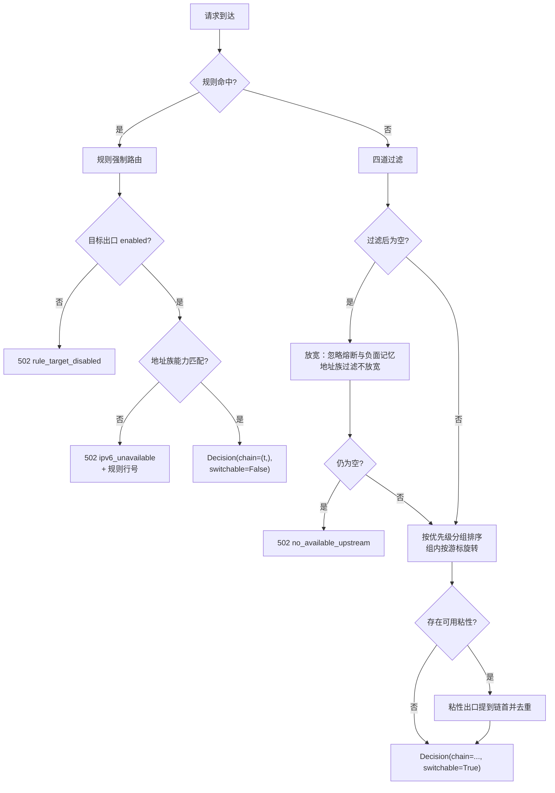
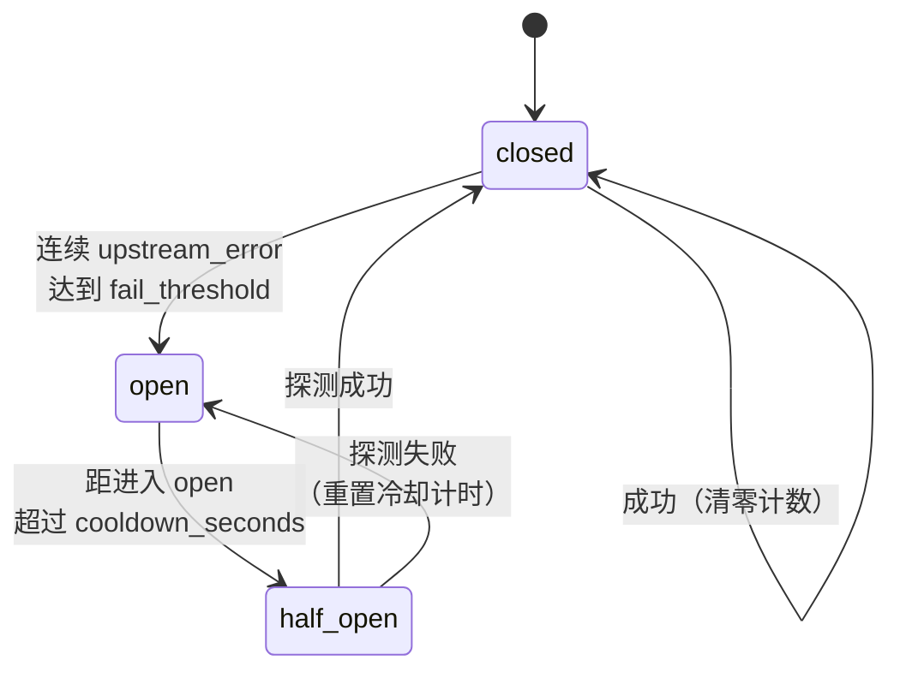
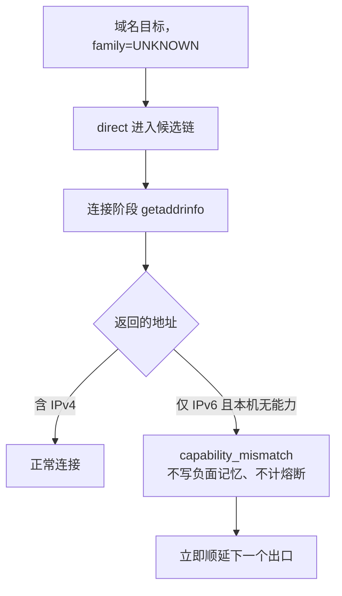

# DD_ROUTING.md - 路由决策详细设计

| 版本 | 日期 | 变更说明 | 作者 |
| :--- | :--- | :--- | :--- |
| v1.0.0 | 2026-08-13 | 初始版本：候选链构造算法、粘性映射、健康与熔断状态机、路由级负面记忆、地址族能力过滤 | Agent |
| v1.1.0 | 2026-08-13 | 分歧定案：`manual` 粘性不因失败清除写入 `record_failure` 实现；§7.2b 补充「粘性是偏好、规则才是硬约束」的完整理由，与 [PRD §4.6.1](../requirements/PRD_OVERVIEW.md) 对齐 | Agent |
| v1.2.0 | 2026-08-14 | M3 实现回写：§7.1 补 `restore()`、`forget_upstreams_except()` 与强制关键字的 `threshold`；新增 §7.4 粘性失败计数记在 host 上的口径、§7.5 热重载对粘性的处理 | Agent |
| v1.3.0 | 2026-08-14 | M4 切片 b：新增 §4.7 区分 `clear_circuit`（手动重置熔断、保留累计）与 `reset`（整条移除），并说明对增量落盘的影响 | Agent |
| v1.4.0 | 2026-08-15 | M4 切片 c：新增 §7.6 手动绑定入口 `bind_manual()` 与「超容优先淘汰 `auto`」——手动绑定被 LRU 挤掉时内存与库不一致，表现为「绑定时好时坏、重启又好了」 | Agent |
| v1.5.0 | 2026-08-16 | 依生产日志新增 §3.2b 内网直连前置：内网 IP 字面量把 `direct` 提到链首（只重排不裁剪，粘性仍可覆盖），消除内网主机冷启动 60 秒的连接超时 | Agent |

**对应需求**：[PRD §4.3.6](../requirements/PRD_OVERVIEW.md)（故障归类）、[§4.3.7](../requirements/PRD_OVERVIEW.md)（候选链）、[§4.3.10](../requirements/PRD_OVERVIEW.md)（熔断）、[§4.2.4](../requirements/PRD_OVERVIEW.md)（地址族）、[§4.6](../requirements/PRD_OVERVIEW.md)（粘性）、[§4.9](../requirements/PRD_OVERVIEW.md)（并发）

**上游依赖**：`config`、`rules`、`state`
**下游使用者**：`egress.executor`、`web`

---

## 1. 职责边界

`Router` 回答一个问题：**这个请求应该按什么顺序尝试哪些出口**。它不发起连接、不判断失败是否值得切换（那是 [DD_SWITCHING.md](./DD_SWITCHING.md)）、不读写数据库。

```python
# r_proxy/decision/router.py

class Router:
    def build_chain(
        self,
        target: RequestTarget,
        snapshot: ConfigSnapshot,
        rule_set: RuleSet,
        state: RuntimeStateView,       # 只读视图
        *,
        now: float,
    ) -> Decision: ...
```

`now` 由调用方传入而非内部取 `time.monotonic()`：使全部时间相关逻辑（冷却期、TTL、限流窗口）在测试中可控，无需 sleep 或 mock 时钟。

**`RuntimeStateView` 是只读协议**，`Router` 拿不到任何写方法。状态变更由 `AttemptExecutor` 在得到结果后执行，二者职责不混淆。

---

## 2. 决策主流程



### 2.1 规则强制路由的三种终局

规则命中后候选链长度恒为 1，没有顺延余地，因此不可用的情况必须在**发起连接之前**判定清楚：

| 情形 | 行为 | 日志 `reason` |
|------|------|--------------|
| 出口存在且可用 | 正常执行，失败不切换 | — |
| 出口被 `enabled: false` | 不连接，`502` | `rule_target_disabled` |
| 出口为 `direct`、目标纯 IPv6、本机无 IPv6 能力 | 不连接，`502` | `ipv6_unavailable` |

后两种都必须在 `request_log` 中带上**命中的规则序号与条件**。运维看到的应该是「规则 #12（`api.partner.com`）指向的出口不可用」，而不是一个语焉不详的 `502`。

这些信息只进日志与 `request_log`；给客户端的 `502` 响应体只含通用描述与 `request_id`，不回显出口名、地址或规则内容（[PRD §4.3.9](../requirements/PRD_OVERVIEW.md)）。

规则命中时**不检查熔断状态**：熔断是自动路由用来避开坏出口的机制，而规则表达的是用户的明确意图。若因熔断而拒绝执行规则，用户会认为规则失效了。让它去尝试并失败，语义更清晰。

### 2.2 粘性的两种来源

| source | 来源 | 优先级 | 失败后 |
|--------|------|--------|--------|
| `manual` | Web 界面手动绑定 | 高 | 同样切换，但**不被自动 UPSERT 覆盖** |
| `auto` | 上次成功自动记录 | 低 | `fail_count` 达阈值后清除 |

`manual` **不因失败清除**，理由见 §7.2b。

`manual` 的保护在存储层实现（UPSERT 带 `WHERE source != 'manual'`，见 [DD_STORAGE.md](./DD_STORAGE.md) §4.3）。路由层只需按「manual 优先于 auto」取值。

---

## 3. 候选链构造

### 3.1 四道过滤

```python
def _filter_usable(
    self, target, snapshot, state, *, now, relaxed: bool
) -> list[str]:
    usable: list[str] = []
    for u in snapshot.upstreams:
        if not u.enabled:                                    # 1
            continue
        if not self._family_ok(u, target, state):            # 4：永不放宽
            continue
        if not relaxed:
            if not state.health.is_available(u.name, now=now):   # 2
                continue
            if state.memory.is_blocked(target.host, u.name, now=now):  # 3
                continue
        usable.append(u.name)
    return usable
```

四道条件的语义差异是本模块最容易做错的地方：

| 序号 | 条件 | 性质 | 参与放宽 |
|------|------|------|----------|
| 1 | `enabled` | 用户意图 | **否** |
| 2 | 未熔断 | 时效性判断，可能过时 | 是 |
| 3 | 无负面记忆 | 时效性判断，可能过时 | 是 |
| 4 | 地址族能力匹配 | **结构性**事实 | **否** |

放宽的目的是「宁可试一次也别让用户完全上不去网」。这对条件 2、3 成立——它们是基于历史观测的推断，可能已经不准。但对条件 4 不成立：本机没有 IPv6 出口，目标只有 IPv6 地址，放宽后再试一次的结果必然还是 `ENETUNREACH`，除了多消耗一次超时之外没有任何收益。

条件 1 不放宽是因为它是用户的明确指令，不是系统的推断。

### 3.2 分组排序与轮询

```python
def _order(self, usable: set[str], snapshot: ConfigSnapshot,
           state: RuntimeStateView) -> list[str]:
    chain: list[str] = []
    for priority, members in snapshot.priority_groups:
        present = [m for m in members if m in usable]
        if not present:
            continue
        if len(present) == 1:
            chain.append(present[0])
            continue
        cursor = state.cursors.next(priority, len(present))
        offset = cursor % len(present)
        chain.extend(present[offset:] + present[:offset])
    return chain
```

`priority_groups` 已在配置加载时构建并排序（[DD_CONFIG.md](./DD_CONFIG.md) §2.1），此处只做过滤与旋转。

**游标推进的时机是构造候选链时，不是请求成功时**。若只在成功时推进，某出口连续失败的场景下游标不动，每个请求都从同一个坏出口开始。构造时推进保证了负载在组内均摊。

**单成员组不消耗游标**（`len(present) == 1` 的分支）。取模后偏移恒为 0，推进游标只是无谓的状态变化。

```python
# r_proxy/state/runtime.py

class CursorTable:
    """每个优先级组一个游标。事件循环内的读改写无 await，天然原子。"""
    def __init__(self) -> None:
        self._c: dict[int, int] = {}

    def next(self, priority: int, _size: int) -> int:
        v = self._c.get(priority, 0)
        self._c[priority] = v + 1
        return v

    def reset_all(self) -> None:
        self._c.clear()
```

游标**单调递增不取模**，取模在使用点做。这样组成员数量变化（热重载）时不会因为旧游标超出新长度而出错。整数溢出在 Python 中不存在。

### 3.2b 内网直连前置

优先级链是按「出公网走哪条路更好」排的，对内网目标恰好排反了：上级代理通常优先级更高，于是第一次访问一台内网主机要先赔满连接超时，才轮到那个几毫秒就能成功的 `direct`。

```python
def _direct_first(chain, target, snapshot) -> tuple[str, ...]:
    if not target.is_private_literal:
        return chain
    direct = next((n for n in chain
                   if (u := snapshot.upstream(n)) is not None and u.is_direct), None)
    if direct is None:
        return chain
    return (direct, *(n for n in chain if n != direct))
```

调用顺序是 `_order` → `_direct_first` → `_apply_sticky`，三条约束都由此而来：

**只重排，不裁剪。** 内网不等于直连可达。2026-08-16 的生产日志里，`198.51.100.116` 与 `.117` 共 116 次请求全部经 `z83-3128` 成功——代理主机对该网段 `No route to host`，只有上级代理到得了。把内网目标限制为只走 `direct` 会让这部分流量彻底不通。

**粘性仍然定链首。** 重排发生在 `_apply_sticky` 之前，已经学会走上级代理的内网主机不受影响。本调整只改变「还没学到任何东西」时的第一步。

**`direct` 不在 `usable` 中就不插回去。** 它可能被禁用、熔断或干脆不在配置里，那几道过滤各有各的理由，绕过去只会白等一次超时。

只认 **IP 字面量**（`RequestTarget.is_private_literal`，含私网、回环、链路本地两个地址族）。域名要解析才知道落在哪个网段，而热路径上不做解析——与 §5.3 对域名给 `UNKNOWN` 是同一条理由。用户要让某个内网域名直连，写一条规则即可。

> 注意 Python 的 `ipaddress` 把 IPv6 文档段 `2001:db8::/32` 也归为 `is_private`，测试里若用它做「普通目标」会意外触发本前置。测试请改用全局地址（如 `2606:4700::1111`）。

**依据**（2026-08-16 生产日志）：`192.0.2.100` 冷启动时的候选链为 `z83-3128`（超时 30 秒）→ `z83-us-cloud`（超时 30 秒）→ `direct`（5 毫秒成功），用户实际等待 **60 秒**。而代理主机对内网不可达的目标是**快速失败**的（实测 `No route to host` 11 毫秒、`Connection refused` 6–118 毫秒），因此前置 `direct` 对那些只有代理到得了的网段代价仅十几毫秒。

### 3.3 粘性前置

```python
def _apply_sticky(self, chain: list[str], target, state,
                  usable: set[str]) -> tuple[list[str], str]:
    entry = state.sticky.get(target.host)
    if entry is None or entry.upstream not in usable:
        return chain, "priority"
    head = entry.upstream
    return [head] + [u for u in chain if u != head], entry.source
```

粘性出口若已不在 `usable` 中（被禁用、熔断、有负面记忆、地址族不匹配），**不前置也不清除**。清除是执行层的职责——只有真正尝试失败才累加 `fail_count`。路由层因为熔断而暂时跳过它，不代表这个粘性绑定是错的。

### 3.4 完整示例

出口：`A(P10)`、`B(P10)`、`C(P50)`、`direct(P100)`

| # | 场景 | P10 游标 | 候选链 |
|---|------|---------|--------|
| 1 | 无粘性、全健康 | 0 | `A → B → C → direct` |
| 2 | 无粘性、全健康 | 1 | `B → A → C → direct` |
| 3 | `example.com` 粘性绑 `C` | 2 | `C → A → B → direct` |
| 4 | `A` 熔断中 | 3 | `B → C → direct` |
| 5 | 目标纯 IPv6、本机无 IPv6 | 4 | `A → B → C`（`direct` 被过滤） |
| 6 | 全部熔断 | 5 | 放宽 → `B → A → C → direct` |
| 7 | 全部熔断 + 目标纯 IPv6 无能力 | 6 | 放宽 → `B → A → C`（`direct` **仍**被排除） |

第 7 行是四道过滤中「地址族不参与放宽」的直接体现。

---

## 4. 出口健康与熔断状态机

### 4.1 状态机



状态**完全在内存中**。落盘只为 Web 展示与重启后的粗略恢复，路由决策一律读内存（[PRD §4.3.10](../requirements/PRD_OVERVIEW.md)）。

### 4.2 数据结构

```python
# r_proxy/state/health.py

class HealthState(Enum):
    CLOSED = auto()
    OPEN = auto()
    HALF_OPEN = auto()


@dataclass(slots=True)
class UpstreamHealth:
    name: str
    state: HealthState = HealthState.CLOSED
    consecutive_failures: int = 0
    opened_at: float = 0.0
    probe_in_flight: bool = False       # half_open 的并发闸门
    total_success: int = 0
    total_failure: int = 0
    last_success_at: float = 0.0
    last_error: str | None = None


class HealthTable:
    def __init__(self, cfg: CircuitBreakerConfig) -> None:
        self._cfg = cfg
        self._h: dict[str, UpstreamHealth] = {}

    def is_available(self, name: str, *, now: float) -> bool:
        h = self._h.get(name)
        if h is None or h.state is HealthState.CLOSED:
            return True
        if h.state is HealthState.OPEN:
            if now - h.opened_at < self._cfg.cooldown_seconds:
                return False
            h.state = HealthState.HALF_OPEN          # 惰性迁移
            h.probe_in_flight = False
        return not h.probe_in_flight                 # half_open：只放行一个
```

### 4.3 惰性状态迁移

`open → half_open` 的迁移**在查询时判定**，不用定时器。理由：

- 定时器需要为每个出口维护一个 `call_later` 句柄，热重载删除出口时要记得取消，容易泄漏
- 没有请求时的状态迁移毫无意义——迁移到 `half_open` 只是为了让下一个请求能去探测
- 惰性迁移让状态转换与请求严格同步，测试时给定 `now` 即可确定性复现

代价是 Web 界面查询到的状态可能显示为 `open` 而实际冷却期已过。解决办法是 Web 的健康查询接口也传入 `now` 走同一份判定逻辑，而不是直接读 `h.state` 字段。

### 4.4 half_open 的并发闸门

```python
def acquire_probe(self, name: str) -> bool:
    """尝试获取 half_open 探测名额。同步方法，无 await。"""
    h = self._h.get(name)
    if h is None or h.state is not HealthState.HALF_OPEN:
        return True                     # closed 状态不需要名额
    if h.probe_in_flight:
        return False                    # 已有探测在飞，本请求跳过该出口
    h.probe_in_flight = True
    return True
```

**必须是同步方法**。若中间有 `await`，两个请求可能都读到 `probe_in_flight == False` 然后都置为 `True`，闸门失效。单进程 asyncio 下无 `await` 的读改写不会被打断，这就是全部所需的同步机制——不需要 `asyncio.Lock`。

名额在得到结果时释放：

```python
def record_result(self, name: str, *, ok: bool, kind: FailureKind,
                  now: float, error: str | None = None) -> None:
    h = self._h.setdefault(name, UpstreamHealth(name))
    h.probe_in_flight = False

    if ok:
        h.total_success += 1
        h.consecutive_failures = 0
        h.last_success_at = max(h.last_success_at, now)   # 单调，见 §4.5
        h.state = HealthState.CLOSED
        return

    h.total_failure += 1
    h.last_error = error

    if kind is not FailureKind.UPSTREAM_ERROR:
        return                          # route_error / capability 不计熔断

    h.consecutive_failures += 1
    if h.state is HealthState.HALF_OPEN:
        h.state = HealthState.OPEN
        h.opened_at = now               # 重新计冷却，避免探测失败后立刻再探
    elif h.consecutive_failures >= self._cfg.fail_threshold:
        h.state = HealthState.OPEN
        h.opened_at = now
```

两处关键判断：

1. **`kind is not UPSTREAM_ERROR` 时提前返回**。`route_error` 说明代理活着，只是到不了这个目标；`capability_mismatch` 是结构性问题。二者都不该导致出口被熔断。这是 [PRD §4.3.6](../requirements/PRD_OVERVIEW.md) 中「防止 `direct` 被访问被墙站点拖垮」的实现点
2. **`half_open` 探测失败时重置 `opened_at`**。若不重置，`now - opened_at` 仍然大于冷却期，下一个请求立即又变成 `half_open`，退化为无冷却的连续重试

### 4.5 last_success_at 的单调保护

`max(h.last_success_at, now)` 对应 [PRD §4.9.2](../requirements/PRD_OVERVIEW.md) RC-06。乱序完成的请求（先发起的后完成）会用较早的时间戳覆盖较晚的，导致「最后成功时间」倒退。取最大值即可。

用 `time.monotonic()` 而非 `time.time()`：系统时钟调整（NTP 同步、手动改时间）会让 `time.time()` 跳变，冷却期可能瞬间失效或永久卡住。展示给用户的墙钟时间另行记录。

### 4.6 direct 永不熔断

```python
def record_result(self, name, *, ok, kind, now, error=None):
    if name == DIRECT and not ok:
        kind = FailureKind.ROUTE_ERROR       # 强制降级
    ...
```

在 `HealthTable` 入口处强制转换，而不是依赖调用方每次都传对 `kind`。这是一条安全性质的约束（[PRD §4.3.6](../requirements/PRD_OVERVIEW.md)：`direct` 被熔断会导致内网、localhost 全部不可访问），放在唯一的收敛点上比散落在各调用点更可靠。

### 4.7 手动重置与「忘掉」是两件事

| 方法 | 语义 | 累计计数 | 使用方 |
|------|------|----------|--------|
| `clear_circuit(name)` | 状态回 `closed`、连续失败清零、`auth_error` 清除 | **保留** | Web 的「重置熔断」按钮（[DD_WEB §8.4](./DD_WEB.md)） |
| `reset(name)` | 整条记录移除 | 丢弃 | 出口从配置中消失（等价于 `forget_except` 的单项形式） |

两者必须分开：运维点「重置」的意图是「再给它一次机会」，而看板上的历史成功率正来自 `total_success` / `total_failure`，顺手清零会让人失去判断「这个出口一直不稳，还是刚坏」的依据。

`clear_circuit` 顺带清 `auth_error`：点重置通常正是因为刚改完上级代理凭据，标志会在下一次认证失败时自己回来。

对落盘也是安全的：`HealthPersister` 用「当前累计 − 上次落盘累计」算增量，`clear_circuit` 不动累计值，因此不会产生负增量（这正是 `reset` 需要配合基线丢弃的原因，见 [DD_STORAGE §4.7](./DD_STORAGE.md)）。

---

## 5. 地址族能力过滤

### 5.1 问题的非对称性

| 出口类型 | 谁解析目标域名 | r-proxy 是否知道目标地址族 |
|----------|---------------|---------------------------|
| `direct` | **r-proxy 自己** | **知道** |
| 上级 HTTP 代理 + 域名 | 上级代理 | 不知道 |
| 上级 HTTP 代理 + IP 字面量 | 无需解析 | 知道目标族，但不知道上级有无该族能力 |

只有第一行能在连接前做出可靠判断，因此**能力过滤只对 `direct` 生效**。这不是简化，而是信息边界的客观结果：经上级代理时目标由上级解析，我们连目标有没有 IPv6 地址都不知道。

上级代理的地址族问题交给 `(host, upstream)` 负面记忆自然学习——试一次失败，记住，下次跳过。这也是为什么**不引入 `supports_ipv6` 配置字段**（[PRD §4.2.4](../requirements/PRD_OVERVIEW.md)）：该字段无法验证、会随上级网络变化而过时，且用户填错会造成静默的错误路由。

### 5.2 出口能力探测

```python
# r_proxy/egress/capability.py

class EgressCapability:
    """本机 IPv6 出口能力。启动时探测一次，SIGHUP 时重探。"""

    def __init__(self) -> None:
        self._has_ipv6 = False

    def refresh(self) -> None:
        self._has_ipv6 = self._probe_ipv6()

    @property
    def has_ipv6(self) -> bool:
        return self._has_ipv6

    @staticmethod
    def _probe_ipv6() -> bool:
        """UDP connect 不发包，只让内核做路由查找。耗时约 0.2ms。"""
        try:
            with socket.socket(socket.AF_INET6, socket.SOCK_DGRAM) as s:
                s.connect(("2001:4860:4860::8888", 53))
                local = s.getsockname()[0]
        except OSError:
            return False
        addr = ipaddress.IPv6Address(local)
        return not (addr.is_link_local or addr.is_loopback or addr.is_unspecified)
```

UDP `connect()` 不产生任何网络流量：内核只做路由表查找并绑定本地地址。检查绑定到的本地地址是否为全局地址，可以区分「有真正的 IPv6 出口」与「只有链路本地地址 `fe80::`」——后者在纯 IPv4 网络中普遍存在，用 `socket.has_ipv6` 或「能否创建 AF_INET6 套接字」判断都会误判为有能力。

### 5.3 目标地址族判定

```python
def _family_ok(self, u: UpstreamConfig, target: RequestTarget,
               state: RuntimeStateView) -> bool:
    if not u.is_direct:
        return True                          # 非 direct 无从判断
    if state.capability.has_ipv6:
        return True                          # 有能力则不必判断目标
    return target.family is not AddressFamily.IPV6_ONLY
```

`target.family` 的来源：

| 情形 | family | 何时确定 |
|------|--------|----------|
| host 是 IPv4 字面量 | `IPV4_ONLY` | 解析请求时立即确定 |
| host 是 IPv6 字面量 | `IPV6_ONLY` | 同上 |
| host 是域名 | `UNKNOWN` | 需要 DNS 解析 |

域名的情况怎么办？**不在路由决策阶段解析 DNS**——决策层禁止 I/O，且为每个请求预先解析会显著增加延迟。

处理方式：域名目标的 `family` 保持 `UNKNOWN`，`direct` 正常进入候选链。真正连接时 `direct` 连接器执行 `getaddrinfo`，此时才知道地址族：



代价是纯 IPv6 域名目标每次都会浪费一次 DNS 解析（约 6ms，且有系统缓存）。收益是决策层保持无 I/O。这个权衡是明确的：纯 IPv6-only 域名在实践中罕见，而每请求的决策延迟影响所有流量。

### 5.4 Happy Eyeballs

目标是双栈时按 RFC 8305 并行尝试。**使用标准库自带实现**，不自己写：

```python
# r_proxy/egress/connector.py

async def _connect_direct(
    self, host: str, port: int, cfg: RoutingConfig, timeout: float,
) -> tuple[StreamReader, StreamWriter]:
    kwargs: dict[str, object] = {}
    if cfg.happy_eyeballs_delay > 0:
        kwargs["happy_eyeballs_delay"] = cfg.happy_eyeballs_delay
        kwargs["interleave"] = 1        # 地址族交错排列，见下
    async with asyncio.timeout(timeout):
        return await asyncio.open_connection(host, port, **kwargs)
```

`asyncio` 自 3.8 起原生支持 `happy_eyeballs_delay`，行为符合 RFC 8305。自己实现「并行发起、延迟启动第二族、取消落败任务」的逻辑，只会在取消与异常传播的边角上引入 bug，而收益为零。

`interleave=1` 需要显式传入：不传时即便设了 `happy_eyeballs_delay`，候选地址仍按 `getaddrinfo` 的原始顺序排列，同一地址族的多个地址会连续排在一起，第二族要等前面所有地址都尝试过才轮到。设为 1 使两族地址交错，这才是 RFC 8305 描述的行为。

| 场景 | 行为 |
|------|------|
| 只有 IPv4 地址 | 直接连，无并行开销 |
| 只有 IPv6 地址、本机有能力 | 直接连 |
| 只有 IPv6 地址、本机无能力 | 已在 §5.3 被判为 `capability_mismatch` |
| 双栈、IPv6 路径正常 | IPv6 在 250ms 内成功，IPv4 从未发起 |
| 双栈、IPv6 路径黑洞 | 250ms 后并行 IPv4，总延迟约 250ms + IPv4 RTT |
| 双栈、IPv6 立即 `ENETUNREACH` | 标准库在该地址失败后立即推进下一个，不等满 250ms |

`happy_eyeballs_delay` 只是「多久后启动下一族」，某一族**立即失败**时会马上推进——实测 `ENETUNREACH` 在 4.9ms 内返回，不会白等 250ms。

**Happy Eyeballs 解决的是「有 IPv6 地址但路径不通」**，不是「本机没有 IPv6」。后者由 §5.2 的能力探测在更早的阶段解决，两者互补而非重复。

`happy_eyeballs_delay: 0` 时不传该参数，退化为按 `getaddrinfo` 返回顺序串行尝试。

**仅对 `direct` 生效**。经上级代理时我们只连上级代理的地址，目标的地址族选择由上级负责。上级代理地址本身若是域名且双栈，同样会走这条路径——这是自然的副产品，不需要特殊处理。

---

## 6. 路由级负面记忆

### 6.1 数据结构

```python
# r_proxy/state/memory.py

@dataclass(slots=True)
class RouteBlock:
    host: str
    upstream: str
    blocked_until: float          # monotonic
    fail_count: int
    last_reason: str


class RouteMemory:
    """(host, upstream) → 负面记忆。容量受 limits.route_block_cache_size 限制。"""

    def __init__(self, capacity: int, ttl: float) -> None:
        self._ttl = ttl
        self._cap = capacity
        self._m: OrderedDict[tuple[str, str], RouteBlock] = OrderedDict()

    def is_blocked(self, host: str, upstream: str, *, now: float) -> bool:
        b = self._m.get((host, upstream))
        if b is None:
            return False
        if now >= b.blocked_until:
            del self._m[(host, upstream)]        # 惰性过期
            return False
        self._m.move_to_end((host, upstream))
        return True

    def block(self, host: str, upstream: str, *, now: float, reason: str) -> None:
        key = (host, upstream)
        b = self._m.get(key)
        if b is None:
            b = RouteBlock(host, upstream, 0.0, 0, reason)
            if len(self._m) >= self._cap:
                self._m.popitem(last=False)      # 淘汰最久未用
        b.blocked_until = now + self._ttl
        b.fail_count += 1
        b.last_reason = reason
        self._m[key] = b
        self._m.move_to_end(key)

    def clear(self, host: str, upstream: str) -> None:
        self._m.pop((host, upstream), None)
```

### 6.2 惰性过期而非定时清理

TTL 默认 600 秒，容量默认 50000。定时扫描全表清理过期项需要遍历，而惰性过期（查询时发现过期就删）把成本摊到查询上，且天然只清理被访问到的键。

未被访问的过期项会一直占位，但它们会因 LRU 淘汰而被逐出——LRU 顺序恰好近似于「最久未访问」，与「最可能已过期」高度相关。不需要额外的清理任务。

### 6.3 成功时清除

```python
# 在 AttemptExecutor 中
if outcome.ok:
    state.memory.clear(target.host, outcome.upstream)
```

成功一次即完全清除该 `(host, upstream)` 的记忆，包括 `fail_count`。不做「递减」：网络恢复是二值的，一次成功就说明这条路通了，没必要让它经历多次成功才摘掉标记。

---

## 7. 粘性映射

### 7.1 数据结构

```python
# r_proxy/state/sticky.py

@dataclass(slots=True)
class StickyEntry:
    host: str
    upstream: str
    source: Literal["auto", "manual"]
    fail_count: int = 0
    last_used_at: float = 0.0
    hit_count: int = 0


class StickyCache:
    """host → 出口。容量受 limits.sticky_cache_size 限制（默认 10000）。"""

    def __init__(self, capacity: int) -> None:
        self._cap = capacity
        self._m: OrderedDict[str, StickyEntry] = OrderedDict()

    def get(self, host: str) -> StickyEntry | None:
        e = self._m.get(host)
        if e is not None:
            self._m.move_to_end(host)
        return e

    def record_success(self, host: str, upstream: str, *, now: float) -> bool:
        """返回 True 表示产生了需要落盘的变更。"""
        e = self._m.get(host)
        if e is not None and e.source == "manual":
            e.hit_count += 1
            e.last_used_at = now
            return False                          # 不覆盖手动绑定
        if e is not None and e.upstream == upstream:
            e.fail_count = 0
            e.hit_count += 1
            e.last_used_at = now
            self._m.move_to_end(host)
            return False                          # 仅计数变化，走 SQL 侧自增
        self._put(host, StickyEntry(host, upstream, "auto",
                                    last_used_at=now, hit_count=1))
        return True                               # 绑定关系变化，需 UPSERT

    def record_failure(self, host: str, threshold: int) -> bool:
        """返回 True 表示粘性被清除。"""
        e = self._m.get(host)
        if e is None:
            return False
        e.fail_count += 1
        if e.source == "manual":
            return False        # 用户声明不因失败作废，见 §7.2
        if e.fail_count >= threshold:
            del self._m[host]
            return True
        return False
```

`manual` 条目的 `fail_count` 照常累加——它是给用户看的健康指标，只是不触发清除。

### 7.2 manual 绑定的两层保护

| 层 | 机制 |
|----|------|
| 内存 | `record_success` 检测到 `source == "manual"` 时不改绑定 |
| 数据库 | UPSERT 带 `WHERE source != 'manual'`（[DD_STORAGE.md](./DD_STORAGE.md) §4.3） |

两层都要有。只有内存保护时，进程重启后从库中回填、再被某次成功覆盖的窗口期内可能丢失手动绑定；只有 SQL 保护时，内存中的绑定已经被改错，落盘被拒绝反而造成内存与磁盘不一致。

### 7.2b manual 绑定失败达阈值时不清除

依据 [PRD §4.6.1](../requirements/PRD_OVERVIEW.md)。两类粘性的性质根本不同：

| 来源 | 性质 | 反复失败意味着 |
|------|------|---------------|
| `auto` | 对「上次哪个出口能用」这一事实的**缓存** | 缓存内容已过时 → 作废重学，标准的缓存失效 |
| `manual` | 用户的**声明** | 用户的偏好暂时不可用 → 没有任何「学来的东西」需要失效 |

自动清除 `manual` 等于系统单方面推翻用户配置，而且是静默的。

「不清除会不会导致每次请求都撞一个死掉的出口」——不会。`(host, upstream)` 负面记忆（§6）已经在候选链构造的过滤阶段跳过该组合，并带 TTL 自动恢复。清除粘性绑定在避免无谓重试这件事上不产生任何额外收益，只会丢失用户意图。

失败时的实际行为：本次请求正常沿候选链切换到其他出口完成，绑定关系保留，负面记忆生效期间该出口不进入候选链，TTL 过期后自动恢复优先尝试。

**粘性是偏好，不是硬绑定。** 需要「只能走某个出口」的用户必须写规则——规则命中时候选链长度恒为 1、失败不切换。这一区分见 [PRD §4.6.1](../requirements/PRD_OVERVIEW.md) 的对照表。

实现与上面的伪代码有三处差别：

| 项 | 实现 | 理由 |
|----|------|------|
| `record_failure(host, *, threshold)` | 强制关键字 | `host` 与 `threshold` 都可能被误传，位置参数传错时不报错，只是行为不对 |
| 新增 `restore(entry)` | 启动回填用，按 `updated_at` 降序调用 | 回填要保留 `source`、`hit_count`、`last_used_at`，不能借 `record_success` 走一遍（它会把 `manual` 当成新绑定） |
| 新增 `forget_upstreams_except(names)` | 热重载后清掉指向已删出口的绑定 | 见 §7.5 |

`last_used_at` 用 `max(old, new)` 更新而非直接赋值：乱序完成的请求（先发起的后完成）不该让时间倒退，与 §4.5 同一个 RC-06。

### 7.3 计数字段不走 UPSERT

`hit_count` 与 `last_used_at` 变化频繁但不改变绑定关系。若每次成功都发一条 UPSERT，写入量会与请求量同数量级。

处理方式：绑定关系变化时发 UPSERT，纯计数变化时发独立的自增语句（SQL 侧 `SET hit_count = hit_count + 1`），且这类语句在写者线程中可以合并——同一批次内同一 host 的多次自增合并为一次 `+ N`。详见 [DD_STORAGE.md](./DD_STORAGE.md) §4.4。

因此 `record_success()` 的返回值就是「发哪条语句」的判据：`True` 发 UPSERT，`False` 发自增。执行层不重复判断绑定是否变化——那需要它先读一遍粘性，而读改写正是 RC-02 的成因。

### 7.4 失败计数记在 host 上

`record_failure(host, ...)` 不接收出口名。粘性条目回答的是「上次成功的那个出口现在还灵不灵」，而**任何**出口上的失败都构成对这个判断的否证：请求最终可能由链上后面的出口完成，但链首（即粘性出口）已经失败过一次。

反过来说，如果按 `(host, upstream)` 记，就与 `(host, upstream)` 负面记忆（§6）完全重复了——后者才是「经这条路到不了这个目标」的权威记录，且带 TTL 自动恢复。两者职责不同：负面记忆决定**候选链里还留不留它**，粘性失败计数决定**这个偏好还要不要保留**。

规则强制路由的失败**不计入**粘性失败计数，也不写粘性（[PRD §4.4.4](../requirements/PRD_OVERVIEW.md)）：规则每次都命中同一出口，粘性对它毫无作用，写进去只会在用户删除规则后继续生效，表现为「规则删了但路由没变」。

### 7.5 热重载对粘性的处理

| 变化 | 处理 |
|------|------|
| 出口被删除 | 清掉指向它的全部绑定，**包括 `manual`** |
| `limits.sticky_cache_size` 变小 | 按 LRU 淘汰到新容量 |
| 其它配置变化 | 绑定全部保留 |

删除出口时连 `manual` 一起清掉，与「永不覆盖手动绑定」不矛盾：出口都不在配置里了，保留用户的绑定意图也无从执行，留着只会让候选链构造每次都做一次无效查找。这一点与熔断状态、负面记忆的处理一致（§4、§6）。

### 7.6 手动绑定的写入路径与 LRU 淘汰

Web 界面的手动绑定（[DD_WEB §8.6](./DD_WEB.md)）不能借 `record_success` 完成——那条路径写死 `source = "auto"`，且遇到已有的 `manual` 条目会拒绝改动（§7.2）。因此另开一个入口：

```python
def bind_manual(self, host: str, upstream: str, *, now: float) -> None:
    """覆盖任何已有条目，包括另一条 manual。fail_count 清零。"""
    self._put(StickyEntry(host, upstream, source="manual", last_used_at=now))
```

`fail_count` 清零是因为改绑的意图就是「换一条路重新开始」：留着上一个出口攒下的失败次数，界面上会显示一个与当前绑定无关的数字。

**超容时优先淘汰 `auto`**。原本的 `_evict_to_capacity` 一律 `popitem(last=False)`，手动绑定会被一批自动学到的映射挤掉，而这种失效格外难查：

| 时刻 | 内存 | 数据库 |
|------|------|--------|
| 绑定后 | `manual → proxy-a` | `manual → proxy-a` |
| 被 LRU 挤掉后 | 无（按优先级重新选路） | `manual → proxy-a` |
| 重启后 | `manual → proxy-a`（回填） | `manual → proxy-a` |

表现是「设置过的绑定时好时坏，重启一下又好了」。改法是前向扫描找最旧的 `auto`：

```python
while len(self._entries) > self._capacity:
    victim = self._oldest_auto()
    if victim is None:
        self._entries.popitem(last=False)   # 全是 manual：上限仍是硬约束
    else:
        del self._entries[victim]
```

全是 `manual` 时照旧淘汰最旧的那条：容量上限是硬约束，不能因为条目类型而失效（[PRD §7.2](../requirements/PRD_OVERVIEW.md) 的「可增长资源必须有界」）。扫描代价与 `manual` 条目数同阶，而它在实际配置里是个位数。

---

## 8. 并发竞态与对策

对应 [PRD §4.9.2](../requirements/PRD_OVERVIEW.md)：

| 编号 | 竞态 | 对策 | 实现位置 |
|------|------|------|----------|
| RC-01 | 100 个并发请求同时撞上刚失效的出口 | 失败即时写内存，后续请求立即可见；`half_open` 只放行 1 个探测 | §4.4 |
| RC-02 | 并发计数器读改写丢失 | 内存侧无 `await` 原子；SQL 侧 `SET c = c + 1` | §4.4、[DD_STORAGE](./DD_STORAGE.md) §4.4 |
| RC-03 | 粘性写入未落盘时其他请求读到旧值 | 接受最终一致：内存立即生效，落盘只影响重启后 | §7.1 |
| RC-04 | 自动 UPSERT 覆盖手动绑定 | 内存 + SQL 双层保护 | §7.2 |
| RC-05 | 热重载与请求并发 | 不可变快照 + 引用替换 | [DD_CONFIG](./DD_CONFIG.md) §6.1 |
| RC-06 | 乱序完成导致时间戳倒退 | `max(old, new)` | §4.5 |

**未采用 per-host 锁**。给每个 host 加锁能避免「多个请求同时探测同一个坏出口」，但会造成队头阻塞：同一 host 的所有请求串行化，一个慢请求拖住其余全部。失败快速传播（RC-01）已经把重复探测的窗口压缩到毫秒级，代价远小于队头阻塞。

---

## 9. 与执行层的接口

```python
# r_proxy/egress/executor.py（骨架）

async def execute(self, target: RequestTarget, decision: Decision,
                  ctx: RequestContext) -> Response:
    for upstream in decision.chain:
        now = time.monotonic()

        # 尝试前重新检查健康（PRD §4.9.4：不在请求开始时固化）
        if decision.switchable and not self._state.health.is_available(
            upstream, now=now
        ):
            continue
        if not self._state.health.acquire_probe(upstream):
            continue                      # half_open 名额已被占用

        outcome, response = await self._attempt(upstream, target, ctx)
        self._state.record(target, outcome, now=time.monotonic())
        self._enqueue_log(ctx.request_id, outcome)

        if outcome.ok:
            return response
        if not decision.switchable:
            return response               # 规则强制路由：原样返回
        if not self._policy.should_switch(outcome, ctx).switch:
            return response               # 判据否决
        if not ctx.replayable:
            return response               # 字节已不可重放

    return self._exhausted_response(ctx.request_id)
```

三处 `continue` 与三处提前 `return` 的区别是本设计的核心语义：

- `continue`：**跳过**这个出口，不算作一次失败尝试（未发起连接）
- `return`：**终止**整个候选链，把结果原样交给客户端

混淆二者会导致「判据说不该切换，但代码继续试了下一个出口」这类违反安全约束的行为（例如 POST 被重复投递）。

---

## 10. 测试要点

| 场景 | 期望 | 对应验收 |
|------|------|----------|
| 同优先级两出口连续请求 | 交替作为链首 | SW-02 |
| 单成员优先级组 | 游标不推进 | — |
| 粘性存在且可用 | 提到链首，其余保持优先级序，无重复 | SW-05 |
| 粘性出口熔断中 | 不前置，**也不清除**粘性 | — |
| 全部出口熔断 | 放宽后返回完整链 | SW-11 |
| 全部熔断 + 目标纯 IPv6 无能力 | 放宽后 `direct` **仍被排除** | AF-06 |
| `direct` 连续失败 20 次 | 状态恒为 `closed`，从不熔断 | SW-08 |
| 上级代理连续 5 次 TCP 失败 | 进入 `open` | SW-07 |
| `open` 期间的请求 | 跳过该出口，不发起连接 | — |
| 冷却期满后首个请求 | 迁入 `half_open` 并放行 | — |
| `half_open` 期间 10 个并发请求 | **仅 1 个**经该出口，其余顺延 | CC-02 |
| `half_open` 探测失败 | 回到 `open` 且 `opened_at` 重置 | — |
| 乱序完成的成功回调 | `last_success_at` 不倒退 | CC-08 |
| 域名目标 | `family=UNKNOWN`，`direct` 进入候选链 | AF-04 |
| 纯 IPv6 域名 + 无能力 | 连接阶段判为 `capability_mismatch`，不写负面记忆 | AF-05 |
| 双栈目标 + IPv6 黑洞 | 250ms 后回落 IPv4，请求成功 | AF-08 |
| 双栈目标 + IPv6 立即 `ENETUNREACH` | 不等满 250ms，立即尝试 IPv4 | AF-09 |
| `route_error` 累积 | 只影响该 host，其他 host 不受影响 | SW-09 |
| 成功一次 | 该 `(host, upstream)` 负面记忆完全清除 | — |
| 负面记忆超过容量 | LRU 淘汰，内存不增长 | RL-04 |
| 手动绑定 + 后续自动成功 | 绑定不被覆盖 | CC-06 |
| 手动绑定失败达阈值 | 绑定**保留**，本次请求正常切换 | — |
| 规则命中被禁用出口 | 不连接，`502`，日志含规则行号 | — |
| 规则命中 + 出口熔断中 | **仍然尝试**（规则不检查熔断） | — |
