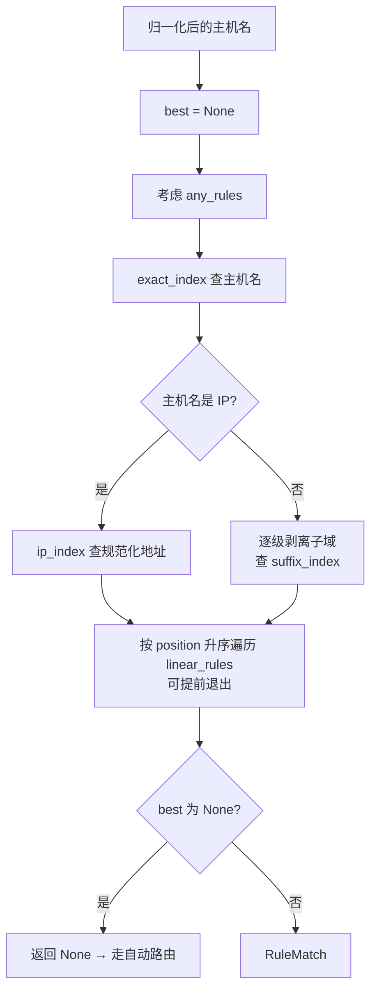
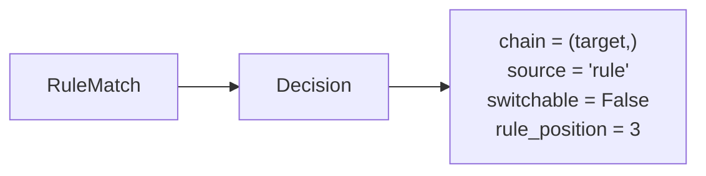

# DD_RULES.md - 规则引擎详细设计

| 版本 | 日期 | 变更说明 | 作者 |
| :--- | :--- | :--- | :--- |
| v1.0.0 | 2026-08-13 | 初始版本：规则解析与编译、last-match-wins 匹配、IP 字面量规范化、CONNECT 场景差异 | Agent |
| v2.0.0 | 2026-08-15 | **规则系统重构**：数据源由文本文件改为 `rules.db`，行式解析器整体删除、只保留条件识别；匹配语义改为 **first-match-wins** 并新增线性桶提前退出；匹配对象收窄为**仅主机名**（正则不再对 URL 求值）；新增 `WILDCARD` 类型；`Rule.index/origin_file/origin_line` 三字段合并为 `position`；新增条件端口检测与遮蔽告警 | Agent |
| v2.0.1 | 2026-08-16 | M5 实现回写：§6.1 的 `load_rules` 改为接 `RulesSource` 协议而非 `sqlite3.Connection`，编译拆出纯函数 `compile_rules` 供 Web 保存前校验共用（避免两份编译逻辑分叉） | Agent |

**对应需求**：[RULES_CONFIG.md](../requirements/RULES_CONFIG.md) 全文、[PRD §4.5](../requirements/PRD_OVERVIEW.md)

**上游依赖**：`config`（`rules.enabled`、`database.rules_path`）、`storage`（`RulesSource` 协议的实现 `RulesStore`）
**下游使用者**：`decision.router`、`web`（规则表格编辑与路由测试）

---

## 1. 设计目标与约束

| 目标 | 约束来源 |
|------|----------|
| 匹配是**纯函数**，无 I/O、无状态 | [ARCH §3.1](./ARCH_OVERVIEW.md) 决策层禁止 I/O |
| 匹配结果确定：**取 `position` 最小的匹配项** | [RULES §4.2](../requirements/RULES_CONFIG.md) |
| 匹配对象**仅主机名**，不涉及 URL、端口、路径 | [RULES §1.2](../requirements/RULES_CONFIG.md) |
| 规则命中即终止决策，不参与优先级链与粘性 | [PRD §3.1](../requirements/PRD_OVERVIEW.md) |
| IPv6 字面量的书写形式差异不影响匹配 | [RULES §3.5](../requirements/RULES_CONFIG.md) |
| 条件编译失败必须定位到规则序号 | [RULES §6.1](../requirements/RULES_CONFIG.md) |
| 每请求匹配开销 P99 < 1ms（与其他决策合计） | [PRD §7.1](../requirements/PRD_OVERVIEW.md) |
| 热路径不读库、不读文件 | [PRD §4.4.4](../requirements/PRD_OVERVIEW.md) |

### 1.1 v2.0.0 的三处语义变更

| 变更 | v1 | v2 | 理由 |
|------|----|----|------|
| 顺序语义 | last match wins，不短路 | **first match wins**，短路 | 「上面的规则更重要」是用户面对有序表格的默认预期；last match wins 还带来「宽规则必须写在前」这条反直觉约束 |
| 匹配对象 | URL（HTTP）或 `host:port`（CONNECT） | **主机名** | URL 正则对 CONNECT 静默失效，等于对所有 HTTPS 站点无效（[RULES §1.2](../requirements/RULES_CONFIG.md)） |
| 数据源 | 多个文本文件按序加载 | 单一 `rules.db` 有序表 | 界面成为唯一编辑入口，行式文本解析不再需要 |

---

## 2. 模块边界


`condition.classify` 被两条路径共用：加载时编译，以及 Web 保存前校验。共用一份实现保证「界面校验通过」与「启动能加载」口径一致，否则会出现「存得下、起不来」。

v1 的 `rules/parser.py` 承担行式文件解析（动作行、模式行、注释、行号），这部分**整体删除**。留下的条件识别逻辑迁入 `rules/condition.py`。

---

## 3. 数据契约

```python
# r_proxy/rules/model.py
from __future__ import annotations
from dataclasses import dataclass
from enum import Enum, auto
from ipaddress import IPv4Address, IPv6Address
import re


class PatternKind(Enum):
    ANY = auto()           # *
    DOMAIN_SUFFIX = auto() # *.example.com —— 含 apex
    WILDCARD = auto()      # 192.168.* —— * 在任意位置
    EXACT_HOST = auto()    # api.github.com
    IP_LITERAL = auto()    # 192.168.1.10 / [2001:db8::1]
    REGEX = auto()         # ^cdn\d+\. 或 /.../


@dataclass(frozen=True, slots=True)
class Rule:
    """一条已编译的规则。position 决定优先级——数值小者胜。"""
    position: int                    # 0 基，界面行序，库内唯一有序键
    kind: PatternKind
    raw: str                         # 原始条件文本，用于展示与调试
    target: str                      # 出口名
    # 按 kind 使用其中之一
    suffix: str | None = None        # DOMAIN_SUFFIX：不含 `*.` 的小写域名
    exact: str | None = None         # EXACT_HOST：小写主机名
    address: IPv4Address | IPv6Address | None = None
    regex: re.Pattern[str] | None = None   # REGEX 与 WILDCARD 共用，见 §4.3

    @property
    def location(self) -> str:
        """`rules[3]` 形式，用于校验报告与日志。"""
        return f"rules[{self.position}]"
```

### 3.1 为什么 `index` / `origin_file` / `origin_line` 合并成 `position`

v1 用 `index` 表达跨文件连续递增的全局序号，另用 `origin_file` + `origin_line` 表达位置以便报错。规则进库后这三者退化成同一个东西：库里就是一张有序表，行序既是优先级也是位置。

`position` 直接对应 `rule` 表的 `position` 列与界面上的行号，报错位置 `rules[3]` 与前端数组下标一一对应，前端据此高亮那一行，不需要任何换算。

### 3.2 RuleSet

```python
@dataclass(frozen=True, slots=True)
class RuleSet:
    """编译后的规则集，不可变。热重载时整体替换引用。"""
    rules: tuple[Rule, ...]                  # 按 position 升序
    any_rules: tuple[Rule, ...]
    exact_index: Mapping[str, tuple[Rule, ...]]
    suffix_index: Mapping[str, tuple[Rule, ...]]
    ip_index: Mapping[IPv4Address | IPv6Address, tuple[Rule, ...]]
    linear_rules: tuple[Rule, ...]           # WILDCARD + REGEX，按 position 升序

    @property
    def is_empty(self) -> bool:
        return not self.rules
```

不可变 + 整体替换的理由与 `ConfigSnapshot` 相同：飞行中的请求持有旧规则集直到结束，单个请求看到的路由意图始终自洽。

`WILDCARD` 与 `REGEX` 合并进同一个 `linear_rules` 桶：两者都无法用哈希索引，都需要逐条求值，且求值方式统一为 `pattern.search()`（§4.3）。合并成一个按 `position` 升序的桶，才能实现 §5.3 的提前退出。

---

## 4. 条件编译

### 4.1 识别顺序

顺序有讲究，判定必须互斥且无歧义：

```python
# r_proxy/rules/condition.py

_PORT_SUFFIX   = re.compile(r"\A(?:\[.*\]|[^:\[\]]+):\d{1,5}\Z")
_APEX_WILDCARD = re.compile(r"\A\*\.([^*]+)\Z")

def classify(text: str) -> Pattern:
    if not text:
        raise ConditionError("条件不能为空")

    # 1. 全匹配
    if text == "*":
        return Pattern(PatternKind.ANY)

    # 2. 正则优先：^ 与 / 都不是合法的主机名字符
    if text.startswith("^"):
        return Pattern(PatternKind.REGEX, regex=_compile_regex(text))
    if len(text) >= 2 and text.startswith("/") and text.endswith("/"):
        return Pattern(PatternKind.REGEX, regex=_compile_regex(text[1:-1]))

    # 3. 方括号包裹：意图明示为 IPv6，解析失败即报错，不退化为域名
    if text.startswith("[") and text.endswith("]"):
        return Pattern(PatternKind.IP_LITERAL, address=_address(text[1:-1], bracketed=True))

    # 4. 裸 IP 字面量。必须早于端口检测：2001:db8::1 含冒号但不是「带端口」
    if (addr := _try_address(text)) is not None:
        return Pattern(PatternKind.IP_LITERAL, address=addr)

    # 5. 含 * 的两种形态。必须早于端口检测：2001:db8:* 含冒号但意图是通配符
    if (m := _APEX_WILDCARD.match(text)) is not None:
        return Pattern(PatternKind.DOMAIN_SUFFIX, suffix=m.group(1).lower())
    if "*" in text:
        return Pattern(PatternKind.WILDCARD, regex=_compile_wildcard(text))

    # 6. 到这里仍含冒号的，只有两种可能，都是错误
    if _PORT_SUFFIX.match(text):
        raise ConditionError("条件只匹配主机名，不能带端口")
    if ":" in text:
        raise ConditionError("不是合法的 IP 地址；IPv6 请用方括号包裹")

    return Pattern(PatternKind.EXACT_HOST, exact=text.lower())
```

关键判定点：

| 输入 | 判定 | 说明 |
|------|------|------|
| `*` | ANY | — |
| `*.google.com` | DOMAIN_SUFFIX | `*.` 开头且其余无 `*`，含 apex |
| `*.example.*` | WILDCARD | 其余部分还有 `*`，不满足 apex 特例形状 |
| `192.168.*` | WILDCARD | 网段匹配的正常写法 |
| `2001:db8:*` | WILDCARD | 含冒号，但 `*` 检测在端口检测之前 |
| `192.168.1.10` | IP_LITERAL | `ip_address()` 解析成功 |
| `[2001:db8::1]` | IP_LITERAL | 剥括号后解析 |
| `2001:db8::1` | IP_LITERAL | 裸 IPv6 也接受（规则里不存在端口分隔歧义），但界面产出带括号形式 |
| `[2001:db8::zz]` | **ConditionError** | 方括号明示了意图是 IPv6，解析失败即报错 |
| `example.com:8443` | **ConditionError** | 条件不接受端口 |
| `[2001:db8::1]:443` | **ConditionError** | 同上，`_PORT_SUFFIX` 覆盖带括号形式 |
| `fe80::1%eth0` | **ConditionError** | zone id 不支持 |
| `^cdn\d+\.` | REGEX | — |
| `api.github.com` | EXACT_HOST | 前面全部落空 |

### 4.2 两处「必须早于端口检测」

这是本节最容易改错的地方。端口检测的动机是拦住 `example.com:8443` 这类静默失效的写法（[RULES §3.6](../requirements/RULES_CONFIG.md)），但冒号在 IPv6 里是合法字符，因此顺序不能颠倒：

| 若端口检测提前 | 后果 |
|----------------|------|
| 早于第 4 步 | `2001:db8::1` 被判为「带端口」而报错，合法的 IPv6 条件无法保存 |
| 早于第 5 步 | `2001:db8:*` 与 `fd00:*` 被判为「带端口」而报错，IPv6 前缀通配无法保存 |

第 6 步的两个分支互补：`_PORT_SUFFIX` 命中说明形状确实是 `host:port`，给出端口相关的提示；否则是形如 `2001:db8::zz` 的坏 IPv6，提示加方括号——加了括号后第 3 步会给出更精确的「方括号内不是合法 IPv6」。

**方括号内解析失败必须报错而非退化。** 若退化为 EXACT_HOST，用户写错的 IPv6 地址会变成一条永不匹配的域名规则，静默失效且极难发现。

> 请求侧的 CONNECT 目标要求更严格：无方括号的 IPv6 直接返回 `400`（见 [DD_PROXY.md](./DD_PROXY.md) §3.3）。规则条件中允许裸写是因为不存在端口分隔歧义——条件本身就不接受端口。

### 4.3 通配符的编译

```python
def _compile_wildcard(text: str) -> re.Pattern[str]:
    """`*` 展开为 `.*`，其余字符全部按字面转义，首尾锚定。

    锚定放进模式而不是靠调用方改用 fullmatch：WILDCARD 与 REGEX 共用
    `linear_rules` 桶，匹配时统一调 `search()`，桶内不需要按 kind 分支。
    """
    body = "".join(".*" if ch == "*" else re.escape(ch) for ch in text.lower())
    return re.compile(rf"\A{body}\Z")
```

三个决定：

| 决定 | 理由 |
|------|------|
| 只支持 `*`，不支持 `?` 与 `[abc]` | 用户预期来自 SwitchyOmega 与 shell 直觉里的 `*`；引入更多元字符会让 `.` 之类字符是否需要转义变得难以解释 |
| 逐字符 `re.escape` 而非 `fnmatch.translate` | `fnmatch` 把 `?` 与 `[seq]` 也当元字符，且其 `*` 的实现细节随版本变动；自己转译才能保证「除 `*` 外一律字面」这条可写进文档的承诺 |
| 模式内锚定 `\A...\Z` | 见上方 docstring：让线性桶的求值方式统一 |

`*` 展开为 `.*` 而非 `[^.]*`：`192.168.*` 必须能匹配 `192.168.1.10`，星号要能跨越点号。

### 4.4 错误报告

```python
@dataclass(frozen=True, slots=True)
class ConditionError(Exception):
    message: str
```

编译错误由调用方补上位置信息，转成统一的 `ValidationIssue`：

| 调用方 | `location` |
|--------|-----------|
| Web 保存校验 | `rules[3]`（提交列表的下标） |
| 启动 / 热重载加载 | `rules[3]`（库内 `position`） |

两者格式一致，因此界面上「保存时报的错」与「重载后报的错」指向同一行，用户不需要换算。

编译在遇到第一个错误时**不立即抛出**，而是收集全部错误后一次返回，与配置校验一致——用户希望一次看到所有问题，界面据此高亮多行。

### 4.5 正则的安全约束

条件由用户提供，正则存在灾难性回溯（ReDoS）风险。

| 措施 | 说明 |
|------|------|
| 编译期检查 | 嵌套量词模式（如 `(a+)+`）的启发式检测，仅告警不阻断 |
| 长度上限 | 单条正则 ≤ 1000 字符，超出报错 |
| 匹配输入上限 | Python `re` 不支持超时，改为限制输入长度：主机名超过 `MAX_SUBJECT` 时跳过线性桶并记 `WARNING` |

**v2 中输入上限的实际意义已大幅下降。** v1 的匹配输入是完整 URL，长度无上界，8192 字节的上限是真实防线。v2 只匹配主机名，而主机名在协议层已受限（DNS 上限 253 字节，且请求行长度另有上限，见 [DD_PROXY.md](./DD_PROXY.md) §3.1），线性桶的输入天然是短串。上限保留为廉价的兜底，正常流量不会触及。

嵌套量词检测保留为告警而非阻断：判定不可能精确，误杀合法正则的代价比放过一条可疑正则更大。

---

## 5. 匹配

### 5.1 匹配对象

| 请求类型 | 匹配对象 |
|----------|----------|
| 普通 HTTP | 主机名 |
| CONNECT | 主机名 |

**两者相同**，这是 v2 的核心简化。v1 的差异（HTTP 用完整 URL、CONNECT 用 `host:port`）导致同一条正则规则对 HTTP 生效、对 HTTPS 静默失效，是一个纯粹的陷阱。

所有 `PatternKind` 对两类请求的行为完全一致，不再需要 v1 那张「适用性」对照表。

### 5.2 分桶索引

规则数量通常在几十到几百条。精确类模式走哈希查表，只有通配符与正则需要逐条求值：



```python
# r_proxy/rules/matcher.py

def match(rule_set: RuleSet, target: RequestTarget) -> RuleMatch | None:
    if rule_set.is_empty:
        return None

    host = target.host                       # 已由 protocol 层归一化
    best: Rule | None = None

    def consider(rules: Iterable[Rule]) -> None:
        nonlocal best
        for r in rules:
            if best is None or r.position < best.position:
                best = r

    consider(rule_set.any_rules)
    consider(rule_set.exact_index.get(host, ()))

    if (addr := parse_ip(host)) is not None:
        # host 是 IP 时不进入后缀匹配：否则 `*.1.10` 会匹配 192.168.1.10
        consider(rule_set.ip_index.get(addr, ()))
    else:
        for suffix in _suffix_candidates(host):
            consider(rule_set.suffix_index.get(suffix, ()))

    best = _consider_linear(rule_set, host, best)
    return RuleMatch(rule=best, target=best.target) if best is not None else None
```

与 v1 的唯一差别是比较方向：`r.position < best.position` 取最小，v1 是 `r.index > best.index` 取最大。分桶结构本身不变——首匹配胜出并**不要求**按顺序遍历全部规则，只要求在所有命中项里取 `position` 最小的那条。

### 5.3 线性桶的提前退出

`linear_rules` 按 `position` 升序排列，因此一旦已有候选的 `position` 小于当前规则的 `position`，后面的规则即使命中也不可能更优：

```python
def _consider_linear(rule_set: RuleSet, host: str, best: Rule | None) -> Rule | None:
    if not rule_set.linear_rules or len(host) > MAX_SUBJECT:
        if len(host) > MAX_SUBJECT:
            logger.warning("主机名过长，跳过通配符与正则规则: %d 字节", len(host))
        return best
    for rule in rule_set.linear_rules:
        if best is not None and rule.position > best.position:
            break                      # 后面的都更靠后，不可能更优
        if rule.regex is not None and rule.regex.search(host):
            best = rule
    return best
```

这是 first-match-wins 带来的一项实际收益：last-match-wins 下必须求值**全部**正则才能确定最靠后的命中项，无法提前退出。当哈希桶已经命中一条靠前的规则时，线性桶往往一条都不需要求值。

### 5.4 后缀匹配不会误伤

| host | 规则 `*.example.com` | 结果 | 原因 |
|------|----------------------|------|------|
| `example.com` | 候选含 `example.com` | **匹配** | 域名及子域包含 apex |
| `www.example.com` | 候选含 `example.com` | **匹配** | — |
| `api.v2.example.com` | 候选含 `example.com` | **匹配** | — |
| `notexample.com` | 候选为 `notexample.com`、`com` | **不匹配** | 按点分段，`notexample.com` ≠ `example.com` |
| `fakeexample.com` | 同上 | **不匹配** | — |

```python
def _suffix_candidates(host: str) -> Iterator[str]:
    """www.api.example.com → www.api.example.com, api.example.com, example.com, com"""
    parts = host.split(".")
    for i in range(len(parts)):
        yield ".".join(parts[i:])
```

产出的第一项是 host 自身，这使 `*.example.com` 能匹配 `example.com`，即 [RULES §3.1](../requirements/RULES_CONFIG.md) 的 apex 特例。

按点分段是关键。若用字符串 `endswith(".example.com")` 判断，`notexample.com` 同样不匹配（因为缺少那个点），但分段法从结构上排除了这类歧义，不依赖对边界字符的正确处理。

### 5.5 IP 规范化

```python
def parse_ip(text: str) -> IPv4Address | IPv6Address | None:
    """规则侧与请求侧共用：两边对「什么算 IP」的判断必须一致，
    否则会出现「规则按域名编译、请求按 IP 匹配」这类永不命中的组合。"""
    try:
        return ip_address(text)
    except ValueError:
        return None
```

`ipaddress` 对象的相等性基于地址的整数值，因此：

| 写法 A | 写法 B | 相等 |
|--------|--------|------|
| `2001:db8::1` | `2001:0db8:0000:0000:0000:0000:0000:0001` | 是 |
| `2001:DB8::1` | `2001:db8::1` | 是 |
| `::ffff:192.168.1.1` | `192.168.1.1` | **否** |

最后一行需要注意：IPv4-mapped IPv6 地址与对应的 IPv4 地址在 `ipaddress` 中是不同对象。但由于**入向仅 IPv4**（[PRD §4.2.4](../requirements/PRD_OVERVIEW.md)），且出向的目标地址来自客户端请求的字面书写，实践中不会出现两种写法混用同一目标的情况。不做额外归一化。

**不支持** zone id（`fe80::1%eth0`）：`ip_address()` 对含 `%` 的输入抛 `ValueError`，若就此落入 EXACT_HOST 分支，会静默产生一条永不匹配的规则。因此编译阶段显式检测 `%` 并报错。

### 5.6 host 归一化的归属

匹配器**假设 `target.host` 已归一化**，归一化由 `protocol` 层在解析请求时完成：

| 处理 | 说明 |
|------|------|
| 转小写 | 域名大小写不敏感 |
| 去除方括号 | `[2001:db8::1]` → `2001:db8::1` |
| 去除末尾点 | `example.com.` → `example.com`（FQDN 绝对写法） |
| 去除端口 | host 与 port 分离存放 |

放在 `protocol` 层而非匹配器内的理由：归一化结果同时被规则匹配、粘性映射键、负面记忆键、日志记录使用。在入口处做一次，保证四者用的是同一个 host 字符串——若各自归一化，很容易出现「规则匹配用小写而粘性键用原始大小写」这类不一致。

条件侧对应地在编译时转小写（`exact`、`suffix`、通配符模式），两侧口径因此一致。

---

## 6. 加载

### 6.1 从 rules.db 读取

```python
# r_proxy/rules/loader.py

class RulesSource(Protocol):
    """规则行 (position, condition, upstream) 的来源。"""
    def read_rules(self) -> tuple[RuleRow, ...]: ...


def load_rules(source: RulesSource, *, enabled: bool) -> LoadResult:
    if not enabled:
        logger.warning("规则已被全局禁用（rules.enabled = false），全部流量走自动路由")
        return LoadResult(rule_set=EMPTY_RULE_SET)
    return compile_rules(source.read_rules())


def compile_rules(rows: Sequence[RuleRow]) -> LoadResult:
    """纯函数：规则行 → 规则集 + 问题清单。"""
    rules: list[Rule] = []
    issues: list[ValidationIssue] = []
    for position, condition, upstream in rows:
        try:
            pattern = classify(condition)
        except ConditionError as exc:
            issues.append(ValidationIssue("error", E_CONDITION, str(exc), f"rules[{position}]"))
            continue
        rules.append(Rule(position=position, kind=pattern.kind, raw=condition,
                          target=upstream, **pattern.fields()))
    issues.extend(detect_shadowing(rules))
    return LoadResult(rule_set=RuleSet.build(rules), issues=issues)
```

**读库与编译分开**：`load_rules` 接一个 `RulesSource` 协议（实现是 `storage/rules_store.py` 的 `RulesStore`），SQL 与排序收在存储层；`compile_rules` 是纯函数，加载路径与 Web 的保存前校验共用同一份编译逻辑。若这里直接收 `sqlite3.Connection`，`rules` 包就得依赖 `storage`，而 Web 校验一份「还没入库的候选列表」时无连接可传，只能另写一份编译——两份编译逻辑迟早会在某个条件类型上分叉，症状是「界面校验通过、启动却报错」。

排序由存储层负责，用 `ORDER BY position, id` 而非只按 `position`：`position` 列**不加唯一约束**（[DD_STORAGE §3](./DD_STORAGE.md)），补上 `id` 作为决胜项保证顺序确定。正常写入路径下 `position` 本来就唯一，这只是防御外部手工改库造成的重复值。

`rules.enabled = false` 时**根本不查库**，直接返回空规则集。不是「查出来再丢掉」——那会在救场场景下白白依赖一个可能已经损坏的库。启动时的建库同样跳过（[DD_STORAGE §4.8.3](./DD_STORAGE.md)）。

### 6.2 编译失败的处理

| 时点 | 处理 | 理由 |
|------|------|------|
| 启动 | **拒绝启动**，报告全部问题 | 与配置校验一致。静默跳过坏行会让实际路由行为与用户意图不符，而用户无从察觉 |
| 热重载 | **保留旧 `RuleSet`**，记 `ERROR` + 界面横幅 | 代理必须继续工作；旧规则集是已知可用的状态 |

正常情况下这两种失败都不该发生：Web 保存路径用同一个 `classify` 做过校验，写不进去坏数据。会触发的只有手工改库或库损坏。

### 6.3 遮蔽检测

```python
def detect_shadowing(rules: Sequence[Rule]) -> list[ValidationIssue]:
    """首匹配胜出下，被前面更宽的条件覆盖的规则永不生效。"""
```

检测范围限于可判定的组合：

| 情形 | 判定 |
|------|------|
| `*` 之后还有规则 | 其后**全部**规则永不生效 |
| 完全重复的条件 | 后出现的那条永不生效 |
| `*.example.com` 在 `www.example.com`（或 `*.sub.example.com`）之前 | 后者永不生效 |
| 涉及 `WILDCARD` 或 `REGEX` 的包含关系 | **不检测** |

正则与通配符之间的包含关系在一般情况下不可判定（等价于正则语言包含问题，对回溯正则更是不可行）。宁可漏报也不误报：一条被误判为「永不生效」的告警会让用户删掉实际有用的规则。

全部为 `warning` 级别，不阻断保存（[RULES §6.2](../requirements/RULES_CONFIG.md)）。

> v1 的重复检测告警文案是「先出现的那条永远不会生效」，v2 顺序语义反转后必须改成「后出现的那条」。这是语义变更时最容易漏改的地方。

### 6.4 出口存在性校验

条件编译只管语法，出口名是否存在必须对着**当前配置**判断，因此不在 `rules` 包内做，而在两处调用点做：

| 调用点 | 行为 |
|--------|------|
| 启动 / 热重载 | 出口名不存在 → 拒绝启动；出口 `enabled = false` → 告警（[RULES §4.4.1](../requirements/RULES_CONFIG.md)） |
| Web 保存 | 出口名不存在 → 拒绝保存并返回 `rules[i]` 定位 |

两处口径必须一致，否则会出现「界面存得下、重启起不来」。

---

## 7. 规则命中后的行为



| 行为 | 说明 |
|------|------|
| 候选链长度 | 恒为 1 |
| 是否读粘性 | **否** |
| 是否写粘性 | **否** |
| 失败时 | **不切换**，原样返回错误 |
| 目标出口被禁用 | 不发起连接，返回 `502`，日志含规则序号 |
| 目标为 `direct` 但纯 IPv6 且本机无能力 | 不发起连接，返回 `502`，原因 `ipv6_unavailable` + 规则序号 |

后两行是「规则命中但出口不可用」的两种情形，共同点是**不发起连接、给出可诊断的错误**。用户需要知道的是「规则配错了」，而不是「网络不可达」。详见 [DD_ROUTING.md](./DD_ROUTING.md) §2.1。

给客户端的 `502` 响应体只含通用描述与 `request_id`，**不回显**出口名、地址或规则内容（[PRD §4.3.9](../requirements/PRD_OVERVIEW.md)）。规则序号只进日志与 `request_log`。

---

## 8. 路由测试接口

`r-proxy route-test` 与 Web 的路由测试模块共用同一入口，保证 CLI 与界面结果一致：

```python
@dataclass(frozen=True, slots=True)
class RouteTestResult:
    url: str
    host: str
    matched_rule: RuleMatch | None
    decision_source: Literal["rule", "manual", "auto", "priority"]
    upstream: str
    candidate_chain: tuple[str, ...]
```

与真实路由走**同一个** `Router.build_chain()`，只是不执行请求。共用实现避免了「测试说走 A，实际走 B」这类最难排查的问题。

`matched_rule` 的对外形状由 `position` 与 `condition` 两个字段构成，替代 v1 的 `file` + `line` + `pattern`（见 [WEBUI_SPEC §3.4](../requirements/WEBUI_SPEC.md)）。

---

## 9. 性能考量

| 项目 | 估算 |
|------|------|
| ANY + EXACT + IP 查表 | O(1)，几次字典查找 |
| 后缀候选生成 | O(域名段数)，典型 3–4 段 |
| 线性桶（通配符 + 正则） | 最坏 O(线性规则数)，命中靠前规则时常为 0 次求值 |

线性桶是唯一的非常数项，但 v2 有两点比 v1 更有利：

1. **提前退出**（§5.3）：哈希桶命中靠前规则时，线性桶大多不需要求值
2. **输入变短**：匹配对象从完整 URL 变成主机名，单次 `search` 的成本与回溯风险都显著下降

缓解手段：

- 界面提示优先使用域名及子域、精确主机这两类（走哈希），正则仅在确实需要时使用
- 线性规则超过 50 条时界面提示
- **不做**正则合并优化（把多条合成一个大正则）：合并后无法定位命中的是哪一条，破坏「错误与命中定位到规则序号」这一需求

不做匹配结果缓存。host 级的复用由粘性映射承担，那才是正确的缓存层次；而规则匹配本身在 v2 已经是哈希查表为主。

---

## 10. 测试要点

| 场景 | 期望 | 对应验收 |
|------|------|----------|
| `*` 与 `*.github.com` 同时匹配 | 取 `position` 更小者 | [RULES §4.2](../requirements/RULES_CONFIG.md) |
| 顺序语义 | 首匹配胜出，非「取最靠后」 | 同上 |
| 线性桶提前退出 | 已有更靠前候选时不再求值后续正则 | §5.3 |
| `*.example.com` 对 `example.com` | 匹配 | [RULES §3.1](../requirements/RULES_CONFIG.md) |
| `*.example.com` 对 `notexample.com` | 不匹配 | 同上 |
| `*.example.*` 对 `example.com` | 不匹配（非 apex 特例形状） | 同上 |
| `192.168.*` 对 `192.168.1.10` | 匹配 | [RULES §3.2](../requirements/RULES_CONFIG.md) |
| `192.168.*` 对 `10.192.168.1` | 不匹配（首尾锚定） | 同上 |
| `api-*.corp` 对 `api.corp` | 不匹配 | 同上 |
| 通配符中的 `.` | 按字面匹配，不当正则元字符 | §4.3 |
| `2001:db8:*` 条件 | 编译为 WILDCARD，不报「带端口」 | §4.2 |
| `[2001:0db8::1]` 条件 vs `[2001:db8::1]` 目标 | 规范化后匹配 | ST-10 |
| `[2001:db8::zz]` 条件 | 报错，不退化为域名 | §4.2 |
| `fe80::1%eth0` 条件 | 报错（zone id 不支持） | [RULES §3.5](../requirements/RULES_CONFIG.md) |
| `example.com:8443` 条件 | 报错（不接受端口） | [RULES §3.6](../requirements/RULES_CONFIG.md) |
| `[2001:db8::1]:443` 条件 | 报错（不接受端口） | 同上 |
| `^https?://x\.com/` 条件 | 对任何主机名都不命中 | [RULES §7 Q1](../requirements/RULES_CONFIG.md) |
| CONNECT 与普通 HTTP 同一主机 | 命中同一条规则 | §5.1 |
| 出口名不存在 | 启动拒绝；保存拒绝，定位 `rules[i]` | §6.4 |
| 出口 `enabled = false` | 启动告警不阻断，命中时 `502` | [RULES §4.4.1](../requirements/RULES_CONFIG.md) |
| 多处条件错误 | 一次返回全部 | §4.4 |
| `*` 之后仍有规则 | 遮蔽告警，指出其后全部失效 | §6.3 |
| 重复条件 | 告警文案指向**后**出现的那条 | §6.3 |
| 正则参与的遮蔽 | 不告警（不可判定，宁漏勿误） | §6.3 |
| `rules.enabled = false` | 不查库，返回空规则集 | §6.1 |
| 库内 `position` 重复 | 按 `(position, id)` 稳定排序，不崩 | §6.1 |
| 启动时某行条件非法 | 拒绝启动并报告全部问题 | §6.2 |
| 热重载时某行条件非法 | 保留旧 `RuleSet`，代理继续工作 | §6.2 |
| 主机名超过 `MAX_SUBJECT` | 跳过线性桶并记 WARNING，哈希桶正常 | §4.5 |
| 规则命中 | `switchable=False`，`chain` 长度为 1 | ST-09 |
| `route_test` 与真实路由 | 结果一致（共用 `build_chain`） | §8 |
