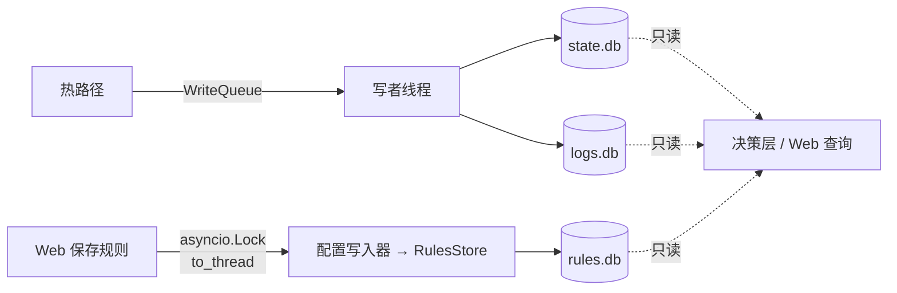
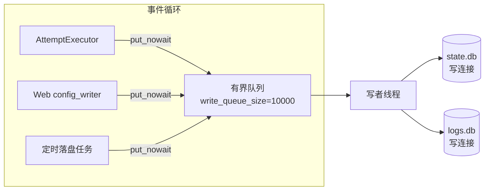

# DD_STORAGE.md - 存储层详细设计

| 版本 | 日期 | 变更说明 | 作者 |
| :--- | :--- | :--- | :--- |
| v1.8.0 | 2026-08-23 | §4.9 补「排除对 Web UI 自身的访问」：目标端口等于 `webui.port` 时不写 `request_log`，理由与只比端口不比 host 的取舍 | Agent |
| v1.7.0 | 2026-08-21 | 代码评审整改：§4.6 补严重积压日志限频（`WriteQueue.put` 同一秒内的丢弃只报一次摘要，避免极端 QPS 下逐条打印刷屏）；§4.7 补 `HealthPersister.run` 取消时的最后一次落盘（`try...finally`，覆盖关停前不足一个周期的窗口） | Agent |
| v1.0.0 | 2026-08-13 | 初始版本：双库划分与 schema、唯一写者线程、批量事务与写入合并、有界队列与分级丢弃、启动回填、日志清理、只读连接 | Agent |
| v1.1.0 | 2026-08-14 | M3 实现回写：§4.1 补 `StorageService` 门面与 `WriteSink` 注入边界；§4.2 写入种类改为由 `OpKind` 唯一决定优先级与目标库；§4.5b 新增关停唤醒（`WriteQueue.interrupt()`）；§5 补 `last_success_at` 的回填与 `persistence.apply_initial_state` 的落点 | Agent |
| v1.3.0 | 2026-08-15 | M4 切片 c：§4.3 新增 `sticky_manual_upsert`（唯一写 `source='manual'`、唯一不带 source 护栏的语句）并说明带上护栏会让改绑静默失效；§4.4 补「验证 `ON CONFLICT` 分支必须分批落盘」的测试推论 | Agent |
| v1.2.0 | 2026-08-14 | §8 重写为三节：补 `queue_high_water` 与 `dropped_normal` 指标、`StorageMetrics` 数据契约（`storage/metrics.py`），新增 §8.3 长跑观测（`MetricsReporter` 的分级判据与写者卡死判定） | Agent |
| v1.4.0 | 2026-08-15 | 规则系统重构：§2 由双库改为**三库**，新增 `rules.db`；§3 补 `rule` / `rule_meta` 表与 `position` 不加唯一约束的理由；新增 §4.8 规则写入路径——唯一**不经**写者线程的写入，说明为何不复用写队列、为何不与 `state.db` 共库；§7 补 `rules.db` 的只读接入 | Agent |
| v1.6.0 | 2026-08-16 | 新增 §4.9 请求日志的生产端：写入点定在 `AttemptExecutor`、字段口径（`failure_kind` 取判据结论而非 `outcome.kind`）、耗时由执行器夹测、字节数暂为 0 的理由、死路也要留一行、测试必须分两层并做变异验证；§4.3 补「自增列的基线必须与启动回填同源」 | Agent |
| v1.5.0 | 2026-08-16 | M5 实现回写：§2 与 §4.8 的写者改为 `storage/rules_store.py`（配置写入器经它写，不自己开连接）；§4.8.1 版本比对移进事务内、`revision` 改 SQL 侧自增；§4.8.3 明确读路径不建库、建库只发生在启用规则的启动时；§7 更正 `rules.db` **不进** `ReadOnlyPool`，改为每次现开现关的只读连接 | Agent |

**对应需求**：[PRD §4.4](../requirements/PRD_OVERVIEW.md)、[§4.9.5](../requirements/PRD_OVERVIEW.md)、[§7.2](../requirements/PRD_OVERVIEW.md)

**上游依赖**：`config`
**下游使用者**：`state`（写入）、`web`（只读）
**实测依据**：[study/sqlite-storage-benchmark.md](../../study/sqlite-storage-benchmark.md)

---

## 1. 设计目标与约束

| 约束 | 来源 |
|------|------|
| 热路径**不得**有同步数据库 I/O | [PRD §4.4.4](../requirements/PRD_OVERVIEW.md) |
| 全进程**唯一**写者，Web 不得直连写库 | [PRD §4.9.5](../requirements/PRD_OVERVIEW.md) |
| 计数器用 SQL 侧自增，禁止 Python 侧读改写 | [PRD §4.4.5](../requirements/PRD_OVERVIEW.md) |
| 批量事务用 `BEGIN IMMEDIATE` | 同上 |
| 粘性 UPSERT 必须带 `WHERE source != 'manual'` | [PRD §4.4.5](../requirements/PRD_OVERVIEW.md) |
| `state.db` 不可丢失，`logs.db` 可丢弃 | [PRD §4.4.0](../requirements/PRD_OVERVIEW.md) |

三条实测数据支撑了整个设计：

| 观测 | 数值 | 推导出的设计 |
|------|------|-------------|
| 单行独立提交 | 0.11ms（NVMe）–0.47ms（SATA） | 每请求写 2 行 = 事件循环停摆 0.22–0.94ms → 必须异步化 |
| 批量提交后单行成本 | 0.0025ms | 批量化收益约 44–188 倍 → 值得引入队列与写者线程 |
| deferred 事务并发自增 | 4 线程 × 500 次 → 只记录 509 次 | 丢失 75% → 必须 `BEGIN IMMEDIATE` |

---

## 2. 三库划分

| 文件 | 表 | 写者 | 写入特征 | 丢失后果 |
|------|-----|------|----------|----------|
| `state.db` | `host_upstream`、`route_block`、`upstream_health`、`schema_meta` | 写者线程 | 低频、体量小 | 粘性与负面记忆丢失，需重新学习 |
| `logs.db` | `request_log`、`config_audit` | 写者线程 | 高频、可批量 | 仅损失审计数据 |
| `rules.db` | `rule`、`rule_meta` | **`RulesStore`**（由配置写入器调用） | 极低频、人工触发 | **路由规则丢失**，全部流量退化为自动路由 |

拆分的收益不只是「避免争用」——WAL 模式下每个库只有一个写者，本来也不存在写写争用。真正的收益是**运维上的可丢弃性**：`logs.db` 可以独立轮转、清空、删除重建而不牵连路由状态。日志表在长期运行后可能膨胀到几百 MB，能直接 `rm` 掉它比 `VACUUM` 一个混合库简单得多。

`config_audit` 放在 `logs.db` 而非 `state.db`：它是审计数据，丢失不影响功能，且写入模式（低频、追加）与请求日志一致。

### 2.1 rules.db 为什么必须独立成库

`rules.db` 是三个库里唯一**不由写者线程写入**的（§4.8）。它单独成库不是为了可丢弃性，而是为了保住「每个库只有一个写者」这条不变量。

规则保存需要四件事，写者线程的批量合并循环一件都不做：

| 需求 | 写队列的行为 |
|------|-------------|
| 校验通过才写 | 队列不做校验，入队即视为已接受 |
| 事务内整体替换（`DELETE` + 全量 `INSERT`） | 队列按 `OpKind` 逐条映射到固定 SQL，没有多语句事务的表达能力 |
| 同步等落盘后才能回 HTTP 响应 | fire-and-forget，无完成通知（每 200ms 或 500 条才落一次） |
| 乐观锁冲突检测 | 无版本概念 |

要让规则走写队列，就得给它加一条带完成事件与返回值的同步通道，把一个现在很干净的契约（「入队即忘的计数器与状态更新」）污染成两种模式并存。而若让配置写入器直接对 `state.db` 另开写连接，就凭空多出第二个写者——违反 [PRD §4.9.5](../requirements/PRD_OVERVIEW.md)，且写者线程的批次落盘会开始撞 `SQLITE_BUSY`（写者 `busy_timeout=5000`，一次冲突就是 5 秒级的事件循环外阻塞）。

独立成库后两者各自持有自己库的唯一写连接，互不相干：



代价是多一个文件与一份 `schema_meta`，收益是不动写者线程的契约。规则写入的频率是「用户点保存」，量级与配置写回相同，本来就该和它走一条路。

---

## 3. Schema

```sql
-- state.db

CREATE TABLE IF NOT EXISTS host_upstream (
    host              TEXT    PRIMARY KEY,
    upstream_name     TEXT    NOT NULL,
    source            TEXT    NOT NULL CHECK (source IN ('auto', 'manual')),
    last_url          TEXT,
    last_success_at   INTEGER NOT NULL DEFAULT 0,
    last_http_status  INTEGER,
    fail_count        INTEGER NOT NULL DEFAULT 0,
    hit_count         INTEGER NOT NULL DEFAULT 0,
    updated_at        INTEGER NOT NULL
) STRICT;

CREATE INDEX IF NOT EXISTS idx_hu_upstream ON host_upstream(upstream_name);
CREATE INDEX IF NOT EXISTS idx_hu_updated  ON host_upstream(updated_at DESC);

CREATE TABLE IF NOT EXISTS route_block (
    host              TEXT    NOT NULL,
    upstream_name     TEXT    NOT NULL,
    fail_count        INTEGER NOT NULL DEFAULT 0,
    last_error        TEXT,
    last_failure_at   INTEGER NOT NULL,
    blocked_until     INTEGER NOT NULL,
    PRIMARY KEY (host, upstream_name)
) STRICT;

CREATE INDEX IF NOT EXISTS idx_rb_until ON route_block(blocked_until);

CREATE TABLE IF NOT EXISTS upstream_health (
    upstream_name         TEXT    PRIMARY KEY,
    consecutive_failures  INTEGER NOT NULL DEFAULT 0,
    total_success         INTEGER NOT NULL DEFAULT 0,
    total_failure         INTEGER NOT NULL DEFAULT 0,
    avg_latency_ms        INTEGER NOT NULL DEFAULT 0,
    circuit_state         TEXT    NOT NULL DEFAULT 'closed'
                                  CHECK (circuit_state IN
                                         ('closed', 'open', 'half_open')),
    cooldown_until        INTEGER NOT NULL DEFAULT 0,
    auth_error            INTEGER NOT NULL DEFAULT 0,
    updated_at            INTEGER NOT NULL
) STRICT;

CREATE TABLE IF NOT EXISTS schema_meta (
    key    TEXT PRIMARY KEY,
    value  TEXT NOT NULL
) STRICT;
```

```sql
-- logs.db

CREATE TABLE IF NOT EXISTS request_log (
    id                 INTEGER PRIMARY KEY AUTOINCREMENT,
    request_id         TEXT    NOT NULL,
    host               TEXT    NOT NULL,
    url                TEXT,
    method             TEXT    NOT NULL,
    upstream_name      TEXT    NOT NULL,
    upstream_priority  INTEGER,
    attempt_index      INTEGER NOT NULL DEFAULT 0,
    decision_source    TEXT,
    rule_origin        TEXT,
    http_status        INTEGER,
    error              TEXT,
    failure_kind       TEXT,
    keep_reason        TEXT,
    elapsed_ms         INTEGER NOT NULL,
    bytes_up           INTEGER NOT NULL DEFAULT 0,
    bytes_down         INTEGER NOT NULL DEFAULT 0,
    created_at         INTEGER NOT NULL
) STRICT;

CREATE INDEX IF NOT EXISTS idx_rl_host    ON request_log(host, created_at DESC);
CREATE INDEX IF NOT EXISTS idx_rl_up      ON request_log(upstream_name, created_at DESC);
CREATE INDEX IF NOT EXISTS idx_rl_created ON request_log(created_at DESC);
CREATE INDEX IF NOT EXISTS idx_rl_reqid   ON request_log(request_id);

CREATE TABLE IF NOT EXISTS config_audit (
    id              INTEGER PRIMARY KEY AUTOINCREMENT,
    actor           TEXT    NOT NULL,
    action          TEXT    NOT NULL,
    target          TEXT    NOT NULL,
    diff            TEXT,
    version_before  TEXT,
    version_after   TEXT,
    created_at      INTEGER NOT NULL
) STRICT;

CREATE INDEX IF NOT EXISTS idx_ca_created ON config_audit(created_at DESC);
```

```sql
-- rules.db

CREATE TABLE IF NOT EXISTS rule (
    id          INTEGER PRIMARY KEY AUTOINCREMENT,
    position    INTEGER NOT NULL,          -- 0 基行序，越小越优先
    condition   TEXT    NOT NULL,          -- 原始条件文本，如 *.google.com
    upstream    TEXT    NOT NULL,          -- 出口名，或保留名 direct
    updated_at  INTEGER NOT NULL
) STRICT;

CREATE INDEX IF NOT EXISTS idx_rule_position ON rule(position);

CREATE TABLE IF NOT EXISTS rule_meta (
    key    TEXT PRIMARY KEY,
    value  TEXT NOT NULL
) STRICT;                                  -- revision 计数器，见 §4.8.2
```

### 3.1 设计说明

| 决定 | 理由 |
|------|------|
| `STRICT` 表 | SQLite 3.37+ 强制类型检查。默认的动态类型会让「写入字符串到 INTEGER 列」静默成功，等到读取时才炸 |
| 索引均为 `DESC` | 所有查询都是「最近的 N 条」，降序索引避免排序步骤 |
| `idx_rl_reqid` | 支撑 [PRD §4.3.9](../requirements/PRD_OVERVIEW.md)：用户拿 `request_id` 到 Web 界面查完整失败链 |
| `request_log` 增加 `failure_kind`、`keep_reason` | 需求原表缺这两列，但「为什么没有切换」是明确的可诊断性要求（[PRD §4.3.5](../requirements/PRD_OVERVIEW.md)），必须落盘 |
| `route_block` 无 TTL 清理索引外的机制 | 依赖 `blocked_until` 索引的定期清理，见 §6.2 |
| `host_upstream.source` 无 `'rule'` | 规则命中不写粘性（[PRD §4.4.4](../requirements/PRD_OVERVIEW.md)），`CHECK` 约束把这条语义固化进 schema |
| `rule.position` **不加**唯一约束 | 见下方说明 |
| `rule.condition` 不加 `UNIQUE` | 条件重复是**告警**而非错误（[RULES §6.2](../requirements/RULES_CONFIG.md)）；建唯一约束会把它变成硬失败 |
| `rule_meta` 与 `schema_meta` 分开 | `schema_meta` 由 `migrate()` 拥有，语义是「schema 元信息」；`revision` 是数据版本，混在一起会让迁移逻辑与业务逻辑共用一张表 |

`source` 的 `CHECK` 约束是把设计约定变成数据库层面的强制。若将来有人误写 `source='rule'`，会立即报错而不是静默产生一条永远不会被正确处理的记录。

**`rule.position` 不加唯一约束**，理由是唯一索引会让「交换两行」变成三步操作：必须先把其中一行写成一个不冲突的临时值，才能避免中途触发约束冲突。而规则的每次保存本来就是整表替换（§4.8.1），`position` 在一个事务内按提交顺序重新编号 `0..N-1`，天然唯一。为一个不会发生的冲突付出重排逻辑的复杂度不值得。

代价是外部手工改库可能造成 `position` 重复。读取侧用 `ORDER BY position, id` 兜底，保证顺序确定而不是随机（见 [DD_RULES §6.1](./DD_RULES.md)）。

### 3.2 迁移

```python
# r_proxy/storage/schema.py

SCHEMA_VERSION = 1

def migrate(conn: sqlite3.Connection, target: int = SCHEMA_VERSION) -> None:
    current = _read_version(conn)
    if current > target:
        raise StorageError(
            f"数据库版本 {current} 高于本程序支持的 {target}，"
            f"请升级 r-proxy 或使用新的数据目录"
        )
    for step in range(current + 1, target + 1):
        with conn:                       # 自动事务
            _MIGRATIONS[step](conn)
            _write_version(conn, step)
```

版本号存在 `schema_meta` 而非 `PRAGMA user_version`：后者是单个整数，无法记录迁移时间、程序版本等辅助信息，而 `schema_meta` 是通用键值表，后续需要存别的元信息时不必再加表。

**降级明确拒绝**。用旧版程序打开新版数据库可能因缺少列而静默写入错误数据，报错退出比冒险继续安全。

---

## 4. 写入路径

### 4.1 整体结构



**只有一个写者线程，它持有两个数据库的写连接。** 不为每个库开一个线程——两个写者线程会引入线程间的批次协调问题，而写入本身不是瓶颈（批量后单行 0.0025ms）。

实现上这三样（队列、写者线程、两个只读连接池）由 `storage/service.py` 的 `StorageService` 一起持有：

```python
service = StorageService(snapshot.database, snapshot.limits)
initial = service.load_initial_state()   # 必须在写者线程启动之前
service.start()                          # 库打不开即抛 StorageError，拒绝启动
...
service.stop()                           # 排空队列后关库
```

散在 `app.py` 手上的话，早晚会出现第二个写者，而两个写者的症状是随机的 `database is locked` 加内存权威不再唯一。

写入方（`egress/executor.py`）拿到的不是 `WriteQueue` 而是 `WriteSink` 协议：

```python
class WriteSink(Protocol):
    def put(self, op: WriteOp) -> bool: ...
```

执行层只需要「能收下一个操作」这一点能力，不该被绑到线程与数据库上。`sink is None` 时内存状态照常生效，只是重启后丢失——这让绝大多数测试不必起写者线程。

### 4.2 写入事件

```python
# r_proxy/storage/queue.py

class Priority(IntEnum):
    CRITICAL = 0      # state.db 的变更，永不丢弃
    NORMAL = 1        # 计数器更新，队列压力大时可合并
    LOSSY = 2         # request_log，队列满时丢弃


@dataclass(frozen=True, slots=True)
class WriteOp:
    kind: OpKind                      # 一个种类对应一条 SQL
    payload: tuple[object, ...]
```

实现与上面的初稿有一处差别：**优先级、目标库、主键位置、增量列位置都不由调用方传入**，而是由 `OpKind` 在 `_SPECS` 表里唯一决定，`WriteOp` 只带种类与参数。理由是传错优先级没有任何直接症状——粘性变更被当成日志丢掉，要到下次重启才发现路由记忆没了。同理，构造 `WriteOp` 的元组一律经 `sticky_upsert()` 等工厂函数，因为 payload 的列顺序必须与 SQL 的参数顺序一致，这种一致性靠调用方自觉维护是守不住的。

| 事件 | 优先级 | 表 |
|------|--------|-----|
| 粘性绑定变更 | `CRITICAL` | `host_upstream` |
| 粘性清除 | `CRITICAL` | `host_upstream` |
| 负面记忆写入/清除 | `CRITICAL` | `route_block` |
| 熔断状态变更 | `CRITICAL` | `upstream_health` |
| 配置审计 | `CRITICAL` | `config_audit` |
| 粘性命中计数 | `NORMAL` | `host_upstream` |
| 健康计数与延迟 | `NORMAL` | `upstream_health` |
| 请求日志 | `LOSSY` | `request_log` |

### 4.3 关键 SQL

```python
_SQL = {
    "sticky_upsert": """
        INSERT INTO host_upstream
            (host, upstream_name, source, last_url, last_success_at,
             last_http_status, fail_count, hit_count, updated_at)
        VALUES (?, ?, 'auto', ?, ?, ?, 0, 1, ?)
        ON CONFLICT(host) DO UPDATE SET
            upstream_name    = excluded.upstream_name,
            last_url         = excluded.last_url,
            last_success_at  = MAX(host_upstream.last_success_at,
                                   excluded.last_success_at),
            last_http_status = excluded.last_http_status,
            fail_count       = 0,
            hit_count        = host_upstream.hit_count + 1,
            updated_at       = excluded.updated_at
        WHERE host_upstream.source != 'manual'
    """,

    # 唯一允许写 source='manual' 的语句，也是唯一不带 source 护栏的 UPSERT。
    "sticky_manual_upsert": """
        INSERT INTO host_upstream
            (host, upstream_name, source, last_success_at, fail_count,
             hit_count, updated_at)
        VALUES (?, ?, 'manual', 0, 0, 0, ?)
        ON CONFLICT(host) DO UPDATE SET
            upstream_name = excluded.upstream_name,
            source        = 'manual',
            fail_count    = 0,
            updated_at    = excluded.updated_at
    """,

    "sticky_hit": """
        UPDATE host_upstream
           SET hit_count = hit_count + ?,
               last_success_at = MAX(last_success_at, ?),
               updated_at = ?
         WHERE host = ?
    """,

    "health_counters": """
        INSERT INTO upstream_health
            (upstream_name, total_success, total_failure,
             consecutive_failures, avg_latency_ms, circuit_state,
             cooldown_until, auth_error, updated_at)
        VALUES (?, ?, ?, ?, ?, ?, ?, ?, ?)
        ON CONFLICT(upstream_name) DO UPDATE SET
            total_success        = upstream_health.total_success + excluded.total_success,
            total_failure        = upstream_health.total_failure + excluded.total_failure,
            consecutive_failures = excluded.consecutive_failures,
            avg_latency_ms       = excluded.avg_latency_ms,
            circuit_state        = excluded.circuit_state,
            cooldown_until       = excluded.cooldown_until,
            auth_error           = excluded.auth_error,
            updated_at           = excluded.updated_at
    """,

    "route_block_upsert": """
        INSERT INTO route_block
            (host, upstream_name, fail_count, last_error,
             last_failure_at, blocked_until)
        VALUES (?, ?, 1, ?, ?, ?)
        ON CONFLICT(host, upstream_name) DO UPDATE SET
            fail_count      = route_block.fail_count + 1,
            last_error      = excluded.last_error,
            last_failure_at = excluded.last_failure_at,
            blocked_until   = excluded.blocked_until
    """,
}
```

五处关键写法：

1. **`WHERE host_upstream.source != 'manual'`**（`sticky_upsert`）：自动逻辑永远不能覆盖手动绑定。这是 RC-04 的数据库侧保护，与内存侧保护（[DD_ROUTING §7.2](./DD_ROUTING.md)）共同构成双层防线
2. **`sticky_manual_upsert` 不带那道护栏**：护栏防的是自动逻辑覆盖手动意图，而这条语句就是手动意图本身（[DD_WEB §8.6](./DD_WEB.md)）。带上它的后果是「把已手动绑定的 host 改到另一个出口」在库里静默失效——内存已改，重启后又变回旧绑定。它也不动 `hit_count` / `last_success_at`：改绑不代表发生过一次成功
3. **`total_success + excluded.total_success`**：SQL 侧自增。传入的是「本批次增量」而非「累计值」，因此 Python 侧从不需要读取当前值。这是 RC-02 的解法
4. **`MAX(last_success_at, excluded.last_success_at)`**：时间戳单调保护（RC-06）。乱序落盘的批次不会让时间倒退
5. **`consecutive_failures = excluded.consecutive_failures`**（覆盖而非自增）：它是内存中的权威值，不是增量。混淆这两类字段是最容易出的错——把覆盖写成自增，计数会翻倍；把自增写成覆盖，并发批次会互相丢失

自增列还有一条不那么显眼的配套要求：**计算增量的基线必须与启动回填同源**。`HealthPersister` 用「当前累计 − 上次落盘累计」算增量，而 `apply_initial_state` 已经把库里的历史值装进了内存健康表；基线若从零起算，首次落盘的增量就是整个历史总量，被 `+ excluded` 再加一遍，每重启一次计数翻一倍。2026-08-16 的容器化验证暴露了这个缺陷，修复是把回填用的 `InitialState` 一并交给 `HealthPersister` 播种基线，详见 [DD_DEPLOY §9.1](./DD_DEPLOY.md)。

### 4.4 批次内合并

同一批次里可能有同一 host 的多次 `sticky_hit`。逐条执行是浪费，且 `executemany` 对同一主键的多次 UPDATE 会退化为逐行处理。

```python
# r_proxy/storage/writer.py

def _merge(ops: list[WriteOp]) -> list[WriteOp]:
    merged: dict[tuple[str, tuple[object, ...]], WriteOp] = {}
    passthrough: list[WriteOp] = []

    for op in ops:
        if op.merge_key is None:
            passthrough.append(op)
            continue
        key = (op.table, op.merge_key)
        if (prev := merged.get(key)) is None:
            merged[key] = op
        else:
            merged[key] = _combine(prev, op)
    return passthrough + list(merged.values())
```

| 操作类型 | 合并方式 |
|----------|----------|
| `increment` | 增量相加：`hit_count + 1` 三次 → `hit_count + 3` |
| `upsert`（同主键） | 保留最后一个（后写的覆盖先写的） |
| `insert`（如 `request_log`） | **不合并**，每条都要保留 |
| `delete` + 后续 `upsert` | 保留 `upsert`（顺序语义） |

合并有一个对**测试设计**的推论：同一行同一种操作在一个批次里会被压成一条，`ON CONFLICT` 分支根本不会执行。要验证 UPSERT 的冲突分支（例如「`manual` 行能否被 `manual` 覆盖」），两次写入必须**分批落盘**——同批写入即使护栏写错了也测不出来。

合并必须保持顺序语义。`passthrough + merged.values()` 这个拼接顺序在存在「先 delete 后 upsert」时是错的——需要更严格的处理：**同一主键上出现 `delete` 时，清空该键之前累积的所有操作，重新开始**。

```python
def _combine(prev: WriteOp, cur: WriteOp) -> WriteOp:
    if cur.kind == "delete":
        return cur                       # 删除抹掉之前的一切
    if prev.kind == "delete":
        return cur                       # 删除后又写入，以写入为准
    if cur.kind == "increment" and prev.kind == "increment":
        return replace(cur, payload=_add_deltas(prev.payload, cur.payload))
    return cur
```

实测收益：`sticky_hit` 在高频访问单一 host 的场景下，500 条批次可合并为个位数条语句。

### 4.5 写者线程

```python
# r_proxy/storage/writer.py

class WriterThread(threading.Thread):
    def __init__(self, queue: WriteQueue, cfg: DatabaseConfig) -> None:
        super().__init__(name="r-proxy-writer", daemon=False)
        self._q = queue
        self._cfg = cfg
        self._stop = threading.Event()

    def run(self) -> None:
        state = _open(self._cfg.state_path)
        logs = _open(self._cfg.logs_path)
        try:
            while not self._stop.is_set():
                batch = self._q.drain(
                    max_items=self._cfg.flush_batch_size,       # 500
                    timeout=self._cfg.flush_interval_ms / 1000, # 0.2s
                )
                if batch:
                    self._flush(_merge(batch), state, logs)
                self._maybe_retention(logs)
            self._flush(_merge(self._q.drain_all()), state, logs)  # 排空
        finally:
            state.close()
            logs.close()

    def _flush(self, ops, state, logs) -> None:
        for conn, group in _split_by_db(ops):
            try:
                conn.execute("BEGIN IMMEDIATE")
                for sql, rows in _group_by_sql(group):
                    conn.executemany(sql, rows)
                conn.commit()
            except sqlite3.Error as exc:
                conn.rollback()
                self._metrics.write_errors += 1
                logger.error("批量写入失败，丢弃 %d 条: %s", len(group), exc)


def _open(path: Path) -> sqlite3.Connection:
    conn = sqlite3.connect(path, isolation_level=None, check_same_thread=True)
    conn.execute("PRAGMA journal_mode=WAL")
    conn.execute("PRAGMA synchronous=NORMAL")
    conn.execute("PRAGMA busy_timeout=5000")
    conn.execute("PRAGMA foreign_keys=ON")
    migrate(conn)
    return conn
```

几处关键设定：

| 设定 | 理由 |
|------|------|
| `isolation_level=None` | 关闭 `sqlite3` 模块的隐式事务管理，由我们显式控制 `BEGIN IMMEDIATE` |
| `check_same_thread=True` | 保留默认检查。连接被误用到其他线程时立即报错，而不是产生难以复现的损坏 |
| `daemon=False` | 守护线程会在主线程退出时被直接杀死，可能丢失最后一批写入 |
| `synchronous=NORMAL` | WAL 模式下足够安全（崩溃不损坏，最多丢最后几个事务），比 `FULL` 快一个数量级 |
| 写入失败**不重试** | 数据可丢，代理不能停。重试会阻塞队列消费，导致内存增长 |

**`BEGIN IMMEDIATE` 不可省略。** 默认的 deferred 事务在读取时只拿共享锁，写入时才升级为排他锁；两个连接同时持有共享锁并请求升级时会死锁，`busy_timeout` 对这种情况无效（退避后重试还是同样的局面）。实测丢失 75% 更新。`IMMEDIATE` 在事务开始时就拿写锁，从根本上避免升级。

虽然本设计只有一个写者线程（理论上不存在并发写），仍然用 `IMMEDIATE`：Web 的只读连接、外部的 `sqlite3` 命令行工具都可能同时存在，且这条规则的成本为零。

实现中把 `_stop` 改名为 `_stopping`：`threading.Thread` 自己有一个 `_stop()` 方法，`join()` 会调用它，被实例属性遮住后的症状是 `join` 抛 `TypeError: 'Event' object is not callable`，与本模块的逻辑毫无关系。

### 4.5b 关停唤醒

`stop()` 只设 `_stopping` 事件是不够的：写者此时正阻塞在 `drain(timeout=flush_interval_ms)` 上，要等时间窗自然到期才会看到事件。而写者线程是 `daemon=False`，进程退出必须等它——`flush_interval_ms` 配到几分钟，退出就被拖住几分钟。

```python
def stop(self, *, timeout: float = 10.0) -> None:
    self._stopping.set()
    self._queue.interrupt()   # 立刻唤醒 drain
    self.join(timeout)
```

`interrupt()` 往队列里放一个哨兵 `WriteOp`，`drain` 与 `drain_all` 按**身份**（`is`）识别并丢弃它，既不计入水位也永不执行。不用 `threading.Condition` 是因为 `SimpleQueue.get` 已经是阻塞点，再加一层条件变量等于维护两个唤醒路径。

排空仍分两步：被唤醒的 `drain` 交回它已攒到的那一批，循环退出后的 `drain_all` 兜住「唤醒之后才入队」的那些（Web 与健康落盘任务在关停期间仍可能入队）。

### 4.6 有界队列与分级丢弃

```python
# r_proxy/storage/queue.py

class WriteQueue:
    def __init__(self, maxsize: int) -> None:
        self._q: queue.SimpleQueue[WriteOp] = queue.SimpleQueue()
        self._maxsize = maxsize
        self._size = 0                     # 事件循环单线程维护，无需锁
        self._dropped = 0

    def put(self, op: WriteOp) -> bool:
        """在事件循环中调用，绝不阻塞。返回 False 表示被丢弃。"""
        if self._size >= self._maxsize:
            if op.priority is Priority.LOSSY:
                self._dropped += 1
                return False
            if self._size >= self._maxsize * 2:
                self._dropped += 1
                logger.error("写入队列严重积压，丢弃 CRITICAL 操作")
                return False
        self._q.put(op)
        self._size += 1
        return True
```

分级丢弃的逻辑：

| 队列水位 | `LOSSY` | `NORMAL` | `CRITICAL` |
|----------|---------|----------|------------|
| < 10000 | 接受 | 接受 | 接受 |
| 10000–20000 | **丢弃** | 接受 | 接受 |
| ≥ 20000 | 丢弃 | 丢弃 | **丢弃 + ERROR** |

硬上限 `maxsize * 2` 是必要的兜底：若 `CRITICAL` 完全不设限，写者线程卡死时队列会无限增长直到 OOM。丢 `CRITICAL` 的后果是粘性映射丢失（重新学习即可），OOM 的后果是整个代理挂掉。

**严重积压的 ERROR 日志限频（v1.7.0）**：极端高 QPS 且写磁盘卡顿时，`size >= maxsize * 2` 会被连续触发，逐条打印 `logger.error` 本身会成为新的 CPU 负担，且刷屏没有任何增量信息。实现上按时间窗限流而非计数窗——记录上次打日志的 `time.monotonic()`，窗口内（1 秒）只在首次触发时打印，之后只累加计数；窗口到期后打印这段时间的累计丢弃数再重置。计数（`dropped[priority]`）本身不受限流影响，`MetricsReporter` 的周期摘要（§8.3）仍能看到真实的丢弃总量——限的是日志，不是统计。判据与 [DD_WEB §5.2.1](./DD_WEB.md) 的认证失败限流是同一套思路：稀发事件立即可见，突发事件降级为摘要。

**`put` 绝不阻塞**。它在事件循环中被调用，阻塞就等于卡住所有连接。用 `SimpleQueue` 而非 `queue.Queue`：前者是无界的、无锁竞争更少的实现，容量控制由我们自己的 `_size` 计数完成。

`_size` 由事件循环单线程递增、写者线程递减——这是跨线程的读改写。Python 的 GIL 使 `+= 1` 在 CPython 上事实原子，但依赖这一点不好。改为：事件循环侧只递增，写者线程侧通过 `drain()` 返回的数量让事件循环侧递减（用 `call_soon_threadsafe`）。

```python
def drain(self, *, max_items: int, timeout: float) -> list[WriteOp]:
    """在写者线程中调用。"""
    batch: list[WriteOp] = []
    deadline = time.monotonic() + timeout
    while len(batch) < max_items:
        remaining = deadline - time.monotonic()
        if remaining <= 0:
            break
        try:
            batch.append(self._q.get(timeout=remaining))
        except queue.Empty:
            break
    if batch:
        self._loop.call_soon_threadsafe(self._decr, len(batch))
    return batch
```

### 4.7 落盘触发

| 触发条件 | 说明 |
|----------|------|
| 距上次落盘 200ms | `flush_interval_ms` |
| 队列积累 500 条 | `flush_batch_size` |
| 熔断状态变更 | 立即入队（但仍走批量，不强制 flush） |
| 进程关闭 | 排空队列后才关库 |

健康状态的定期落盘由事件循环侧的后台任务驱动（每 5 秒扫描一次内存状态，有变化则入队），而不是每次状态变更都入队。健康计数在高 QPS 下每秒变化数百次，逐次入队是浪费——落盘的唯一目的是「Web 展示 + 重启后粗略恢复」，5 秒粒度足够。

**取消时补最后一次落盘（v1.7.0）**：`HealthPersister.run()` 是 `while True: sleep → flush` 的循环，被 `App.stop()` 取消（`_stop_background`）时，取消点落在两次 `flush` 之间的任意时刻——关停前最多 `interval`（默认 5 秒）秒的健康计数增量会停留在内存里，永远不会落盘。修复是把 `flush` 调用包进 `try...finally`：正常循环体在 `try` 里，`finally` 里补发一次同样的 `flush`，`asyncio.CancelledError` 传播前先执行完这次收尾。这次收尾必须发生在 `StorageService.stop()`（关库）之前——`App.stop()` 的既有顺序（`_stop_background` 先于关库）已经满足这个前提，写者线程此时仍在运行，能接住这最后一批入队。

### 4.8 规则写入：唯一不经写者线程的写入

`rules.db` 由**配置写入器**（`web/config_writer.py`）写入，不走 `WriteQueue`。这不是对「唯一写者」约束的破例——约束的实质是「每个库只有一个写者」，`rules.db` 的唯一写者就是配置写入器。为什么不复用写队列见 §2.1。

写入器复用它已有的 `asyncio.Lock`（Web 固定单进程单 worker，进程内互斥即足够），所有 SQLite 调用经 `asyncio.to_thread`，与 `config.toml` 的写回路径完全一致。

**实现补充**：SQL 本身收在 `storage/rules_store.py` 的 `RulesStore` 里，配置写入器只调 `read()` / `replace()`，不自己开连接。这样存储语句仍然只出现在 `storage/` 包内，`web/` 不必知道表结构；`rules/loader.py` 与启动路径也复用同一个门面读取，不必各写一遍 SQL。`RulesStore` 的写连接**每次操作现开现关**：`sqlite3` 连接绑定创建它的线程，而调用方走 `asyncio.to_thread`，线程池会换线程；规则写入的频率是「用户点保存」，开连接的成本可以忽略。

#### 4.8.1 整表替换

```
acquire lock
  → 读库内当前 revision
  → 与客户端提交的比对，不等即 409（库未改动）
  → 逐条编译 condition（rules.condition.classify）
  → 校验每个 upstream 存在于当前 config.toml
  → 任一校验失败即返回（库未改动）
  → 导出当前规则为文本快照 → backups/ → 轮转
  → BEGIN IMMEDIATE
       再读一次 revision 并比对，不等即 409（回滚）
       DELETE FROM rule
       INSERT INTO rule (position, condition, upstream, updated_at)
            VALUES (?, ?, ?, ?)        -- executemany，position = 0..N-1
       UPDATE rule_meta SET value = CAST(CAST(value AS INTEGER) + 1 AS TEXT)
            WHERE key = 'revision'
     COMMIT
  → 热重载：重新编译内存 RuleSet，整体替换引用
  → 审计入队（config_audit，走写队列）
release lock
```

**版本比对做两次**，第二次在事务内。锁外那次是为了在编译与备份之前就把过期请求挡掉；但只有事务内的比对才真正与写入原子。两次比对的成本是一次单行 `SELECT`，而少了第二次，「检查」与「写入」之间就存在一个理论上的窗口——这类窗口一旦出问题，症状是某次保存无声地覆盖了另一次，事后无从复现。

**整表替换而非逐行 diff。** 客户端提交的是一份完整有序列表，`DELETE` 加批量 `INSERT` 在单个事务里本身就是原子的；算最小差异集需要处理「行内容变了」「顺序变了」「既变内容又换位置」的组合，复杂度高且容易在重排时错乱。规则数量在几十到几百条，整表重写的成本在批量提交下是微秒级（实测批量后单行 0.0025ms）。

`BEGIN IMMEDIATE` 是既定要求：deferred 事务在并发下会丢更新（实测丢 75%）。这里虽然只有一个写者，但仍统一用 `IMMEDIATE`——写事务一律显式取写锁是本项目的通行约定，不为「这处没有并发」开例外。

**顺序不可调换：先校验版本，再校验内容，最后才碰库。** 任一步失败时库保持原样，`revision` 不变，客户端可以直接重试。这与 `config.toml` 写回的顺序约定相同。

审计仍走写队列：它写的是 `logs.db`，那个库的写者是写者线程。规则的前后两份列表各渲染成一段 `条件 → 出口` 的文本再走现有的 `unified_diff`，因此审计页与脱敏逻辑不需要任何改动。

#### 4.8.2 乐观锁用整数 revision

`config.toml` 的并发保护是「重读磁盘算 sha256 前 16 位」，v1 的规则文件沿用了同一套。规则进库后改用 `rule_meta` 里的整数计数器：

```sql
UPDATE rule_meta SET value = CAST(CAST(value AS INTEGER) + 1 AS TEXT) WHERE key = 'revision'
```

| 对比项 | 内容哈希 | 整数 revision |
|--------|----------|--------------|
| 取值成本 | 需读出全部行并序列化后哈希 | 一次单行 `SELECT` |
| 等价内容不同表示 | 会产生**假冲突**（如仅 `position` 重排后又排回原状） | 不会 |
| 语义 | 「内容是否相同」 | 「是否发生过写入」 |

乐观锁要回答的问题是「我读到之后有没有人写过」，整数计数器正好表达这个，而哈希表达的是另一个问题。计数器在同一事务内自增，与数据变更同生共死。

计数器**在 SQL 侧自增**，Python 侧不读值再写回——与 §4.3 的计数器约定同源。这里虽然只有一个写者且已持锁，仍照此办理，避免在代码库里留下一个「读改写也没关系」的先例。

#### 4.8.3 建库与首次运行

| 情形 | 处理 |
|------|------|
| `rules.db` 不存在 | 启动时建库、建表、写入 `revision = 0`，规则集为空 |
| `rules.db` 存在但无 `rule` 行 | 正常，空规则集，全部流量走自动路由 |
| `rules.enabled = false` | **不打开、也不创建**库，直接使用空规则集（[DD_RULES §6.1](./DD_RULES.md)） |
| schema 版本高于程序支持 | 拒绝启动（与另两个库同一策略，§3.2） |

仓库未随包发布任何规则，因此新装实例的初始规则集为空，不存在需要植入的默认规则。

**建库只发生在启动时（且规则已启用）**，`RulesStore.read()` 遇到文件不存在直接回 `revision = 0` 的空快照，不建库。两点理由：建库是写者的职责，而读路径会在启动加载与 Web 展示等多处被调用；`enabled = false` 的场景恰恰是「库里有条规则把流量带沟里了」，此时替用户凭空造一个库文件既无用，又会让「这台机器上到底有没有规则库」多一个例外。「库不存在」与「库是空的」对客户端是同一件事——还没有人写过——因此共用同一个初始 `revision`。

### 4.9 请求日志的生产端

`request_log` 的写入点在 **`AttemptExecutor`**，每次尝试结束入队一行。

放这里而不放协议层，是因为协议层只看得到 `ExecutionResult`——那里面只有最后一次尝试的结果。切换链（「先试了 a，超时，换 b，成功」）只有执行器完整看得见，而这条链正是这张表存在的理由。

| 字段 | 取值 | 说明 |
|------|------|------|
| `request_id` | 由 `ClientConnection` 生成并传入 `execute()` | 与失败响应头 `X-R-Proxy-Request-Id` 是同一个值，用户拿着它就能查到整条链 |
| `attempt_index` | 0 起递增 | Web 的切换页用 `attempt_index > 0` 筛选「发生过切换的请求」 |
| `rule_origin` | `rules[3]` | 与校验报错、界面行号同一套写法，用户不需要换算 |
| `failure_kind` | 取自 `verdict.failure_kind` | **不取** `outcome.kind`：前者才是判据链的结论，也是真正用来记熔断与负面记忆的那一个。记另一个会让日志与系统实际行为对不上——而对不上时用户信的是日志 |
| `keep_reason` | 取自 `verdict.keep_reason` | 「为什么没有切换」的唯一记录 |
| `elapsed_ms` | 执行器夹在 `attempt` 两侧测量 | 见下 |
| `bytes_up` / `bytes_down` | 恒为 0 | 见下 |

**耗时由执行器测，不由尝试回调自己填。** 回调有四个返回分支（连接失败、握手非 2xx、正常应答……），让每个分支各自计时，漏掉任何一个都会在界面上留下一列无声的 0——而「这一列是 0」看起来完全像是「这次很快」。夹在 `await attempt(...)` 两侧测量只有一个点，无法遗漏。

**字节数目前恒为 0。** 这一行在尝试结束时就写下，而响应体是之后才流式转发的，那一刻还没有可记的数字。要填准只能在传输结束后回来 `UPDATE`，但 `request_log` 是只插不改的（§4.4 的合并表把 `insert` 列为不合并、每条都要保留），为一个展示字段引入「先插后改」会同时破坏批量插入的形状与只插不改的不变量。留 0 并在此写明，好过让一个看不出真假的数字上界面。

**两处写入，不止一处**：候选链为空时一次尝试都没发起，仍写一行（`upstream_name` 为空串、`error` 记 `empty_reason`）。客户端此时只收到不含任何拓扑信息的 `502`（[PRD §4.3.9](../requirements/PRD_OVERVIEW.md)），这一行是用户判断「规则配错了」还是「网络坏了」的唯一依据（[RULES_CONFIG §4.4](../requirements/RULES_CONFIG.md)）。

**测试必须分两层。** 这张表在 M1–M5 期间一直是空的，而存储层与 Web 层的测试都是绿的：两侧各自构造 `WriteOp` 直接插库，谁都没验「一次真实的代理请求会不会产生这一行」。因此除了字段取值的单元测试，必须有一条走真实套接字的端到端断言（`tests/test_protocol_server.py::TestRequestLogging`），并对它做变异验证——抽掉 `connection.py` 的 `request_id=` 传参后它必须失败。**分层测试各自为政时，层与层之间没接上的线不会被任何一层照到。**

**排除对 Web UI 自身的访问（v1.8.0）。** 若客户端的代理设置未把访问 Web UI 的流量排除在外（例如浏览器把 `127.0.0.1`/局域网 IP 上的所有端口都指给本代理），仪表盘每 3 秒轮询一次 `/api/status` 会被当作一次正常的被代理请求写进 `request_log`，把真实流量的日志淹没。`AttemptExecutor._log_attempt` 与 `note_dead_end` 因此在入队前判定：`target.port == snapshot.webui.port and snapshot.webui.enabled` 时直接跳过，不写这一行。

只比端口、不比 host：`webui.host` 可能配的是 `0.0.0.0`，客户端连接时用的是局域网 IP 或 `127.0.0.1`，字面值永远对不上绑定地址；而 `webui.port`（默认 `6061`）与代理端口、上游地址撞车的概率可忽略，用它作判据足够可靠且是 O(1) 比较，不占用热路径。`webui.enabled=False`（`--no-web` 或配置关闭）时不生效——此时端口号不代表任何正在监听的服务，不能拿来误伤真实指向该端口的流量。

这条过滤只作用于 `request_log` 的落盘，不影响熔断、粘性绑定与转发本身：Web UI 流量仍按正常路由决策转发，只是不再产生可追溯的一行。

---

## 5. 启动回填

```python
# r_proxy/storage/reader.py

def load_initial_state(cfg: DatabaseConfig, limits: LimitsConfig,
                       *, now: float) -> InitialState:
    with _open_ro(cfg.state_path) as conn:
        sticky = conn.execute("""
            SELECT host, upstream_name, source, fail_count, hit_count
              FROM host_upstream
             ORDER BY updated_at DESC
             LIMIT ?
        """, (limits.sticky_cache_size,)).fetchall()

        blocks = conn.execute("""
            SELECT host, upstream_name, fail_count, last_error, blocked_until
              FROM route_block
             WHERE blocked_until > ?
             ORDER BY last_failure_at DESC
             LIMIT ?
        """, (int(time.time()), limits.route_block_cache_size)).fetchall()

        health = conn.execute("SELECT * FROM upstream_health").fetchall()
    return InitialState(sticky, blocks, health)
```

| 回填内容 | 处理 |
|----------|------|
| 粘性映射 | 按 `updated_at DESC` 取前 N 条（N = LRU 容量），最近用过的最有价值 |
| 负面记忆 | 只回填**未过期**的（`blocked_until > now`） |
| 健康计数 | 回填累计成功/失败次数，供 Web 展示历史成功率 |
| 熔断状态 | **不回填** `circuit_state`，一律重置为 `closed` |

**熔断状态不回填**是有意的。进程重启可能正是因为运维在修复网络问题，带着旧的 `open` 状态启动会让刚修好的出口继续被拒绝 60 秒。重启后重新观测是更合理的默认——重启本身就是「重新开始」的语义。

回填的时间戳需要在两个时钟间转换：数据库存的是 `time.time()`（Unix 时间戳，可跨重启比较），内存用的是 `time.monotonic()`（不受时钟调整影响）。转换在回填时一次性完成：

```python
def _to_monotonic(unix_ts: int, *, now_unix: float, now_mono: float) -> float:
    return now_mono - (now_unix - unix_ts)
```

实现补充两点：

1. 粘性回填另读 `last_success_at` 并同样转成 monotonic。若回填后的条目 `last_used_at` 为 0，LRU 会把刚回填的绑定当成最旧的先淘汰——回填的意义正在于它们最近用过
2. 读出的行由顶层 `persistence.apply_initial_state()` 装进 `RuntimeState`。回填要同时理解两侧的数据结构，而 `state` 禁止 I/O、`storage` 不该理解路由语义，因此这段粘合放在两层之上
3. 库不存在（首次启动）、打不开、表缺失、文件损坏一律回退为空状态并记 `ERROR`。路由状态是可重新学习的，为它拒绝启动不合理——与「库打不开就拒绝启动」不冲突：后者说的是**写**路径，写不进去意味着此后学到的一切都会静默丢失

---

## 6. 清理任务

### 6.1 请求日志

```python
def _run_retention(self, logs: sqlite3.Connection) -> None:
    cutoff = int(time.time()) - self._cfg.retention_days * 86400
    logs.execute("BEGIN IMMEDIATE")
    logs.execute("DELETE FROM request_log WHERE created_at < ?", (cutoff,))
    logs.execute("""
        DELETE FROM request_log
         WHERE id <= (
             SELECT id FROM request_log
              ORDER BY id DESC
              LIMIT 1 OFFSET ?
         )
    """, (self._cfg.max_log_rows,))
    logs.commit()
```

两条 `DELETE` 分别对应「保留 30 天」与「最多 10 万条」，取先达到者（[PRD §4.4.6](../requirements/PRD_OVERVIEW.md)）。

第二条用 `id <=` 加子查询而非 `ORDER BY ... LIMIT` 形式的 `DELETE`：后者需要 SQLite 编译时启用 `SQLITE_ENABLE_UPDATE_DELETE_LIMIT`，并非所有发行版都启用。子查询形式在任何构建下都可用。

**清理在写者线程内执行**，与业务写入串行（[PRD §4.4.6](../requirements/PRD_OVERVIEW.md)）。放到独立线程会引入第二个写者，违反核心约束。

删除 10 万行可能耗时数百毫秒，期间写者线程不消费队列。这是可接受的——队列有 10000 容量，200ms 的积压远未触及水位。若日志量极大导致单次清理过久，可分批删除（每次 1 万行，多轮执行）。

### 6.2 负面记忆

```python
def _clean_route_block(self, state: sqlite3.Connection) -> None:
    state.execute("DELETE FROM route_block WHERE blocked_until < ?",
                  (int(time.time()) - 86400,))
```

保留过期后 24 小时才删除：`fail_count` 的历史值对 Web 界面的诊断有价值（「这个 host 经这个出口失败过 47 次」）。内存侧的惰性过期（[DD_ROUTING §6.2](./DD_ROUTING.md)）已经保证过期记录不影响路由，数据库侧不急着删。

### 6.3 VACUUM

不自动执行 `VACUUM`：它需要重写整个数据库文件并持有排他锁，几百 MB 的库可能锁住数秒。改为：

- 启用 `PRAGMA auto_vacuum=INCREMENTAL`（建库时设置，之后不可更改）
- 清理任务后执行 `PRAGMA incremental_vacuum(1000)`，每次回收至多 1000 页
- Web 界面提供手动完整 `VACUUM` 入口，并明确提示「期间服务可能短暂停顿」

`auto_vacuum` 必须在**建库时**设置，对已有数据库无效。这是迁移逻辑需要注意的：升级到支持增量 vacuum 的版本时，已有数据库无法启用，只能建议用户删除 `logs.db` 重建（这正是双库划分的价值之一）。

---

## 7. 只读访问

```python
# r_proxy/storage/reader.py

class ReadOnlyPool:
    """每线程一个只读连接。sqlite3 连接不可跨线程使用。"""

    def __init__(self, path: Path) -> None:
        self._path = path
        self._local = threading.local()

    def connection(self) -> sqlite3.Connection:
        if (conn := getattr(self._local, "conn", None)) is None:
            uri = f"file:{self._path}?mode=ro"
            conn = sqlite3.connect(uri, uri=True, check_same_thread=True)
            conn.row_factory = sqlite3.Row
            conn.execute("PRAGMA query_only=ON")
            conn.execute("PRAGMA busy_timeout=2000")
            self._local.conn = conn
        return conn
```

| 设定 | 理由 |
|------|------|
| `mode=ro` | 文件层面只读 |
| `PRAGMA query_only=ON` | 双保险。即便 URI 参数被改，写入仍会被拒绝 |
| `busy_timeout=2000` | 比写者的 5000 短。Web 查询宁可快速失败也不要挂住线程池 |
| `threading.local()` | `sqlite3` 连接绑定线程；`asyncio.to_thread` 使用的线程池会复用线程，因此每线程一个连接是合适的粒度 |

WAL 模式下读者不阻塞写者、写者不阻塞读者，因此 Web 查询与写者线程可以完全并行。这是选择 WAL 的主要理由。

`rules.db` 的读者有两类：启动与热重载时编译 `RuleSet`（[DD_RULES §6.1](./DD_RULES.md)），以及 Web 拉取规则列表供表格渲染。两者都是只读，与写事务在 WAL 下互不阻塞。

**它不进 `ReadOnlyPool`**（设计初稿说的是「用同一个池，没有特殊处理」）。池的价值在于省掉高频查询的建连开销，而规则读取的频率是「进程启动、热重载、用户打开规则页」——每天个位数次。相对地，池按线程缓存长期连接，而 `rules.db` 的路径可以在热重载时随配置改变，池里那条连接就会指向旧文件。`RulesStore` 因此每次现开现关一条只读连接（复用 `reader.connect_readonly()` 的 `mode=ro` + `query_only` 设定），省掉一类只有在改配置时才会暴露的陈旧状态。

**决策层不在这里读库。** 规则在加载时一次性编译进不可变的内存 `RuleSet`，请求路径上只做内存查表——热路径禁止同步数据库 I/O（[PRD §4.4.4](../requirements/PRD_OVERVIEW.md)）。把规则搬进数据库**没有**改变这一点，改变的只是这份内存结构的数据来源。

**连接不会被显式关闭**。线程池的线程生命期与进程相同，连接随进程退出而释放。若将来引入线程回收，需要注册 `threading.excepthook` 或改用显式的连接池。

---

## 8. 可观测性

### 8.1 指标集

| 指标 | 用途 |
|------|------|
| `queue_size` | 队列水位，接近 `write_queue_size` 说明写入跟不上 |
| `queue_high_water` | 历史最高水位 |
| `dropped_lossy` | 被丢弃的日志条数 |
| `dropped_normal` | 被丢弃的计数器更新数 |
| `dropped_critical` | 被丢弃的关键操作数，**非零即为严重问题** |
| `write_errors` | 批量写入失败次数 |
| `last_flush_at` | 最后一次落盘时间，长时间不变说明写者线程卡死 |
| `flush_duration_p99_ms` | 落盘耗时，突增说明磁盘有问题或日志表过大 |
| `merge_ratio` | 合并后条数 / 合并前条数 |
| `accepted` / `flushes` / `rows_written` / `retention_runs` | 吞吐与清理次数 |

`dropped_critical > 0` 应当在 Web 界面显著告警：它意味着粘性映射或熔断状态没能落盘，重启后会丢失。

`queue_high_water` 不能由 `queue_size` 的周期采样替代：积压是突发的，两次采样之间涨上去又落回来的那一次，恰恰是最需要知道的那一次。它在 `put` 成功之后更新，因此被丢弃的操作不会抬高水位——否则「队列满」本身会污染「队列有多满」。

### 8.2 数据契约与上报

```python
# r_proxy/storage/metrics.py

@dataclass(frozen=True, slots=True)
class StorageMetrics:
    queue_size: int
    queue_capacity: int
    queue_high_water: int
    ...

    @property
    def merge_ratio(self) -> float:
        before = self.rows_written + self.rows_merged_away
        return 1.0 if before == 0 else self.rows_written / before
```

`metrics.py` **不导入队列与写者**：指标是 Web 与日志两个消费方共享的契约，把它钉在具体实现上会让 Web 为了读一个数字而 import 写者线程。截面由 `StorageService.metrics()` 组装，队列侧与写者侧的计数由不同线程推进，读到的截面可能相差一个批次——这对水位与告警判断无影响，因此不加锁。

一条落盘都没发生时 `merge_ratio` 返回 `1.0`（「一条都没省下」）而不是 `0`：后者会在界面上显示成「合并率极佳」，与事实相反。

### 8.3 长跑观测

Web 界面只回答「现在怎么样」。长期后台运行还需要回答「刚才发生过什么」，而这只能靠日志——它是唯一能事后回溯、且在 `--no-web` 下仍然存在的出口。

`MetricsReporter` 由 `Application` 起成后台任务，每 300 秒采样一次：

| 情况 | 级别 | 内容 |
|------|------|------|
| `dropped_critical` 有增量 | `ERROR` | 对应的粘性或熔断状态重启后会丢失 |
| `write_errors` 有增量 | `ERROR` | 提示检查磁盘空间与文件权限 |
| `dropped_lossy` 有增量 | `WARNING` | 明确说明代理转发未受影响 |
| 判定写者卡死 | `ERROR` | 队列积压数与「多久没落盘」 |
| 有吞吐 | `INFO` | 本周期增量 + 当前水位与累计丢弃 |
| 无任何活动 | 不记录 | — |

几处判据值得单列：

- **只报增量，不报累计**：累计值非零会让同一次磁盘故障在之后每个周期都重复报一次，噪声会把真正的新故障埋掉
- **空闲周期完全不记录**：本地代理会连续运行几个月，每周期一行等于把日志填满无信息量的行
- **卡死判定必须由外部观察者做**：卡死的写者线程自己什么都报不出来，`last_flush_at` 停止前进是它唯一留下的痕迹。判据是「队列有积压 **且** 整个采样周期内没有落盘」；空队列不算卡死——空闲的代理本来就不该有落盘
- **`last_flush_at == 0` 表示「一次都没落盘」**，不是「1970 年落过盘」，因此基线取上报器的启动时刻。少了这一步，进程启动后的第一个周期只要队列里有东西就会误报卡死
- **判定卡死时抑制吞吐摘要**：卡死状态下的吞吐数字没有意义，且会把告警挤出视野

关停时另记一行累计总账（`StorageService.stop()`）：长跑进程的中间上报可能早已被日志轮转冲掉。

---

## 9. 测试要点

| 场景 | 期望 | 对应验收 |
|------|------|----------|
| 4 个并发协程各触发 500 次计数自增 | 数据库最终值为 2000（无丢失） | CC-03 |
| 批量写入用 deferred 事务 | 测试应能复现丢更新（作为回归防护的反例） | — |
| 自动成功 + 已有 manual 绑定 | UPSERT 被 `WHERE` 拒绝，绑定不变 | CC-06 |
| 乱序落盘的两批 `last_success_at` | 取较大值，不倒退 | CC-08 |
| 同一批次 5 条同 host 的 `hit_count + 1` | 合并为一条 `+ 5` | — |
| 同一批次 `delete` 后 `upsert` | 最终结果为 `upsert` | — |
| 同一批次 `upsert` 后 `delete` | 最终结果为 `delete` | — |
| 队列写满后继续写 `request_log` | 丢弃并计数，不阻塞事件循环 | RL-03 |
| 队列写满后写粘性变更 | **接受**（`CRITICAL` 不被 `LOSSY` 挤掉） | — |
| 队列达 2 倍容量后写粘性 | 丢弃 + `ERROR` 日志 | — |
| 写入失败（如磁盘满） | 记 `ERROR`，代理继续服务 | — |
| 进程收到 SIGTERM | 队列排空后才关库，无数据丢失 | — |
| 重启后 | 粘性与未过期负面记忆被回填 | — |
| 重启后熔断状态 | 一律 `closed`，不回填 | — |
| 回填数量超过 LRU 容量 | 只取最近的 N 条 | — |
| `route_block` 已过期的记录 | 不回填内存 | — |
| 时间戳跨重启转换 | Unix ↔ monotonic 转换正确 | — |
| 日志超过 30 天 | 被清理 | — |
| 日志超过 10 万条 | 保留最新 10 万条 | — |
| 清理期间的业务写入 | 排队等待，不丢失 | — |
| 写入 `source='rule'` | `CHECK` 约束拒绝 | — |
| 向 INTEGER 列写字符串 | `STRICT` 表拒绝 | — |
| 用旧版程序打开新版数据库 | 明确报错退出，不尝试运行 | — |
| Web 只读连接尝试写入 | 被拒绝 | — |
| Web 查询与写者线程并发 | 互不阻塞（WAL） | — |
| 保存规则时提交的 `revision` 已过期 | `409`，库未改动，`revision` 不变 | §4.8.1 |
| 保存规则时某条条件非法 | 拒绝写入，库未改动，`revision` 不变 | §4.8.1 |
| 保存规则时某个出口名不存在 | 拒绝写入，库未改动 | §4.8.1 |
| 连续两次保存相同内容 | `revision` 仍各自 +1（计数器语义是「是否写过」，非「内容是否变」） | §4.8.2 |
| 整表替换后的 `position` | 严格为 `0..N-1`，无空洞、无重复 | §4.8.1 |
| 保存过程中断（模拟事务失败） | 回滚到替换前的完整规则集，无半份状态 | §4.8.1 |
| 保存规则 | `backups/` 下新增文本快照，并按 `backup_keep` 轮转 | §4.8.1 |
| 保存规则 | `config_audit` 有一条含前后 diff 的记录 | §4.8.1 |
| 外部手工把两行 `position` 改成相同值 | 按 `(position, id)` 稳定排序，不崩、顺序确定 | §3.1 |
| `rules.db` 不存在 | 启动时自动建库，`revision = 0`，空规则集；读路径不建库 | §4.8.3 |
| `rules.enabled = false` | 不打开、也不创建 `rules.db` | §4.8.3 |
| `rules.db` 损坏或非 SQLite 文件 | 报错并指明是哪个库 | §4.8.3 |
| 写者线程与配置写入器同时活动 | 各写自己的库，无 `SQLITE_BUSY` | §2.1 |
