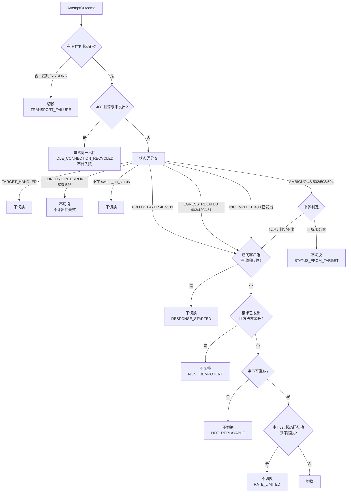
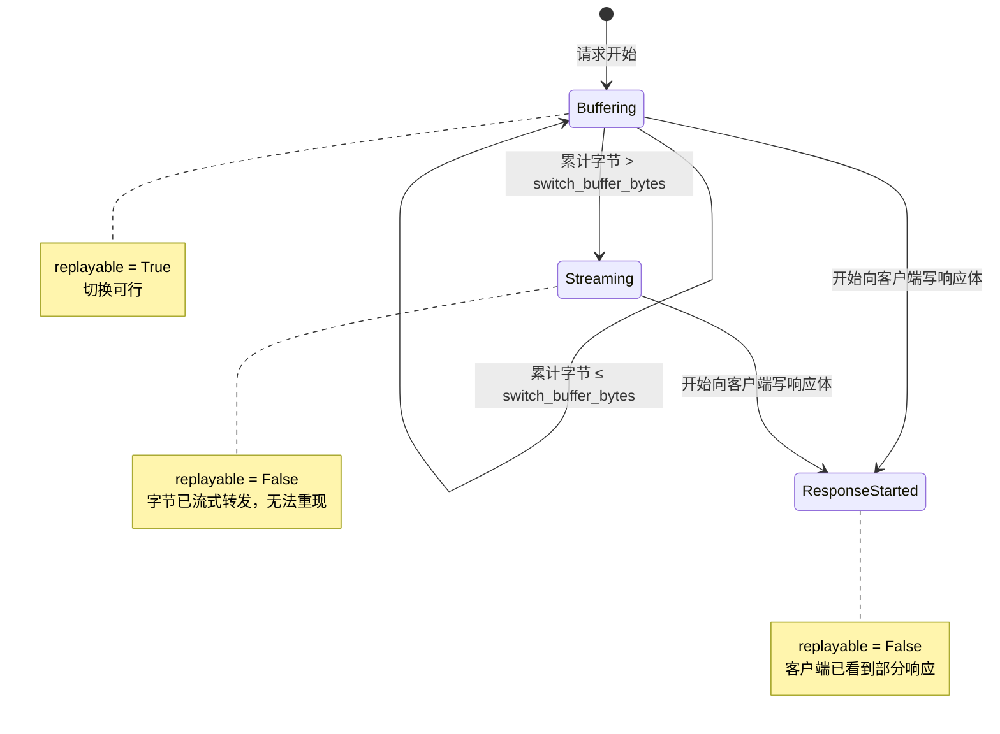
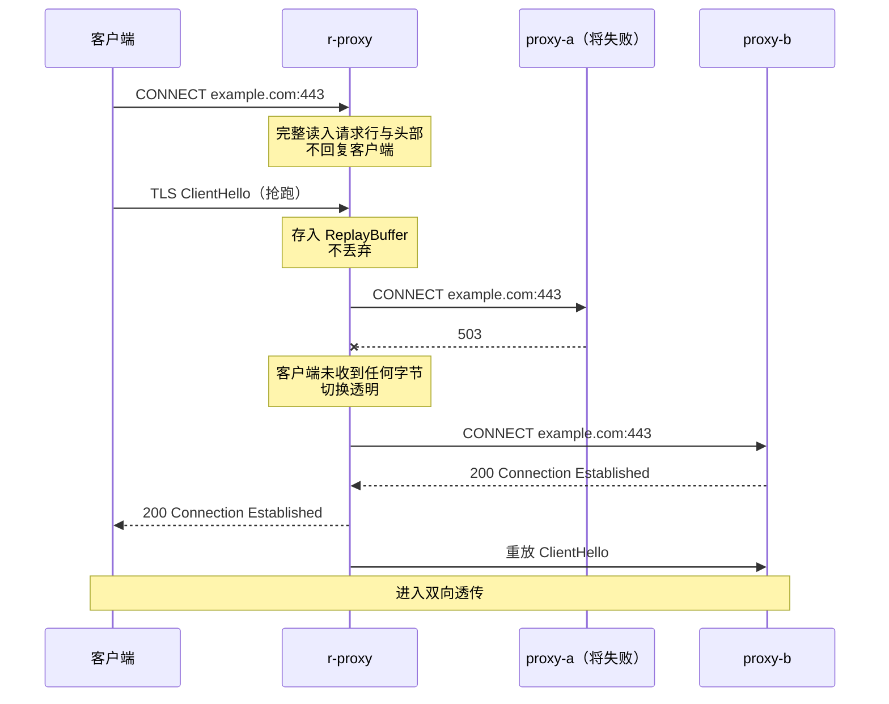

# DD_SWITCHING.md - 切换判据与字节重放详细设计

| 版本 | 日期 | 变更说明 | 作者 |
| :--- | :--- | :--- | :--- |
| v1.0.0 | 2026-08-13 | 初始版本：三道判据的判定链、状态码分类表、`502/503/504` 来源判定、幂等门控、切换频率限流、请求字节重放缓冲、CONNECT 隧道早夭 | Agent |
| v1.1.0 | 2026-08-14 | M2 实现回填：明确限流配额与候选链剩余长度无关 | Agent |
| v1.2.0 | 2026-08-15 | 修正缺陷：CONNECT 握手超时原记 `upstream_error`，导致被墙目标熔断健康出口；§3.2 补齐握手阶段的分界（有无可解析字节）与四条具体归类 | Agent |
| v1.3.0 | 2026-08-16 | 依生产日志修正隧道早夭判定：新增「上游先关闭」条件，消除浏览器预连接造成的假标记（实测占负面记忆 45%）；§8.1 记录 `bytes_up` 方案为何不成立；§8.2 明确早夭走 stderr 而非 `request_log` 及其理由；§9 补失败尝试与候选链耗尽的日志 | Agent |

**对应需求**：[PRD §4.3.1](../requirements/PRD_OVERVIEW.md)–[§4.3.5](../requirements/PRD_OVERVIEW.md)、[§4.3.11](../requirements/PRD_OVERVIEW.md)、[§4.3.13](../requirements/PRD_OVERVIEW.md)

**上游依赖**：`config`
**下游使用者**：`egress.executor`

---

## 1. 职责边界

`SwitchPolicy` 回答一个问题：**这次失败值不值得换个出口再试**。它不决定换成谁（那是 [DD_ROUTING.md](./DD_ROUTING.md)），不发起连接，不访问任何状态存储。

```python
# r_proxy/decision/switching.py

class SwitchPolicy:
    def should_switch(
        self,
        outcome: AttemptOutcome,
        ctx: SwitchContext,
        cfg: RoutingConfig,
        *,
        now: float,
    ) -> SwitchVerdict: ...
```

与 `Router` 一样，它是纯函数：相同输入必然得到相同输出。唯一的例外是频率限流需要读写滑动窗口计数，该状态由调用方通过 `ctx` 注入。

---

## 2. 数据契约

```python
@dataclass(frozen=True, slots=True)
class SwitchContext:
    """判据所需的请求上下文。"""
    method: Method
    is_connect: bool
    request_sent: bool          # 请求字节是否已写出到上游
    replayable: bool            # 已发出的字节能否重放，见 §7
    response_started: bool      # 是否已向客户端写出响应体字节
    host: str
    attempt_index: int
    limiter: SwitchRateLimiter  # 有状态，唯一的可变依赖


class SwitchReason(Enum):
    TRANSPORT_FAILURE = auto()      # 传输层失败
    PROXY_LAYER_STATUS = auto()     # 407 / 511
    AMBIGUOUS_STATUS = auto()       # 502/503/504 判定为代理侧或无法判定
    EGRESS_RELATED_STATUS = auto()  # 403 / 429 / 451
    INCOMPLETE_REQUEST = auto()     # 408 真实超时


class KeepReason(Enum):
    TARGET_HANDLED = auto()         # 状态码证明目标已处理
    CDN_ORIGIN_ERROR = auto()       # 520–526
    STATUS_FROM_TARGET = auto()     # 歧义码判定来源为目标
    NON_IDEMPOTENT = auto()         # 非幂等且已发出
    NOT_REPLAYABLE = auto()         # 字节不可重放
    RESPONSE_STARTED = auto()       # 已向客户端写出响应体
    RATE_LIMITED = auto()           # 频率超限
    IDLE_CONNECTION_RECYCLED = auto()  # 408 空闲连接回收，重试同一出口


@dataclass(frozen=True, slots=True)
class SwitchVerdict:
    switch: bool
    retry_same_upstream: bool = False   # 仅 IDLE_CONNECTION_RECYCLED 为 True
    switch_reason: SwitchReason | None = None
    keep_reason: KeepReason | None = None
    failure_kind: FailureKind = FailureKind.ROUTE_ERROR
```

`SwitchVerdict` 同时携带「切不切」与「为什么」。`keep_reason` 不是可选的调试信息——它要写进 `request_log`，用户在 Web 界面看到「为什么没有切换」全靠它。这是 [PRD §4.3.5](../requirements/PRD_OVERVIEW.md) 明确要求的可诊断性。

`retry_same_upstream` 是唯一的第三态：`408` 空闲连接回收时，既不切换也不放弃，而是在新连接上重试同一出口。

---

## 3. 判定链



```python
def should_switch(self, outcome, ctx, cfg, *, now) -> SwitchVerdict:
    # 判据一：失败层次
    if outcome.status is None:
        return SwitchVerdict(
            switch=True,
            switch_reason=SwitchReason.TRANSPORT_FAILURE,
            failure_kind=outcome.kind,     # egress 层已按 errno 初步归类
        )

    status = outcome.status

    # 408 的空闲连接回收特例，必须先于分类判断
    if status == 408 and not ctx.request_sent:
        return SwitchVerdict(
            switch=False,
            retry_same_upstream=True,
            keep_reason=KeepReason.IDLE_CONNECTION_RECYCLED,
            failure_kind=FailureKind.NOT_A_FAILURE,
        )

    # 判据二：状态码与来源
    category = classify_status(status)
    if category is StatusCategory.TARGET_HANDLED:
        return SwitchVerdict(False, keep_reason=KeepReason.TARGET_HANDLED,
                             failure_kind=FailureKind.NOT_A_FAILURE)
    if category is StatusCategory.CDN_ORIGIN_ERROR:
        return SwitchVerdict(False, keep_reason=KeepReason.CDN_ORIGIN_ERROR,
                             failure_kind=FailureKind.NOT_A_FAILURE)
    if status not in cfg.switch_on_status:
        return SwitchVerdict(False, keep_reason=KeepReason.TARGET_HANDLED,
                             failure_kind=FailureKind.NOT_A_FAILURE)

    kind = FailureKind.ROUTE_ERROR
    reason = _switch_reason_for(category)

    if category is StatusCategory.AMBIGUOUS:
        origin = determine_origin(outcome, ctx)
        if origin is Origin.TARGET:
            return SwitchVerdict(False, keep_reason=KeepReason.STATUS_FROM_TARGET,
                                 failure_kind=FailureKind.NOT_A_FAILURE)
    if status == 407:
        kind = FailureKind.UPSTREAM_ERROR       # 凭据错误是出口自身的问题

    # 判据三：幂等性、可重放性、频率
    if ctx.response_started:
        return SwitchVerdict(False, keep_reason=KeepReason.RESPONSE_STARTED,
                             failure_kind=kind)
    if ctx.request_sent and not ctx.method.idempotent:
        return SwitchVerdict(False, keep_reason=KeepReason.NON_IDEMPOTENT,
                             failure_kind=kind)
    if not ctx.replayable:
        return SwitchVerdict(False, keep_reason=KeepReason.NOT_REPLAYABLE,
                             failure_kind=kind)
    if not ctx.limiter.try_consume(ctx.host, now=now, cfg=cfg.status_switch_rate_limit):
        return SwitchVerdict(False, keep_reason=KeepReason.RATE_LIMITED,
                             failure_kind=kind)

    return SwitchVerdict(True, switch_reason=reason, failure_kind=kind)
```

### 3.1 顺序为何不可调换

| 位置 | 原因 |
|------|------|
| 传输层判定在最前 | 无状态码时后续的分类、来源判定全都不适用 |
| `408` 特例在分类之前 | `408` 在分类表中属于「切换」，但空闲连接回收场景要走完全不同的第三态。放在分类之后会先被判为切换 |
| `switch_on_status` 检查在分类之后 | 分类表中的 `TARGET_HANDLED` 与 `CDN_ORIGIN_ERROR` 是**硬约束**，即便用户把 `521` 加进 `switch_on_status` 也不切换（[PRD §4.3.2.2](../requirements/PRD_OVERVIEW.md)） |
| 频率限流在最后 | 限流会消耗配额。若放在幂等检查之前，一个非幂等请求即使最终不切换也会白白消耗配额 |
| `response_started` 在幂等之前 | 它是更强的约束：无论方法是否幂等，响应体一旦开始写给客户端就无法撤回 |

### 3.2 failure_kind 与是否切换是正交的

不切换不等于不记失败。例如非幂等 POST 收到 `503`：当前请求原样返回错误，但仍记一次 `route_error`，使**后续**请求避开这个出口（[PRD §4.3.4](../requirements/PRD_OVERVIEW.md)）。

反过来，`520–526` 与 `TARGET_HANDLED` 类既不切换也不记失败——它们证明了出口是通的。

| 情形 | switch | failure_kind |
|------|--------|--------------|
| TCP 连不上上级代理 | 是 | `UPSTREAM_ERROR` |
| `direct` 连接目标超时 | 是 | `ROUTE_ERROR`（[DD_ROUTING §4.6](./DD_ROUTING.md) 强制降级） |
| **CONNECT 握手超时**（连上了代理，它不回应答） | 是 | `ROUTE_ERROR`（代理活着，卡在它到目标那一段） |
| CONNECT 握手应答无法解析（状态行畸形、非 ASCII、超长） | 是 | `UPSTREAM_ERROR`（对端不是正常工作的代理） |
| 上级代理握手中途关闭连接 | 是 | `UPSTREAM_ERROR` |
| 上级代理返回 `503` | 是 | `ROUTE_ERROR`（代理活着） |
| 上级代理返回 `407` | 是 | `UPSTREAM_ERROR`（凭据配错） |
| 非幂等 POST 收到 `503` | **否** | `ROUTE_ERROR` |

握手阶段的归类**不能一刀切**。分界是「有没有收到可解析的字节」：

- **一个字节都没回（超时）**：上级代理正卡在自己连目标的那一步。目标被墙且丢包时，squid 的 `connect_timeout` 通常比我们的 `read_timeout` 长，于是**我们先超时**——这条路径在真实环境里极其常见。记 `upstream_error` 会让连续访问几个被墙站点就熔断一个完全健康的出口，其余目标跟着一起不可用。这正是 [DD_ROUTING §4.6](./DD_ROUTING.md) 为 `direct` 设防的那种拖累，上级代理同样受不起
- **回了字节但不是合法的代理应答**：与目标无关，换任何目标都一样坏，属于出口本身的问题

同一情形在普通 HTTP 转发路径（`_attempt_http` 读响应头超时）本来就记 `ROUTE_ERROR`，两条路径必须一致。
| 目标返回 `500` | 否 | `NOT_A_FAILURE` |
| CF 返回 `521` | 否 | `NOT_A_FAILURE` |
| `ENETUNREACH` | 是 | `CAPABILITY_MISMATCH` |
| `408` 空闲连接回收 | 否（重试同出口） | `NOT_A_FAILURE` |

---

## 4. 状态码分类

```python
# r_proxy/decision/classify.py

class StatusCategory(Enum):
    TARGET_HANDLED = auto()
    INCOMPLETE_REQUEST = auto()
    PROXY_LAYER = auto()
    AMBIGUOUS = auto()
    EGRESS_RELATED = auto()
    CDN_ORIGIN_ERROR = auto()
    INFORMATIONAL = auto()
    UNKNOWN = auto()


_TARGET_HANDLED = frozenset({
    400, 401, 404, 405, 406, 409, 410, 415, 421, 422, 500, 501, 505,
})
_PROXY_LAYER = frozenset({407, 511})
_AMBIGUOUS = frozenset({502, 503, 504})
_EGRESS_RELATED = frozenset({403, 429, 451})
_CDN_ORIGIN = frozenset(range(520, 527))


def classify_status(status: int) -> StatusCategory:
    if 100 <= status < 200:
        return StatusCategory.INFORMATIONAL
    if 200 <= status < 400:
        return StatusCategory.TARGET_HANDLED
    if status in _CDN_ORIGIN:
        return StatusCategory.CDN_ORIGIN_ERROR
    if status == 408:
        return StatusCategory.INCOMPLETE_REQUEST
    if status in _PROXY_LAYER:
        return StatusCategory.PROXY_LAYER
    if status in _AMBIGUOUS:
        return StatusCategory.AMBIGUOUS
    if status in _EGRESS_RELATED:
        return StatusCategory.EGRESS_RELATED
    if status in _TARGET_HANDLED:
        return StatusCategory.TARGET_HANDLED
    return StatusCategory.UNKNOWN
```

`UNKNOWN` 的兜底行为是**不切换**：走到 `status not in cfg.switch_on_status` 分支返回 `TARGET_HANDLED`。未知状态码大概率是目标应用的自定义码，切换无意义。

`_CDN_ORIGIN` 的判断置于 `_TARGET_HANDLED` 之前，因为它需要在用户误把 `521` 加入 `switch_on_status` 时仍然生效。

### 4.1 407 的额外处理

`407` 几乎总意味着该出口的凭据配置错误，而非临时故障。除切换外还要：

```python
# 在 AttemptExecutor 中
if outcome.status == 407:
    state.health.mark_auth_error(upstream, now=now)
```

`auth_error` 是叠加在健康状态之上的独立标志，不是第四个状态：

| 属性 | 说明 |
|------|------|
| 效果 | Web 界面显著告警；候选链中**仍然保留**该出口 |
| 清除条件 | 配置变更（该出口的 `auth` 字段改动）或 Web 手动重置 |
| 为何不移出候选链 | 用户可能正在修凭据，或该代理只对部分目标要求认证 |

同时 `407` 计入 `UPSTREAM_ERROR`，因此连续 5 次会正常触发熔断——这条路径足以在凭据持续错误时把出口摘掉，不需要额外的移除逻辑。

### 4.2 408 的两种情形

```python
if status == 408 and not ctx.request_sent:
    # 复用的空闲连接被服务端回收
```

`ctx.request_sent` 的准确性是关键。它必须在**字节真正写入 socket 之后**才置为 `True`，而不是在构造请求对象时。

本期 `direct` 与上级代理连接均使用**短连接**（`Connection: close`），因此严格来说不存在空闲连接复用，`ctx.request_sent` 在收到任何响应时必然为 `True`。这个分支是为将来引入连接池预留的。保留它的成本是一个 `if`，而遗漏它在引入连接池后会造成难以复现的偶发失败。

---

## 5. 502 / 503 / 504 的来源判定

```python
class Origin(Enum):
    PROXY = auto()
    TARGET = auto()
    UNDETERMINED = auto()


def determine_origin(outcome: AttemptOutcome, ctx: SwitchContext) -> Origin:
    # 信号 1：CONNECT，可靠性 100%
    if ctx.is_connect:
        return Origin.PROXY

    headers = outcome.response_headers    # 小写键

    # 信号 2：代理软件特征头
    if any(h in headers for h in _PROXY_ERROR_HEADERS):
        return Origin.PROXY
    server = headers.get("server", "").lower()
    if any(server.startswith(p) for p in _PROXY_SERVER_PREFIXES):
        return Origin.PROXY
    if any(t in headers.get("via", "").lower() for t in _PROXY_VIA_TOKENS):
        return Origin.PROXY
    if any(server.startswith(p) for p in _TARGET_SERVER_PREFIXES):
        return Origin.TARGET

    return Origin.UNDETERMINED


_PROXY_ERROR_HEADERS = frozenset({
    "x-squid-error", "x-cache", "x-tinyproxy", "proxy-connection",
})
_PROXY_SERVER_PREFIXES = ("squid", "tinyproxy", "privoxy", "polipo", "mitmproxy")
_PROXY_VIA_TOKENS = ("squid", "tinyproxy", "proxy")
_TARGET_SERVER_PREFIXES = ("nginx", "apache", "cloudflare", "openresty",
                           "gunicorn", "iis", "caddy", "envoy", "istio")
```

### 5.1 判定不出时切换

`UNDETERMINED` 走切换分支，依据 [PRD §4.3.3](../requirements/PRD_OVERVIEW.md)：多试一次的代价，远小于本可恢复却直接失败。

### 5.2 不使用响应耗时作为判据

需求中列出「响应耗时」为可靠性低的第三信号。设计上**不实现**它，理由：

判定「代理生成的错误通常在不足一个 RTT 内返回」需要知道到目标的 RTT，而这个值我们没有——如果能直连测 RTT，就不需要代理了。用一个固定阈值（比如 50ms）代替，会在本地代理（RTT < 1ms）与跨国代理（RTT > 200ms）两种场景下给出相反的错误判断。

已有的两个信号覆盖了绝大多数情况：CONNECT 场景 100% 可靠，普通请求的主流代理软件都会留下特征头。剩余的 `UNDETERMINED` 走「切换」这个安全默认值即可。

### 5.3 `_TARGET_SERVER_PREFIXES` 的作用

反向识别目标服务器同样有价值：`Server: nginx` + `502` 说明目标自己的网关坏了，换出口无用。这条判定把一部分本会落入 `UNDETERMINED` 的情况正确归入 `TARGET`，减少无谓遍历。

误判风险：上级代理若把目标的响应头透传出来，`Server: nginx` 可能来自目标而错误提示为「目标生成」。但这恰恰是对的——能透传目标响应头，说明代理确实连上了目标。

---

## 6. 切换频率限流

```python
# r_proxy/decision/limiter.py

class SwitchRateLimiter:
    """每 host 的滑动窗口计数。只统计状态码触发的切换。不持久化。"""

    def __init__(self, capacity: int = 10000) -> None:
        self._w: OrderedDict[str, deque[float]] = OrderedDict()
        self._cap = capacity

    def try_consume(self, host: str, *, now: float,
                    cfg: RateLimitConfig) -> bool:
        q = self._w.get(host)
        if q is None:
            if len(self._w) >= self._cap:
                self._w.popitem(last=False)
            q = deque()
            self._w[host] = q
        self._w.move_to_end(host)

        cutoff = now - cfg.window_seconds
        while q and q[0] < cutoff:
            q.popleft()

        if len(q) >= cfg.max_switches_per_host:
            return False
        q.append(now)
        return True

    def peek(self, host: str, *, now: float, cfg: RateLimitConfig) -> int:
        """供 Web 界面展示，不消耗配额。"""
        ...
```

| 设计点 | 说明 |
|--------|------|
| 只限状态码触发的切换 | 传输层失败是真实链路故障，限流它会让代理在网络抖动时失去自愈能力 |
| 配额在**判定通过时**消耗 | 前置的幂等、可重放检查已否决的请求不消耗配额 |
| 与候选链剩余长度无关 | 判据是纯函数，不知道链上还剩几个出口。候选链最后一个出口的失败同样消耗配额——它确实"判定为应该切换"，只是无处可切。因此 N 个出口全部返回可切换状态码时，一次请求消耗 N 份配额（验收点 M2-14） |
| 不持久化 | 60 秒生命期的计数器不值得落盘（[PRD §4.3.5](../requirements/PRD_OVERVIEW.md)） |
| 容量上限 | LRU 淘汰，防止大量不同 host 撑爆内存 |
| `deque` 存时间戳 | 窗口内最多 `max_switches_per_host`（默认 10）个元素，内存可忽略 |

`peek()` 与 `try_consume()` 分开：Web 界面查询「这个 host 还剩多少配额」时不能消耗配额。把它们合并成一个带 `dry_run` 参数的方法会让调用点更容易传错。

---

## 7. 请求字节重放

### 7.1 可重放性状态机



一旦离开 `Buffering` 就不可逆，没有回到可重放状态的路径。

### 7.2 缓冲区

```python
# r_proxy/protocol/replay.py

class ReplayBuffer:
    """请求字节的可重放缓冲。超出上限后转为流式并永久标记不可重放。"""

    __slots__ = ("_limit", "_chunks", "_size", "_replayable")

    def __init__(self, limit: int) -> None:
        self._limit = limit
        self._chunks: list[bytes] = []
        self._size = 0
        self._replayable = limit > 0

    @property
    def replayable(self) -> bool:
        return self._replayable

    @property
    def size(self) -> int:
        return self._size

    def append(self, data: bytes) -> None:
        if not self._replayable:
            return                       # 已放弃，不再累积内存
        if self._size + len(data) > self._limit:
            self._replayable = False
            self._chunks.clear()         # 立即释放
            self._size = 0
            return
        self._chunks.append(data)
        self._size += len(data)

    def give_up(self) -> None:
        """响应体已开始转发等场景，主动放弃重放能力。"""
        self._replayable = False
        self._chunks.clear()
        self._size = 0

    def replay_into(self, write: Callable[[bytes], None]) -> None:
        for chunk in self._chunks:
            write(chunk)
```

超限时**立即清空已缓存内容**。既然已经确定不可重放，保留那 64KB 毫无用处，而在 `max_client_connections`（默认 1000）个并发连接下，不清空意味着最坏 64MB 的无效驻留。

`switch_buffer_bytes: 0` 表示禁用缓存：`_replayable` 初始即为 `False`，所有请求在发出后都不可切换（传输层失败仍可切换，因为那时字节根本没发出）。

### 7.3 内存上界

```
最坏内存 = max_client_connections × switch_buffer_bytes
         = 1000 × 65536 = 64 MB
```

这是 [PRD §7.2](../requirements/PRD_OVERVIEW.md) 中 150MB 常驻内存目标的最大单项。启动校验会在 `max_client_connections × switch_buffer_bytes > 128MB` 时发出警告。

### 7.4 CONNECT 的字节时序



| 时点 | 客户端已收到 | 可否切换 |
|------|-------------|----------|
| 读完 CONNECT 头，未回复 | 无 | **可以** |
| 已回复 `200 Connection Established` | `200` | **不可以** |

**抢跑字节必须缓存而非丢弃**。规范要求客户端等 `200` 再发 ClientHello，但部分客户端不等。丢弃这些字节会导致 TLS 握手因缺少 ClientHello 而挂到超时，表现为「HTTPS 站点偶发卡住」，且只在特定客户端上出现——这是最难定位的一类 bug。

抢跑字节超过 `switch_buffer_bytes` 时：**停止读取客户端**（不再 `resume_reading`，依靠 TCP 背压），已缓存内容不丢弃，也不因此放弃切换。ClientHello 通常在 512 字节以内，触发上限的情况几乎不存在；真触发了说明客户端行为异常，让它阻塞比让它悄悄丢数据更安全。

```python
# r_proxy/protocol/connection.py（CONNECT 抢跑处理）

def data_received(self, data: bytes) -> None:
    if self._phase is Phase.CONNECT_PENDING:
        self._replay.append(data)
        if not self._replay.replayable:      # 触及上限
            self._transport.pause_reading()
        return
    ...
```

### 7.5 普通 HTTP 的字节时序

| 情形 | 可否切换 |
|------|----------|
| 无请求体（GET/HEAD） | 可以 |
| 请求体 ≤ `switch_buffer_bytes` | 可以 |
| 请求体 > `switch_buffer_bytes` | 不可以（已流式转发） |
| 已开始向客户端转发响应体 | 不可以 |

请求头本身**始终**可重放：它在解析时已完整读入内存，且体积受 `max_header_bytes`（[DD_PROXY §3.1](./DD_PROXY.md)）限制。因此无请求体的请求永远可切换。

超出缓冲上限时转为流式转发并标记不可切换，但**仍按 [PRD §4.3.6](../requirements/PRD_OVERVIEW.md) 记录失败**——当前请求救不回来，但要让后续请求受益。

---

## 8. CONNECT 隧道早夭

隧道建立后无法再切换（`200` 已发出），但可以为**下一次请求**积累认知。

```python
# r_proxy/protocol/relay.py（实现落在中继层，统计与判定分离）

@dataclass(slots=True)
class RelayStats:
    bytes_up: int = 0
    bytes_down: int = 0
    started_at: float = field(default_factory=time.monotonic)
    ended_at: float | None = None
    closed_by: Literal["client", "upstream"] | None = None
```

隧道关闭时（`protocol/connection.py::_note_premature_death`）：

```python
if stats.closed_by != "upstream":
    return
if stats.bytes_down == 0 and stats.duration_ms < window * 1000:
    executor.note_tunnel_premature_death(host, upstream, request_id=...)
```

判定条件是「**上游先关闭**」且「存活 < 5 秒」且「上游方向零字节」。三个条件缺一不可：

- 只看时长：正常的短连接（如一次小 API 调用后立即关闭）会被误判
- 只看字节数：连接建立后长时间无数据但最终正常关闭的场景会被误判
- 不看是谁先关：浏览器的预连接与连接池探活会被算到出口头上

典型命中场景是 TLS ClientHello 发出后被 RST——r-proxy 视角看到的正是「隧道建立、上游一个字节没回、5 秒内被上游关掉」。

#### 8.1 为什么用「谁先关闭」而不是「客户端发过字节没有」

**这一条是 2026-08-16 依据生产日志修正的**（见下方 v1.3.0）。原实现只判「上游零字节 + 窗口内」，结果 5 小时内产生 122 条负面记忆，其中 **55 条（45%）** 来自早夭判定，被标记的主机大量是 `lamssettings-pa.googleapis.com`、`readaloud.googleapis.com`、`i.ytimg.com` 这类浏览器后台服务——它们的共同特征是**开了隧道却从未使用**。

浏览器的预连接与连接池探活从本进程的视角与「ClientHello 被 RST」几乎同形，区别只在关闭是谁发起的。

修正过程中试过一个更直觉的判据「客户端发过字节（`bytes_up > 0`）才算」，**它是错的**，M2-19 立刻挂掉：上游一回 `200` 就断开时，`relay_bidirectional` 按 `FIRST_COMPLETED` 收尾，客户端的 ClientHello 常常还没被 `up` 泵读到任务就被取消了，`bytes_up` 是 0 却并不代表客户端没说话——那恰恰是本判定最该抓的场景。字节数在这里有竞态，`closed_by` 没有：它就是 `FIRST_COMPLETED` 的直接结论。

两个方向都已结束时归给客户端（`closed_by = "client" if up in done else "upstream"`）：判定的用途是「要不要怪上游」，客户端明确关过就足以让这次不算上游的账。

#### 8.2 早夭必须留一行 stderr 日志

本节早先的伪代码写的是 `enqueue_log(request_id, error="tunnel_premature_death", ...)`，实现**有意偏离**：不写 `request_log`，改为 `logger.warning`。

理由是 `request_log` 的行语义为「一次出口尝试一行」，`attempt_index` 表示第几次尝试（[DD_STORAGE §4.9](./DD_STORAGE.md)）。早夭发生在尝试成功**之后**的隧道拆除阶段，为它补一行会让首次尝试即成功的请求凭空出现 `attempt_index = 1`，于是「发生过切换」的筛选（`attempt_index > 0`）会捞出一批根本没切换过的请求。

但日志不可省略：这个标记会让后续十分钟的请求绕开该出口，而它诞生的那次请求在 `request_log` 里记的是 `200 成功`。没有这行日志，「为什么这个出口突然被绕开了」在任何地方都查不到——2026-08-16 的日志分析中，正是它导致一次 20 秒的重试无法复原经过。

计为 `route_error` 而非 `upstream_error`：隧道能建立说明上级代理是活的，问题在代理到目标那一段。

---

## 9. 与执行层的协作

```python
# AttemptExecutor 中判据的使用（完整片段见 DD_ROUTING §9）

outcome, response = await self._attempt(upstream, target, ctx)
verdict = self._policy.should_switch(outcome, ctx.switch_ctx,
                                     snapshot.routing, now=time.monotonic())

self._state.record(target, outcome, kind=verdict.failure_kind, now=...)
self._enqueue_log(ctx.request_id, outcome, verdict)

if outcome.ok:
    return response
if verdict.retry_same_upstream:
    continue_with_same_upstream()          # 不推进候选链，不计尝试次数
if not verdict.switch:
    return response                        # 原样返回，keep_reason 已入日志
# 继续候选链
```

归类的职责在两层之间分配：

| 情形 | 归类方 | 依据 |
|------|--------|------|
| 传输层失败（无状态码） | `egress` 层，`SwitchPolicy` 原样采纳 | `errno`（`ENETUNREACH` → `CAPABILITY_MISMATCH`），见 [DD_PROXY §7.1](./DD_PROXY.md) |
| 收到 HTTP 响应 | `SwitchPolicy` | 需要请求上下文（是不是 CONNECT、状态码来源） |
| `direct` 的任何失败 | `HealthTable` 入口处强制降为 `ROUTE_ERROR` | [DD_ROUTING §4.6](./DD_ROUTING.md) |

第三行是最后一道保险：即便前两层归类有误，`direct` 也不会被熔断。

---

## 10. 测试要点

| 场景 | 期望 | 对应验收 |
|------|------|----------|
| 连接超时 | 切换，`TRANSPORT_FAILURE` | SW-01 |
| 目标返回 `404` | 不切换，原样返回 | SW-03 |
| 目标返回 `500` | 不切换 | SW-04 |
| CF 返回 `521` | 不切换，`NOT_A_FAILURE` | SW-14 |
| 用户把 `521` 加进 `switch_on_status` | **仍不切换**（硬约束） | SW-15 |
| CONNECT 收到 `503` | 判定为 `PROXY`，切换 | SW-06 |
| HTTP `503` + `X-Squid-Error` | 判定为 `PROXY`，切换 | SW-12 |
| HTTP `503` + `Server: nginx` | 判定为 `TARGET`，不切换 | SW-13 |
| HTTP `503` 无特征头 | `UNDETERMINED`，切换 | — |
| GET 收到 `503` | 切换 | — |
| POST 已发出后收到 `503` | **不切换**，但记 `route_error` | SW-10 |
| POST 在 TCP 连接阶段失败 | **切换**（字节未发出） | — |
| PATCH 读超时 | 不切换 | — |
| 请求体 100KB（>64KB） | 标记不可重放，失败时不切换 | SW-16 |
| 请求体 10KB | 可重放，失败时正常切换并重放 | — |
| `switch_buffer_bytes: 0` | 请求发出后一律不可切换 | — |
| 缓冲超限后 | `_chunks` 已清空，内存不驻留 | RL-06 |
| 已向客户端写出响应体后上游断开 | 不切换 | — |
| 同一 host 60 秒内第 11 次状态码切换 | 不切换，`RATE_LIMITED` | SW-17 |
| 同一 host 第 11 次**传输层**失败 | **仍然切换**（不受限流） | SW-18 |
| 限流后配额随时间恢复 | 窗口滑出后可再次切换 | — |
| 幂等检查否决的请求 | **不消耗**限流配额 | — |
| `408` + 请求未发出 | `retry_same_upstream`，不计失败 | SW-19 |
| `408` + 请求已发出 | 切换，计 `route_error` | — |
| `407` | 切换，`UPSTREAM_ERROR`，标记 `auth_error` | — |
| 连续 5 次 `407` | 出口熔断 | — |
| CONNECT 抢跑的 ClientHello | 缓存并在切换后重放，TLS 握手成功 | SW-20 |
| CONNECT 抢跑字节超过上限 | 暂停读取客户端，不丢弃已缓存内容 | — |
| CONNECT 握手超时（代理零字节应答） | 记 `route_error`，**不**推进熔断计数 | — |
| CONNECT 握手应答为 `NOT-HTTP` 之类的垃圾 | 记 `upstream_error` | — |
| 隧道 3 秒内关闭且上游零字节 | 记 `route_error`，下次请求跳过该出口 | SW-21 |
| 隧道 3 秒内关闭但上游有字节 | **不**记失败 | — |
| 隧道存活 10 秒后关闭且上游零字节 | **不**记失败 | — |
