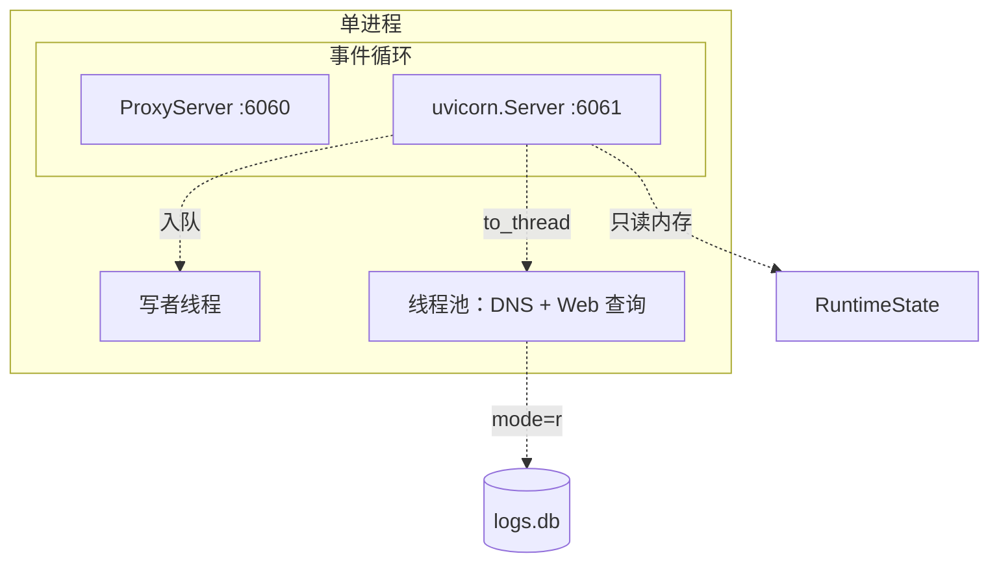
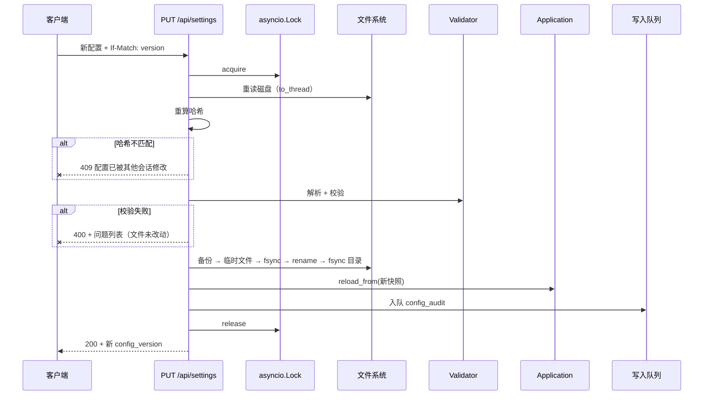

# DD_WEB.md - Web 管理界面详细设计

| 版本 | 日期 | 变更说明 | 作者 |
| :--- | :--- | :--- | :--- |
| v2.1.6 | 2026-08-21 | §7 补充：新增 `sqlite3.OperationalError → 503` 的专用错误处理器，慢磁盘/WAL checkpoint 触发的忙锁不再落进兜底的 `500` | Agent |
| v2.1.5 | 2026-08-18 | §6.1 补第三点：原子写的临时文件必须先 `fchmod(0o600)` 再写内容，`os.replace` 不会自动收紧权限；修复此前每次 Web 写配置都把含明文 `auth_token` 的 `config.toml` 权限从 600 重置为 644 的缺陷，备份文件同一问题一并修复。详见 [DD_DEPLOY §11.8](./DD_DEPLOY.md) | Agent |
| v2.1.4 | 2026-08-16 | 依生产日志降噪：新增 §5.2.1「失败日志一个窗口只说两次话」，`record_failure()` 改为返回窗口内累计次数，避免一次页面加载刷五条同样的 `WARNING` | Agent |
| v2.1.3 | 2026-08-16 | 偏差表更新：请求日志的生产端已接通，日志页与切换页不再永远为空（实现见 [DD_STORAGE §4.9](./DD_STORAGE.md)），前端未改动 | Agent |
| v2.1.2 | 2026-08-16 | §10.7.2 补「展开面板必须自己重画」：`refresh()` 在面板展开时跳过 `renderSticky`，因此「设状态 → refresh()」画不出刚打开的面板（按钮点下去没反应）。改为 `openPanel` 直接重画、`closePanel` 负责关闭与换页换序，`refresh()` 每轮存 `state.items`。改绑按钮此前带着同一缺陷 | Agent |
| v2.1.1 | 2026-08-16 | 新增 §7.2.1 缓存头：静态资源发 `no-cache`（无构建、URL 不带内容哈希，不发头则升级后浏览器继续跑旧脚本，已实际踩到），`/api/*` 发 `no-store` | Agent |
| v2.1.0 | 2026-08-16 | 新增「固化粘性为规则」：§6.3.3 单条插入 `insert_rule`（读改写全在锁内、插表首、重复条件 `409`、与整表替换共用 `_commit_rules`）；§8.9 接口设计（粘性与规则的语义差异、五条约束、响应字段）；§10.7.2 粘性页的固化面板；§9 补九条测试要点。同时修正 §10.7：`StickySource` 只有 `auto | manual`，规则命中既不读也不写粘性，原「`source=rule` 的行只读」是不可达分支 | Agent |
| v2.0.1 | 2026-08-16 | M5 实现回写：§6.3 伪代码改为经 `RulesStore` 门面（SQL 收在 `storage/`）、事务内二次比对 `revision`、返回值带告警清单；§10.7.1 补脏状态的三处落点与 `popstate` 的地址栏回推 | Agent |
| v1.6.0 | 2026-08-15 | 切片 e：新增 §10 前端单页应用（不用框架的理由、`dom.js` 作为唯一建节点入口并禁掉 `href`/`src`/`style`/`on*` 动态赋值、深链接白名单与静态挂载顺序、token 与轮询策略、各页要点、测试要点与已知偏差） | Agent |
| v2.0.0 | 2026-08-15 | 规则改为表格界面 + `rules.db` 存储：§6.2 规则输入由纯文本改为结构化 JSON；§6.3 重写为「整表替换」（单事务 `DELETE` + 全量 `INSERT`、`revision` SQL 侧自增、与 `config.toml` 共用同一把锁），新增 §6.3.1 三处跨库校验必须成对、§6.3.2 记录路径穿越面随规则入库而消失并把白名单测试教训移交备份恢复；§8.1 引用检查返回条数 + 逐条枚举，消息不与 `details` 重复；新增 §10.7.1 规则页（拖拽与 ↑/↓ 并存、`draggable` 必须为 `"true"`、前端不拼文件文本、移除 diff 预览与 `diff.js`） | Agent |
| v1.0.0 | 2026-08-13 | 初始版本：可选依赖隔离、单进程装配、`to_thread` 查询边界、认证与限流、配置写回与审计、前端转义、SSRF 与路径穿越防护 | Agent |
| v1.1.0 | 2026-08-13 | 分歧定案：配置格式改 TOML，§6.2 重写为 `tomlkit` 风格保留写回（注释不再丢失，原「提示 + 备份」的降级方案作废）；新增 §6.2.2 明确读写用不同的库 | Agent |
| v1.2.0 | 2026-08-14 | M4 切片 a 实现回写：新增 §2.2.1（依赖守卫必须罩到 `start()`）、§2.2.2（启动中途失败必须回滚，否则非 daemon 写者线程让进程退不出去）；§5.2 token 比较改为按字节并说明 `TypeError → 500` 的陷阱；§5.3 补失败限流的两处实现约束；§7.4 补三个错误处理器的统一信封 | Agent |
| v1.5.0 | 2026-08-15 | M4 切片 d 实现回写：新增 §6.2.3（`tomlkit` 的注释归属：增删表会让注释错位一格，故增删走行区间、改值走 `tomlkit`）、§6.2.4（新出口的序列化必须经 `tomlkit`，字符串拼接是 TOML 注入）、§6.6（写入编排：基线在锁内读、`Transform` 形状、失败分类）、§6.7（备份的目录、命名、按来源分组轮转与排序依据）、§8.8（设置白名单：客户端不得指定点分键）、§8.9（优先级批量：传分组而非数值，步长自适应）；§6.3 补「同目录真实文件同样 404」与端到端用例够不着的部分；§6.4 补 `actor` 沿用客户端 IP | Agent |
| v1.4.0 | 2026-08-15 | M4 切片 c 实现回写：新增 §4.6（`views.py` 共用投影，`/api/health` 与 `/api/upstreams` 不得各算一套口径）；§7.3 补探测目标为服务端常量、探测不写健康状态、超时要覆盖两处；新增 §8.6（手动绑定的键归一化与专用写入语句）、§8.7（批量清除拒绝空条件）；§8.1 补充出口增删改随 `config_writer` 移入切片 d | Agent |
| v1.3.0 | 2026-08-14 | M4 切片 b 实现回写：§4.2 补 `id` 次级排序键、`has_more` 取代 `total`、切换链的两段查询与显式列清单；§4.3 补 `offset` 派生；新增 §4.5（`to_thread` 边界的架构守卫与验证方法）；§8.4 改用 `clear_circuit` 并补健康接口的字段口径 | Agent |

**对应需求**：[WEBUI_SPEC.md](../requirements/WEBUI_SPEC.md) 全文、[PRD §4.7](../requirements/PRD_OVERVIEW.md)

**上游依赖**：`config`、`state`、`storage`、`rules`
**下游使用者**：无

---

## 1. 设计目标与约束

| 约束 | 来源 |
|------|------|
| `--no-web` 或 `webui.enabled = false` 时**完全不导入**任何第三方包（含 `tomlkit`） | [PRD §4.8](../requirements/PRD_OVERVIEW.md) |
| 进程数**必须**为 1 | [WEBUI §1.2.1](../requirements/WEBUI_SPEC.md) |
| 所有数据库查询经 `asyncio.to_thread` | [WEBUI §1.2.2](../requirements/WEBUI_SPEC.md) |
| Web **不得**直连写库 | [PRD §4.9.5](../requirements/PRD_OVERVIEW.md) |
| Web 崩溃不得影响代理核心 | [ARCH §10](./ARCH_OVERVIEW.md) |
| 渲染 host / URL 一律转义 | [WEBUI §7.2](../requirements/WEBUI_SPEC.md) |

---

## 2. 与代理核心共存

### 2.1 同一事件循环



`uvicorn` 作为**任务**跑在代理的事件循环里，不用 `uvicorn.run()`（它会自己创建事件循环）：

```python
# r_proxy/web/__init__.py

async def start(app_state: Application) -> asyncio.Task[None]:
    import uvicorn                       # 延迟导入，见 §2.2
    from r_proxy.web.app import create_app

    cfg = uvicorn.Config(
        create_app(app_state),
        host=app_state.current().webui.host,
        port=app_state.current().webui.port,
        log_config=None,                 # 复用代理的日志配置
        access_log=False,                 # 访问日志由中间件按需记录
        workers=1,                        # 冗余保险，见 §2.3
        lifespan="off",
    )
    server = uvicorn.Server(cfg)
    task = asyncio.create_task(server.serve(), name="webui")
    task.add_done_callback(_on_web_exit)
    return task
```

```python
def _on_web_exit(task: asyncio.Task[None]) -> None:
    if task.cancelled():
        return
    if (exc := task.exception()) is not None:
        logger.error("Web 界面异常退出，代理服务继续运行", exc_info=exc)
```

`_on_web_exit` 是 [ARCH §10](./ARCH_OVERVIEW.md) 中「Web 崩溃不影响代理」的落实点。不重启 Web——反复崩溃会刷屏，且崩溃原因（端口被占、依赖损坏）通常不会自愈。

`lifespan="off"`：应用的启动关闭由 `Application` 统一编排，不需要 ASGI lifespan 事件。

### 2.2 可选依赖的隔离

```python
# r_proxy/app.py

async def _maybe_start_web(self) -> None:
    cfg = self._snapshot.webui
    if not cfg.enabled or self._no_web_flag:
        return
    try:
        from r_proxy import web          # 唯一的导入点
    except ImportError as exc:
        logger.warning(
            "Web 界面已启用但依赖缺失（%s）。"
            "执行 pip install \"r-proxy[web]\" 安装，或使用 --no-web 关闭此提示。",
            exc.name,
        )
        return
    self._web_task = await web.start(self)
```

`from r_proxy import web` 是全代码库中**唯一**导入 web 包的位置。`r_proxy/web/__init__.py` 内部才导入 `fastapi`、`uvicorn`。这个两层结构保证：

- `--no-web` 时 `r_proxy.web` 根本不被导入，`fastapi` 未安装也不影响
- 依赖缺失时给出可操作的提示，而不是 `ModuleNotFoundError` 崩溃

#### 2.2.1 守卫必须罩到 `start()`

上面的写法有个陷阱：**`try` 只包住 `import` 是不够的**。`r_proxy/web/__init__.py` 的模块体只用标准库（`fastapi` 与 `uvicorn` 在 `start()` 里才导入），所以缺依赖时 `from r_proxy import web` 会**成功**，异常在随后的 `web.start(self)` 里才抛出——落在 `except ImportError` 之外，直接把代理的启动一起带走。

实现因此把两步都放进同一个 `try`：

```python
try:
    from r_proxy import web

    runner = await web.start(self)
except ImportError as exc:
    logger.warning('Web 界面已启用但依赖缺失（%s）。执行 pip install "r-proxy[web]" 安装，'
                   "或用 --no-web 关闭此提示。", exc.name)
    return
self._web = runner
```

代价是我们自己 web 代码里的拼写错误型 `ImportError` 也会被降级成「依赖缺失」。可接受：提示里带 `exc.name`，缺的究竟是 `uvicorn` 还是 `r_proxy.web.querys` 一目了然。

#### 2.2.2 启动到一半失败必须回滚

Web 启动失败暴露了一个与 Web 无关的更严重问题：`Application.start()` 在 `storage.start()` 之后任何一步抛异常，都会留下一个**活着的非 daemon 写者线程**，于是进程永远退不出去。最常见的触发路径根本不是 Web，而是**代理端口被占用**——用户看到的是「报了端口错误，然后连 Ctrl-C 都没反应」。

```python
self._storage = storage
try:
    ...  # ProxyServer、后台任务、Web
except BaseException:
    await self.stop()
    raise
```

用 `BaseException` 而非 `Exception`：启动期间的 `CancelledError` 与 `KeyboardInterrupt` 同样会留下写者线程。

对称地，`Application.stop()` 的每一环也必须独立捕获异常——某一环抛出不能跳过后面的关库。这条在 M4 之前不成立：`stop()` 是一串顺序 `await`，Web 关停抛异常就会让 `storage.stop()` 永远执行不到。

用 import 检查测试守住这条约束：

```python
def test_core_does_not_import_web(monkeypatch):
    for mod in ("fastapi", "uvicorn"):
        monkeypatch.setitem(sys.modules, mod, None)   # 触发 ImportError
    import r_proxy.protocol.server      # noqa: F401
    import r_proxy.decision.router      # noqa: F401
    import r_proxy.storage.writer       # noqa: F401
```

### 2.3 为何必须单进程

`uvicorn --workers N` 用 `fork` 创建 N 个进程。对本设计而言这是灾难性的：

| 后果 | 说明 |
|------|------|
| N 个写者线程 | 违反唯一写者约束，重现实测的 75% 丢更新 |
| N 份内存状态 | 每个进程有自己的熔断、粘性、游标，互相看不见 |
| N 个代理监听 | 子进程继承监听套接字，请求被随机分发到状态不一致的进程 |

因此 `webui.workers != 1` 在启动校验阶段直接拒绝（[DD_CONFIG §4.1](./DD_CONFIG.md) `E_WEB_WORKERS`）。代码里再传一次 `workers=1` 是冗余的保险。

---

## 3. 分层结构

```
r_proxy/web/
├── __init__.py          # start()：延迟导入 uvicorn，装配并启动
├── app.py               # create_app()：FastAPI 实例、中间件、路由挂载
├── deps.py              # 认证依赖、Application 注入、分页参数
├── schemas.py           # Pydantic 请求/响应模型
├── errors.py            # 统一异常处理器
├── config_writer.py     # config.toml 原子写回、rules.db 整表替换 + 审计
├── queries.py           # 所有 SQL 查询，供 to_thread 调用
├── routers/
│   ├── status.py        # /api/status /api/health /api/logs /api/healthz
│   ├── upstreams.py     # /api/upstreams
│   ├── sticky.py        # /api/sticky /api/route-blocks
│   ├── rules.py         # /api/rules /api/route-test
│   └── settings.py      # /api/settings /api/reload /api/config/* /api/audit
└── static/              # 单页应用产物
```

`queries.py` 集中所有 SQL 是有意的：它是唯一会碰数据库的模块，审查「有没有漏掉 `to_thread`」「有没有 SQL 拼接」时只需看这一个文件。

---

## 4. 数据访问

### 4.1 三个数据来源

| 来源 | 访问方式 | 内容 |
|------|----------|------|
| 内存状态 | 直接同步读 | 健康、熔断、粘性、负面记忆、队列水位、限流状态 |
| `logs.db` | `to_thread` + 只读连接 | 请求日志、审计记录 |
| 配置快照 | 直接同步读 | 出口列表、路由设置、规则元信息 |

**内存状态直接读，不走 `to_thread`**：它就是几个字典查找，微秒级。放进线程池反而增加调度开销。

`state.db` **不由 Web 直接读取**：粘性与负面记忆的权威在内存，读数据库会拿到滞后的副本。Web 展示的应该是当前真实生效的状态。

### 4.2 to_thread 边界

```python
# r_proxy/web/routers/status.py

@router.get("/logs", dependencies=[Authenticated])
async def list_logs(params: LogQueryDep, app: AppDep) -> LogPage:
    rows = await asyncio.to_thread(
        queries.query_logs, app.storage.logs_reader, params
    )
    return LogPage(
        items=[LogItem.model_validate(dict(r)) for r in rows[: params.page_size]],
        page=params.page,
        page_size=params.page_size,
        has_more=len(rows) > params.page_size,
    )
```

```python
# r_proxy/web/queries.py

_COLUMNS = "id, request_id, host, url, method, upstream_name, ..."


def query_logs(pool: ReadOnlyPool, q: LogQuery) -> list[sqlite3.Row]:
    """在线程池中执行。禁止在事件循环中直接调用。"""
    clause, args = _where(q)
    sql = (
        f"SELECT {_COLUMNS} FROM request_log {clause} "
        "ORDER BY created_at DESC, id DESC LIMIT ? OFFSET ?"
    )
    return pool.query(sql, (*args, q.page_size + 1, q.offset))


def _where(q: LogQuery, *, extra: Sequence[str] = ()) -> tuple[str, tuple[object, ...]]:
    where: list[str] = list(extra)
    args: list[object] = []
    if q.host:
        where.append("host = ?"); args.append(q.host)
    if q.upstream:
        where.append("upstream_name = ?"); args.append(q.upstream)
    if q.status is not None:
        where.append("http_status = ?"); args.append(q.status)
    if q.since is not None:
        where.append("created_at >= ?"); args.append(q.since)
    if q.until is not None:
        where.append("created_at <= ?"); args.append(q.until)
    clause = f"WHERE {' AND '.join(where)}" if where else ""
    return clause, tuple(args)
```

`clause` 由**固定的字符串字面量**拼接而成，用户输入全部走 `?` 参数。这是唯一安全的动态 WHERE 构造方式——把列名或值直接拼进 SQL 是注入的入口。`_where` 的 `extra` 也只接受代码里写死的字面量条件（目前只有 `attempt_index > 0`），不接受任何来自请求的片段。

三处实现上的定案：

| 决定 | 理由 |
|------|------|
| 显式列清单，不用 `SELECT *` | 加一列 schema 不应自动变成 API 变化；响应模型是 `extra="forbid"`，多出的列会变成 `500` |
| `ORDER BY created_at DESC, id DESC` | `created_at` 只到秒，同秒内几十条日志很常见。少了 `id` 这个次级键，翻页边界会漂——同一行出现两次而另一行被跳过 |
| 多取一条得 `has_more`，不返回 `total` | `COUNT(*)` 要把满足条件的行全数过一遍，而看板只需要知道「下一页」能不能点 |

### 4.2.1 切换事件流要两段查询

`/api/logs/switches` 的分页单位是**请求**，而筛选条件作用在**尝试行**上。一条 SQL 做不到：直接 `LIMIT` 截行会把某个请求的尝试链切掉一半，前端就画不出完整的切换路径。

```python
found = await asyncio.to_thread(queries.query_switch_request_ids, reader, params)
request_ids = found[: params.page_size]
rows = await asyncio.to_thread(queries.query_attempts, reader, request_ids)
```

第一段 `GROUP BY request_id` + `WHERE attempt_index > 0` 定位「切换过的请求」，第二段按 `request_id IN (...)` 取回完整尝试链（走 `idx_rl_reqid`）。`IN` 的占位符个数由**列表长度**决定、与用户输入无关，`page_size ≤ 1000` 保证不会撞上 SQLite 的参数个数上限。

两段之间保留策略可能刚好清掉某个请求的行，此时该条目直接跳过，而不是返回一条空链。

### 4.3 分页与限制

```python
class Pagination(Model):
    page: int = Field(1, ge=1, le=10_000)
    page_size: int = Field(50, ge=1, le=1_000)

    @property
    def offset(self) -> int:
        return (self.page - 1) * self.page_size
```

`offset` 作为派生属性而非字段：每个查询函数各自算一遍 `(page - 1) * page_size` 迟早会有一处写错，而写错的表现是「某一页的数据莫名其妙」而不是报错。

`page_size` 上限 1000 与 `page` 上限 10000 都是必需的（[WEBUI §7.6](../requirements/WEBUI_SPEC.md)）：

- 无 `page_size` 上限时，一次请求 100 万行会占满线程池线程数秒，期间**DNS 解析排队**——表现为「打开 Web 界面后新连接变慢」
- 无 `page` 上限时，`OFFSET 10000000` 会让 SQLite 扫描并丢弃千万行

DNS 与 Web 查询共用默认线程池（[ARCH §5.2](./ARCH_OVERVIEW.md)），这是必须限制查询规模的直接原因。

`OFFSET` 分页在深翻页时仍然慢。日志场景下用户几乎只看最近的几页，不做游标分页优化。若将来成为问题，改用 `WHERE id < ?` 的键集分页。

### 4.4 慢查询保护

```python
@app.middleware("http")
async def slow_query_guard(request: Request, call_next):
    start = time.monotonic()
    response = await call_next(request)
    if (elapsed := time.monotonic() - start) > 1.0:
        logger.warning("Web 慢请求 %.2fs: %s %s",
                       elapsed, request.method, request.url.path)
    return response
```

只记录不中断：中断一个跑到一半的查询并不能让线程回来（`sqlite3` 的执行无法从外部取消），只会让用户看到错误而线程仍被占用。记录足以让运维发现问题。

### 4.5 to_thread 边界靠守卫维持

「每个查询都记得包 `to_thread`」是一条人工审查守不住的约束：漏掉一次的代码看起来完全正常，症状要到某个大表深翻页时才出现，而那时表现为「打开管理界面时代理卡住」，几乎没人会联想到某一个日志查询。

因此用静态守卫钉住：`r_proxy/web/` 下除 `queries.py` 自身之外，任何 `queries.X` 引用都必须是 `to_thread(...)` 的实参（`tests/test_architecture.py::test_web_queries_are_reached_only_through_to_thread`）。交给别的包装函数也算违规——只有 `to_thread` 能保证换线程。守卫自身也有一组反例用例护着，防止它退化成永真断言。

运行时验收（M4-08）用的是「查询还没返回而代理已经答完」而非比较耗时：

```python
def slow_query(pool, params):
    entered.set()
    release.wait(timeout=10)     # 卡住，等测试放行
    return []

query = asyncio.create_task(client.get("/api/logs"))
await _wait_for_flag(entered)
response = await _proxy_get(app, site.address)
assert not query.done()          # 查询仍在飞，代理已经答完
```

比较耗时的写法在这里是**测不出问题的**：漏掉 `to_thread` 时事件循环被同步调用整块占住，测试自己的计时代码也一起被冻住，等它恢复运行时阻塞已经结束，量到的耗时反而正常。判据必须落在「两件事的重叠」上，而不是任何一件事的时长上。

### 4.6 内存状态的投影集中在 `views.py`

`/api/health`（看板轮询）与 `/api/upstreams`（管理页）展示同一份健康数据，形状不同：前者扁平，后者把健康面内嵌在 `health` 下。两个 router 各写一遍投影必然漂移，而漂移的表现是「同一个出口在两个页面上显示不同的成功率」——这类缺陷很难归因，因为两个数字都不明显错。

```python
# r_proxy/web/views.py

def health_info(cfg, table, *, now) -> UpstreamHealthInfo:      # 健康面
def health_item(cfg, table, *, now) -> UpstreamHealthItem:      # 扁平：/api/health
def upstream_item(cfg, table, *, now) -> UpstreamItem:          # 内嵌：/api/upstreams
def by_priority(upstreams) -> list[UpstreamConfig]              # (priority, name)
```

模型层用继承表达同一层语义：`UpstreamHealthItem(UpstreamHealthInfo)` 加上定位字段，`UpstreamItem` 则把 `UpstreamHealthInfo` 作为字段内嵌。两者的字段口径因此不可能各走一路（§8.5）。

`by_priority` 的次级键取名称只为让输出稳定。**不展示同优先级组内的轮询顺序**：那由游标决定，把「本次恰好的顺序」画到界面上会让人以为它是固定的。

### 4.7 内存分页给 `total`，SQL 分页给 `has_more`

粘性映射与负面记忆整份都在内存里，筛完的列表长度是白拿的，因此 `/api/sticky` 与 `/api/route-blocks` 回真实 `total`；日志的总数要让 SQLite 扫全表，因此 `/api/logs` 只回 `has_more`（§4.3）。同一个概念在两处给不同字段是有意的，代价差了几个数量级。

---

## 5. 认证

### 5.1 适用范围

| 路径 | 是否需要 token |
|------|---------------|
| `/api/healthz` | **否**（存活探针） |
| `/api/*` 其余全部 | **是**，无论读写 |
| `/`、`/static/*` | 否（静态资源本身不含敏感数据） |

**只读接口同样需要 token**（[WEBUI §7.1.1](../requirements/WEBUI_SPEC.md)）。`/api/logs` 会返回用户访问过的全部 URL，`/api/upstreams` 会返回内网代理地址——这些比写接口更值得保护。

### 5.2 校验实现

```python
# r_proxy/web/deps.py

async def require_token(
    request: Request,
    app: Annotated[Application, Depends(get_app)],
) -> None:
    expected = app.current().webui.auth_token
    if expected is None:
        return                           # 回环绑定且未配置，允许
    provided = _extract(request)
    if provided is None or not hmac.compare_digest(provided, expected):
        raise HTTPException(401, detail="认证失败")


def _extract(request: Request) -> str | None:
    if (h := request.headers.get("authorization")) and h.startswith("Bearer "):
        return h[7:]
    return request.headers.get("x-auth-token")
```

实现用 `secrets.compare_digest`（与 `hmac.compare_digest` 同一函数），并且**必须先编码成 bytes**：

```python
def _matches(provided: str, expected: str) -> bool:
    return secrets.compare_digest(provided.encode(), expected.encode())
```

对 `str` 直接比较时它只接受纯 ASCII，遇到非 ASCII 会抛 `TypeError` —— 认证失败于是从 `401` 变成 `500`，而且每个请求都是 `500`，界面完全不可用。根因（非 ASCII 的 token 在 HTTP 头里发不出去）已由启动校验的 `E_WEB_TOKEN_NON_ASCII` 拦下，这里是第二道防线。

| 要点 | 说明 |
|------|------|
| `secrets.compare_digest` | 常量时间比较，防止通过响应时间差逐字节爆破 token |
| **不接受 query string 中的 token** | URL 会进入浏览器历史、Referer 头、反向代理日志 |
| 错误响应不区分「无 token」与「token 错误」 | 都返回 `401 认证失败`，不给探测者额外信息 |
| token 绝不进日志 | 中间件记录请求时必须过滤 `authorization` 与 `x-auth-token` 头 |

#### 5.2.1 失败日志一个窗口只说两次话

`record_failure()` 返回该 IP 在当前窗口内的累计次数，`require_token` 据此决定要不要打日志：

```python
count = throttle.record_failure(ip)
if count == 1:
    logger.warning("Web 认证失败，来自 %s，token 指纹 %s", ip, fingerprint(provided))
elif count == throttle.max_failures:
    logger.warning("来自 %s 的连续认证失败已达 %d 次，暂时拒绝该来源", ip, count)
```

**理由**：前端一次页面加载并发五个 `/api/*` 请求，未输入 token 时会刷出五条内容完全一致的 `WARNING`。2026-08-16 的生产日志里，`20:28:55` 这一秒就占了五行——而那 5 小时的日志总共只有 35 行。逐条打印没有任何增量信息，只会把真正的事件挤出屏幕。

压制不等于丢弃：达到阈值触发锁定时补一行，把这一窗口的总次数说出来。暴力破解因此仍然可见（第 1 次 + 第 10 次），而正常的「忘了填 token」只留一行。

### 5.3 认证失败限流

```python
class AuthThrottle:
    """按客户端 IP 限制认证失败频率。"""
    def __init__(self, max_failures: int = 10, window: float = 60.0) -> None: ...

    def check(self, ip: str, *, now: float) -> bool: ...
    def record_failure(self, ip: str, *, now: float) -> None: ...
```

超限后该 IP 在窗口内一律返回 `429`，不再做 token 比较。这防止本机其他用户或已进入内网的攻击者暴力枚举 token。

限流状态在内存中，与切换频率限流（[DD_SWITCHING §6](./DD_SWITCHING.md)）结构一致但独立——两者的窗口与阈值语义完全不同，共用一个实现只会让参数含义混乱。

两处实现约束：

- **被跟踪的 IP 数必须有上限**（`MAX_TRACKED_CLIENTS = 1024`，LRU 淘汰）。可增长资源都要有界，否则伪造源地址就能把内存撑满
- **客户端标识取连接的对端地址，不看 `X-Forwarded-For`**。Web 界面直连本机，转发头完全由客户端控制，采信它等于让攻击者用一个伪造头绕开限流

---

## 6. 配置写回

### 6.1 写入流程



完整实现见 [DD_CONFIG §5.2](./DD_CONFIG.md)、[§5.3](./DD_CONFIG.md)。此处只强调三点：

1. **重读磁盘而非比对内存**，否则检测不到编辑器直接修改
2. **校验失败时磁盘文件完全未动**，也不产生备份
3. **临时文件创建时即 `fchmod(0o600)`，早于写入内容**：`config.toml` 含明文 `webui.auth_token`，`open(tmp, "w")` 走 umask 默认权限（通常 `644`），而 `os.replace()` 是纯 `rename`——目标文件的最终权限完全继承自临时文件，不会自动收紧。曾经在这里漏掉这一步，导致每次 Web 写配置后文件权限都从部署时手工设置的 `600` 被悄悄放宽成 `644`（部署记录见 [DD_DEPLOY §11.8](./DD_DEPLOY.md)）。备份文件（§6.7）同样需要在写完后补 `chmod(0o600)`，否则明文快照的权限问题会原样复制一份。

### 6.2 结构化编辑 vs 文本编辑

| 接口 | 输入 | 处理 |
|------|------|------|
| `PUT /api/settings` | 结构化 JSON | `tomlkit` 载入原文档 → 只改动被修改的键 → 写回 |
| `PUT /api/upstreams/{name}` | 结构化 JSON | 同上，只改对应的 `[[upstreams]]` 表 |
| `PUT /api/rules` | 结构化 JSON | 不碰 `config.toml`，整表替换 `rules.db`（§6.3） |

规则是唯一不写 `config.toml` 的写入路径，因此完全不涉及 `tomlkit`。

#### 6.2.1 注释与格式必须保留

朴素做法「解析成字典 → 修改 → 全量重新序列化」会丢弃用户手写的全部注释、空行与分组。用户通过界面点一下保存，此前写的说明文字就永久消失——虽然有备份，但用户不会想到去找。

因此写回**必须**走 `tomlkit` 的风格保留往返（[WEBUI_SPEC §6.2.2](../requirements/WEBUI_SPEC.md)）：

```python
# r_proxy/web/config_writer.py
import tomlkit


def apply_settings(original_text: str, changes: dict[str, object]) -> str:
    doc = tomlkit.parse(original_text)          # 保留注释、空行、缩进
    for dotted_key, value in changes.items():
        _set_nested(doc, dotted_key.split("."), value)
    return tomlkit.dumps(doc)


def upsert_upstream(original_text: str, spec: UpstreamSpec) -> str:
    doc = tomlkit.parse(original_text)
    array = doc.setdefault("upstreams", tomlkit.aot())
    for table in array:
        if table["name"] == spec.name:
            _update_table(table, spec)          # 只改动字段，保留表内注释
            return tomlkit.dumps(doc)
    array.append(_new_table(spec))              # 新出口追加到数组末尾
    return tomlkit.dumps(doc)
```

关键在于**只写被改动的键**。若把整个 `ConfigSnapshot` 反向序列化回文档，所有被默认值填充过的项都会被显式写进文件，配置文件会从几十行膨胀到几百行，而用户并没有改动它们。

| 操作 | 处理 |
|------|------|
| 修改已有键 | 原地替换值，保留该行尾部注释 |
| 新增出口 | 追加 `[[upstreams]]` 表到数组末尾 |
| 删除出口 | 移除该表**及其紧邻的前置注释块**（那些注释描述的就是这个出口） |
| 用户未改动的项 | 一个字节都不动，包括仍为默认值的显式配置 |

#### 6.2.2 读写用不同的库

| 路径 | 库 | 所在包 |
|------|-----|--------|
| 读（代理核心与 Web 都用） | `tomllib`（标准库） | `config/loader.py` |
| 写（仅 Web） | `tomlkit`（`[web]` extra） | `web/config_writer.py` |

`config` 包严禁导入 `tomlkit`，否则 `--no-web` 形态会失去零依赖性质。这条边界由 [MIGRATION §6.2](./MIGRATION.md) 的 import 检查测试守住。

写回后不需要用 `tomlkit` 重新解析来更新内存快照——写回完成即触发热重载，重载走的是标准的 `tomllib` 读路径。这样「Web 写入的配置」与「用户手写的配置」经过完全相同的校验与构建流程，不存在两条路径行为不一致的风险。

写前校验用 `config.loader.load_text(text, path)`：从内存文本构建候选快照，**不读也不写**磁盘。`path` 仍要传，因为 `database.*` 的相对路径以配置文件所在目录为基准，且报错信息要带上文件名——传临时文件路径会让路径解析到别处。

#### 6.2.3 注释归属：为什么增删表不能用 `tomlkit`

实现时发现 `tomlkit` 的注释归属与直觉相反，照搬 §6.2 的伪代码会静默改坏配置。

一个视觉上位于某个表**之前**的注释块，在文档树里存在**前一项的尾部**：

```toml
# 家里的代理        ← 存在 doc.body（AoT 之前）
[[upstreams]]
name = "home"
                    ← 以下两行存在 home 这个表的 body 尾部
# 兜底直连
[[upstreams]]
name = "direct"
```

于是：

| 操作 | 朴素做法 | 实际结果 |
|------|----------|----------|
| 删除 `home` | `del aot[0]` | `home` 的表没了，但描述它的 `# 家里的代理` 留在原地盖到了 `direct` 头上；同时 `# 兜底直连`（属于 `direct`）跟着 `home` 一起被删 |
| 删除最后一个出口 | `del aot[-1]` | 连同它后面属于**下一个章节**的注释一起删掉 |
| 追加新出口 | `aot.append(t)` | 新表插在下一个章节的注释之后，顶着别人的说明，且与后续表之间没有空行 |

注释错位比丢注释更糟：丢了还看得出来，错位之后 `direct` 顶着「家里的代理」的说明，下一个读配置的人会被它误导。

因此实现分成两条路径（`r_proxy/web/toml_edit.py`）：

| 操作 | 手段 | 理由 |
|------|------|------|
| 改值（设置、出口字段、优先级） | `tomlkit` 就地赋值 | 不移动任何项，注释归属不变 |
| 增删 `[[upstreams]]` 表 | 行区间计算 | 只有按文本行才能精确表达「表体 + 紧邻前置注释，但不含尾部注释」 |

行区间的三条规则：

1. **表体终点**是下一个顶层表头，但 `[upstreams.xxx]` 是子表，不构成边界（删出口要连 `[upstreams.auth]` 一起删）
2. 从终点**向前回退**掉空行与注释：那些属于下一个表
3. **前置注释**只认与表头连续、中间没有空行的那一段；隔了空行的是章节分隔，不是这个出口的说明

行区间依赖「顶层表头在行首」这一约定，理论上能被多行数组骗过。因此删除后会**重新解析结果**确认仍是合法 TOML 且目标确已消失——写坏配置的代价远大于多解析一次。

#### 6.2.4 新表的序列化必须经 `tomlkit`

`name` 与 `address` 来自请求体。手写 `f'name = "{name}"'` 时，一个含引号或换行的名字就是攻击者可控的 TOML 片段：

```
name = 'evil"\nport = 9999\nx = "'   → 拼接后凭空多出一个顶层键
```

`_render_upstream` 因此用 `tomlkit` 构造文档再 `dumps`，转义交给库。请求层另有 `^[A-Za-z0-9][A-Za-z0-9._-]*$` 的名字白名单，两道各自独立。

### 6.3 规则的整表替换

```python
# r_proxy/web/config_writer.py

async def write_rules(
    self, rules: Sequence[tuple[str, str]], *, expected_revision: int, actor: str
) -> tuple[int, list[ValidationIssue]]:
    """校验后在单个事务里整表替换，返回 (新 revision, 告警清单)。"""
    async with self._lock:                      # 与 config.toml 共用同一把锁
        store = self._app.rules_store           # storage/rules_store.py
        current = await asyncio.to_thread(store.read)
        if current.revision != expected_revision:
            raise RulesConflict(expected=expected_revision, actual=current.revision)
        issues = self.validate_rules(rules)     # 编译条件 + 校验出口存在
        before = render_rules(current.rows)
        await asyncio.to_thread(self._backup_rules, before)     # backups/
        after = await asyncio.to_thread(
            store.replace, rules,
            expected_revision=expected_revision, now_unix=int(time.time()),
        )
        await self._app.reload()
        self._app.storage.queue.put(config_audit(
            actor=actor, action="rules.update", target="rules",
            diff=unified_diff(before, render_rules(numbered(rules)), label="rules"),
            version_before=str(expected_revision), version_after=str(after),
            now_unix=int(time.time()),
        ))
        return after, issues
```

SQL 收在 `storage/rules_store.py` 的 `RulesStore.replace()` 里（[DD_STORAGE §4.8.1](./DD_STORAGE.md)），写入器只调门面。存储语句因此仍然只出现在 `storage/` 包内，`web/` 不必知道表结构，规则加载路径也复用同一个门面。`replace()` 在 `BEGIN IMMEDIATE` 内**再比对一次** `revision`：锁外那次是为了在编译与备份之前挡掉过期请求，但只有事务内的比对才与写入原子。

五个要点：

| 要点 | 理由 |
|------|------|
| 与 `config.toml` 共用同一把 `asyncio.Lock` | 规则校验要读当前 `upstreams`，配置校验要读当前规则（§6.3.1）。两者互相依赖，各用一把锁会让「同时改出口和规则」产生跨库不一致 |
| 顺序：先校验版本 → 再校验内容 → 最后才碰库 | 任一步失败时库保持原样、`revision` 不变，客户端可直接重试。与配置写回同一约定 |
| `BEGIN IMMEDIATE` + 整表替换 | deferred 事务在并发下丢更新（[DD_STORAGE §4.3](./DD_STORAGE.md)）。整表替换比算最小 diff 简单得多且不会重排错乱 |
| `revision` 在 SQL 侧自增 | 与计数器约定同源，不在 Python 侧读改写（[DD_STORAGE §4.8.2](./DD_STORAGE.md)） |
| 告警随成功响应一起回 | 遮蔽、重复、`*` 之后仍有规则都是**告警**：拦下来会让用户改不了一张本来就有问题的表。返回值因此是 `(revision, issues)` 而不只是 `revision` |

审计仍走写队列：它写 `logs.db`，那个库的写者是写者线程。规则的前后两份列表各渲染成一段 `条件 → 出口` 的文本再走现有的 `unified_diff`，因此审计页与脱敏逻辑无需改动。

#### 6.3.1 跨库校验必须成对

规则在 `rules.db`，出口在 `config.toml`，两者的引用完整性跨越存储边界。**三处调用点必须口径一致**，漏掉任何一处就会出现「界面存得下、重启起不来」：

| 调用点 | 检查 |
|--------|------|
| `PUT /api/rules` | 每条规则的 `upstream` 存在于当前 `config.toml` |
| `DELETE /api/upstreams/{name}` | `rules.db` 中无规则引用该出口，否则 `409`（§8.1） |
| 写回 `config.toml` 前的候选校验 | 从 `rules.db` 读当前规则，校验其出口在候选配置中仍存在 |

第三处最容易漏。v1 中它是 `parse_files(candidate.rule_files)`——从候选配置声明的规则文件解析；规则入库后必须改成从 `rules.db` 读，否则用户通过设置页删掉一个出口时不会触发引用检查。

#### 6.3.2 路径穿越面的消失

v1 中规则文件通过 `file_id` 定位，`web/routers/rules.py` 有一道**白名单等值查找**作为路径穿越防线。规则入库后 `/api/rules` 不再接受任何文件标识或路径参数，**这条防线连同它要防的攻击面一起移除**。

保留下来的知识：同样的白名单等值查找仍用于**备份恢复**（`ConfigWriter.read_backup`），因此下面这条测试教训依然适用。

**验证白名单时不能只发 `../../etc/passwd`**：`httpx` 与 Starlette 在请求到达处理函数之前就把 `..` 规范化掉了，这类用例验的其实是 HTTP 框架——把白名单换成路径拼接照样通过。真正能验到白名单的是**同目录下真实存在、但不在允许清单里**的文件名：

| 用例 | 拼接式实现 | 白名单实现 |
|------|-----------|-----------|
| 恢复备份时提交 `config.toml` | 读到配置文件本身 | `404` |
| 恢复备份时提交 `state.db` | 读到数据库字节 | `404` |

`config.toml` 是完全合法的路径段，不会被任何一层规范化，会一路走到解析函数——这才是这条防线的实际攻击面。此外白名单解析函数另有直接的单元测试覆盖端到端够不着的形状（绝对路径、`x/../../y`、空串、大小写变体）。

#### 6.3.3 单条插入：`insert_rule`

规则页之外还有一个写入入口：粘性页的「固化为规则」（§8.9）。它不提交整张表，只给一条 `(condition, upstream)`。

```python
# r_proxy/web/config_writer.py

PROMOTED_POSITION = 0

async def insert_rule(
    self, condition: str, upstream: str, *, actor: str, target: str
) -> tuple[int, int, list[ValidationIssue]]:
    """把一条规则插到表首，返回 (位置, 新 revision, 告警清单)。"""
    async with self._lock:
        current = await asyncio.to_thread(self._app.rules_store.read)
        self._reject_duplicate(condition, upstream, current.rows)   # 已存在 → RuleExists
        rules = [(condition, upstream), *((c, u) for _p, c, u in current.rows)]
        revision, issues = await self._commit_rules(
            rules, current=current, actor=actor, action="rules.promote", target=target,
        )
        return PROMOTED_POSITION, revision, issues
```

三处设计选择：

| 选择 | 理由 |
|------|------|
| 读改写**都在锁内**，客户端不传 `revision` | 一键操作没有「请刷新后重试」的合理位置。把读改写留在客户端（`GET /api/rules` → 本地插入 → `PUT /api/rules`）就一定会有 409 这个失败形态，而用户点的只是粘性行上的一个按钮，他甚至不知道规则表长什么样 |
| 插**表首**而不是追加表尾 | 首匹配胜出下，表尾的新规则只要前面有 `*` 或更宽的 `*.apex` 就永远不会命中——保存成功、只回一条 `W_RULE_SHADOWED` 告警、实际无效，是最难查的失败形态。表首一定生效；代价是它排在用户已有的顺序之前，由界面在确认前说明 |
| 条件重复 → `409 RULE_EXISTS`，**不写库** | 整表替换路径允许重复（只回 `W_RULE_DUPLICATE`）：编辑表格时用户看得见那两行并能自己取舍。插入路径看不见规则表，重复点两次只会在表首堆出一条让原规则永不生效的死行。比的是编译后的 `dedup_key` 而非原始文本，`[2001:0db8::1]` 与 `[2001:db8::1]` 因此算同一条 |

`insert_rule` 与 `write_rules` 共用 `_commit_rules()`（校验 → 备份 → 单事务替换 → 热重载 → 审计）。两条写入路径各写一份的话，漂移的方向总是其中一条漏掉备份或审计。审计的 `action` 是 `rules.promote`、`target` 是被固化的 host，而不是整表替换用的 `rules`——事后要能回答「这条规则是谁、从哪个 host 固化来的」。

### 6.4 审计

```python
# r_proxy/web/config_writer.py

def _audit(self, action: str, target: str, *,
           before: str | None, after: str | None,
           diff: str | None, actor: str) -> None:
    self._queue.put(WriteOp(
        priority=Priority.CRITICAL,
        table="config_audit",
        kind="insert",
        payload=(actor, action, target, _mask(diff), before, after,
                 int(time.time())),
    ))
```

| 字段 | 内容 |
|------|------|
| `actor` | 客户端 IP（本期无用户体系）。不加 `web:` 前缀：所有写入都来自 Web，前缀不携带信息，而切片 b/c 的熔断重置与粘性改绑已经在用裸 IP，两处口径必须一致 |
| `action` | `update_settings` / `create_upstream` / `delete_upstream` / `update_rules` / `restore_backup` / `reload` |
| `target` | 被操作对象标识（出口名；规则整表替换固定为 `rules`） |
| `diff` | 统一 diff 文本，**已脱敏** |
| `version_before` / `version_after` | `config_version` |

```python
_SECRET_KEYS = re.compile(
    r'^(\s*[-\s]*(?:password|auth_token|token|secret)\s*:\s*).+$',
    re.IGNORECASE | re.MULTILINE,
)

def _mask(diff: str | None) -> str | None:
    return _SECRET_KEYS.sub(r"\1***", diff) if diff else None
```

审计记录本身会被 `GET /api/audit` 返回，若 diff 中含密码明文，等于把凭据存进了可查询的表。脱敏必须在**入库前**做，而不是查询时——查询时脱敏意味着明文已经落盘。

审计走 `CRITICAL` 优先级：队列满时不能丢弃配置变更记录。

实际落地的 `action` 取值：`upstream.create` / `upstream.update` / `upstream.delete` / `upstream.priorities` / `settings.update` / `rules.update` / `config.restore` / `config.reload`，与切片 b/c 的 `circuit.reset` / `sticky.bind` / `sticky.clear` 同表。

**脱敏要能验到才算数。** 拿「改一次优先级」去验脱敏是空转的：那种 diff 里根本不含密码行，把 `mask_secrets` 整个删掉也照样通过。唯一能让凭据真的出现在 diff 两侧的路径是**恢复一份密码不同的备份**，验收用例（M4-16）因此走这条路径，并先断言 `"password" in diff` 以确保后面两条不是空转。

### 6.5 备份与恢复

```python
@router.post("/config/restore")
async def restore(req: RestoreRequest, ...) -> RestoreResponse:
    backup = _resolve_backup(req.filename)          # 白名单查找，同 §6.3
    content = await asyncio.to_thread(backup.read_text, encoding="utf-8")
    candidate = load_from_text(content)
    issues = validate(candidate, has_ipv6_egress=...)
    if any(i.level == "error" for i in issues):
        raise HTTPException(400, detail=_issues_to_detail(issues))
    version = await writer.write_config(content, expected_version=current)
    return RestoreResponse(config_version=version)
```

**恢复也要经过校验**。备份文件可能是很久以前的版本，其中引用的出口在当前规则中已不存在。恢复前校验避免把服务恢复到一个无法启动的状态。

恢复前会自动备份当前配置（写入路径内部逻辑），因此恢复操作本身可以被撤销。

### 6.6 写入编排

```python
# r_proxy/web/config_writer.py
Transform = Callable[[str], str]          # 原文 → 新文，纯函数

async def edit_config(transform, *, expected_version, actor, action, target) -> str:
    async with self._lock:
        before, version = await self._read_verified(self.path, expected_version)
        text = transform(before)
        await asyncio.to_thread(self._validate_config, text)
        await asyncio.to_thread(self._replace, self.path, text)
        await self._app.reload()
        self._audit(diff=mask_secrets(unified_diff(before, text)), ...)
```

三点值得单独说明：

1. **基线文本必须在锁内读**，不能由调用方先读好再传进来。调用方读到的可能是上一个版本，变换会以它为基准，把别人刚写进去的改动一并抹掉。签名收 `Transform` 而不是收最终文本，就是为了让「读基线」这一步没法被挪到锁外。
2. **热重载复用 `Application.reload()`**，而不是 `reload_from(candidate)`。写完的文件重新走一遍标准的 `tomllib` 读路径，Web 写入与手工编辑因此共用同一条加载、校验、装配流程；候选快照只用于「写之前判断能不能用」，不参与生效。
3. **失败分三类**，语义各不相同：

| 异常 | HTTP | 含义 |
|------|------|------|
| `ConfigConflict` | `409` | 磁盘内容已不是客户端读到的那份，回上实际版本供客户端刷新 |
| `ConfigInvalid` | `400` | 内容校验未通过，附逐条问题；磁盘未动，也没产生备份 |
| `TomlEditError` | `400` | 配置文件结构与预期不符（如 `upstreams` 不是表数组），请求无法在当前文件上完成 |

`422` 保留给 FastAPI 的模型校验（[WEBUI §3.6](../requirements/WEBUI_SPEC.md)），语义是「请求本身不合法」，与上面三类区分开。

规则走 `write_rules`（§6.3）：不经 `Transform`（没有原文可变换，整表替换），但共用同一把锁、同样的「先校验版本再校验内容最后碰库」顺序，以及同一套失败分类——`RulesConflict` → `409`、条件编译或出口引用失败 → `400`。出口存在性对着**当前**配置判断：用户可能想先加规则再加出口，但那段时间里规则指向一个不存在的出口，启动校验同样会拒绝——两处口径不一致就会出现「界面存得下、重启起不来」。

### 6.7 备份

| 项目 | 取值 | 理由 |
|------|------|------|
| 目录 | `database.state_path.parent / "backups"` | 默认即 `~/.r-proxy/backups/`；跟着数据目录走，容器或多实例改了数据目录时备份一起搬 |
| 配置备份名 | `config-YYYYMMDD-HHMMSS.toml` | 前缀固定用 `config` 而非实际文件名：`--config` 可以把它指成别的名字，而轮转按前缀分组，名字跟着变会让历史备份被当成另一个文件永不淘汰 |
| 规则备份名 | `rules-YYYYMMDD-HHMMSS` | 规则只有一张表，前缀固定；内容是 `条件 → 出口` 的可读文本快照，供人核对，**不作为导入源**（[WEBUI §6.2.1](../requirements/WEBUI_SPEC.md)） |
| 同秒撞名 | 追加 `-1`、`-2` | 覆盖等于丢掉一版，而备份的意义就是每一版都留着 |
| 轮转 | 按前缀（`config` / `rules`）**分组**计数，各留 `backup_keep` 份 | 两类备份共用一个目录，混在一起数会让连改十次规则冲掉全部配置备份 |
| 排序 | `mtime` 降序 | **不能按文件名**：`-` 的码位（45）小于 `.`（46），`config-…-1.toml` 在字典序里排在 `config-….toml` **之前**，轮转会先删掉同一秒里最新的那份。备份写完不再改动，`mtime` 即创建时间 |

`GET /api/config/backups` 只列 `config-` 前缀的备份；恢复接口按**白名单等值查找**读取，与 §6.3 同一理由。

---

## 7. 输出安全

### 7.1 前端转义

请求日志中的 `host` 与 `url` 来自不可信流量：任何人只要能连上代理端口，就能构造 `http://evil.com/<script>alert(1)</script>` 这样的请求，让它出现在管理员的日志页面上。

```javascript
// static/js/render.js

function text(value) {
  const node = document.createTextNode(value == null ? "" : String(value));
  const span = document.createElement("span");
  span.appendChild(node);
  return span;
}

function renderLogRow(item) {
  const tr = document.createElement("tr");
  for (const field of ["host", "url", "upstream_name", "error"]) {
    const td = document.createElement("td");
    td.textContent = item[field] ?? "";     // 唯一允许的赋值方式
    tr.appendChild(td);
  }
  return tr;
}
```

**`textContent` 而非 `innerHTML`**。这是硬规则，代码审查时应当搜索 `innerHTML` 确认零使用。使用 DOM API 构造节点比模板字符串拼接更啰嗦，但它从机制上排除了 XSS，而不是依赖每个开发者记得调用转义函数。

前端不引入模板引擎。引入 React/Vue 会自动处理转义，但也会引入构建工具链，与「轻量、单文件部署」的定位冲突。原生 DOM API 加上这条硬规则足够。

### 7.2 CSP

```python
@app.middleware("http")
async def security_headers(request: Request, call_next):
    r = await call_next(request)
    r.headers["Content-Security-Policy"] = (
        "default-src 'self'; script-src 'self'; style-src 'self'; "
        "img-src 'self' data:; connect-src 'self'; frame-ancestors 'none'"
    )
    r.headers["X-Content-Type-Options"] = "nosniff"
    r.headers["Referrer-Policy"] = "no-referrer"
    return r
```

CSP 是纵深防御：即便 §7.1 的某处出现疏漏，`script-src 'self'` 也会阻止内联脚本执行。这要求前端**不使用内联 `<script>` 与内联事件处理器**（`onclick="..."`），全部通过 `addEventListener` 绑定。

`frame-ancestors 'none'` 防止点击劫持。`Referrer-Policy: no-referrer` 防止 URL（可能含 token，虽然我们不接受 query token）泄露到外部站点。

#### 7.2.1 缓存头

同一个中间件按路径给出缓存策略：

| 路径 | `Cache-Control` | 理由 |
|------|-----------------|------|
| `/api/*` | `no-store` | 请求日志含完整 URL、出口列表含内网地址，不该被写进磁盘缓存留在盘上 |
| 其余（`index.html` 与 `/static/*`） | `no-cache` | 「用之前必须回源校验」，配合 `StaticFiles` 已有的 ETag 就是一次 `304` |

静态资源**必须**发这个头。项目没有构建步骤，资源 URL 因此不带内容哈希：不发缓存头时浏览器按启发式规则（`Last-Modified` 距今时长的一部分）自定新鲜期，升级后会继续执行缓存里的旧脚本。这个故障实际发生过一次——粘性页新加的按钮在界面上不出现，而服务端发的明明是新文件，排查方向很容易跑偏到「代码没生效」上去。界面部署在本机，每次 `304` 的开销无关紧要。

### 7.3 SSRF 防护

`POST /api/upstreams/{name}/test` 会发起到指定地址的连接，这是典型的 SSRF 入口。

```python
async def test_upstream(name: str, app: Application) -> TestResult:
    u = app.current().upstream(name)          # 只测已配置的出口
    if u is None:
        raise HTTPException(404)
    ...
```

**只接受已存在的出口名称，不接受客户端提交的任意地址**。用户想测试一个新地址，必须先把它加进配置——而添加配置本身是需要认证的操作，且会留下审计记录。

测试连接的额外约束：

| 项 | 值 |
|----|-----|
| 超时 | 5 秒固定，不使用配置值（避免 30 秒的读超时挂住线程） |
| 行为 | 仅 TCP 连接 + 一次 `CONNECT` 探测 |
| 返回 | 成功/失败 + 耗时 + 状态码 + 错误类型；**不返回**响应体内容 |

不返回响应体是关键：返回了就等于给了攻击者一个通用的内网探测器（虽然地址被限制在已配置的出口，但仍应遵循最小暴露原则）。

#### 7.3.1 三处实现约束

**探测目标也是服务端常量**，不只是出口地址。`PROBE_HOST` / `PROBE_PORT` 写在 `web/probe.py` 里；做成请求参数就等于把这个接口变成内网端口扫描器——出口名受限只挡住了「从哪出去」，没挡住「打到哪」。要改探测目标只能改配置（切片 d 的 settings），仍由服务端读取。

**超时必须覆盖两处**：`UpstreamConnector` 取的是 `upstream.connect_timeout or routing.connect_timeout`，出口自己配的那份优先级更高。只把 `RoutingConfig.connect_timeout` 改成 5 秒，遇到 `connect_timeout = 30` 的出口仍会挂 30 秒。实现上用 `dataclasses.replace(cfg, connect_timeout=5.0)` 连同一份临时 `RoutingConfig` 一起传。

**探测结果不写入健康状态**。手动诊断不该改变路由行为：一次失败的探测把出口熔断掉，或一次成功的探测把冷却期抹掉，都会让「测一下」变成「改一下」。运维在排查时反复点击测试是很自然的动作，它必须是只读的。

探测复用与真实请求**同一个** `UpstreamConnector`（理由同 §8.3）：另写一份探测逻辑必然与真实路径漂移，而探测的全部价值就在于它反映真实行为。因此 `ConnectorError` 之外的 `OSError` / `TimeoutError` 也要收敛成结果对象——让它冒成 `500` 会把「出口挂了」显示成「界面挂了」。

### 7.4 敏感数据

| 数据 | 处理 |
|------|------|
| 上级代理密码 | API 只返回 `has_auth: bool` |
| `auth_token` | 任何接口都不返回；`GET /api/settings` 中该字段被移除 |
| 审计 diff | 入库前脱敏（§6.4） |
| 错误响应 | 不含堆栈、文件路径 |

```python
# r_proxy/web/errors.py

@app.exception_handler(Exception)
async def unhandled(request: Request, exc: Exception) -> JSONResponse:
    request_id = uuid.uuid4().hex[:16]
    logger.exception("Web 内部错误 [%s] %s %s",
                     request_id, request.method, request.url.path)
    return JSONResponse(
        status_code=500,
        content={"error": {"code": "INTERNAL_ERROR",
                           "message": "服务内部错误",
                           "request_id": request_id}},
    )
```

堆栈只进日志，响应体只给 `request_id`。与代理侧的失败响应策略一致（[PRD §4.3.9](../requirements/PRD_OVERVIEW.md)）。

四个处理器统一挂在 `web/errors.py`，输出一律是 `{"error": {"code", "message", "details"?}}`：

| 异常 | 状态 | 说明 |
|------|------|------|
| `HTTPException` | 原状态码 | `detail` 是 dict 时透传 `code` / `message` / `details`，是字符串时按状态码取默认 `code` |
| `RequestValidationError` | `422` | 只回 `location` 与 `message`，**不回显收到的值**——值可能来自不可信输入，原样放回响应体等于给了一个反射点 |
| `sqlite3.OperationalError` | `503` | 只读查询的 `busy_timeout` 比写者短（[DD_STORAGE §7](./DD_STORAGE.md)），宁可快速失败也不挂住线程池；快速失败后应该让客户端知道「稍后重试」而不是当成 bug，见下方说明 |
| 其余 `Exception` | `500` | 只回 `request_id` |

前端因此只有一条解析路径，不必区分 FastAPI 的 `detail` 与我们自己的结构。

**`sqlite3.OperationalError` 单独映射为 `503`（v2.1.5）**：慢磁盘或长时间的 WAL checkpoint 会让只读连接在 `busy_timeout` 到期后抛 `database is locked`；这条异常此时会被通用的 `Exception` 处理器兜住，回给客户端一个 `500 INTERNAL_ERROR`——语义上暗示「代码有 bug」，但实际上只是「这次查询晚了几百毫秒」。单独注册一个更具体的处理器（Starlette 按异常类型精确匹配，不会被后注册的 `Exception` 处理器抢先），映射到 `503 UNAVAILABLE`，前端可以据此区分「该重试」与「该报 bug」。堆栈仍然只进日志（`logger.warning`，不是 `exception`——这是预期路径，不是需要排查的故障），响应体只给 `request_id`，与其余处理器一致。

---

## 8. 关键接口的实现要点

### 8.1 删除出口的引用检查

```python
@router.delete("/upstreams/{name}")
async def delete_upstream(name: str, app: Application) -> None:
    refs = [r for r in app.rules.rules if r.target == name]
    if refs:
        raise HTTPException(409, detail={
            "code": "UPSTREAM_IN_USE",
            "message": f"无法删除 {name}：仍被 {len(refs)} 条规则引用",
            "details": [{"position": r.position, "condition": r.raw}
                        for r in refs],
        })
    ...
```

返回**每一条**引用的位置与条件，而非笼统的「被引用」：用户拿到规则序号可以直接去界面上改，拿到「被引用」还要自己逐条翻找。

**`message` 里只给条数，不嵌入第一条的位置。** 前端会把 `details` 渲染成列表附在消息后面，若消息里也带上第一条，用户看到的是「仍被 rules[7] 引用（rules[7]）」这样重复一遍的文案。消息负责概括，`details` 负责枚举，两者不重叠。

删除本身经 `edit_config(remove_upstream)`（§6.6），因此引用检查通过之后仍要过版本比对与配置校验。检查在**内存中的已编译规则集**上做，不重新读 `rules.db`：规则集与配置快照在热重载时一同替换，两者必然自洽，而查库还要多一次 `to_thread`。

### 8.2 优先级拖拽排序

请求体传的是**按新顺序排列的优先级组**，不是每个出口的数值：

```python
PUT /api/upstreams/priorities
{"config_version": "...", "groups": [["home", "office"], ["backup"], ["direct"]]}
→ home=10, office=10, backup=20, direct=30
```

传组而非数值有两个原因：界面上拖动的单位就是组（同优先级的出口整体移动，不会被拖散）；数值该是多少取决于组数，那是服务端才知道的事。

| 组数 | 步长 | 最大值 |
|------|------|--------|
| ≤ 99 | 10 | 990 |
| 100–199 | 5 | 995 |
| ≥ 200 | 1 | 999 |

超出 `999` 时**拒绝保存**而不是静默截断：截断会把两个本应不同优先级的组压成同一个数值，悄悄变成轮询组，改变路由行为。

`_reassign` 要求**每个已配置的出口恰好出现一次**：漏掉一个就会留着旧数值、与新顺序不自洽；重复出现则无法确定它属于哪一组。两种情况都在算数值之前拒绝，一个字节都不写。

**路由声明顺序**：`/upstreams/priorities` 必须注册在 `/upstreams/{name}` **之前**。FastAPI 按注册顺序匹配，反过来的话 `priorities` 会被当成出口名，请求体也就对不上模型，用户看到的是一个费解的 `422`。

### 8.3 路由测试

```python
@router.post("/route-test")
async def route_test(req: RouteTestRequest, app: Application) -> RouteTestResult:
    return rules.route_test(req.url, app=app)
```

直接调用与真实路由**同一个** `Router.build_chain()`（[DD_RULES §7](./DD_RULES.md)）。绝不重新实现一份「用于测试的」决策逻辑——那必然与真实逻辑漂移，而路由测试的全部价值就在于它反映真实行为。

`route_test` 是纯计算（决策层无 I/O），不需要 `to_thread`。

### 8.4 熔断重置

```python
@router.post("/health/{name}/reset", dependencies=[Authenticated])
async def reset_health(name: str, request: Request, app: AppDep) -> UpstreamHealthItem:
    cfg = app.snapshot.upstream(name)
    if cfg is None:
        raise HTTPException(404, detail="出口不存在")
    app.state.health.clear_circuit(name)
    app.storage.queue.put(config_audit(
        actor=client_ip(request), action="reset_health", target=name,
        diff=None, version_before=app.snapshot.config_version,
        version_after=app.snapshot.config_version, now_unix=int(time.time()),
    ))
    return _health_item(cfg, ...)
```

直接改内存状态，落盘由定期任务处理。重置操作也要审计——「为什么这个出口突然恢复了」需要能追溯。

用 `clear_circuit` 而不是 `reset`：后者会把整条记录连累计计数一起丢掉，而看板的历史成功率正来自那两个计数（[DD_ROUTING §4.7](./DD_ROUTING.md)）。

返回重置后的那一条而不是 `204`：前端拿到就能原地更新那一行，省一次 `/api/health` 往返。

### 8.5 健康接口的字段口径

| 字段 | 来源 | 注意 |
|------|------|------|
| `circuit_state` | `health.state_of(name, now=...)` | **必须**经 `state_of`，它顺带完成 `open → half_open` 的惰性迁移；直接读字段会显示一个早已不成立的 `open`，运维会以为出口还被拦着 |
| `available` | `health.is_available(name, now=...)` | 与候选链的实际判据同源 |
| `last_success_age_seconds` | `now - last_success_at` | 内存里是 `monotonic`，绝对值对客户端毫无意义，因此报相对时长；从未成功过时报 `null` 而不是 0 |
| `success_rate` | 累计计数 | 零尝试时报 `0.0`——「还没跑过」不是「全部成功」 |
| 排序 | `(priority, name)` | 与候选链顺序一致，看板不必自己重排 |

**不含 `avg_latency_ms`**：内存中尚未统计延迟（`HealthPersister` 落盘时填 0 占位）。回一个 0 会在看板上显示成「平均延迟 0ms」，比缺这一项更容易误导。延迟统计是一项独立待办，见 [MIGRATION §6.4.4](./MIGRATION.md)。

`/api/upstreams` 在此之上只多一个 `has_auth`：上级代理的用户名与密码明文**任何接口都不返回**（§7.4、验收点 M4-10）。

### 8.6 手动绑定粘性

```python
@router.put("/sticky/{host}", dependencies=[Authenticated])
async def bind_sticky(host: HostPath, body: StickyBindRequest, request: Request, app: AppDep):
    key = normalize_host(host)                      # 与代理侧同一个函数
    cfg = app.snapshot.upstream(body.upstream)
    if cfg is None:
        raise HTTPException(400, detail={"code": "UPSTREAM_NOT_FOUND", ...})
    if not cfg.enabled:
        raise HTTPException(409, detail={"code": "UPSTREAM_DISABLED", ...})
    app.state.sticky.bind_manual(key, cfg.name, now=time.monotonic())
    app.storage.queue.put(sticky_manual_upsert(host=key, upstream=cfg.name, ...))
```

四条约束，每一条对应一种「设置了但不生效」：

| 约束 | 不做的后果 |
|------|-----------|
| host 经 `protocol.parse.normalize_host` 归一化 | 用户输入 `EXAMPLE.COM.`，绑定键与真实流量的键不同，绑定永远不被命中 |
| 出口不存在 → `400`，**禁用** → `409` | 禁用的出口不进候选链，绑上去等于什么都没发生 |
| 落盘走专用的 `STICKY_MANUAL_UPSERT` | 自动路径的 UPSERT 带 `WHERE source != 'manual'`，用它改绑已手动绑定的 host 会在库里静默失效：内存已改，重启后变回旧绑定（[DD_STORAGE §5.2](./DD_STORAGE.md)） |
| 先改内存、再入队落盘 | 顺序反过来会出现「界面显示已改、下一个请求仍用旧绑定」 |

手动绑定还要求 `StickyCache` 在超容时**优先淘汰 `auto`**，见 [DD_ROUTING §7.6](./DD_ROUTING.md)。

### 8.7 批量清除拒绝空条件

`DELETE /api/sticky` 的两个条件（`upstream` 与 `hosts`）都为空时返回 `400`，**不**理解成「清空全部」。一次手滑的空请求不该抹掉整份路由记忆；确实要清空就显式列出 host。`hosts` 上限 1000 条，理由与分页上限相同（§4.3）：可增长的入参都要有上限。

`(host, upstream)` 负面记忆同样提供解除入口。解除后该出口立刻重新参与这个 host 的候选——这是「我已经修好了网络，别再等 TTL」的正常诉求。

### 8.8 设置更新的键白名单

`PUT /api/settings` 的模型把每个可改项**逐个列成字段**，再由服务端映射到点分键：

```python
class SettingsUpdateRequest(VersionedRequest):
    connect_timeout: float | None = Field(None, gt=0, le=300)
    circuit_breaker_fail_threshold: int | None = Field(None, ge=1, le=1_000)
    ...

_SETTING_KEYS = {"connect_timeout": "routing.connect_timeout", ...}
```

**不接受客户端提交的点分键字典**。让客户端指定键名等于允许它写 `webui.auth_token`（改掉访问凭据），或者写进任何一个加载器不认识的键——后者会让下一次启动因 `E_UNKNOWN_KEY` 直接失败，而写入当时一切正常。

只有 `model_dump(exclude_unset=True)` 里出现过的字段才进 `changes()`。这一点是必需的：`None` 既可能表示「没提交」也可能是某个字段的合法值，不靠 `exclude_unset` 区分就会把用户没动过的项统统写成默认值，配置文件从几十行涨到几百行。

`listen.*` 与 `webui.*` 只读展示，响应里用 `restart_required_fields` 标注。响应**不含** `auth_token` 的值；`"webui.auth_token"` 这个**字段名**出现在 `restart_required_fields` 里是给界面标注用的，与泄露凭据是两回事——相应的测试要断言「值不出现」而非「字符串 `auth_token` 不出现」。

### 8.9 固化粘性为规则

`POST /api/sticky/{host}/promote` 把一条粘性映射写成一条规则（[WEBUI_SPEC §2.3](../requirements/WEBUI_SPEC.md)）。

```python
@router.post("/sticky/{host}/promote", dependencies=[Authenticated])
async def promote_sticky(host: HostPath, body: StickyPromoteRequest,
                         request: Request, app: AppDep, writer: WriterDep):
    key = normalize_host(host)                      # 与代理侧同一个函数
    cfg = app.snapshot.upstream(body.upstream)      # 不存在 → 400，禁用 → 409
    previous = match(app.rules, _probe(key))        # 固化前该 host 命中的规则
    position, revision, issues = await writer.insert_rule(
        body.condition, cfg.name, actor=client_ip(request), target=key,
    )
    cleared = app.state.sticky.clear(key)           # 写库成功之后才清
    if cleared:
        app.storage.queue.put(sticky_delete(host=key))
```

#### 8.9.1 为什么这不是「让粘性更持久」

粘性与规则在路由层是**两种东西**，不是同一种东西的两个持久度：

| | 粘性 | 规则 |
|---|------|------|
| 对候选链的作用 | 把某个出口提到链首，其余候选仍在 | 链长度恒为 1（`switchable=False`） |
| 失败时 | 照常切换到下一个候选 | 原样返回 `502`，不切换 |
| 熔断与负面记忆 | 参与过滤 | **不看**——规则是用户的明确指令 |
| 表达能力 | 一 host 一条 | 六种条件类型，一条 `*.example.com` 覆盖域名及子域 |
| 容量 | 受 `sticky_cache_size` LRU 淘汰 | 不淘汰 |

因此固化是一次**语义变更**：用放弃该 host 的自动故障切换，换取确定性。界面必须在确认之前写明这一点（§10.7.2），否则用户会以为它只是「记得更牢一点」，直到某天那个出口挂了、该 host 直接 502 才发现兜底早就没了。

想要「优先走它但保留兜底」的用户要的是 `manual` 粘性（`PUT /api/sticky/{host}`，§8.6），不是规则。

#### 8.9.2 五条约束

| 约束 | 不做的后果 |
|------|-----------|
| 条件与出口从**请求体**取，不从内存里的粘性条目取 | 用户在确认框里看到并可能改过的是那两个值；回头再读内存状态可能已经不是同一个 |
| 出口禁用 → `409`，与 §8.6 同一口径 | 规则指向禁用出口在路由层是死路（`EMPTY_RULE_TARGET_DISABLED`），链上没有顺延余地，直接 502。而 `validate_rules` 只查出口**存在**，这一条拦不住 |
| 粘性条目**不存在**也照写规则 | 条目可能在点击与提交之间被 LRU 淘汰。规则内容全在请求体里，没有理由因此失败——报错只会让用户重来一遍同样的操作。响应用 `sticky_cleared` 如实回报 |
| 清粘性放在写库成功**之后** | 反过来会在校验失败、条件重复、出口被禁时白丢一条有用的绑定 |
| `previous_match` 在写库**之前**算 | 写完会热重载，之后再算命中的必然是刚插进去的那条 |

清掉粘性条目而不是留着标注：规则生效后它再也不会被读到（命中规则短路掉粘性），留着只会在界面上显示一个不再变化的命中数，还白占 LRU 容量。这也意味着 `StickySource` 只有 `auto | manual` 两个取值——**没有** `rule` 来源，规则命中既不读也不写粘性。

#### 8.9.3 响应

```json
{
  "position": 0,
  "revision": 8,
  "rules_enabled": true,
  "sticky_cleared": true,
  "previous_match": { "position": 3, "condition": "*.github.com" },
  "issues": []
}
```

`previous_match` 非空说明表里本来就有一条更宽的规则管着这个 host，新规则从此优先于它——界面据此提示，避免用户在规则页看到两条都能匹配的规则时以为出了错。`rules_enabled` 为 `false` 时规则写进去了但不生效（`[rules] enabled = false`），提示语必须说出来，否则用户会以为固化失败。

`position`、`condition`、`upstream` 都是管理员自己写的东西，回显它们不属于「泄露内网拓扑」——那条红线针对的是给**代理客户端**的错误响应（§7.4），Web API 的调用者已经通过认证。

---

## 9. 测试要点

| 场景 | 期望 | 对应验收 |
|------|------|----------|
| `--no-web` 且未安装 fastapi | 代理正常启动，无告警 | TC-01 |
| `webui.enabled: true` 但未安装 fastapi | 告警 + 安装提示，代理正常启动 | TC-02 |
| 核心模块在 fastapi 缺失下导入 | 成功（import 检查测试） | — |
| `webui.workers: 4` | 启动被拒绝 | Q-26 |
| Web 任务抛异常 | 记 `ERROR`，代理继续服务 | — |
| 无 token 访问 `/api/logs` | `401` | TC-08 |
| 错误 token 访问 `/api/status` | `401`，与无 token 响应**一致** | — |
| token 放在 query string | 不被接受 | — |
| 60 秒内 11 次认证失败 | `429` | — |
| token 比较 | 常量时间（`compare_digest`） | — |
| 请求日志中的 token 头 | 被过滤，不出现在日志 | — |
| `page_size=100000` | `422`（超出上限 1000） | TC-11 |
| `page=999999999` | `422` | — |
| `status=99` | `422` | — |
| host 筛选传 `' OR 1=1 --` | 零结果，数据不变（参数化生效） | — |
| 同一秒内的多行翻页 | 两页不重叠、不漏行（`id` 次级键生效） | — |
| `/api/logs/switches` | 只含切换过的请求，每条带完整尝试链 | — |
| `queries.X` 出现在 `to_thread` 之外 | 架构守卫失败 | — |
| 查询期间的代理请求 | 不受阻塞（`to_thread` 生效） | TC-10 |
| 冷却期已过的出口 | `circuit_state` 显示 `half_open` | — |
| 重置熔断 | 状态回 `closed`，累计计数保留，审计落库 | — |
| 重置不存在的出口 | `404` | — |
| 日志中的 `<script>` 标签 | 页面显示为纯文本，脚本不执行 | TC-09 |
| 前端代码中的 `innerHTML` | 零出现（审查项） | — |
| 内联 `<script>` | 被 CSP 阻止 | — |
| `GET /api/upstreams` | 含 `has_auth`，**不含**密码 | TC-13 |
| `GET /api/settings` | 不含 `auth_token` | — |
| 审计记录中的密码 diff | 显示为 `***` | — |
| 恢复备份时提交 `../../etc/passwd` | `404`（白名单不匹配） | TC-12 |
| 校验失败的配置提交 | `400`，磁盘文件未改动，无备份产生 | TC-14 |
| 提交时配置已被外部修改 | `409` | — |
| 恢复一份引用了已删除出口的备份 | `400`，不恢复 | — |
| 恢复操作 | 恢复前自动备份当前配置 | — |
| 删除被规则引用的出口 | `409`，消息给条数、`details` 枚举每条的序号与条件 | — |
| 删除出口的 `message` | **不**嵌入第一条引用位置（避免与 `details` 重复） | — |
| `PUT /api/rules` 的 `revision` 过期 | `409`，`rules.db` 未改动 | — |
| `PUT /api/rules` 含非法条件 | `400` + `rules[i]` 定位，库未改动、`revision` 不变 | — |
| `PUT /api/rules` 指向不存在的出口 | `400`，库未改动 | — |
| `PUT /api/rules` 成功 | `position` 为 `0..N-1`、`revision` +1、有备份快照、有审计记录 | — |
| 保存规则事务中途失败 | 回滚到替换前的完整规则集，无半份状态 | — |
| 通过设置页删除一个被规则引用的出口 | 候选配置校验从 `rules.db` 读规则并拒绝（§6.3.1 第三处） | — |
| 保存规则与保存配置并发 | 共用同一把锁，串行执行，无跨库不一致 | — |
| 批量优先级更新中途出错 | 全部不改 | — |
| 拖拽排序产生 200 个组 | 步长自适应，不超出 999 | — |
| 路由测试与真实请求 | 结果一致 | — |
| 连通性测试 | 只接受已配置的出口名，不接受任意地址 | — |
| 请求体里携带 `address` / `target` | 一律无效，探测目标与出口都取自服务端 | — |
| 出口配了 `connect_timeout = 30` | 探测仍用 5 秒（两处超时都被覆盖） | — |
| 连续多次连通性测试失败 | 健康状态不变，出口不被熔断 | — |
| 探测结果 | 只含成功/失败、耗时、状态码、错误类型 | — |
| 手动绑定 `EXAMPLE.COM.` | 键归一化为 `example.com` | — |
| 手动绑定到禁用的出口 | `409`，内存不变 | — |
| 改绑已手动绑定的 host | 库里也改成新出口（专用语句，无 `source` 护栏） | — |
| 自动成功覆盖手动绑定 | 不覆盖（内存与 SQL 两层防线） | — |
| `DELETE /api/sticky` 空条件 | `400`，一条都不清 | — |
| `hosts` 超过 1000 条 | `422` | — |
| 固化一条粘性映射 | 规则进表首（`position` 为 0）、`revision` +1、热重载后立即生效 | — |
| 固化后原粘性条目 | 内存与 `state.db` 都清掉，响应 `sticky_cleared` 为 `true` | — |
| 固化时条目已被 LRU 淘汰 | 照写规则，`sticky_cleared` 为 `false` | — |
| 固化的条件与表里已有条件重复 | `409 RULE_EXISTS`，库未改动（`[2001:0db8::1]` 与 `[2001:db8::1]` 算重复） | — |
| 固化到禁用的出口 | `409`，规则未写 | — |
| 固化时条件非法（如带端口） | `400`，库未改动，**粘性条目仍在** | — |
| 该 host 本来就被更宽的规则覆盖 | 响应 `previous_match` 给出那条的位置与条件 | — |
| 固化的审计 | `action` 为 `rules.promote`、`target` 为 host、diff 含新增行 | — |
| 已过期的负面记忆 | 不出现在列表里 | — |
| 未捕获异常 | `500`，响应体无堆栈与路径 | — |
| 通过界面保存配置 | 注释、空行、键顺序、行尾注释全部保留 | — |
| 恢复备份时提交 `config.toml` | `404`（同目录真实文件也不在白名单里） | — |
| 删除出口后 | 相邻出口的注释不错位，下一章节的注释不被吃掉 | — |
| 新增出口 | 不插到下一章节的注释之后 | — |
| 出口名含引号或换行 | `422`；即便绕过也由 `tomlkit` 转义，不产生额外的顶层键 | — |
| 改出口优先级 | `[upstreams.auth]` 原样保留 | — |
| 禁用最后一个启用的出口 | `400`（`E_NO_UPSTREAM`），磁盘未动 | — |
| `switch_on_status` 含 `2xx` | `400`（`E_SWITCH_STATUS_2XX`），磁盘未动 | — |
| `switch_on_status` 含 `700` | `422`（模型层逐项限 100–599） | — |
| 请求体里塞 `"webui.auth_token"` | `422`，键名由服务端白名单决定 | — |
| `If-Match` 与请求体版本号不一致 | `400` | — |
| `os.replace` 之前失败 | 原文件逐字节不变，内存快照不变 | M4-17 |
| 目标文件被以 `"w"` 打开 | 不允许（只写 `.tmp`，再 `replace`） | M4-17 |
| 写入 `backup_keep + N` 次 | 只留 `backup_keep` 份，删的不是最新那份 | M4-18 |
| 重载一个语法错误的文件 | `400`，运行中的快照保持不变，消息不含部署路径 | — |

切片 e（前端）的测试要点见 §10.8。

---

## 10. 前端单页应用

### 10.1 为什么不用框架

| 方案 | 代价 |
|------|------|
| React / Vue + 构建 | 自动转义，但引入 node 工具链、`node_modules`、产物版本管理。与「`pip install` 即可部署」冲突 |
| 引 CDN 上的运行时 | CSP 要放开 `script-src` 到外部域；离线部署直接白屏 |
| 原生 ES 模块 | 无构建、无依赖，浏览器直接跑。代价是转义要靠纪律 + 机制 |

选第三个。转义的「纪律」用一条机制兜住：**所有节点创建集中在 `js/dom.js`，它不提供任何能解析 HTML 的入口**。业务代码拿不到 `innerHTML`，因为它连字符串模板都不用。

浏览器要求：ES 模块 + `??` + `?.`（Chrome/Firefox/Safari 近两个大版本均支持，需求 §5）。不用顶层 `await`、不用装饰器、不用可选链赋值。

### 10.2 目录结构

```
r_proxy/web/static/
├── index.html          # 唯一的 HTML，外链脚本与样式
├── css/app.css
└── js/
    ├── dom.js          # 建节点的唯一入口（转义机制在此）
    ├── api.js          # fetch 封装：token、错误归一、ApiError
    ├── router.js       # history 路由
    ├── format.js       # 时长、字节、时间戳的显示格式
    ├── app.js          # 入口：导航、token 面板、轮询调度
    └── pages/
        ├── dashboard.js
        ├── upstreams.js
        ├── sticky.js
        ├── rules.js
        └── settings.js
```

每个页面模块导出统一形状，`app.js` 不需要知道页面内部：

```javascript
export const page = {
  id: "dashboard",
  title: "监控看板",
  mount(root),      // 建 DOM，返回后立即可见
  refresh(),        // 轮询调用；无数据变化时也必须能重复调用
  unmount(),        // 解绑一次性资源
};
```

`refresh()` 与轮询分离是有意的：页面自己不持有定时器。定时器只有一个，在 `app.js` 里，切页时不需要逐个清理——**忘记清理定时器**是这类界面最常见的泄漏，表现为切几次页面后请求频率翻倍。

### 10.3 转义机制

```javascript
// js/dom.js

const FORBIDDEN_ATTRS = /^(on|href$|src$|srcdoc$|formaction$|style$)/i;

export function el(tag, attrs = {}, children = []) {
  const node = document.createElement(tag);
  for (const [name, value] of Object.entries(attrs)) {
    if (FORBIDDEN_ATTRS.test(name)) {
      throw new Error(`属性 ${name} 可执行脚本或加载外部资源，不允许动态设置`);
    }
    if (value === true) node.setAttribute(name, "");
    else if (value !== false && value != null) node.setAttribute(name, String(value));
  }
  for (const child of [].concat(children)) {
    node.appendChild(typeof child === "object" ? child : document.createTextNode(String(child)));
  }
  return node;
}

export function td(value) {
  const cell = document.createElement("td");
  cell.textContent = value == null ? "—" : String(value);   // 唯一允许的赋值方式
  return cell;
}
```

三处不显然的决定：

**`el()` 拒绝 `href` 与 `src`。** 光有 `textContent` 不够：`el("a", {href: item.url})` 里的 `javascript:alert(1)` 一点即执行，而日志里的 URL 完全由客户端流量决定。禁掉整类属性比逐处判断 URL 协议可靠——判断要处理 `\tjavascript:`、`JaVaScRiPt:`、`data:text/html` 等一串变体。**日志页的 URL 因此只作文本呈现，不做可点链接**，这是安全换掉的一点便利。

**`style` 也在禁列里。** 动态样式值能通过 `background:url(...)` 发起外部请求，CSP 的 `img-src 'self'` 会挡住加载，但那是第二道防线，不该依赖它。样式一律用 `class`。

**抛异常而不是静默忽略。** 忽略会让「链接点不动」变成一个难查的功能 bug，而抛异常在开发时第一次就暴露。

`textContent` 对 `null` 显示 `—` 而不是空：空单元格分不清「没有这个字段」和「值是空串」。

### 10.4 路由：静态资源不能挂在根

需求 §4 要求 `/upstreams` 这样的路径，而 `StaticFiles` 对它只会回 `404`——磁盘上没有这个文件。

```python
# r_proxy/web/app.py

SPA_PAGES = ("upstreams", "sticky", "rules", "settings")


def _install_spa(app: FastAPI) -> None:
    app.mount("/static", StaticFiles(directory=STATIC_DIR), name="static")
    for path in ("/", *(f"/{page}" for page in SPA_PAGES)):
        app.add_api_route(path, _index, methods=["GET"], include_in_schema=False)
```

**资源挂在 `/static` 而不是 `/`。** 挂在 `/` 的 `StaticFiles` 匹配一切，此后注册的任何路由都永远到不了——包括 `/api/*`。这个陷阱是静默的：`create_app` 里的路由都在挂载之前注册，所以现有接口照常工作，只有之后新加的会莫名其妙地 `404`，而「路由顺序」通常是最后才被怀疑的东西。挂到子路径后顺序不再是正确性的一部分。（§5.1 的免认证路径表本来就写的是 `/static/*`。）

页面深链接用**白名单**而不是「任何非 `/api` 路径都回 index.html」的兜底：兜底会让 `/static/js/app.jsx` 这样的笔误返回一个 `200` 的 HTML，浏览器报的却是「MIME 类型不匹配」，排查时完全指不到真正的原因。白名单下笔误就是 `404`，一眼能看出来。

代价是这份列表与前端路由表重复。用一个守护测试消掉：解析 `index.html` 的导航链接，断言每个 `href` 都能在服务端取到 index.html（§10.8）。

### 10.5 认证与 token

| 项 | 做法 |
|----|------|
| 存储 | `sessionStorage`（需求 §7.1.2），关标签页即失效 |
| 传递 | `Authorization: Bearer <token>`，不用 query，不用 Cookie |
| 无 token 时 | **不发** `Authorization` 头。回环 + 未配置 token 的部署本来就不需要它 |
| `401` | 弹出 token 输入面板，记住原操作，填入后重试一次 |
| `429` | 提示「认证失败次数过多」，不自动重试——自动重试只会把限流窗口一直续上 |

token 面板只在收到 `401` 后出现，不在启动时无条件索要：默认部署（回环、无 token）不该被一个输入框拦住。

### 10.6 轮询

| 项 | 取值 |
|----|------|
| 周期 | 3 秒，可暂停（需求 §2.1） |
| 范围 | 只刷新当前页 |
| 标签页隐藏时 | 暂停（`visibilitychange`） |
| 请求失败 | 保留上一次的数据，只在顶部显示一行错误；不清空表格 |
| 重入 | 上一轮未返回时跳过本轮 |

隐藏即暂停不只是省资源：后台标签页里一个忘了关的界面会以 3 秒一次的频率永久查库，而管理员根本看不到它。

「失败不清空」是刻意的：网络抖一下就把满屏数据清空，比显示略旧的数据更糟——运维正盯着某一行看的时候尤其如此。

### 10.7 各页要点

| 页面 | 值得说明的实现 |
|------|----------------|
| 看板 | 三块数据来自三个端点（`/status`、`/health`、`/logs`），一轮里并发发出。失败的那块单独降级，不影响另两块 |
| 出口 | 拖拽的单位是**优先级组**而非单行（需求 §2.2）。同时给每组 ↑/↓ 按钮：拖拽在键盘上不可达，而需求 §5 要求关键操作可键盘访问 |
| 粘性 | 每行三个动作：改绑、固化、清除。改绑与固化都是就地展开的面板，两者互斥，见 §10.7.2 |
| 规则 | 两列表格 + 只读兜底行，见下 |
| 设置 | `switch_on_status` 分三类呈现——建议、有风险（`403`/`429`/`451`）、劝阻（`5xx` 业务错误与 `520`–`526`）。勾选 `2xx`/`3xx` 时前端直接拒绝保存，不等服务端 |

#### 10.7.1 规则页

表格四列：拖动手柄、条件（文本输入）、出口（下拉）、操作（↑/↓/删除）。底部固定一行只读兜底说明（需求 §2.4.1）。

| 项 | 做法 |
|----|------|
| 排序 | 拖拽 + ↑/↓ 按钮。按钮不是可选的：拖拽在键盘与触屏上不可达，而需求 §5 要求关键操作可键盘访问 |
| `draggable` | 必须显式赋 `"true"` 字符串。赋空字符串时元素**不可拖动**，且没有任何报错——这个坑在出口页的分组拖拽上踩过一次 |
| 条件预检 | 输入框失焦时在前端跑一遍条件分类，出错就地标红。前端只做形状判断，权威校验仍在服务端 |
| 提交 | 整表提交（完整有序数组），前端**不拼任何文件文本**——序列化由服务端负责，这从结构上消灭了「前端生成畸形格式」这类 bug |
| 脏状态 | 有未保存改动时暂停本页轮询，并拦截导航离开 |
| `409` | 提示已被其他会话修改，给「重新载入」按钮（丢弃本地改动） |
| 出口下拉 | 选项来自 `/api/upstreams` 加保留名 `direct`；引用已禁用出口的行加警示标记 |
| 告警 | 保存成功但带 `issues` 时展示告警条，不打断流程 |

脏状态的拦截落在三处：本页轮询前查一次 `page.isDirty()`（`app.js` 的 `tick`）、站内切页经 `router.setGuard()` 确认、关闭标签页挂 `beforeunload`。守卫要额外处理浏览器后退——`popstate` 到达时地址栏已经变了，用户选择留下就得把当前路径 `pushState` 回去，否则地址栏与页面从此不一致。

**没有 diff 预览，也没有文本编辑器。** v1 的规则页是「行号栏 + 文本域 + 保存前 diff」，diff 用 `js/diff.js` 的行级 LCS 实现。表格化之后 diff 预览失去意义：用户改的是一行的某个字段或行的顺序，界面上本来就看得见，再给一段文本 diff 是多余的一层翻译。`js/diff.js` 随之移除。

前端不再需要理解规则的存储形态——它只处理 `[{condition, upstream}]` 这个数组。

#### 10.7.2 粘性页的固化面板

点「固化」就地展开一行：条件输入框（默认填 host）、一个「改为 `*.上级域`」的快捷按钮、一句提示、确认与取消。

| 项 | 做法 |
|----|------|
| 面板即确认 | 不再叠一个 `window.confirm`。最要紧的一句是「失败不再自动切换」，塞进系统对话框里既没法排版也容易被无脑点掉 |
| 快捷后缀 | 三段以上取上级域（`api.github.com` → `*.github.com`），两段取自身（`example.com` → `*.example.com`，后缀匹配含 apex）。IP 字面量**不给**这个按钮 |
| 不自动推断 | 默认永远是精确主机名。没有 PSL 就判不出公共后缀，`*.com.cn`、`*.github.io` 这类推断会一路误伤到别人的域名 |
| 与改绑互斥 | 打开一个就关掉另一个 |
| 成功提示 | 一次说清三件事：规则落在 `rules[0]`、`previous_match` 指的那条从此对该 host 不生效、`rules_enabled` 为 `false` 时这条规则暂不生效 |

**展开面板必须自己重画，不能走 `refresh()`。** 这是踩过的坑：`refresh()` 在面板展开时会跳过 `renderSticky`（否则轮询把改了一半的条件冲掉），因此「设置 `state.promoting` → `refresh()`」这条路径永远画不出刚打开的面板，现象是按钮点下去毫无反应。改绑按钮带着这个缺陷活了一阵，直到固化按钮踩到同一处才暴露。

正确的形状是三个入口各司其职：

| 动作 | 做法 |
|------|------|
| 打开面板 | `openPanel(host, mode)` 直接 `renderSticky(state.items)`。数据已经在屏幕上，打开面板不需要再拉一次 |
| 关闭面板、换查询条件、换排序、翻页 | `closePanel()`：清掉面板状态再 `refresh()`。列表内容要变了，展开中的面板留着没有意义——若直接调 `refresh()`，同样会因为跳过重画而「点了没反应」 |
| 轮询 | 照常 `refresh()`，面板开着时它自觉不重画 |

`refresh()` 每轮把列表存进 `state.items`，`openPanel` 才有东西可画。

### 10.8 测试要点

浏览器不在测试环境里，因此**不断言「渲染结果是纯文本」**——没有 DOM 可断言。改为断言两件在 Python 里可验证、且合起来足以支撑 M4-09 的事实：

| 场景 | 期望 | 对应验收 |
|------|------|----------|
| 全部 `.js` / `.html` 中的 HTML 解析汇点 | 零出现（`innerHTML`、`outerHTML`、`insertAdjacentHTML`、`document.write`、`eval`、`new Function`） | M4-09 |
| 全部 `.js` 中的 `href` / `src` / `on*` 动态赋值 | 零出现（只允许 `dom.js` 里的禁列常量本身） | M4-09 |
| `index.html` | 无内联 `<script>`、无 `on*=` 属性 | M4-09 |
| 含 `<script>` 的 URL 经 `/api/logs` 返回 | **原样**返回，不在服务端转义 | M4-09 |
| 静态响应 | 带 CSP 与 `X-Content-Type-Options` | M4-09 |
| 静态响应的 `Cache-Control` | `no-cache`（升级后不会继续跑缓存里的旧脚本） | — |
| `/api/*` 的 `Cache-Control` | `no-store` | — |
| `index.html` 的导航 `href` | 每一个都能在服务端取到 index.html | — |
| `create_app` 之后注册的 `/api` 路由 | 仍然可达（静态资源没挂在 `/`） | — |
| 每个 `import { X } from "./y.js"` | `X` 确实是 `y.js` 的导出 | — |
| 扫描器自身 | 对 `x.innerHTML = y`、`el.setAttribute("href", u)`、未导出的命名导入必须报警（反例守护） | — |
| 规则行的 `draggable` | 值为字符串 `"true"`，不是空串 | — |
| 前端源码中的规则文本序列化 | 零出现（前端只提交结构化数组） | — |

命名导入的守护值得单列：链接失败时浏览器**整页空白**，一行脚本都不执行，控制台里只有一句 `SyntaxError`。没有任何后端测试会看到它，而它是改前端时最容易犯的错。

第一条的遍历范围必须是「`static/` 下所有 `.js` 与 `.html`」，不是一份手写的文件清单——漏掉的那个文件恰好就是出问题的那个（这个教训来自 M3 的唯一写者守护）。

「服务端原样返回」是一条正向断言：转义是渲染层的职责，服务端提前转义会让 API 的值与数据库里的值不一致，反而掩盖问题。

### 10.9 已知偏差

| 需求 | 实现 | 理由 |
|------|------|------|
| §2.4 规则语法高亮 | 只做行号 + 错误行标红，不做 token 着色 | 文本域里做着色要用镜像 `<pre>` 覆盖层，依赖字体度量与滚动同步逐像素对齐；对不齐时编辑器直接不可用。着色的收益（颜色）远小于错误定位（已由校验接口给出行号） |
| §2.1 平均延迟 | 不展示 | 内存里尚未统计延迟（切片 b 的待办），显示 `0ms` 比缺这一项更误导 |
| §2.1 实时请求日志 | ~~表格已就绪，但当前为空~~ **2026-08-16 已接通** | 生产者原先缺失（`request_log` 只有表结构）。现由 `AttemptExecutor` 每次尝试写一行，见 [DD_STORAGE §4.9](./DD_STORAGE.md)。前端未改动 |
