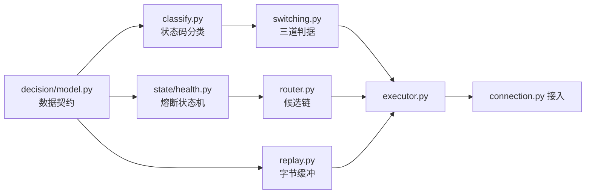

# MIGRATION.md - 从现有实现到目标形态的重构路径

| 版本 | 日期 | 变更说明 | 作者 |
| :--- | :--- | :--- | :--- |
| v2.1.0 | 2026-08-16 | M5 实现完成：§7.2 回填实际落地的文件（新增 `storage/rules_store.py`，`rules.db` 不进 `StorageService`）并标注状态，§7.4 标注 27 条验收状态与变异验证，新增 §7.5 实现偏差与 §7.6 测试 | Agent |
| v1.0.0 | 2026-08-13 | 初始版本：现状差距分析、M1–M4 的文件级改动与验收点、需求待确认清单、架构约束的自动化守护 | Agent |
| v1.1.0 | 2026-08-13 | §2 三项待确认事项全部定案并回写需求文档，改写为决策记录；M1 补充 TOML 加载与未知键检查的验收点；§6.2 架构测试补充 `tomlkit` import 边界 | Agent |
| v1.2.0 | 2026-08-14 | M1 实现完成：§3.1 回填实际落地的文件（`tunnel.py` 改为 `relay.py`、新增 `body.py` 与 `contracts.py`），§3.3 标注验收状态与对应测试，新增 §3.4 实现过程中发现的偏差 | Agent |
| v1.3.0 | 2026-08-14 | M2 实现完成：§4.1 标注实现状态并补 `connector.py` 改动，§4.3 标注 20 条验收状态与变异验证，新增 §4.4 实现偏差 | Agent |
| v1.4.0 | 2026-08-14 | M3 实现完成：§5.1 回填实际落地的文件（新增 `storage/service.py`、`persistence.py`），§5.3 标注 18 条验收状态与变异验证，新增 §5.4 实现偏差与 §5.5 M2 验收点的语义调整 | Agent |
| v1.4.1 | 2026-08-14 | §6.2 记录 M3 提前启用的两条架构守护（唯一写者、只读连接）及其变异验证结论 | Agent |
| v1.6.0 | 2026-08-14 | 新增 §6.4 M4 切片推进（五片划分）与切片 a 的改动、实现偏差、测试；§6.2 增补两条 Web 架构守护及其变异验证 | Agent |
| v1.5.0 | 2026-08-14 | 新增 §5.6 长跑观测：`storage/metrics.py`、`StorageService.metrics()`、队列水位峰值与周期上报的分级判据 | Agent |
| v2.0.0 | 2026-08-15 | 新增 §7 M5 规则系统重构（三处语义变更、18 步文件级改动、三处最易漏之处、27 条验收点）；M3-10 / M3-11 标注为已废止并说明原因；原 §7、§8 顺延为 §8、§9，质量门禁补「废止的验收点须标注」 | Agent |
| v1.10.0 | 2026-08-15 | M4 切片 e 完成（M4 收尾）：§6.4 切片表标记 e 已完成，新增 §6.4.12 ~ §6.4.14。要点：静态资源改挂 `/static`（挂 `/` 会遮蔽其后注册的全部路由）、深链接走白名单、转义靠 `dom.js` 单一入口 + 属性禁列、M4-09 用「无 HTML 汇点 + 服务端原样返回」两条可验证事实支撑、`package-data` 的 `fnmatch` 假断言 | Agent |
| v1.9.0 | 2026-08-15 | M4 切片 d 完成：§6.4 切片表标记 d 已完成，新增 §6.4.9 ~ §6.4.11（改动、实现偏差与测试）。偏差要点：`tomlkit` 增删表会让注释错位故改走行区间、写入接口收 `Transform` 以保证基线在锁内读、生效改用 `Application.reload()`、备份按 mtime 排序、设置更新逐字段列白名单 | Agent |
| v1.8.0 | 2026-08-15 | M4 切片 c 完成：§6.4 切片表调整（出口增删改与 M4-14 随 `config_writer` 移入切片 d），新增 §6.4.6 ~ §6.4.8 改动、偏差与测试 | Agent |
| v1.7.0 | 2026-08-14 | M4 切片 b 完成：§6.4 状态更新，新增 §6.4.4 改动与偏差（熔断重置改用 `clear_circuit`、延迟统计列为待办、M4-08 判据改为「重叠」）与 §6.4.5 测试；§6.2 增补 `to_thread` 边界守卫 | Agent |

**对应需求**：[PRD §1.2](../requirements/PRD_OVERVIEW.md) 实施路线图

---

## 1. 现状与目标的差距

现有代码 456 行，实现的是一个**只能直连**的最小代理：

| 文件 | 行数 | 现状 | 目标形态中的去向 |
|------|------|------|------------------|
| `cli.py` | 77 | `--host` / `--port` / `--log-level` | 扩展为配置文件驱动，新增 `--config`、`--no-web` 等 |
| `server.py` | 45 | `loop.create_server` + 生命周期 | 拆分为 `app.py`（编排）与 `protocol/server.py`（监听与限流） |
| `handler.py` | 275 | `asyncio.Protocol`，直连转发 | **完全重写**为 `protocol/` 包，改用 Streams |
| `tests/test_handler.py` | 55 | 基础解析测试 | 保留并大幅扩充 |

缺失的能力：上级代理、路由决策、切换、粘性、规则、存储、Web 界面、地址族处理、资源限制。

### 1.1 现有代码中必须修掉的问题

重构过程中会自然消除，但值得单独列出以免遗漏：

| 问题 | 位置 | 后果 |
|------|------|------|
| 错误响应回显目标地址 | `handler._send_error(502, f"cannot connect to {host}:{port}")` | 信息泄露模式，见 [DD_PROXY §9](./DD_PROXY.md) |
| 无请求头长度限制 | `_is_header_complete` 无限累积 `bytearray` | 单连接可耗尽内存 |
| 无并发连接数限制 | `server.py` | 资源耗尽 |
| 不移除逐跳头部 | `_build_outgoing_request` 只删了 `proxy-connection` | 违反 RFC 9110 §7.6.1 |
| `Proxy-Authorization` 被透传 | 同上 | 凭据泄露给目标 |
| 中继无背压 | `relay_from_remote` 直接 `write`，无 `drain` | 慢客户端下载大文件时内存爆涨 |
| IPv6 目标解析错误 | `_resolve_target` 用 `rsplit(":", 1)` | `[2001:db8::1]:443` 被解析为 host=`[2001:db8::1]`（带方括号） |
| `create_task` 无强引用 | `data_received` 中 `self._loop.create_task(...)` | Task 可能被 GC 回收，表现为随机连接中断 |

最后一条尤其隐蔽：`_dispatch` 的 Task 没有被任何变量持有，事件循环只保有弱引用。在高负载下可能出现请求处理到一半突然消失，且无任何错误日志。

---

## 2. 设计推演引出的三项需求修订（已定案）

设计过程中发现三处与需求文档不一致。**这些不是设计疏漏，而是设计推演揭示的需求问题**。三项均已于 2026-08-13 定案并回写需求文档，此处保留决策记录与理由，供后续追溯。

### 2.1 配置格式改为 TOML（原为 YAML）

| 项 | 内容 |
|----|------|
| 原需求 | [PRD §4.8](../requirements/PRD_OVERVIEW.md) 把 `pyyaml` 列为 Web extra，而配置是 YAML |
| 矛盾 | `--no-web` 时仍需读配置，代理核心因此不得不依赖 `pyyaml`，「零第三方运行时依赖」不成立 |
| **定案** | **配置格式改为 TOML**。读用标准库 `tomllib`，写用 `tomlkit`（`[web]` extra） |

`tomllib` 只有 `load` / `loads`，没有写入能力。这个「读是标准库、写要第三方」的不对称恰好与项目的依赖边界重合——代理核心只读配置，只有 Web 界面写回。选 TOML 后不必削弱任何约束就能达成目标。

附带解决了另一个问题：`tomlkit` 是风格保留型库，Web 写回能保住用户的注释。`pyyaml` 的 `safe_load` / `safe_dump` 往返会丢弃全部注释，原设计只能靠「提前提示 + 备份」兜底（见 DD_WEB v1.0.0 §6.2，已作废）。

**为何在此时切换**：切换成本随时间单调上升。现在改只需重写文档中的配置示例；一旦实现并有用户在用，就成了需要迁移工具的破坏性变更。

代价是 TOML 的表头陷阱（`[[upstreams]]` 之后的裸键归属该表），用「拒绝未知键」的校验兜住。

详见 [PRD §4.2.1b](../requirements/PRD_OVERVIEW.md)、[DD_CONFIG §1.1](./DD_CONFIG.md)、[DD_WEB §6.2](./DD_WEB.md)。

### 2.2 规则指向不可用出口：拆分条件（原为一律拒绝启动）

| 项 | 内容 |
|----|------|
| 原需求 | [RULES §4.4](../requirements/RULES_CONFIG.md)：规则指定的出口被禁用 → 启动/重载校验失败并报错 |
| 问题 | 该表述把「名字写错」与「用户主动禁用」混为一谈，而后者是常见的运维操作 |
| **定案** | **拆分为两个条件**：目标不存在 → 拒绝启动；目标已禁用 → 告警 + 持续可见 |

这不是「降级」，真正危险的那一类（拼写错误）保持拒绝启动。放行的只有「用户明知故犯」的那一类：临时禁用排查、计划维护、一份配置多环境。这些场景中用户不会同时改规则文件，因为 `enabled` 是高频运维开关而规则是低频的意图声明。

告警必须是**持续状态**（`GET /api/status` + Web 常驻横幅），不是一行滚走的启动日志，否则降级的风险（用户没注意到）会真实发生。

熔断与负面记忆属于运行时推断，规则命中时**不检查**——因系统推断拒绝执行用户的明确指令，会让用户认为规则失效了。

详见 [RULES §4.4.1](../requirements/RULES_CONFIG.md)、[DD_CONFIG §4.2](./DD_CONFIG.md)。

### 2.3 manual 粘性不因失败清除（原未区分 source）

| 项 | 内容 |
|----|------|
| 原需求 | [PRD §4.6](../requirements/PRD_OVERVIEW.md) 规则 2 未区分 `source`，字面理解为 `manual` 也会被清除 |
| **定案** | **`manual` 不清除**，且需求补充 §4.6.1 明确「粘性是偏好、规则才是硬约束」 |

`auto` 粘性是对「上次哪个出口能用」的**缓存**，反复失败说明缓存过时，作废重学是标准的缓存失效。`manual` 粘性是用户的**声明**，其中没有任何「学来的东西」，也就不存在需要失效的内容。

「不清除会不会一直撞死掉的出口」——不会，`(host, upstream)` 负面记忆已在候选链构造阶段跳过该组合并带 TTL 自动恢复。清除粘性不产生额外收益，只丢失用户意图。

顺带修正了需求的一处表述缺失：manual 粘性是**偏好**不是**硬绑定**，失败时仍会切换到其他出口。需要「只能走某个出口」的用户必须写规则。这一点若不写明，用户会拿手动绑定当强制路由用，并在故障时得到意料之外的行为（例如内网流量转到外部代理）。

详见 [PRD §4.6.1](../requirements/PRD_OVERVIEW.md)、[DD_ROUTING §7.2b](./DD_ROUTING.md)。

---

## 3. M1 可用代理

**目标**：能作为浏览器代理正常上网，支持 HTTP 与 CONNECT，可配置多个上级代理但只用第一个。

对应 [PRD](../requirements/PRD_OVERVIEW.md) G-01、G-02。

### 3.1 改动

| 操作 | 文件 | 说明 |
|------|------|------|
| 操作 | 文件 | 说明 | 状态 |
|------|------|------|------|
| 新增 | `config/model.py`、`loader.py`、`validate.py` | 完整实现（不分阶段），后续里程碑只加字段 | 已完成 |
| 新增 | `contracts.py` | 跨层数据契约（`Method`、`Headers`、`RequestTarget`、`FailureKind`） | 已完成（计划外，见 §3.4） |
| 新增 | `protocol/parse.py` | 请求解析、host 规范化、IPv6 方括号处理 | 已完成 |
| 新增 | `protocol/body.py` | 请求体边界判定、请求走私防护 | 已完成（计划外，见 §3.4） |
| 新增 | `protocol/connection.py` | `ClientConnection`，Streams 实现 | 已完成 |
| 新增 | `protocol/server.py` | 监听 + 连接数限制 | 已完成 |
| 新增 | `protocol/relay.py` | `pump` 背压中继 + CONNECT 双向中继 | 已完成（原名 `tunnel.py`，见 §3.4） |
| 新增 | `egress/connector.py` | 出口连接（`direct` + 单个上级代理） | 已完成 |
| 新增 | `egress/capability.py` | IPv6 出口能力探测 | 已完成（原属 M2，校验层需要） |
| 新增 | `app.py` | 生命周期编排 | 已完成 |
| 重写 | `cli.py` | 配置文件驱动 | 已完成 |
| 删除 | `handler.py` | 能力迁入 `protocol/` | 已完成 |
| 删除 | `server.py` | 拆分到 `app.py` 与 `protocol/server.py` | 已完成 |

### 3.2 为何配置模块一次做完

配置的字段会随里程碑增加，但**加载、校验、快照、热重载的机制**从 M1 就需要完整。分阶段实现会导致 M2 时要把「读取单个值」改造成「不可变快照 + 引用替换」，而此时已有代码依赖旧接口。机制先行、字段渐增的成本最低。

### 3.3 验收点

全部验收点由 `tests/test_m1_acceptance.py` 逐条守护，编号一一对应。

| 编号 | 场景 | 期望 | 状态 |
|------|------|------|------|
| M1-01 | 浏览器代理指向 `127.0.0.1:6060` | 正常浏览 HTTP 与 HTTPS 站点 | 通过（另经 `curl` 访问真实站点确认） |
| M1-02 | `CONNECT [2001:db8::1]:443` | 正常解析 | 通过 |
| M1-03 | `CONNECT 2001:db8::1:443` | `400` + 方括号提示 | 通过 |
| M1-04 | `listen.host: "::1"` | 启动被拒绝 | 通过 |
| M1-05 | 请求头 100KB | `431` | 通过 |
| M1-06 | 1001 个并发连接 | 第 1001 个收到 `503` | 通过（用 `max_client_connections = 3` 等价验证） |
| M1-07 | 慢客户端下载 1GB | 内存不随下载量增长 | 通过（96MB 下载，客户端停读，RSS 增长 < 16MB） |
| M1-08 | `Proxy-Authorization` 头 | 不转发、不入日志 | 通过 |
| M1-09 | 大文件下载 20 分钟 | 不被超时中断 | 通过（间隔均超 `read_timeout` 的分段传输） |
| M1-10 | `SIGTERM` | 活跃连接优雅完成后退出 | 通过（另经真实进程发信号确认） |
| M1-11 | 错误响应体 | 不含目标地址、堆栈、路径 | 通过（另有 AST 守护禁止拼接消息） |
| M1-12 | `config.toml` 语法错误 | 拒绝启动，报出文件名与行列号 | 通过 |
| M1-13 | 配置含未知键 | 拒绝启动，`E_UNKNOWN_KEY` + 最接近的合法键名建议 | 通过 |
| M1-14 | `sticky_fail_threshold` 误写在 `[[upstreams]]` 表下 | 拒绝启动，提示该项属于 `[routing]` | 通过 |
| M1-15 | 未安装 `tomlkit` 时启动 | 正常（读路径只用标准库 `tomllib`） | 通过（子进程屏蔽全部 Web 依赖后导入核心） |

**M1 结束时系统必须可用**：能替代现有实现日常使用，且没有已知的内存泄漏与资源耗尽路径。

M1-07 与 M1-11 的断言做过变异验证：删掉 `pump` 中的 `await dst.drain()` 后，M1-07 的 RSS 检查与 `test_stalled_destination_bounds_the_write_buffer` 均会失败（写缓冲涨到 29MB）。没有这一步，「内存不增长」这类断言很容易写成永真式。

### 3.4 实现过程中与设计的偏差

| 项 | 设计原文 | 实际实现 | 理由 |
|----|----------|----------|------|
| 中继模块命名 | `protocol/tunnel.py` | `protocol/relay.py` | `pump` 同时服务于 HTTP 响应体转发与 CONNECT 隧道，放在名为 `tunnel` 的模块里会让 HTTP 路径反过来依赖「隧道」 |
| 跨层类型位置 | 未指定 | 新增顶层 `contracts.py` | 决策层禁止导入 `protocol`，而 `RequestTarget` 两边都要用；放在任一层都会形成反向依赖 |
| 请求体处理 | 散见于 §3.5 表格 | 独立的 `protocol/body.py` | 请求走私防护是安全边界，独立成模块便于集中测试与审查 |
| IPv6 能力探测 | 列在 M2 | M1 即实现 | `validate()` 的 `W_UPSTREAM_IPV6` 检查需要它，否则 M1 的启动校验不完整 |
| 关停流程 | `close()` 后 `wait_closed()` | 先排空活跃连接，再 `wait_closed()` | Python 3.12.1 起 `Server.wait_closed()` 会一直等到所有连接处理完毕，按原顺序写会让 `drain_timeout` 完全失效（关停直接挂死） |

---

## 4. M2 自动切换

**目标**：出口故障时按优先级自动切换，同优先级轮询，`direct` 不会因个别站点被阻断而整体熔断。

对应 G-03、G-07。这是产品核心价值所在的里程碑。

### 4.1 改动

| 操作 | 文件 | 说明 | 状态 |
|------|------|------|------|
| 新增 | `decision/model.py` | 跨层数据契约 | 已实现 |
| 新增 | `decision/router.py` | 候选链构造（无粘性、无规则） | 已实现 |
| 新增 | `decision/switching.py` | 三道判据 | 已实现 |
| 新增 | `decision/classify.py` | 状态码分类、来源判定 | 已实现 |
| 新增 | `decision/limiter.py` | 切换频率限流 | 已实现 |
| 新增 | `state/health.py` | 健康与熔断状态机 | 已实现 |
| 新增 | `state/memory.py` | 路由级负面记忆（内存，不落盘） | 已实现 |
| 新增 | `state/runtime.py` | 状态聚合 + 轮询游标 | 已实现 |
| 新增 | `egress/executor.py` | 候选链驱动 | 已实现 |
| 新增 | `egress/capability.py` | IPv6 出口能力探测 | M1 已提前实现（见 §3.4） |
| 新增 | `protocol/replay.py` | 请求字节重放缓冲 | 已实现 |
| 修改 | `protocol/connection.py` | 接入决策与执行 | 已实现 |
| 修改 | `egress/connector.py` | Happy Eyeballs；失败归类按连接对象区分 | 已实现（见 §4.4） |

### 4.2 实现顺序

严格按依赖关系，每步都可独立测试：



`classify.py`、`health.py`、`router.py`、`switching.py`、`replay.py` **全部是纯逻辑，无 I/O**，可以在没有任何网络代码的情况下写完并测透。这是分层设计的直接收益：M2 的绝大部分复杂度可以用普通单元测试覆盖，不需要搭建代理环境。

### 4.3 验收点

全部验收点由 `tests/test_m2_acceptance.py` 逐条守护，编号一一对应。判据与状态机的分支细节另由各模块单元测试覆盖；验收测试走真实套接字，只验证端到端可观察的行为。

| 编号 | 场景 | 期望 | 状态 |
|------|------|------|------|
| M2-01 | 首个出口 TCP 连不上 | 自动切换到下一个，客户端无感知 | 通过 |
| M2-02 | 同优先级两出口 | 连续请求交替作为链首 | 通过 |
| M2-03 | 目标返回 `404` | 不切换 | 通过 |
| M2-04 | 目标返回 `500` | 不切换 | 通过 |
| M2-05 | CF 返回 `521` | 不切换，不计失败 | 通过 |
| M2-06 | 用户把 `521` 加进 `switch_on_status` | 仍不切换 | 通过 |
| M2-07 | CONNECT 收到 `503` | 判为代理侧，切换 | 通过 |
| M2-08 | HTTP `503` + `Server: nginx` | 判为目标侧，不切换 | 通过 |
| M2-09 | POST 已发出后 `503` | **不切换**，但记 `route_error` | 通过 |
| M2-10 | 请求体 100KB 后失败 | 不切换（不可重放） | 通过 |
| M2-11 | 上级代理连续 5 次 TCP 失败 | 熔断 | 通过（暴露了归类缺陷，见 §4.4） |
| M2-12 | `direct` 连续失败 20 次 | **不熔断** | 通过 |
| M2-13 | `half_open` 期间 10 个并发 | 仅 1 个探测 | 通过 |
| M2-14 | 同 host 60 秒内第 11 次状态码切换 | 被限流 | 通过（配额计数口径见 §4.4） |
| M2-15 | 同 host 第 11 次传输层失败 | 仍切换 | 通过 |
| M2-16 | 纯 IPv6 目标 + 无 IPv6 能力 | 跳过 `direct`，不记失败 | 通过 |
| M2-17 | 双栈目标 + IPv6 黑洞 | Happy Eyeballs 回落 IPv4 | 通过（以 `localhost` 双栈解析等价验证） |
| M2-18 | CONNECT 抢跑的 ClientHello | 缓存并重放，握手成功 | 通过 |
| M2-19 | 隧道 3 秒内关闭且上游零字节 | 记 `route_error` | 通过（另有反例：上游回过字节即不算早夭） |
| M2-20 | 候选链耗尽的响应体 | 不含出口名、地址、失败原因、链长 | 通过 |

M2-12 是最关键的一条：它验证了失败归类机制真正生效。若归类有误，用户访问一批被墙站点后内网也会不可访问——这是功能性事故。

M2-18 的断言做过变异验证：在候选链执行前插入一次 `self._reader.read()`（模拟「握手前顺手读一下客户端」这类改动）后该测试失败。抢跑字节的正确性完全依赖「隧道建立前从不读取客户端」这条不变式，而它是一条**缺省行为**——没有任何代码显式表达它，只能靠测试守住。

### 4.4 实现过程中与设计的偏差

| 项 | 设计原文 | 实际实现 | 理由 |
|----|----------|----------|------|
| 传输层失败归类 | `classify_transport(exc, ctx)`，`ctx` 未定义 | `classify_transport(exc, *, is_direct)` | 连接对象是归类的唯一依据：`direct` 连的是目标（`route_error`），上级代理连的是代理自己（`upstream_error`）。只看 errno 会把死掉的上级代理记成路由问题，熔断永不打开（见 [DD_PROXY §7.2](DD_PROXY.md)） |
| 限流配额口径 | 「配额在判定通过时消耗」 | 同上，且**与候选链剩余长度无关** | 判据是纯函数，不知道链上还剩几个出口。候选链末位的失败同样消耗配额——它确实判定为应切换，只是无处可切 |
| 单次尝试的注入方式 | 未指定 | `executor.execute()` 接收 `attempt` / `discard` 回调 | `egress` 不得依赖 `protocol`。回调注入同时让执行层的控制流可以在零网络的条件下测透 |

---

## 5. M3 记忆与规则

**目标**：粘性复用生效且重启后保留，规则文件强制路由生效。

对应 G-04、G-05、G-06。

### 5.1 改动

| 操作 | 文件 | 说明 | 状态 |
|------|------|------|------|
| 新增 | `storage/schema.py` | DDL 与迁移 | 已完成 |
| 新增 | `storage/queue.py` | 有界队列 + 分级丢弃 + `WriteSink` 协议 | 已完成 |
| 新增 | `storage/writer.py` | 唯一写者线程 + 批量合并 | 已完成 |
| 新增 | `storage/reader.py` | 只读连接池 + 启动回填 | 已完成 |
| 新增 | `storage/retention.py` | 日志清理 | 已完成 |
| 新增 | `storage/service.py` | 存储子系统门面（队列 + 写者线程 + 只读池） | 已完成，设计外新增，见 §5.4 |
| 新增 | `storage/metrics.py` | `StorageMetrics` 契约 + `MetricsReporter` 周期上报 | 已完成，见 §5.6 |
| 新增 | `persistence.py` | 内存状态与磁盘的粘合层：回填装配 + 健康计数周期落盘 | 已完成，设计外新增，见 §5.4 |
| 新增 | `state/sticky.py` | 粘性 LRU | 已完成 |
| 新增 | `rules/model.py`、`parser.py`、`matcher.py` | 规则引擎 | 已完成 |
| 修改 | `state/memory.py` | `clear()` 返回是否有变化、新增 `restore()` | 已完成 |
| 修改 | `state/health.py` | 新增 `restore_counters()`（不含熔断状态） | 已完成 |
| 修改 | `state/runtime.py` | 持有 `sticky`，热重载时按新配置调整容量并丢弃指向已删出口的绑定 | 已完成 |
| 修改 | `decision/router.py` | 接入粘性前置与规则强制路由 | 已完成 |
| 修改 | `egress/executor.py` | 记录粘性、把状态变更入队落盘 | 已完成 |
| 修改 | `protocol/server.py`、`app.py` | 装配存储、启动回填、关停排空 | 已完成 |

### 5.2 两条并行线

存储与规则**互不依赖**，可并行开发：

| 线 | 内容 | 依赖 |
|----|------|------|
| 存储线 | `storage/` + `state/sticky.py` + 回填 | M2 的 `state/` |
| 规则线 | `rules/` + `router` 的规则分支 | M2 的 `router` |

规则引擎完全不碰数据库（规则命中不写粘性），这是 [PRD §4.4.4](../requirements/PRD_OVERVIEW.md) 的直接结果，也让并行开发成为可能。

### 5.3 验收点

全部验收点见 [tests/test_m3_acceptance.py](../../tests/test_m3_acceptance.py)，编号一一对应。

| 编号 | 场景 | 期望 | 状态 |
|------|------|------|------|
| M3-01 | 某 host 成功后再次访问 | 直接使用上次成功的出口 | 通过 |
| M3-02 | 重启后 | 粘性映射被回填 | 通过 |
| M3-03 | 重启后熔断状态 | 一律 `closed`，不回填 | 通过（累计计数照常回填） |
| M3-04 | 4 个并发协程各触发 500 次计数自增 | 数据库最终值 2000，无丢失 | 通过 |
| M3-05 | 自动成功 + 已有 manual 绑定 | 绑定不被覆盖 | 通过（内存与库两侧各自断言） |
| M3-06 | 队列写满后继续写日志 | 丢弃并计数，事件循环不阻塞 | 通过 |
| M3-07 | 队列写满后写粘性变更 | 接受 | 通过（与 M3-06 合为一例，见 §5.4） |
| M3-08 | `SIGTERM` | 队列排空后才关库 | 通过 |
| M3-09 | 磁盘满 | 记 `ERROR`，代理继续服务 | 通过（以删表等价制造批次失败） |
| M3-10 | `*` 与 `.github.com` 同时匹配 | 后者胜（last match wins） | 通过，**M5 已废止** |
| M3-11 | `default.rules` 与 `user.rules` | 后加载的文件优先 | 通过，**M5 已废止** |
| M3-12 | `.example.com` 对 `notexample.com` | 不匹配 | 通过，M5 改写法为 `*.example.com` |
| M3-13 | 规则命中 | 不切换、不读写粘性 | 通过 |
| M3-14 | 规则命中被禁用出口 | `502` + 规则行号 | 通过（并断言响应体不含出口名），M5 改为规则序号 |
| M3-15 | 规则指向纯 IPv6 目标 + `direct` + 无能力 | `502` + `ipv6_unavailable` + 行号 | 通过（并断言不写负面记忆），M5 改为规则序号 |
| M3-16 | `[2001:0db8::1]` 规则 vs `[2001:db8::1]` 目标 | 规范化后匹配 | 通过 |
| M3-17 | 热重载时规则语法错误 | 保留旧规则集，代理继续工作 | 通过 |
| M3-18 | 日志超过保留策略 | 被清理 | 通过 |

> **M3-10 与 M3-11 已被 M5 废止**（§7）。M5 把顺序语义从 last-match-wins 改为 first-match-wins，M3-10 的期望结果整个反转；规则不再分文件，M3-11 的前置条件不复存在。两条记录保留在此作为语义变更的历史依据，**不是**当前的验收标准。

M3-04 直接对应实测中丢失 75% 更新的场景，是 `BEGIN IMMEDIATE` + SQL 侧自增的回归防护。

三条关键断言做了变异验证——「记住了」「没丢」这类断言若不验证，很可能在被测逻辑整段删掉后仍然通过：

| 变异 | 期望被抓住 | 结果 |
|------|-----------|------|
| `_apply_sticky` 恒不前置 | M3-01、M3-02 | 两条均失败 |
| `record_success` 去掉 `manual` 分支 | M3-05 | 失败（内存侧与 executor 侧各一条） |
| `stop()` 不调用 `queue.interrupt()` | M3-08 | 失败（写者线程等满 `flush_interval_ms`，日志给出「未能在 10.0s 内退出」） |

第三条同时暴露了一个真实缺陷，见 §5.4。

### 5.4 实现过程中与设计的偏差

| 项 | 设计原文 | 实际实现 | 理由 |
|----|----------|----------|------|
| 存储子系统的装配 | 未指定 | 新增 `storage/service.py` 的 `StorageService` | 队列、写者线程、两个只读池散在 `app.py` 手上，早晚会出现第二个写者。把「唯一写者」收进一个对象里，越界就是显式的 |
| 内存与磁盘的粘合 | 未指定 | 新增顶层 `persistence.py` | 回填要同时理解 `state` 与 `storage`，而两层各自都不该知道对方（`state` 禁止 I/O，`storage` 不该理解路由语义）。放在 `app` 之下的顶层模块 |
| 关停唤醒 | 「进程关闭：排空队列后才关库」 | 新增 `WriteQueue.interrupt()`，`stop()` 先唤醒再 `join` | 写者阻塞在 `drain(timeout=flush_interval_ms)` 上，而写者线程不是 daemon。`flush_interval_ms` 配到几分钟时，进程退出会被拖住同样久——实测把整个测试套件从 8s 拖到超过 300s |
| `memory.clear()` | 返回 `None` | 返回 `bool` | 只有真清掉了才入队 `route_block_delete`。无条件发 DELETE 会让写入量与请求量同数量级，而绝大多数成功请求本来就没有负面记忆 |
| 粘性失败阈值参数 | `record_failure(host, threshold)` | `record_failure(host, *, threshold)` | 强制关键字：`threshold` 与 `host` 都可能被误传，位置参数出错时不报错，只是行为不对 |
| 回填字段 | 只读 `fail_count`、`hit_count` | 另读 `last_success_at` 并转成 monotonic | 回填后的条目若 `last_used_at` 为 0，LRU 会把刚回填的绑定当成最旧的先淘汰 |
| M3-06 与 M3-07 | 两条独立验收 | 合并为一个测试 | 两者是同一个分级丢弃策略的两面：同一个满队列上，日志被拒、粘性被收。分开写要构造两次相同的前置状态，而「同时」才是要守的性质 |
| 健康计数落盘 | 「事件循环侧的后台任务，每 5 秒扫描」 | `persistence.HealthPersister`，由 `app` 起 task | 与设计一致，仅明确了落点。增量基线放在 persister 内部，因此从不需要读库 |

### 5.5 M2 验收点的语义调整

M3-01 与 M2-02 直接冲突：M2-02 断言「同优先级两出口，连续请求交替作为链首」，用的是同一个 host 连发 4 次。粘性生效后，同一 host 的第二次访问必然沿用上次成功的出口，轮询在**单 host 维度上消失**了。

这不是回归：轮询的语义本就是「新目标在组内均摊」，而不是「同一目标来回换出口」——后者会让每个目标都反复踩一遍未知出口的坑，与粘性的存在理由直接矛盾。M2-02 已改为 4 个不同 host，断言两个出口各承接 2 个，轮询语义得到保留。

另有一处测试基础设施缺陷在 M3 集成时暴露：`database.state_path` 默认为 `~/.r-proxy/state.db`，而验收测试的配置里原本不写 `[database]`。M3 之前没有任何测试碰数据库，因此无人察觉；M3 一接入存储，所有启动 `Application` 的测试就共用了同一个真实状态库，上一个测试学到的粘性映射会改变下一个测试的路由结果（实测 5 条 M2 验收点因此失败）。对策是 `tests/conftest.py` 的自动夹具把 `$HOME` 指向每个测试独有的临时目录，同时验收测试显式配置库路径以便查询。

### 5.6 长跑观测（M3 收尾补齐）

M3 落地后，写者线程的计数只存在于内存里，没有任何出口——`WriterMetrics` 是活的，但没有第二个人读它。这在 M4 之前是个真空期：**代理已经开始长期后台运行，而唯一能发现存储异常的手段是重启后发现状态丢了**。

补齐的内容见 [DD_STORAGE §8](./DD_STORAGE.md)：

| 改动 | 文件 | 说明 |
|------|------|------|
| 新增 | `storage/metrics.py` | `StorageMetrics` 不可变契约 + `MetricsReporter` 周期上报 |
| 新增 | `StorageService.metrics()` | 汇总队列与写者两侧的计数为一份截面 |
| 新增 | `WriteQueue.high_water` | 历史最高水位 |
| 修改 | `app.py` | 后台任务从单个 `_health_task` 改为 `_background` 列表，起 `MetricsReporter` |
| 修改 | `StorageService.stop()` | 关停时记一行累计总账 |

设计取舍集中在「什么时候**不**记日志」：

- 空闲周期完全不记录。本地代理会连续跑几个月，每周期一行等于把日志填满无信息量的行
- 只报增量。累计值非零会让同一次磁盘故障在之后每个周期重复报一次，把真正的新故障埋掉
- 判定卡死时抑制吞吐摘要。卡死状态下的吞吐数字没有意义，且会把告警挤出视野

写者卡死的判定必须由**外部观察者**做：卡死的线程自己什么都报不出来，`last_flush_at` 停止前进是它唯一留下的痕迹。判据是「队列有积压且整个采样周期内没有落盘」。

变异验证三条：

| 变异 | 期望被抓住 | 结果 |
|------|-----------|------|
| `_writer_looks_stalled` 恒返回 `False` | 卡死告警、摘要抑制 | 两条均失败 |
| 卡死基线去掉 `or self._started_at` | 「从未落盘」不应误报 | 失败（启动后第一个周期只要有积压就误报） |
| `high_water` 不更新 | 峰值跨排空保留 | 失败 |

`queue_high_water` 在 `put` **成功之后**更新，被丢弃的操作不抬高水位——否则「队列满」本身会污染「队列有多满」这个读数。

---

## 6. M4 管理界面

**目标**：浏览器中完成监控与全部配置管理。

对应 G-08。

### 6.1 改动

| 操作 | 文件 |
|------|------|
| 新增 | `web/__init__.py`、`app.py`、`deps.py`、`schemas.py`、`errors.py` |
| 新增 | `web/queries.py`、`config_writer.py` |
| 新增 | `web/routers/status.py`、`upstreams.py`、`sticky.py`、`rules.py`、`settings.py` |
| 新增 | `web/static/` |
| 修改 | `pyproject.toml` | 增加 `[web]` extra |
| 修改 | `app.py` | 接入 Web 启动与崩溃隔离 |

### 6.2 架构约束的自动化守护

M4 是最容易破坏架构约束的阶段——Web 需要读取几乎所有状态，很容易顺手加一条直连数据库的写入或一个同步查询。用测试守住：

```python
# tests/test_architecture.py

def test_decision_layer_has_no_io_imports():
    """决策层不得导入 I/O 相关模块。"""
    forbidden = {"sqlite3", "socket", "r_proxy.storage",
                 "r_proxy.protocol", "r_proxy.egress"}
    for module in _iter_modules("r_proxy/decision"):
        assert not (_imports_of(module) & forbidden), module


def test_web_never_opens_write_connection():
    """Web 层的所有 sqlite3.connect 必须带 mode=ro。"""
    for module in _iter_modules("r_proxy/web"):
        for call in _find_calls(module, "sqlite3.connect"):
            assert "mode=ro" in _source_of(call), module


def test_web_queries_always_via_to_thread():
    """routers/ 中不得直接调用 queries.* ，必须经 to_thread。"""
    for module in _iter_modules("r_proxy/web/routers"):
        for call in _find_calls(module, prefix="queries."):
            assert _is_inside_to_thread(call), f"{module}: {call}"


def test_core_imports_without_web_deps(monkeypatch):
    """代理核心在缺少全部 Web 依赖时可正常导入并读配置。"""
    for mod in ("fastapi", "uvicorn", "tomlkit"):
        monkeypatch.setitem(sys.modules, mod, None)
    importlib.import_module("r_proxy.protocol.server")
    importlib.import_module("r_proxy.decision.router")
    importlib.import_module("r_proxy.storage.writer")
    importlib.import_module("r_proxy.config.loader")


def test_config_package_never_imports_tomlkit():
    """配置读路径只用标准库 tomllib；tomlkit 属于 [web] extra。"""
    for module in _iter_modules("r_proxy/config"):
        assert "tomlkit" not in _imports_of(module), module


def test_no_inner_html_in_frontend():
    """前端禁用 innerHTML。"""
    for js in Path("r_proxy/web/static").rglob("*.js"):
        assert "innerHTML" not in js.read_text(), js
```

这些测试从 M1 就开始写（此时只有前两条适用），随里程碑逐步启用。架构约束靠人工审查守不住——它们会在赶进度时第一个被牺牲。

M3 落地存储层后，[tests/test_architecture.py](../../tests/test_architecture.py) 增补两条：

| 守护 | 约束 | 备注 |
|------|------|------|
| `test_write_connections_are_opened_only_by_the_writer` | `schema.open_write` 只允许 `storage/writer.py` 调用 | 遍历范围必须含 `app.py`、`persistence.py` 等**顶层**模块：按包遍历会漏掉它们，而装配代码正好都在那里——第二个写者最可能出现在 `app.py` |
| `test_readers_never_open_a_writable_connection` | `reader.py` 的每个 `sqlite3.connect` 都带 `mode=ro` | 是 §6.2 中 Web 版检查的核心版前身；Web 落地后同一条约束扩展到 `r_proxy/web` |

同时把 `state` 包的禁止导入扩到 `sqlite3` 与 `r_proxy.storage`：内存权威状态自己不落盘，落盘一律经写者线程。

第一条的遍历范围是变异验证补出来的：初版只扫 `CORE_PACKAGES`，在 `app.py` 里塞进 `open_write` 仍然通过——守护测试守的正好是它唯一漏掉的地方。

M4 切片 a 落地 `r_proxy/web/` 后再增补两条：

| 守护 | 约束 | 变异验证 |
|------|------|----------|
| `test_web_dependencies_are_confined_to_the_web_package` | `fastapi` / `uvicorn` / `tomlkit` 只出现在 `r_proxy/web/` | 在 `cli.py` 里 `import uvicorn` → 失败 |
| `test_the_web_package_has_exactly_one_import_point` | `r_proxy.web` 只允许 `app.py` 导入 | 在 `persistence.py` 里 `from r_proxy import web` → 失败 |

第一条是 `CORE_PACKAGES` 检查的补集：按包遍历漏掉 `app.py` 与 `cli.py`，而它们正是最容易顺手 `import uvicorn` 的地方——一旦漏进去，`--no-web` 形态在没装 fastapi 的机器上直接崩。变异点因此故意放在 `cli.py`，不放在某个已被覆盖的子包里。

切片 b 再增补一条：

| 守护 | 约束 | 变异验证 |
|------|------|----------|
| `test_web_queries_are_reached_only_through_to_thread` | `r_proxy/web/` 下（除 `queries.py` 自身）每个 `queries.X` 引用都必须是 `to_thread` 的实参 | 把 `list_logs` 里的 `to_thread` 换成直接调用 → 失败；`test_the_to_thread_guard_actually_catches_a_direct_call` 另用三个代码片段护住守卫自身 |

这一条守的是**没有直接症状**的错误：漏掉 `to_thread` 的代码看起来完全正常，要到某个大表深翻页时才表现为「打开管理界面时代理卡住」，而那时几乎没人会怀疑一个日志查询。

### 6.3 验收点

| 编号 | 场景 | 期望 |
|------|------|------|
| M4-01 | `--no-web` 且未装 fastapi | 代理正常启动，无告警 |
| M4-02 | `enabled: true` 但未装 fastapi | 告警 + 安装提示，代理正常启动 |
| M4-03 | `webui.workers: 4` | 启动被拒绝 |
| M4-04 | Web 任务抛异常 | 记 `ERROR`，代理继续服务 |
| M4-05 | 无 token 访问 `/api/logs` | `401` |
| M4-06 | 60 秒内 11 次认证失败 | `429` |
| M4-07 | `page_size=100000` | `422` |
| M4-08 | Web 查询期间的代理请求 | 不受阻塞 |
| M4-09 | 日志中的 `<script>` | 显示为纯文本 |
| M4-10 | `GET /api/upstreams` | 含 `has_auth`，不含密码 |
| M4-11 | `PUT /api/rules/../../etc/passwd` | `404` |
| M4-12 | 校验失败的配置提交 | `400`，磁盘未改动 |
| M4-13 | 提交时配置已被外部修改 | `409` |
| M4-14 | 删除被规则引用的出口 | `409` + 文件与行号 |
| M4-15 | 路由测试与真实请求 | 结果一致 |
| M4-16 | 审计中的密码 diff | 显示为 `***` |
| M4-17 | 写回后进程崩溃 | 配置文件要么旧版要么新版，无截断 |
| M4-18 | 备份超过 `backup_keep` | 最旧的被删除 |

### 6.4 切片推进

M4 有约 30 个接口加一个单页应用，一次性提交无法审查，因此按五片推进，每片自带验收点：

| 片 | 内容 | 验收点 | 状态 |
|----|------|--------|------|
| a | `[web]` extra 装配、延迟导入与崩溃隔离、`create_app`、认证与失败限流、`/api/healthz`、`/api/status` | M4-01 ~ M4-06 | 已完成 |
| b | `queries.py` 参数化查询与分页上限、`routers/status.py` 的日志与健康接口 | M4-07、M4-08 | 已完成 |
| c | `routers/upstreams.py`（出口列表的凭据脱敏、连通性测试）、`routers/sticky.py`（粘性与负面记忆的增删查） | M4-10 | 已完成 |
| d | `config_writer.py`（`tomlkit` 风格保留、原子写、备份轮转、审计脱敏、`If-Match`）、出口增删改与优先级批量、`routers/rules.py`、`routers/settings.py` | M4-11 ~ M4-18（含 M4-14） | 已完成 |
| e | `web/static/` 单页应用（原生 ES 模块，无构建）、`/static` 挂载与页面深链接、静态资源打包 | M4-09 | 已完成 |

#### 6.4.1 切片 a 的改动

| 操作 | 文件 | 说明 |
|------|------|------|
| 新增 | `web/__init__.py` | `start()` + `WebRunner`（就绪等待、绑定地址、优雅关停） |
| 新增 | `web/app.py` | `create_app()`：安全头与慢请求中间件、错误处理器、静态目录按存在与否挂载 |
| 新增 | `web/deps.py` | `get_app`、`require_token`、`AuthThrottle` |
| 新增 | `web/errors.py`、`web/schemas.py`、`web/routers/status.py` | 统一信封、响应模型、`/api/healthz` 与 `/api/status` |
| 修改 | `app.py` | `_maybe_start_web()`、启动回滚、关停分环、`storage` / `web` / `uptime_seconds` / 连接数只读入口 |
| 修改 | `config/validate.py` | 新增 `E_WEB_TOKEN_NON_ASCII`；`E_PORT_CONFLICT` 排除两端为 `0` |
| 修改 | `pyproject.toml` | dev extra 增 `httpx`（Web 测试用 ASGITransport） |

`/api/status` 提前到切片 a：认证需要一个受保护的端点才能验收，而它只读内存、不依赖 `queries.py`。它也是 [DD_STORAGE §8](./DD_STORAGE.md) 那套存储指标的第一个消费方。

#### 6.4.2 实现偏差与发现的缺陷

| 项 | 说明 |
|----|------|
| 依赖守卫的范围 | 设计里 `try` 只包住 `from r_proxy import web`。实际上该 import 会**成功**（web 包的模块体只用标准库），异常在 `web.start()` 里才抛——守卫必须罩到 `start()`。见 [DD_WEB §2.2.1](./DD_WEB.md) |
| 启动中途失败挂死进程 | `storage.start()` 之后任何一步抛异常都会留下活着的非 daemon 写者线程，进程永远退不出去。最常见的触发路径是**代理端口被占用**，与 Web 无关，属于 M1 就存在的缺陷。修法见 [DD_WEB §2.2.2](./DD_WEB.md) |
| 关停不能半途而废 | `stop()` 原本是一串顺序 `await`，Web 关停抛异常就跳过了关库。改为每环独立捕获 |
| `WebRunner.stop()` 不重抛 | serve 的异常已由 `_on_exit` 记过，关停时再抛一次只会打断调用方后续清理 |
| 非 ASCII token → `500` | `compare_digest` 对非 ASCII `str` 抛 `TypeError`。双层修复：启动校验拒绝（`E_WEB_TOKEN_NON_ASCII`），比较改按字节 |
| 两个 `port = 0` 被判端口冲突 | `0` 表示由内核分配，两次分配必然不同。原判据让「代理与 Web 都用临时端口」无法启动 |
| M4-05 的端点 | 计划里是 `/api/logs`，切片 a 还没有该端点，先用 `/api/status` 验收；`/api/logs` 的同款断言在切片 b 补 |

前三条是同一次测试暴露的：M4-02 的子进程测试挂住不退，往下查才发现根因是写者线程，而 Web 依赖缺失只是触发它的一条路径。**「挂住」比「报错」难查得多**，它没有堆栈也没有日志。

#### 6.4.3 切片 a 的测试

| 文件 | 覆盖 |
|------|------|
| `tests/test_web_app.py` | 以 `httpx.ASGITransport` 直接打应用：认证的六种情形、失败限流、安全头、错误信封、`/api/status` 内容 |
| `tests/test_m4_acceptance.py` | M4-01 ~ M4-06。M4-01/02 在**子进程**里屏蔽 `fastapi` 后真启一次（本进程内删 `sys.modules` 再导会产生新的类对象，污染整个会话）；M4-05/06 走真实 uvicorn 端口 |
| `tests/test_app.py` | 端口被占用时的启动回滚：断言 `storage` 已释放且没有名为 `r-proxy-writer` 的线程存活。变异验证：去掉回滚里的 `await self.stop()` → 该用例失败，且 pytest 进程在打印结果后挂住 |

#### 6.4.4 切片 b 的改动

| 操作 | 文件 | 说明 |
|------|------|------|
| 新增 | `web/queries.py` | `query_logs`、`query_switch_request_ids`、`query_attempts` 与共用的 `_where`；显式列清单 |
| 修改 | `web/schemas.py` | `Pagination`（含派生 `offset`）、`LogQuery`、`LogItem`/`LogPage`、切换链三件套、`UpstreamHealthItem`/`HealthResponse` |
| 修改 | `web/routers/status.py` | `/api/logs`、`/api/logs/switches`、`/api/health`、`/api/health/{name}/reset` |
| 修改 | `state/health.py` | 新增 `clear_circuit()`：解除熔断但保留累计计数（[DD_ROUTING §4.7](./DD_ROUTING.md)） |
| 修改 | `storage/queue.py` | 新增 `config_audit()` 构造器（`CRITICAL`，落 `logs.db`） |

实现上的三处定案已回写 [DD_WEB §4.2](./DD_WEB.md)：`ORDER BY` 必须带 `id` 次级键、`has_more` 取代 `total`、切换事件流用两段查询。

| 项 | 说明 |
|----|------|
| 熔断重置的语义 | 设计里写的是 `health.reset(name)`，但它会连累计计数一起丢掉，而看板的历史成功率正来自那两个计数。改为新增 `clear_circuit()`，`reset()` 保留原语义（出口从配置消失时用） |
| 健康接口无 `avg_latency_ms` | 内存中尚未统计延迟，`HealthPersister` 落盘时填 0 占位。回 0 会显示成「平均延迟 0ms」，比缺项更误导，因此字段暂不提供。**待办**：在 `HealthTable` 里做延迟的滑动平均，看板与 `/api/upstreams` 都要用 |
| M4-08 的判据 | 初版比较「代理请求耗时」，结果**变异验证不出来**：漏掉 `to_thread` 时事件循环整块被占，测试自己的计时代码也一起冻住，恢复后量到的耗时反而正常。改为「查询仍在飞而代理已经答完」，见 [DD_WEB §4.5](./DD_WEB.md) |
| M4-05 的补齐 | 切片 a 用 `/api/status` 代替，这里补上 `/api/logs` 的同款断言（无 token → `401`，带 token → `200`） |

#### 6.4.5 切片 b 的测试

| 文件 | 覆盖 |
|------|------|
| `tests/test_web_queries.py` | 查询层：五种筛选组合、注入尝试（`' OR 1=1 --` 与 `DROP TABLE`）零结果且数据不变、同秒翻页不重叠、切换链定位与归组、空 ID 列表提前返回（否则 `IN ()` 是语法错误）。接口层：分页上限、筛选透传、切换链、健康表排序、`half_open` 惰性迁移的可见性、重置保留计数、重置未知出口 `404`、审计真正落到 `config_audit` |
| `tests/test_m4_acceptance.py` | M4-07（真实端口上 `page_size=100000` 与 `page=999999999` 均 `422`，`page_size=1000` 正常）、M4-08（阻塞式假查询 + 并发代理请求） |
| `tests/test_architecture.py` | `to_thread` 边界守卫及其自身的反例用例 |

日志库在 `Application.start()` **之前**灌数据：此时写者线程还没起来，测试的写入不与它抢 WAL 锁，也不必等落盘时间窗。唯一需要等落盘的是审计断言，用轮询而非固定 `sleep`。

#### 6.4.6 切片 c 的改动

| 操作 | 文件 | 说明 |
|------|------|------|
| 新增 | `web/views.py` | 内存状态 → 响应模型的共用投影：`health_info` / `health_item` / `upstream_item` / `sticky_item` / `by_priority`（[DD_WEB §4.6](./DD_WEB.md)） |
| 新增 | `web/probe.py` | 连通性测试：固定 5 秒、目标为服务端常量、复用 `UpstreamConnector`、不写健康状态（[DD_WEB §7.3.1](./DD_WEB.md)） |
| 新增 | `web/routers/upstreams.py` | `GET /api/upstreams`、`POST /api/upstreams/{name}/test` |
| 新增 | `web/routers/sticky.py` | 粘性的查/绑/清（含批量）与 `route-blocks` 的查/清 |
| 修改 | `web/schemas.py` | `UpstreamHealthInfo` 与 `UpstreamHealthItem` 的继承拆分、`UpstreamItem`、`ProbeResult`、粘性与负面记忆的分页模型 |
| 修改 | `web/routers/status.py` | `/api/health` 与重置改用 `views`，删掉本地 `_health_item` |
| 修改 | `state/sticky.py` | 新增 `bind_manual()`；`_evict_to_capacity` 超容时优先淘汰 `auto`（[DD_ROUTING §7.6](./DD_ROUTING.md)） |
| 修改 | `storage/queue.py`、`storage/writer.py` | 新增 `STICKY_MANUAL_UPSERT`（[DD_STORAGE §4.3](./DD_STORAGE.md)） |

#### 6.4.7 切片 c 的实现偏差

| 项 | 说明 |
|----|------|
| 出口增删改移入切片 d | 原计划把「凭据脱敏、连通性测试、优先级批量」都放在 c，但增删改与优先级批量都要写回 `config.toml`，依赖切片 d 的 `config_writer.py`。把引用检查（M4-14）单独提前只会留下一个没有调用方的函数，因此 **M4-14 随出口增删改一并移入切片 d**；切片 c 交付读取与连通性测试，验收点只剩 M4-10 |
| 手动绑定需要新的写入种类 | 自动路径的 `STICKY_UPSERT` 写死 `source='auto'` 且带 `WHERE source != 'manual'`。沿用它会让「改绑一个已手动绑定的 host」在库里静默失效——内存已改，重启后变回旧绑定。新增 `STICKY_MANUAL_UPSERT` |
| 手动绑定会被 LRU 挤掉 | 引入 Web 侧绑定后这条路径才真正可达：手动绑定被一批自动映射淘汰后，内存回到按优先级选路而库里的 `manual` 行还在，表现为「绑定时好时坏、重启又好了」。`_evict_to_capacity` 改为优先淘汰 `auto` |
| 绑定到禁用出口 → `409` | 需求未规定。禁用的出口不进候选链，绑上去等于什么都没发生；「设置了但不生效」比直接报错难查得多，因此拒绝 |
| 两个端点的健康投影 | `/api/health` 扁平、`/api/upstreams` 内嵌，是 WEBUI_SPEC 两处响应示例的既有形状。用 `UpstreamHealthItem(UpstreamHealthInfo)` 的继承关系表达「同一份口径、两种形状」，避免两个 router 各算一套（会表现为同一出口在两个页面上成功率不同） |
| 探测超时要覆盖两处 | `UpstreamConnector` 取 `upstream.connect_timeout or routing.connect_timeout`，只改后者会被出口自己配的 30 秒盖掉 |

#### 6.4.8 切片 c 的测试

| 文件 | 覆盖 |
|------|------|
| `tests/test_web_upstreams.py` | 候选链顺序、`has_auth`、**在原始响应文本上**断言用户名与密码零出现（只查字段名会漏掉「凭据被塞进某个 message」）、内嵌健康反映熔断、`/api/health` 形状未变；探测的 SSRF 边界（请求体里的 `address` / `target` 一律无效）、固定 5 秒覆盖两处超时、连接被拒是结果而非 `500`、`407` 不回显代理消息、响应字段集合固定（防止日后被加上响应体）、连测五次健康状态不变 |
| `tests/test_web_sticky.py` | 列表的筛选与排序、按失败次数排序、分页与 `total`；手动绑定的内存生效、落库为 `manual`、改绑覆盖、host 归一化、未知出口 `400`、禁用出口 `409`、审计落库；单条与批量清除、空条件 `400`、`hosts` 超限 `422`；负面记忆的剩余时间、过期不列出、解除与 `404`；六个端点的 token 必需 |
| `tests/test_state_sticky.py` | `bind_manual` 的四种情形、manual 优先于 auto 存活、全 manual 时容量上限仍然生效 |
| `tests/test_storage_writer.py` | `auto` 行被转成 `manual`、`manual` 行能被 `manual` 覆盖（**分两批落盘**）、改绑保留 `hit_count` |
| `tests/test_m4_acceptance.py` | M4-10 在真实 uvicorn 端口上重跑一次：`has_auth` 正确，原始响应文本中用户名与密码零出现 |

两处断言最初是假的，变异验证时才发现：给 `STICKY_MANUAL_UPSERT` 加回 `WHERE source != 'manual'` 后测试**全绿**。原因是两次绑定落在同一批次里被合并成一条，`ON CONFLICT` 分支根本没执行。改为「等第一次落盘后再改绑」才咬得住（[DD_STORAGE §4.4](./DD_STORAGE.md)）。

#### 6.4.9 切片 d 的改动

| 操作 | 文件 | 说明 |
|------|------|------|
| 新增 | `web/toml_edit.py` | 风格保留的纯文本变换：`apply_settings` / `upsert_upstream` / `remove_upstream` / `set_priorities`（[DD_WEB §6.2.3](./DD_WEB.md)） |
| 新增 | `web/config_writer.py` | 写入编排：锁、重读磁盘比版本、候选校验、备份轮转、原子写、热重载、审计脱敏（[DD_WEB §6.6](./DD_WEB.md)、§6.7） |
| 新增 | `web/routers/rules.py` | 规则文件的列表 / 读取 / 保存 / 仅校验，以及 `POST /api/route-test` |
| 新增 | `web/routers/settings.py` | `GET`+`PUT /api/settings`、`POST /api/reload`、备份列表与恢复、`GET /api/audit` |
| 修改 | `config/loader.py` | 抽出 `_build()`，新增 `load_text()`：从内存文本构建候选快照，不落盘（[DD_CONFIG §5.2](./DD_CONFIG.md)） |
| 修改 | `web/routers/upstreams.py` | `POST` / `PUT` / `DELETE`（含 M4-14 引用检查）/ `PUT /upstreams/priorities` |
| 修改 | `web/schemas.py` | 版本化请求基类、出口增改、优先级分组、规则、设置白名单、备份与审计的模型 |
| 修改 | `web/errors.py` | `version_conflict()` 与 `invalid_config()` 两个信封 |
| 修改 | `web/deps.py`、`web/app.py` | `WriterDep`；应用级共享一个 `ConfigWriter`（写锁在它身上） |
| 修改 | `web/queries.py` | `query_audit()`：参数化筛选 + 多取一条判断下一页 |

#### 6.4.10 切片 d 的实现偏差

| 项 | 说明 |
|----|------|
| 增删表不能用 `tomlkit` | 设计原稿的 `aot.append()` / `del aot[i]` 会让注释**错位一格**：删掉 `home` 之后描述它的注释盖到了 `direct` 头上，而 `direct` 自己的注释被一并删除；追加新表则会插到下一章节的注释之后。原因是「视觉上位于表之前」的注释块存在**前一项的尾部**。改值仍走 `tomlkit`（不移动项），增删改走行区间计算（[DD_WEB §6.2.3](./DD_WEB.md)） |
| 写入接口收 `Transform` 而非最终文本 | 基线文本必须在锁内读。由调用方先读好再传进来时，它读到的可能是上一个版本，变换会以它为基准把别人刚写进去的改动抹掉 |
| 生效走 `Application.reload()` | 设计原稿是 `reload_from(candidate)`。改为重走标准读路径，Web 写入与手工编辑因此共用同一条加载流程；候选快照只用于「写之前判断能不能用」 |
| 优先级接口传分组而非数值 | 界面上拖动的单位是组，而数值取决于组数（步长自适应），那是服务端才知道的事。要求每个出口恰好出现一次：漏掉会留旧值与新顺序不自洽，重复则无法确定归属 |
| `/upstreams/priorities` 必须先于 `/upstreams/{name}` 注册 | FastAPI 按注册顺序匹配，反过来 `priorities` 会被当成出口名，用户看到费解的 `422` |
| 设置更新逐字段列白名单 | 需求只说「结构化 JSON」。接受客户端提交的点分键等于允许它写 `webui.auth_token`，或写进加载器不认识的键——后者让下一次启动直接失败，而写入当时一切正常 |
| 备份按 `mtime` 排序 | 按文件名排会踩到：`-` 的码位小于 `.`，同秒撞名产生的 `config-…-1.toml` 在字典序里排在 `config-….toml` **之前**，轮转会先删掉最新的那份 |
| 备份按来源分组轮转 | 配置与各规则文件共用一个目录，混在一起数会让改一次规则冲掉九份配置备份 |
| 创建 / 编辑出口不接受凭据 | 上级代理认证本期不参与连接建立（`UpstreamAuth` 是预留）。接受它等于为一个不工作的功能写入明文密码。但 `PUT` 必须**保住已有的** `[upstreams.auth]`，否则「改一下优先级」会顺手抹掉凭据 |
| `reload` 失败回 `400` 而非 `500` | 失败时保留正在生效的快照，服务仍在正常转发——问题出在提交的内容上。消息里的绝对路径替换为文件名，避免泄露部署路径 |

#### 6.4.11 切片 d 的测试

| 文件 | 覆盖 |
|------|------|
| `tests/test_web_toml_edit.py` | 注释、空行、行尾注释与键顺序的逐字保留；只写被指名的键；中间表非行内；`[upstreams.auth]` 与前置注释在改值时不动；删表不吃掉下一个出口或下一章节的注释；隔了空行的注释不算「紧邻」；未知字段拒写；`None` 删键；恶意 `name` 不产生额外顶层键 |
| `tests/test_web_config_write.py` | 三条主线各自成立：磁盘（写成功后是新内容、被拒绝时逐字节未变）、内存（写完立刻生效）、审计（记录齐全且无明文凭据）。含 M4-11 ~ M4-18 全部验收点、`If-Match` 的三种组合、优先级批量的四类拒绝、`_reassign` 的步长自适应（纯函数，不必真造几百个出口）、十五个端点的 token 必需 |
| `tests/test_web_config_write.py::TestAtomicWrite` | M4-17 直接驱动 `ConfigWriter`：`os.replace` 前失败时原文件逐字节不变；目标文件从不被以 `"w"` 打开（那会先截断它）。走 HTTP 只能看到一个 500，看不到文件状态 |

变异验证发现两条假断言：

| 假断言 | 为什么是假的 | 改法 |
|--------|--------------|------|
| M4-16 用「改优先级」验脱敏 | 那种 diff 里根本不含密码行，把 `mask_secrets` 整个删掉照样通过 | 改用「恢复一份密码不同的备份」——唯一能让凭据真的出现在 diff 两侧的路径；并先断言 `"password" in diff` |
| M4-11 只发 `../../etc/passwd` | `httpx` 与 Starlette 在到达处理函数之前就把 `..` 规范化掉了，验的其实是 HTTP 框架；把白名单换成路径拼接后仍然全绿 | 补 `PUT /api/rules/config.toml`（同目录真实文件，完全合法的路径段，会一路走到解析函数），再加 `_resolve` 的直接单元测试 |

#### 6.4.12 切片 e 的改动

| 操作 | 文件 | 说明 |
|------|------|------|
| 新增 | `web/static/index.html` | 唯一的 HTML：左侧导航 + 右侧内容区、token 面板骨架、外链样式与模块脚本 |
| 新增 | `web/static/css/app.css` | 深浅色跟随系统偏好（`color-scheme` + `prefers-color-scheme`） |
| 新增 | `web/static/js/dom.js` | **建节点的唯一入口**；禁列拦下 `on*`/`href`/`src`/`srcdoc`/`formaction`/`style` 的动态赋值 |
| 新增 | `web/static/js/api.js` | `fetch` 封装、`ApiError` 归一、token 存取（`sessionStorage`） |
| 新增 | `web/static/js/ui.js` | 横幅、面板内提示、原生 `confirm`、token 面板 |
| 新增 | `web/static/js/router.js` | history 路由；未知路径交给服务端而不是前端伪造 |
| 新增 | `web/static/js/diff.js` | 行级 LCS，规则保存前的差异预览；超 2000 行退化为只报数量 |
| 新增 | `web/static/js/format.js` | 时长、字节、时间戳、成功率、熔断档位 |
| 新增 | `web/static/js/app.js` | 入口：导航、页面装载、**唯一的**轮询定时器、401/429 处理 |
| 新增 | `web/static/js/pages/*.js` | 五个页面：看板、出口、粘性、规则、设置 |
| 修改 | `web/app.py` | `SPA_PAGES` + `_install_spa()`：静态资源挂 `/static`，页面深链接白名单回 index.html |
| 修改 | `pyproject.toml` | `[tool.setuptools.package-data]`：静态资源不是 Python 包，不声明就打不进 wheel |

#### 6.4.13 切片 e 的实现偏差

| 项 | 说明 |
|----|------|
| 静态资源挂 `/static` 而非 `/` | 设计初稿按 `StaticFiles(html=True)` 挂在 `/`，实测**打断了三个既有测试**：挂在 `/` 的 mount 匹配一切，`create_app` 之后注册的任何路由都到不了（那三个用例正是在返回的应用上临时加 `/api/...` 路由）。生产代码侥幸能跑，只因为真实路由都在挂载之前注册——是个静默陷阱。改挂子路径后顺序不再是正确性的一部分（[DD_WEB §5.1](./DD_WEB.md) 的免认证路径表本来就写的是 `/static/*`） |
| 深链接用白名单，不做兜底 | 「非 `/api` 一律回 index.html」会让 `/static/js/app.jsx` 这类笔误拿到 `200` 的 HTML，浏览器只报「MIME 类型不匹配」。白名单下笔误就是 `404` |
| 不做规则语法着色 | 需求 §2.4 要求着色。文本域里着色要用镜像 `<pre>` 覆盖层，依赖字体度量与滚动同步逐像素对齐，对不齐时编辑器直接不可用；而有价值的部分（错误行定位）已由校验接口的行号给出。落地为行号栏 + 错误行标红 + 可点跳转 |
| 轮询期间不重画正在编辑的区域 | 出口行编辑、未保存的优先级顺序、设置表单、规则编辑器都会跳过重画。3 秒一次的轮询否则会连同光标一起抹掉已键入的内容——等于让编辑根本无法完成 |
| 日志里的 URL 不做可点链接 | `javascript:` 一点即执行，而 URL 完全由客户端流量决定。判断协议要处理 `\tjavascript:`、`JaVaScRiPt:`、`data:text/html` 一长串变体，禁掉整类属性可靠得多 |
| 标签页隐藏时暂停轮询 | 需求只要求「可暂停」。后台标签页里一个忘了关的界面会 3 秒一次永久查库，而管理员根本看不到它 |
| 请求失败不清空表格 | 网络抖一下就把满屏数据清空，比显示略旧的数据更糟——运维正盯着某一行看的时候尤其如此 |
| 平均延迟仍不展示 | 内存里尚未统计延迟（切片 b 的待办）。显示 `0ms` 比缺这一项更误导 |
| 审计 diff 单独排版 | 统一 diff 是多行文本，塞进 `white-space: nowrap` 的单元格会被压成一长条。改为单元格内嵌可滚动的等宽块 |

#### 6.4.14 切片 e 的测试

浏览器不在测试环境里，所以**不断言「渲染结果是纯文本」**——没有 DOM 可断言。M4-09 落在两条可验证且合起来足够的事实上：前端不存在任何 HTML 解析汇点；服务端原样返回带 `<script>` 的值（转义是渲染层的职责）。

| 文件 | 覆盖 |
|------|------|
| `tests/test_web_frontend.py` | 汇点扫描（`innerHTML`/`outerHTML`/`insertAdjacentHTML`/`document.write`/`eval`/`new Function`、`href`/`src`/`on*` 赋值）；`setAttribute` 只允许出现在 `dom.js`；禁列覆盖全部可执行属性；HTML 无内联脚本与事件属性；`/api/logs` 原样回 `<script>`；静态响应带 CSP；深链接与笔误的 `404`；导航链接 ↔ 服务端白名单一致；页面模块 ↔ `app.js` 引入一致；命名导入都能在目标模块找到导出；`package-data` 覆盖全部静态文件 |

扫描器先把**字符串与注释替换成等长空白**再找汇点。不这么做就只能逐处豁免——注释里提到 `innerHTML`、禁列常量里写着 `href` 都会误报，而豁免清单一长，守护就失效了。

变异验证（逐条确认守护会失败）：

| 变异 | 结果 |
|------|------|
| 在 `dashboard.js` 加 `row.innerHTML = item.url` | 汇点扫描失败 |
| 在 `sticky.js` 直接 `node.setAttribute("href", v)` | 属性收口检查失败 |
| 从 `FORBIDDEN_ATTRS` 去掉 `href`/`src` | 禁列覆盖检查失败 |
| `SPA_PAGES` 去掉 `settings` | 导航一致性与页面模块一致性同时失败 |
| 把 `import { emptyRow }` 改成一个不存在的名字 | 命名导入检查失败 |
| 静态资源改挂 `/` | 「挂载不遮蔽任何路由」失败 |

`package-data` 那条第一次是**假断言**：用 `fnmatch` 匹配时 `*` 会跨过 `/`，于是 `static/js/*.js` 看起来也罩住了 `static/js/pages/`，删掉子目录模式照样通过。改用 glob 语义的 `PurePath.match` 才咬得住；随后用 `pip wheel` 实测确认 14 个静态文件全部进包。

另有两项**手工**验证（node 不是项目依赖，不进测试套件）：用 `node --check` 逐个解析全部模块；再用一份 DOM stub 让 node 把整张模块图链接一遍并自检 `diff.js` 的 LCS 结果。命名导入的静态检查已把前者的主要价值搬进 pytest。

端到端冒烟：真实启动一次（代理 16060 + 界面 16061），确认页面与资源的状态码与 MIME、五个页面深链接、以及界面实际会发的每一种请求——新增/改/删出口、优先级分组、设置全量提交、规则保存与校验、粘性绑定、审计与备份列表，以及 `409`（版本冲突、出口被引用）与 `400`（`2xx` 切换码）三种错误体的 `details` 形状与前端解析一致。

---

## 7. M5 规则系统重构

**目标**：规则由「Privoxy 风格文本文件 + 文本编辑器」改为「`rules.db` + Web 表格界面」。需求见 [RULES_CONFIG.md](../requirements/RULES_CONFIG.md) v2.0.0，设计见 [DD_RULES](./DD_RULES.md) v2.0.0、[DD_STORAGE §2.1/§4.8](./DD_STORAGE.md)、[DD_WEB §6.3/§10.7.1](./DD_WEB.md)。

**不做向后兼容**：无迁移脚本、不读旧 `.rules` 文件。仓库未随包发布任何规则文件，因此没有需要迁移的默认规则；用户手写的规则需按 [RULES §9.2](../requirements/RULES_CONFIG.md) 的换算表在界面上重录。

### 7.1 三处语义变更

| 变更 | 影响面 |
|------|--------|
| last-match-wins → **first-match-wins** | `matcher.py` 一处比较方向；遮蔽告警文案；M3-10 废止 |
| 匹配对象由「URL 或 `host:port`」收窄为**仅主机名** | 正则的匹配输入；`MAX_SUBJECT` 的实际意义下降；用户的 URL 正则需重写 |
| 数据源由文本文件改为 `rules.db` | `parser.py` 整体删除；配置、存储、Web、前端四层都要改 |

### 7.2 改动

按依赖顺序推进，每一步都能独立通过测试：

| # | 层 | 文件 | 改动 | 状态 |
|---|----|------|------|------|
| 1 | 存储 | `storage/schema.py` | `Database` 枚举加 `RULES`；新增 `_RULES_V1`（`rule` + `rule_meta`），`rule_meta` 初始化 `revision = 0` | 已完成 |
| 2 | 存储 | ~~`storage/service.py`~~、`storage/reader.py` | 只读连接改公开为 `connect_readonly()` 供规则库复用；`rules.db` **不进** `StorageService`（见 §7.5） | 已完成，方案调整 |
| 2b | 存储 | `storage/rules_store.py`（新增） | `RulesStore`：整表读、整表替换、`revision` 乐观锁；建库与迁移由它负责 | 已完成，设计外新增，见 §7.5 |
| 3 | 配置 | `config/model.py` | `DatabaseConfig` 加 `rules_path`；`ConfigSnapshot` 删 `rule_files` / `rule_versions`，加 `rules_enabled` | 已完成 |
| 4 | 配置 | `config/loader.py` | 删 `_resolve_rule_files()`；读 `[rules] enabled`；`rules.files` 残留时报 `E_RULES_FILES_REMOVED` | 已完成 |
| 5 | 配置 | `config/validate.py` | 删 `E_DUP_RULE_FILENAME`；`rule_targets` 形状改为「出口名 → `rules[i]`」 | 已完成 |
| 6 | 规则 | `rules/condition.py`（新增） | 从 `parser.py` 抽出 `classify()`，加 `WILDCARD`、apex 特例、端口检测、zone id 检测 | 已完成 |
| 7 | 规则 | `rules/model.py` | `PatternKind` 加 `WILDCARD`；`Rule` 三字段合并为 `position` 并加 `location` 属性；`RuleSet` 的 `regex_rules` 改为 `linear_rules` | 已完成 |
| 8 | 规则 | `rules/matcher.py` | 比较方向改 `<`；线性桶提前退出；匹配对象改为主机名 | 已完成 |
| 9 | 规则 | `rules/loader.py`（新增） | 从 `rules.db` 读取并编译；`enabled=False` 时不查库；遮蔽检测 | 已完成 |
| 10 | 规则 | `rules/parser.py` | **删除**（行式文件解析不再需要） | 已完成 |
| 11 | 应用 | `app.py` | 热重载改为从库读并编译；编译失败保留旧 `RuleSet`；启动时按 `rules_enabled` 决定是否建库 | 已完成（`persistence.py` 无需改动，见 §7.5） |
| 11b | 决策 | `decision/model.py`、`decision/router.py`、`protocol/connection.py` | `Decision.rule_origin`（文件:行号）改为 `rule_position`；死路日志文案改为 `rules[i]` | 已完成，设计外新增，见 §7.5 |
| 12 | Web | `web/config_writer.py` | 新增 `write_rules()`；`_validate_config()` 的规则来源改为 `rules.db`（§7.3 第一处） | 已完成 |
| 13 | Web | `web/schemas.py` | 删 `RuleFilesResponse` / `RuleFileItem` / `RuleFileContent` / `RuleSaveRequest`；加 `RuleRow` / `RulesResponse` / `RulesSaveRequest` / `RulesSaveResponse` / `RulesValidateRequest` / `RulesValidateResponse` | 已完成，命名与条目有出入，见 §7.5 |
| 14 | Web | `web/routers/rules.py` | 删三个文件接口与 `resolve_rule_file()`；新增 `GET/PUT /api/rules`、改写 `POST /api/rules/validate` | 已完成 |
| 15 | Web | `web/routers/upstreams.py` | 引用检查的 `details` 改为 `position` + `condition`，`message` 只给条数 | 已完成 |
| 16 | Web | `web/routers/settings.py` | 移除规则文件列表；~~改为只读的「已配置 N 条规则」~~ | 部分完成：只做了移除，见 §7.5 |
| 17 | 前端 | `static/js/pages/rules.js` | **重写**为表格 UI | 已完成 |
| 18 | 前端 | `static/js/diff.js` | **删除**（表格化后 diff 预览失去意义） | 已完成 |
| 18b | 前端 | `static/js/router.js`、`app.js`、`css/app.css` | 离开页面前的守卫、脏态暂停轮询、表格与拖拽的样式 | 已完成，设计外新增，见 §7.5 |

### 7.3 三处最容易漏的地方

| 位置 | 症状 |
|------|------|
| `config_writer._validate_config()` 的规则来源 | 不改的话，从设置页删掉一个被规则引用的出口不会触发引用检查（[DD_WEB §6.3.1](./DD_WEB.md)） |
| `classify()` 中端口检测的位置 | 放在 IP 与通配符检测**之前**，`2001:db8::1` 与 `2001:db8:*` 都会被误判为「带端口」（[DD_RULES §4.2](./DD_RULES.md)） |
| 重复条件的告警文案 | 顺序语义反转后必须由「先出现的那条不生效」改为「后出现的那条不生效」（[DD_RULES §6.3](./DD_RULES.md)） |

### 7.4 验收点

端到端可观察的条目（M5-01、M5-09、M5-19、M5-20、M5-22、M5-23、M5-27）由 `tests/test_m5_acceptance.py` 逐条守护，走真实套接字与真实 SQLite 文件；其余条目在最贴近的那一层验证，测试文件见下表末列。

| 编号 | 场景 | 期望 | 状态 |
|------|------|------|------|
| M5-01 | `*` 与 `*.github.com` 同时匹配 | 前者胜（`position` 更小），与已废止的 M3-10 相反 | 通过（`test_m5_acceptance.py` + `test_rules_matcher.py`，另经变异验证） |
| M5-02 | `*.example.com` 对 `example.com` / `notexample.com` | 匹配 / 不匹配 | 通过（`test_rules_matcher.py`） |
| M5-03 | `*.example.*` 对 `example.com` | 不匹配（非 apex 特例形状） | 通过（`test_rules_condition.py` + `test_rules_matcher.py`） |
| M5-04 | `192.168.*` 对 `192.168.1.10` / `10.192.168.1` | 匹配 / 不匹配（首尾锚定） | 通过（同上） |
| M5-05 | 通配符中的 `.` | 按字面匹配，不当正则元字符 | 通过（同上，另验 `?` 与 `[seq]`） |
| M5-06 | `2001:db8:*` 条件 | 编译为 WILDCARD，不报「带端口」 | 通过（`test_rules_condition.py`） |
| M5-07 | `example.com:8443` / `[2001:db8::1]:443` 条件 | 均报错（不接受端口） | 通过（同上） |
| M5-08 | `[2001:db8::zz]` / `fe80::1%eth0` 条件 | 均报错，不退化为域名 | 通过（同上） |
| M5-09 | 同一主机的 HTTP 与 CONNECT 请求 | 命中同一条规则 | 通过（`test_m5_acceptance.py` + `test_rules_matcher.py`） |
| M5-10 | 线性桶提前退出 | 已有更靠前候选时不再求值后续正则 | 通过（`test_rules_matcher.py`，用间谍正则断言未被求值） |
| M5-11 | `PUT /api/rules` 的 `revision` 过期 | `409`，库未改动 | 通过（`test_web_config_write.py` + `test_storage_rules_store.py`） |
| M5-12 | `PUT /api/rules` 含非法条件或未知出口 | `400` + `rules[i]`，库未改动、`revision` 不变 | 通过（`test_web_config_write.py`，错误码为 `E_RULE_TARGET`） |
| M5-13 | `PUT /api/rules` 成功 | `position` 为 `0..N-1`、`revision` +1、有文本快照、有审计 diff | 通过（同上，快照不进恢复列表见 §7.5） |
| M5-14 | 事务中途失败 | 回滚到完整的旧规则集，无半份状态 | 通过（`test_storage_rules_store.py`，用 `STRICT` 表拒绝 `None` 制造中途失败） |
| M5-15 | 连续两次保存相同内容 | `revision` 各自 +1 | 通过（同上） |
| M5-16 | 库内 `position` 重复（手工改库） | 按 `(position, id)` 稳定排序，不崩 | 通过（同上，直接插入重复 `position`） |
| M5-17 | `*` 规则 / 遮蔽 / 重复条件 | 保存成功 + 对应告警；重复的告警指向**后**出现的那条 | 通过（`test_rules_loader.py` + `test_web_config_write.py`） |
| M5-18 | 正则参与的遮蔽 | 不告警（不可判定，宁漏勿误） | 通过（`test_rules_loader.py`） |
| M5-19 | 配置残留 `rules.files` | 启动报 `E_RULES_FILES_REMOVED` 并给出改法 | 通过（`test_m5_acceptance.py` + `test_config_loader.py`，`--check` 与启动两条路径） |
| M5-20 | `[rules] enabled = false` | 不打开 `rules.db`，空规则集，全部流量走自动路由 | 通过（`test_m5_acceptance.py` + `test_app.py`，后者断言文件未被创建） |
| M5-21 | 删除被规则引用的出口 | `409`，`message` 给条数、`details` 逐条给序号与条件 | 通过（`test_web_config_write.py`） |
| M5-22 | 从设置页删除被规则引用的出口 | 同样被拒（候选校验从 `rules.db` 读规则） | 通过（`test_m5_acceptance.py`，走手工编辑 + `POST /api/reload`） |
| M5-23 | 规则命中被禁用出口 / 纯 IPv6 + `direct` 无能力 | `502` + 日志含规则序号；响应体不含出口名（承接 M3-14、M3-15） | 通过（`test_m5_acceptance.py`） |
| M5-24 | 启动时某行条件非法 | 拒绝启动并一次报告全部问题 | 通过（`test_app.py`） |
| M5-25 | 热重载时某行条件非法 | 保留旧 `RuleSet`，代理继续工作（承接 M3-17） | 通过（同上） |
| M5-26 | 前端源码 | 无 `diff.js` 引用；规则行 `draggable` 为 `"true"`；无规则文本序列化 | 通过（`test_web_frontend.py`） |
| M5-27 | 保存规则与保存配置并发 | 共用同一把锁，串行执行 | 通过（`test_m5_acceptance.py`，并发提交后两处改动都在最终状态里） |

M5-01 值得单独变异验证：把 `matcher.py` 的比较方向改回 `>` 时它必须失败。顺序语义是这次重构里唯一「代码能跑但结果全错」的改动——分桶索引不变、类型不变、接口不变，只有一个比较符号，回归测试是唯一的防线。

**变异验证已执行**：把 `match()` 的 `<` 与线性桶提前退出的 `>` 同时改回原方向，9 个测试失败（`test_m5_acceptance.py` 2 个、`test_rules_matcher.py` 7 个），其中既有端到端的「字节去了哪个出口」，也有提前退出的求值次数。改回后全部通过。

### 7.5 实现过程中与设计的偏差

**`rules.db` 不进 `StorageService`（§7.2 第 2 步）**。原计划把建库与只读池一并纳入存储子系统，实现时新开了 `storage/rules_store.py`。理由是两个库的访问形态相反：`state.db` / `logs.db` 是「热路径只读 + 后台批量写」，读走连接池、写走唯一写者线程；而规则库是「Web 请求内同步写、要等落盘、要冲突检测、要在事务里整表替换」。写者线程的批量合并循环做不了这四件事中的任何一件，硬塞进去只会让「唯一写者线程」这句话同时指两种东西。规则库因此自带一个门面，写连接现开现关（`sqlite3` 连接绑定创建线程，而调用方走 `asyncio.to_thread`，线程池会换线程）。`reader._connect_ro()` 相应改为公开的 `connect_readonly()` 供其复用，`tests/test_architecture.py` 的 `open_write` 调用方白名单加入 `rules_store.py`——守护的实质是「每个库只有一个写者」，不是「只有写者线程能调 `open_write`」。

**`persistence.py` 无需改动（§7.2 第 11 步）**。它粘的是内存状态与 `state.db`，规则从不经它落盘。原计划把它列进来是按「凡涉及热重载的都要改」推的，实际上规则的装配全在 `app.py`：`_load_rules()` 每次按新快照新建 `RulesStore`（`database.rules_path` 可能在重载时变了），`_ensure_rules_db()` 只在 `rules_enabled` 为真时建库。

**建库也算「打开」（M5-20）**。救场开关的字面要求是「不打开 `rules.db`」，实现时把建库一并跳过了：`enabled = false` 的场景恰恰是「库里有一条规则把流量带沟里了」，此时替用户凭空造一个库文件既无用又会让「这台机器上到底有没有规则库」这个判断多一个例外。测试因此断言文件根本不存在，而不只是断言规则集为空。

**`decision` 与 `protocol` 两层的连带改动（§7.2 新增第 11b 步）**。规则的身份从 `(文件, 行号)` 变成 `position`，`Decision.rule_origin` 这个二元组随之改为 `rule_position: int`，`protocol/connection.py` 里死路日志的 `%s:%d` 改为 `rules[%d]`。原表没列这两层是因为它们不涉及规则的解析与存储——但规则的**身份表示**穿透到了日志和决策记录，这是「文件:行号」这种复合标识退场时必然要还的债。

**schemas 的命名与条目与计划有出入（§7.2 第 13 步）**。`RulesGetResponse` 实际叫 `RulesResponse`，并且多出两个计划外的响应模型：`RulesSaveResponse`（保存成功要回新 `revision` 与告警清单——告警不阻断保存，但必须回给用户）与 `RulesValidateResponse`（校验接口要回 `ok` 与规则条数）。

**设置页没有加「已配置 N 条规则」（§7.2 第 16 步）**。规则文件列表已按计划移除，但计数没补。规则页本身就是这个数字的权威展示处，在设置页再放一份只是多一处会漂移的真相；真需要时它是一行 `SettingsResponse` 字段，随时可加。

**文本快照不进 `/api/config/backups`（M5-13）**。这是设计既定的（[DD_WEB §6.7](./DD_WEB.md)：恢复列表只列 `config-` 前缀），但验收点写的是「有文本快照」，照字面容易写成「查恢复接口能看到它」的测试。实际实现里快照只落盘、不进列表——那个列表里的条目是可以一键回滚的 `config.toml`，混进一份格式不同、回滚路径也不同的规则快照，会让「点了恢复会发生什么」变得不可预测。测试因此直接检查备份目录，并单列一条断言它**不**出现在列表里。

**前端的脏状态处理（§7.2 新增第 18b 步）**。§7.2 的改动表只列了 `rules.js` 与 `diff.js`，但 [DD_WEB §10.7.1](./DD_WEB.md) 要求的「脏态暂停轮询 + 拦截导航」落不进单个页面模块：轮询在 `app.js`、切页在 `router.js`。因此 `router.js` 加了 `setGuard()`，`app.js` 加了 `beforeunload` 与轮询前的脏态判定。守卫要处理浏览器后退——`popstate` 到达时地址栏已经变了，用户选择留下就得把当前路径推回去。

### 7.6 测试

新增 `tests/test_rules_condition.py`（条件识别与拒绝理由）、`tests/test_rules_loader.py`（编译与遮蔽检测）、`tests/test_storage_rules_store.py`（乐观锁、整表替换的原子性、排序确定性）、`tests/test_m5_acceptance.py`（端到端验收点）；重写 `tests/test_rules_matcher.py`（first-match-wins 与主机名匹配）、`tests/test_app.py::TestRuleLoading`（数据源改为直接播种 `rules.db`）、`tests/test_web_config_write.py::TestRules`（整表读写接口）；`tests/test_web_frontend.py::TestRulesPage` 加三条源码守护（M5-26）。删除 `tests/test_rules_parser.py`。

`tests/test_m3_acceptance.py` 的 `TestRules`（M3-10 ~ M3-17）整体移交 M5：M3-10 被 M5-01 反转废止，其余在新的数据源与语义下重做，原文件顶部留了指向说明，不留两套互相矛盾的期望。

改造既有测试时波及面最大的是两个构造函数签名：`DatabaseConfig` 多了必填的 `rules_path`、`ConfigSnapshot.build()` 的 `rule_files` / `rule_versions` 换成 `rules_enabled`，共 13 个测试文件跟着改。这类改动没有技术含量，但它恰恰是「必填字段」的价值所在——漏改的地方在收集阶段就炸，不会带着一个默认路径静默跑到别的测试的库上。

全套 1186 项通过；`decision/`、`rules/`、`state/` 三个纯逻辑包的覆盖率分别为 100%、99%、99%，`storage/rules_store.py` 为 97%（未覆盖的是两处防御性分支），整体 95%。

---

## 8. 质量门禁

每个里程碑结束前必须通过：

```bash
/media/data/venv/bin/ruff check .
/media/data/venv/bin/mypy r_proxy
/media/data/venv/bin/pytest
```

| 项 | 要求 |
|----|------|
| `mypy` | `strict` 模式零错误。新增 `# type: ignore` 必须带具体错误码与理由注释 |
| `ruff` | 零告警 |
| 覆盖率 | `decision/`、`rules/`、`state/` 三个纯逻辑包 ≥ 90%；整体 ≥ 75% |
| 架构测试 | §6.2 中适用的全部通过 |
| 废止的验收点 | 被后续里程碑废止的条目须在原表中标注，不留下两套互相矛盾的期望 |
| 验收点 | 该里程碑的全部条目有对应的自动化测试 |

`decision/` 与 `rules/` 要求高覆盖率是因为它们无 I/O、纯函数，测试成本极低而 bug 后果严重（路由错误、重复投递 POST）。`protocol/` 与 `egress/` 涉及真实网络，覆盖率要求放宽，靠集成测试补足。

---

## 9. 设计文档的同步义务

实现过程中若发现设计不可行或有更优方案：

1. **先改设计文档**，说明原方案的问题与新方案的取舍
2. 再改代码
3. 在对应 DD 文档的修订历史中记录

这是 [AGENTS.md](../../AGENTS.md) §2 的「设计驱动开发」要求。代码与设计漂移后，设计文档会迅速失去价值并变成误导——一份错误的设计文档比没有设计文档更糟。
