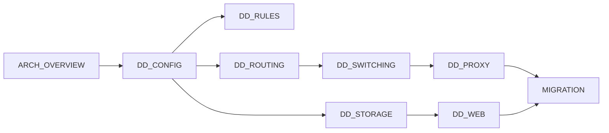

# docs/design/index.md - 设计文档索引

| 版本 | 日期 | 变更说明 | 作者 |
| :--- | :--- | :--- | :--- |
| v1.0.0 | 2026-08-12 | 初始版本 | Agent |
| v2.0.0 | 2026-08-13 | 补齐模块详细设计（7 篇）与重构路径，新增阅读顺序与需求映射表 | Agent |
| v2.1.0 | 2026-08-14 | M1 实现完成，ARCH_OVERVIEW 包结构与 MIGRATION §3 回填实际落地情况 | Agent |
| v2.2.0 | 2026-08-14 | M3 实现完成：DD_ROUTING §7、DD_STORAGE §4/§5、ARCH_OVERVIEW §4 与 MIGRATION §5 回写实现结果 | Agent |
| v2.3.0 | 2026-08-14 | M4 切片 a、b 完成：DD_WEB §2.2/§4/§5/§8 与 DD_ROUTING §4.7 回写实现结果，MIGRATION §6.4 记录切片推进 | Agent |
| v2.4.0 | 2026-08-15 | M4 切片 c ~ e 完成：DD_WEB §6/§8 补配置写回，新增 §10 前端单页应用；MIGRATION §6.4.6 ~ §6.4.14 记录三片的改动、偏差与测试 | Agent |
| v3.0.0 | 2026-08-15 | 规则系统重构（M5，尚未实现）：DD_RULES 全面改写为 v2.0.0（条件编译、first-match-wins、从库加载）；DD_STORAGE 由双库改三库并新增 §2.1/§4.8；DD_WEB §6.3 改为整表替换、新增 §10.7.1 规则页；DD_CONFIG 删 `rule_files`、加 `rules_enabled`；ARCH_OVERVIEW 包结构更新；MIGRATION 新增 §7 M5 | Agent |
| v3.2.0 | 2026-08-16 | 固化粘性为规则：DD_WEB v2.1.0 新增 §6.3.3（单条插入 `insert_rule`）、§8.9（`POST /api/sticky/{host}/promote`）、§10.7.2（固化面板），并修正粘性来源不含 `rule` | Agent |
| v3.5.0 | 2026-08-16 | 首次生产日志分析的四项修正：DD_SWITCHING v1.3.0 §8 隧道早夭增加「上游先关闭」条件（消除浏览器预连接造成的假标记，实测占负面记忆 45%）、§8.1 记录 `bytes_up` 方案为何有竞态、§8.2 早夭走 stderr 而非 `request_log` 的理由；DD_ROUTING v1.5.0 新增 §3.2b 内网直连前置（只重排不裁剪，消除内网冷启动 60 秒）；DD_WEB v2.1.4 §5.2.1 认证失败日志合并；重载日志区分「规则已重载」与「配置已重载」 | Agent |
| v3.4.0 | 2026-08-16 | 请求日志生产端接通：DD_STORAGE v1.6.0 新增 §4.9（写入点、字段口径、耗时夹测、字节数留 0 的理由、死路留痕、测试分两层）；DD_WEB v2.1.3 偏差表更新；DD_DEPLOY v1.2.0 §9.2 标为已修复 | Agent |
| v3.3.0 | 2026-08-16 | 新增 [DD_DEPLOY.md](./DD_DEPLOY.md) v1.0.0：容器部署方案（host 网络选型、卷布局、迁移流程、验证记录），并记录重启导致出口累计计数翻倍的既有缺陷 | Agent |
| v3.1.0 | 2026-08-16 | M5 实现完成：新增 `storage/rules_store.py` 作为 `rules.db` 的唯一写者门面（DD_STORAGE §2/§4.8/§7 回写，`rules.db` 不进只读连接池）；DD_RULES §6.1 的加载接口改为 `RulesSource` 协议 + 纯函数 `compile_rules`；DD_WEB §6.3/§10.7.1 回写；MIGRATION §7.2/§7.4 标注状态并新增 §7.5 偏差与 §7.6 测试 | Agent |
| v3.6.0 | 2026-08-17 | DD_DEPLOY v1.6.0 新增 §11：实例 A（`host-a.example.internal`）因 OpenStack 安全组未放行入向端口（追加 10000–12000 段仍不可达，判定为源地址范围问题）而放弃，第三个实例迁移到已验证外网直通的实例 B（`host-b.example.internal`），端口复用其已放行的 8080/8081；记录数据库随配置一并迁移的必要性、属主权限踩坑、经公网真机验证的最终结果 | Agent |
| v3.7.0 | 2026-08-18 | DD_DEPLOY v1.7.0 新增 §11.8：新增上级代理报 500 的根因是属主修复只 chown 文件未 chown 目录；诊断中修复代码级安全缺陷——`config_writer.py` 原子写会把含明文 `auth_token` 的 `config.toml` 权限从 600 重置为 644，配置备份同样受影响，已修复并补测试；记录 `DOCKER_BUILDKIT=0` 绕过 BuildKit DNS 解析失败的现象。DD_WEB v2.1.5 §6.1 同步补记原子写权限收紧的实现要点 | Agent |

设计文档依据 [需求文档](../requirements/index.md) v1.5.0 编写。规则部分依据 [RULES_CONFIG.md](../requirements/RULES_CONFIG.md) v2.0.0 与 [WEBUI_SPEC.md](../requirements/WEBUI_SPEC.md) v2.0.0。

## 文档列表

| 文档 | 说明 |
|------|------|
| [ARCH_OVERVIEW.md](./ARCH_OVERVIEW.md) | 架构概览：分层模型、模块边界、并发模型、启动与关闭时序、包结构、跨层数据契约 |
| [DD_CONFIG.md](./DD_CONFIG.md) | 配置模块：加载与校验、不可变快照、`config_version`、热重载与状态保留 |
| [DD_RULES.md](./DD_RULES.md) | 规则引擎：条件编译与类型识别、first-match-wins 匹配、从 `rules.db` 加载、IP 字面量规范化、正则安全约束 |
| [DD_ROUTING.md](./DD_ROUTING.md) | 路由决策：候选链构造、粘性映射、健康与熔断状态机、负面记忆、地址族能力过滤 |
| [DD_SWITCHING.md](./DD_SWITCHING.md) | 切换判据：三道判据链、状态码分类、`502/503/504` 来源判定、幂等门控、字节重放 |
| [DD_PROXY.md](./DD_PROXY.md) | 协议层：请求解析与 host 规范化、HTTP 转发、CONNECT 隧道、背压与资源限制 |
| [DD_STORAGE.md](./DD_STORAGE.md) | 存储层：三库 schema、唯一写者线程、批量事务与合并、有界队列、规则整表替换、启动回填、清理 |
| [DD_WEB.md](./DD_WEB.md) | Web 界面：可选依赖隔离、单进程装配、`to_thread` 边界、认证、配置写回与规则写入、审计、XSS 与 SSRF 防护、无构建单页应用 |
| [DD_DEPLOY.md](./DD_DEPLOY.md) | 容器部署：host 网络与访问控制、镜像构建、卷布局与备份目录派生、从裸跑迁移的顺序、持久化验证记录 |
| [MIGRATION.md](./MIGRATION.md) | 重构路径：现状差距、M1–M5 的文件级改动与验收点、需求修订的决策记录、架构约束的自动化守护 |

## 阅读顺序

初次阅读建议按上图顺序。定位具体问题时可直接跳转：

| 想了解 | 看这里 |
|--------|--------|
| 整体是怎么分层的、为什么这么分 | [ARCH_OVERVIEW §2](./ARCH_OVERVIEW.md)、[§3](./ARCH_OVERVIEW.md) |
| 一次请求都经过了哪些环节 | [ARCH_OVERVIEW §6](./ARCH_OVERVIEW.md) |
| 出口的尝试顺序是怎么定的 | [DD_ROUTING §3](./DD_ROUTING.md) |
| 什么情况下会切换、什么情况下不会 | [DD_SWITCHING §3](./DD_SWITCHING.md) |
| 为什么 `direct` 不会被熔断 | [DD_ROUTING §4.6](./DD_ROUTING.md) |
| IPv4 客户端怎么访问纯 IPv6 目标 | [DD_ROUTING §5](./DD_ROUTING.md) |
| POST 会不会被重复投递 | [DD_SWITCHING §3](./DD_SWITCHING.md)、[§7](./DD_SWITCHING.md) |
| 数据库写入为什么不会卡住代理 | [DD_STORAGE §4](./DD_STORAGE.md) |
| 并发下计数器为什么不会丢 | [DD_STORAGE §4.3](./DD_STORAGE.md) |
| 请求日志是谁写的、为什么字节数是 0 | [DD_STORAGE §4.9](./DD_STORAGE.md) |
| 规则为什么单独一个库、为什么不走写队列 | [DD_STORAGE §2.1](./DD_STORAGE.md)、[§4.8](./DD_STORAGE.md) |
| 规则条件是怎么判定类型的 | [DD_RULES §4.1](./DD_RULES.md) |
| 为什么条件只匹配主机名 | [RULES_CONFIG §1.2](../requirements/RULES_CONFIG.md) |
| 规则配错了怎么救回来 | [RULES_CONFIG §2.3](../requirements/RULES_CONFIG.md) |
| Web 界面会不会拖慢代理 | [DD_WEB §4](./DD_WEB.md) |
| 从现在的代码怎么走到目标形态 | [MIGRATION.md](./MIGRATION.md) |
| 怎么用容器部署、数据放在哪 | [DD_DEPLOY.md](./DD_DEPLOY.md) |
| 为什么容器用 host 网络而不是发布端口 | [DD_DEPLOY §2](./DD_DEPLOY.md) |

## 需求到设计的映射

| 需求条目 | 主要设计文档 |
|----------|-------------|
| [PRD §4.1](../requirements/PRD_OVERVIEW.md) 代理服务 | [DD_PROXY](./DD_PROXY.md) |
| [PRD §4.2](../requirements/PRD_OVERVIEW.md) 上级代理池与优先级 | [DD_CONFIG](./DD_CONFIG.md)、[DD_ROUTING §3](./DD_ROUTING.md) |
| [PRD §4.2.4](../requirements/PRD_OVERVIEW.md) 地址族范围 | [DD_ROUTING §5](./DD_ROUTING.md)、[DD_PROXY §3.3](./DD_PROXY.md) |
| [PRD §4.3.1–4.3.5](../requirements/PRD_OVERVIEW.md) 切换判据 | [DD_SWITCHING](./DD_SWITCHING.md) |
| [PRD §4.3.6–4.3.7](../requirements/PRD_OVERVIEW.md) 故障归类与候选链 | [DD_ROUTING §3](./DD_ROUTING.md)、[§4](./DD_ROUTING.md) |
| [PRD §4.3.9](../requirements/PRD_OVERVIEW.md) 失败响应信息边界 | [DD_PROXY §9](./DD_PROXY.md) |
| [PRD §4.3.10](../requirements/PRD_OVERVIEW.md) 熔断 | [DD_ROUTING §4](./DD_ROUTING.md) |
| [PRD §4.3.11](../requirements/PRD_OVERVIEW.md) CONNECT 切换与隧道早夭 | [DD_SWITCHING §7.4](./DD_SWITCHING.md)、[§8](./DD_SWITCHING.md) |
| [PRD §4.3.13](../requirements/PRD_OVERVIEW.md) 字节管理 | [DD_SWITCHING §7](./DD_SWITCHING.md) |
| [PRD §4.4](../requirements/PRD_OVERVIEW.md) 数据模型 | [DD_STORAGE](./DD_STORAGE.md) |
| [PRD §4.5](../requirements/PRD_OVERVIEW.md) / [RULES_CONFIG](../requirements/RULES_CONFIG.md) 规则路由 | [DD_RULES](./DD_RULES.md) |
| [PRD §4.6](../requirements/PRD_OVERVIEW.md) 粘性复用 | [DD_ROUTING §7](./DD_ROUTING.md) |
| [PRD §4.7](../requirements/PRD_OVERVIEW.md) / [WEBUI_SPEC](../requirements/WEBUI_SPEC.md) Web 界面 | [DD_WEB](./DD_WEB.md) |
| [PRD §4.8](../requirements/PRD_OVERVIEW.md) 依赖与部署 | [DD_CONFIG §1.1](./DD_CONFIG.md)、[DD_WEB §2.2](./DD_WEB.md) |
| [PRD §4.9](../requirements/PRD_OVERVIEW.md) 并发竞态 | [DD_ROUTING §8](./DD_ROUTING.md)、[DD_STORAGE §4](./DD_STORAGE.md) |
| [PRD §7](../requirements/PRD_OVERVIEW.md) 性能与资源限制 | [DD_PROXY §8](./DD_PROXY.md)、[DD_STORAGE §4.6](./DD_STORAGE.md) |
| [PRD §1.2](../requirements/PRD_OVERVIEW.md) 实施路线图 | [MIGRATION.md](./MIGRATION.md) |

## 设计推演引出的需求修订（已定案）

设计推演过程中发现三处与需求文档表述不一致，均已于 2026-08-13 定案并回写需求。决策记录见 [MIGRATION §2](./MIGRATION.md)：

| # | 议题 | 定案 |
|---|------|------|
| 1 | 配置格式与依赖归属 | **改用 TOML**：读用标准库 `tomllib`，写用 `tomlkit`（`[web]` extra）。代理核心真正零第三方运行时依赖，且 Web 写回能保留注释 |
| 2 | 规则指向不可用出口 | **拆分条件**：出口名不存在 → 拒绝启动；出口已禁用 → 告警 + 持续可见 |
| 3 | `manual` 粘性失败达阈值 | **不清除**，并明确「粘性是偏好、规则才是硬约束」 |

2026-08-15 另有一项由用户驱动的需求变更，规模大到需要单列一个里程碑（[MIGRATION §7](./MIGRATION.md)）：

| # | 议题 | 定案 |
|---|------|------|
| 4 | 规则的存储与编辑形态 | **改为 `rules.db` + Web 表格界面**，参照 SwitchyOmega。文本规则文件与 `rules.files` 键废弃，不提供兼容层；顺序语义同时改为首匹配胜出，匹配对象收窄为仅主机名。放弃「能用编辑器救回来」这一性质，代价由 `[rules] enabled = false` 开关与文本快照备份补回 |

2026-08-16 首次分析生产日志（5 小时真实流量），四项修正均由数据驱动。分析过程与试错记录见 `.learnings/experience/2026-08-16-log-analysis-findings.md`：

| # | 现象（实测） | 定案 |
|---|------|------|
| 5 | 122 条负面记忆中 55 条来自隧道早夭，被标记的多是浏览器后台服务（预连接后放弃） | 早夭判定增加**「上游先关闭」**条件（[DD_SWITCHING §8](./DD_SWITCHING.md)）。信号不能用 `bytes_up`：上游回 `200` 即断开时客户端字节常来不及被读到，有竞态 |
| 6 | 早夭标记诞生时 `request_log` 记的是 `200 成功`、stderr 无输出，导致一次 20 秒重试无法复原经过 | 早夭、每次失败尝试、候选链耗尽都打 stderr 日志；早夭**不**补 `request_log` 行，否则首次即成功的请求会凭空出现 `attempt_index=1`（[DD_SWITCHING §8.2](./DD_SWITCHING.md)） |
| 7 | 内网主机冷启动候选链为「上级代理超时 30 秒 ×2 → `direct` 5 毫秒成功」 | 内网 IP 字面量把 `direct` 提到链首（[DD_ROUTING §3.2b](./DD_ROUTING.md)）。**只重排不裁剪**：实测存在只有上级代理到得了的内网段 |
| 8 | 5 小时 35 行日志里，5 行是同一秒的认证失败、11 行是配置版本未变的「配置已重载」 | 认证失败一个窗口只记首次与锁定两条（[DD_WEB §5.2.1](./DD_WEB.md)）；重载日志区分规则与配置 |

## 相关文档

- [需求文档索引](../requirements/index.md)
- [技术预研索引](../../study/index.md)
- [SQLite 存储实测](../../study/sqlite-storage-benchmark.md)
