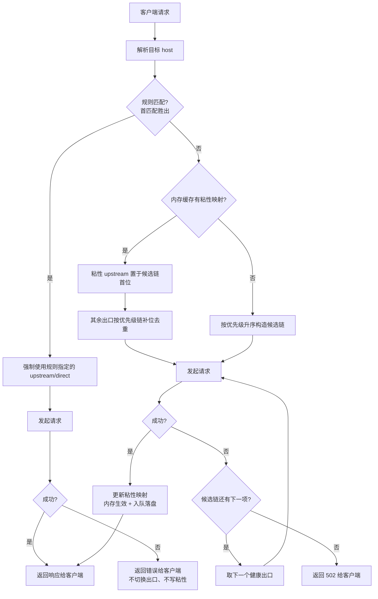
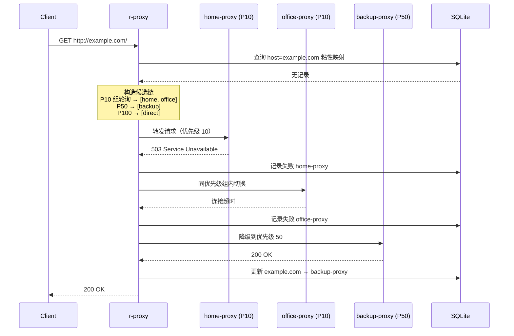
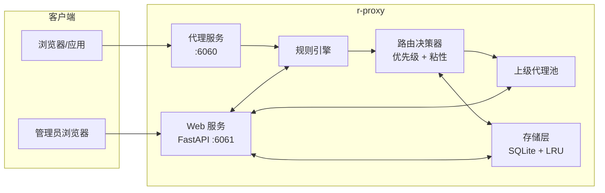
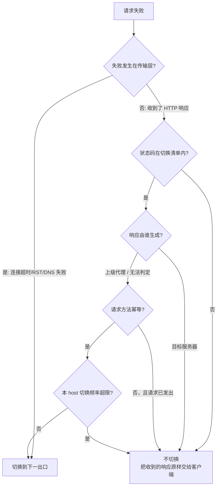
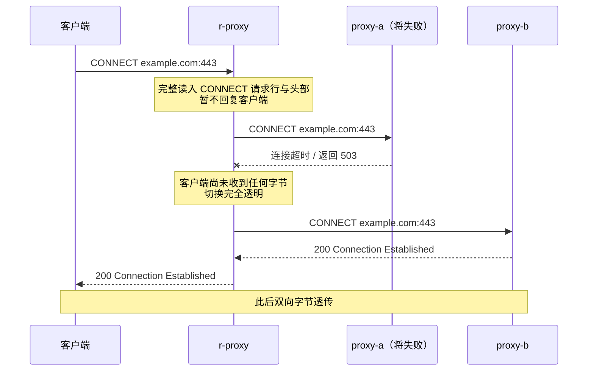
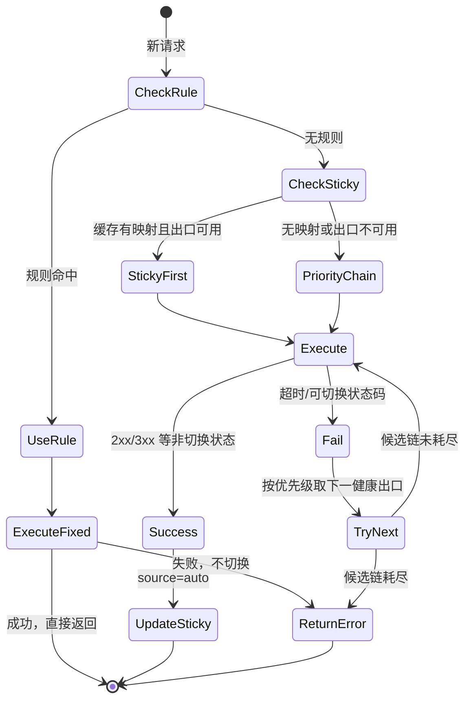
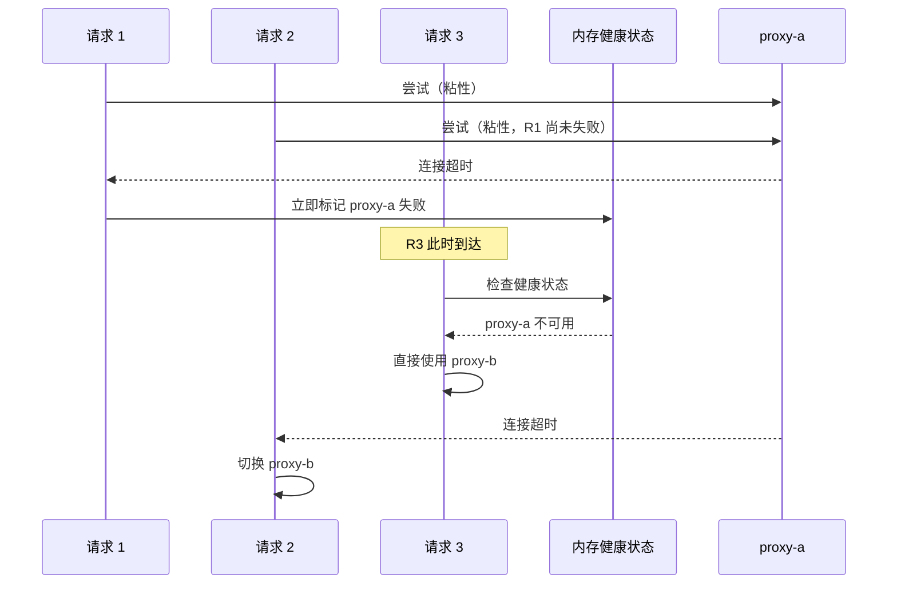
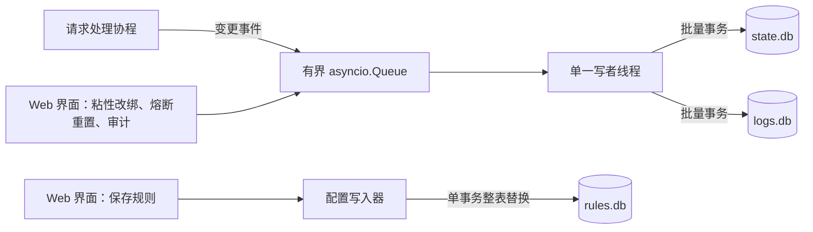

# PRD_OVERVIEW.md - r-proxy 产品需求总览

| 版本 | 日期 | 变更说明 | 作者 |
|------|------|----------|------|
| v1.0.0 | 2026-08-12 | 初始版本，整理用户 6 项核心需求 | Agent |
| v1.1.0 | 2026-08-12 | Web 管理界面纳入本期范围；上级代理与直连支持优先级配置，自动切换按优先级顺序执行 | Agent |
| v1.2.0 | 2026-08-12 | 新增 §4.9 并发与一致性；存储层改为内存热路径 + 单一批量写者 + 拆分数据库文件；熔断改为内存态并增加探测限流 | Agent |
| v1.3.0 | 2026-08-12 | 重构 §4.3 切换策略：状态码分类与来源判定、幂等性约束、切换频率限制、出口级/路由级故障分离（修复 `direct` 被全局熔断的缺陷）、CONNECT 隧道早夭判定、per-upstream 超时覆盖 | Agent |
| v1.4.0 | 2026-08-13 | 评审修订：新增 §1.2 实施路线图（M1–M4）与 §7 性能基线与资源限制；修正 §3.1/§4.6 中规则强制路由误入切换循环的矛盾；`502` 响应体收敛为通用错误 + `request_id`（§4.3.9）；补 `408` 与 Cloudflare `520`–`526` 分类（§4.3.2.1、§4.3.2.2）；新增 §4.3.13 切换期间的请求字节管理；新增 §4.2.4 IPv6 支持范围；数据库路径统一为 `state.db` / `logs.db`；补充 RL/ST 两组验收场景 | Agent |
| v1.5.0 | 2026-08-13 | 明确地址族的入向/出向不对称：入向收窄为 IPv4-only，出向支持 IPv6，定位为应用层 IPv4→IPv6 网关（§1.1、§4.2.4）；补充「DNS 解析归属决定地址族归因能力」这一架构前提；`direct` 增加 IPv6 出口能力探测，纯 IPv6 目标在无能力时于候选链构造阶段跳过且不计失败（§4.3.6、§4.3.7）；启用 Happy Eyeballs 并说明其适用场景；明确不提供上级代理 `supports_ipv6` 字段及理由；新增 AF 组验收场景 | Agent |
| v1.6.0 | 2026-08-13 | 设计评审回写，三项定案：**配置格式由 YAML 改为 TOML**（§4.2.1、§4.2.1b、§4.8），使代理核心真正零第三方运行时依赖（`tomllib` 为标准库），写回用 `tomlkit` 保留注释；**规则指向不可用出口的处理拆分为两种情况**（[RULES_CONFIG.md](./RULES_CONFIG.md) §4.3.1）：名字不存在拒绝启动、已禁用仅告警；**`manual` 粘性不因失败清除**并新增 §4.6.1 明确「粘性是偏好、规则才是硬约束」 | Agent |
| v1.7.0 | 2026-08-15 | **规则系统重构**（详见 [RULES_CONFIG.md](./RULES_CONFIG.md) v2.0.0）：规则由文本文件改为 `rules.db` + Web 表格界面，`[rules] files` 换成 `enabled` 救场开关，`[database]` 新增 `rules_path`；§4.5 改为首匹配胜出、只匹配主机名；§4.9.5 写入路径明确「每库一个写者」并纳入配置写入器；§5 文件布局移除 `rules/` 目录 | Agent |

## 1. 背景与目标

r-proxy 在现有轻量级 HTTP/HTTPS 正向代理基础上，演进为支持**多上级代理、优先级故障切换、规则路由、持久化记忆与 Web 管理**的智能代理网关。

### 1.1 核心目标

| 编号 | 目标 | 优先级 |
|------|------|--------|
| G-01 | 启动后固定监听 `6060` 端口，提供 HTTP 代理服务 | P0 |
| G-02 | 支持直连与多个上级 HTTP 代理 | P0 |
| G-03 | 依据 HTTP 状态码与超时自动切换上级代理 | P0 |
| G-04 | 在本地 SQLite 记录 host url 与所用上级代理的映射关系 | P0 |
| G-05 | 支持按主机名配置固定路由规则（Web 表格界面维护） | P0 |
| G-06 | 自动匹配成功的代理对同一 host 保持粘性（sticky） | P0 |
| G-07 | **上级代理与直连均可配置优先级，自动切换严格按优先级顺序进行** | P0 |
| G-08 | **提供 Web 管理界面：监控、上级代理管理、粘性管理、规则编辑、全局设置** | P0 |

**地址族定位**：客户端全部为 IPv4，而目标站点可能是纯 IPv6。因此 r-proxy 的入向仅需 IPv4，出向必须同时支持 IPv4 与 IPv6——它事实上承担了**应用层 IPv4→IPv6 网关**的角色，让 IPv4-only 客户端无需 NAT64/DNS64 即可访问纯 IPv6 目标。详见 §4.2.4。

### 1.2 实施路线图

G-01 至 G-08 全部属于本期范围，但它们之间存在依赖关系，不可能同时开工。下表按依赖顺序划分为四个里程碑，每个里程碑结束时系统都处于**可运行、可验证**的状态。

| 里程碑 | 包含目标 | 交付后可验证的能力 | 依赖 |
|--------|----------|--------------------|------|
| **M1 可用代理** | G-01、G-02 | 能作为浏览器代理正常上网，支持 HTTP 与 CONNECT，可配置多个上级代理但只用第一个 | — |
| **M2 自动切换** | G-03、G-07 | 出口故障时按优先级自动切换，同优先级轮询；`direct` 不会因个别站点被阻断而整体熔断 | M1 |
| **M3 记忆与规则** | G-04、G-05、G-06 | 粘性复用生效，重启后保留；规则强制路由生效 | M2 |
| **M4 管理界面** | G-08 | 浏览器中完成监控与全部配置管理 | M3 |

各里程碑的内部优先级：

| 目标 | 优先级 | 说明 |
|------|--------|------|
| G-01 启动后监听 `6060` 提供 HTTP 代理 | P0 | 一切的前提 |
| G-02 支持直连与多个上级 HTTP 代理 | P0 | 一切的前提 |
| G-03 依据状态码与超时自动切换 | P0 | 产品的核心价值 |
| G-07 出口优先级与同级轮询 | P0 | 与 G-03 同一套决策逻辑，必须一起实现 |
| G-04 SQLite 记录 host 与出口映射 | P0 | G-06 的持久化基础 |
| G-06 自动匹配结果的粘性复用 | P0 | 避免每个请求重新遍历 |
| G-05 固定规则路由 | P0 | 独立于切换逻辑，可与 G-04/G-06 并行开发 |
| G-08 Web 管理界面 | P0 | 依赖前述所有能力的数据与状态，必须最后做 |

**为何不降级任何目标**：G-01 至 G-07 构成一条完整的功能链，缺任何一环产品都不成立（例如没有 G-06，每个请求都要重新遍历出口，延迟不可接受）。G-08 虽然可以在功能上被 CLI 替代，但本项目的使用场景是**长期后台运行的本地代理**，用户需要一个地方查看「为什么这个站点走了直连」，缺少它会导致故障完全不可诊断。因此本期不做 P0/P1 拆分，而是用里程碑控制交付节奏。

### 1.3 非目标（本期不做）

- HTTPS MITM / 证书解密
- SOCKS4/5 上级代理
- 分布式多节点部署
- 多用户账号体系与细粒度权限（Web 界面默认仅本地访问，见 [WEBUI_SPEC.md](./WEBUI_SPEC.md) §7）
- **Prometheus / OpenTelemetry 指标导出**：本期的可观测性通过 Web 界面与 `logs.db` 提供。指标导出需要先稳定指标命名与语义，过早引入会形成难以修改的外部契约；且单机本地代理的典型用户不运行 Prometheus。`logs.db` 是标准 SQLite，需要接入监控系统的用户可自行查询导出
- **IPv6 客户端接入**：入向仅支持 IPv4，`listen.host` 配置 IPv6 地址时启动失败。出向的 IPv6 支持不受影响，见 §4.2.4
- **CIDR 网段匹配**：规则条件不支持 `10.0.0.0/8` 这类前缀长度写法。IPv4/IPv6 的前缀匹配用字符串通配符表达（`192.168.*`、`fd00:*`），语义是文本匹配而非地址计算，见 [RULES_CONFIG.md](./RULES_CONFIG.md) §3.5
- **上级代理的 IPv6 能力声明**：不提供 `supports_ipv6` 字段，因为对域名目标无法归因、用户手填无法验证，理由详见 §4.2.4
- **NAT64 / DNS64 / 透明代理**：地址族转换只发生在应用层的正向代理路径上，不做网络层转换
- **上级代理认证**：`upstreams[].auth` 为预留字段，本期不实现

> v1.1.0 变更：**Web 管理界面已从非目标移入 P0 目标（G-08）**。

---

## 2. 用户故事

### US-01 启动代理服务

> 作为用户，我希望启动 r-proxy 后自动监听 `6060` 端口，以便客户端将 HTTP 代理指向 `127.0.0.1:6060` 即可使用。

**验收标准：**

- 默认监听地址 `127.0.0.1:6060`（可通过配置覆盖 bind 地址，但默认端口为 6060）
- 支持标准 HTTP 正向代理（GET/POST 等）与 CONNECT 隧道（HTTPS）
- 启动日志明确输出代理监听地址、Web 界面地址、加载的规则与上级代理数量

### US-02 配置上级代理池与优先级

> 作为用户，我希望配置多个上级 HTTP 代理并允许直连，且能为每个出口（含直连）指定优先级，让 r-proxy 优先使用我信任的线路。

**验收标准：**

- 配置文件可声明一个或多个上级代理，每条包含：名称（唯一标识）、类型、地址（`host:port`）、**优先级**、启用开关、可选认证信息
- `direct`（直连）作为一等公民出口，同样可配置优先级
- **优先级语义：数字越小优先级越高**（`priority: 10` 优先于 `priority: 20`），参考 DNS MX 记录惯例
- 相同优先级的多个出口构成一个「优先级组」，组内采用**轮询（round-robin）**分担负载
- 未显式声明 `priority` 时使用默认值 `100`
- 优先级可通过配置文件或 Web 界面修改，修改后热生效（无需重启）

### US-03 按优先级自动切换上级代理

> 作为用户，当当前上级代理不可用或返回代理层错误时，我希望 r-proxy 按优先级从高到低自动尝试下一个可用出口，无需手动干预。

**验收标准：**

- 触发切换的条件（可配置，见 §4.3）：
  - **传输层失败**：连接超时、读超时、连接被拒、TCP RST、DNS 失败
  - **HTTP 状态码**：默认对 `403/407/408/429/451/502/503/504/511` 触发切换；`404`、`500` 等表明目标已正常处理的响应，以及 Cloudflare `520`–`526` 一类证明出口本身畅通的响应，**均不触发**切换（见 §4.3.2）
  - **来源判定**：`502/503/504` 需判定响应由代理还是目标生成（见 §4.3.3）
  - **幂等性门控**：非幂等请求（POST/PATCH）在已发出后不得重试（见 §4.3.4）
- **候选链严格按优先级升序构造**；同优先级组内按轮询游标决定起始成员，组内其余成员紧随其后作为同层备选
- 已禁用（`enabled: false`）或处于熔断冷却期的出口不进入候选链
- 切换过程对客户端透明（客户端只收到最终成功响应，或全部失败后的通用 `502`，不回显出口细节，见 §4.3.9）
- 每次尝试记录到 SQLite（见 US-04）

### US-04 持久化 host url 与代理映射

> 作为用户，我希望系统在本地 SQLite 中记录每个 host 最终使用的上级代理，以便重启后仍能复用历史选择。

**验收标准：**

- 使用本地 SQLite 数据库，按可靠性等级拆分为两个文件（路径可配置，见 §4.4 与 §5）：
  - `state.db`：粘性映射与出口健康，不可丢失
  - `logs.db`：请求审计日志，可轮转、可丢弃
- 至少记录：`host`、`upstream_name`（或 `direct`）、`source`（规则/自动/手动）、`last_success_at`、`last_http_status`、`fail_count`
- 请求审计表额外记录完整 `url`，用于 Web 界面追溯
- 支持按 host 查询历史与当前生效映射
- 运行时以内存为准、批量落盘，热路径不做同步数据库 I/O（见 §4.4.4）

### US-05 固定规则路由

> 作为用户，我希望在 Web 界面上用一张表格为特定主机指定固定的上级代理，不必学习任何文本格式。

**验收标准：**

- 规则独立于主配置存储（`rules.db`，见 [RULES_CONFIG.md](./RULES_CONFIG.md)）
- 界面提供两列表格（条件 + 出口下拉），支持拖拽与按钮两种排序方式
- 条件类型由写法自动推断：全匹配、域名及子域、通配符、精确主机、IP 字面量、正则
- 条件**只匹配主机名**，不涉及协议、端口、路径（理由见 [RULES_CONFIG.md](./RULES_CONFIG.md) §1.2）
- 规则命中后**强制**使用指定上级代理（或直连），不参与优先级自动切换
- 规则顺序：**首匹配优先**（界面上从上到下第一条命中的生效）
- 提供 `[rules] enabled = false` 作为规则配错时的全局停用开关

> **注意**：规则的「首匹配优先」与上级代理的「数值优先级」是两套独立机制。前者决定**选哪个出口**，后者决定**自动模式下的尝试顺序**。规则命中时不查询数值优先级。

### US-06 自动匹配结果的粘性复用

> 作为用户，当某个 host 通过自动选择找到可用上级代理后，后续对同一 host 的请求应默认使用同一代理，直到该代理再次失败。

**验收标准：**

- 同一 `host`（不含路径）的后续请求优先使用上次成功的 `upstream_name`
- 粘性信息在进程重启后仍有效（依赖 SQLite）
- 规则命中的 host 以规则为准，不被自动粘性覆盖
- 当粘性代理再次触发切换条件时，更新 SQLite 并按优先级链选用新的上级代理
- 粘性出口失效后的补位顺序**仍遵循优先级链**

### US-07 Web 管理界面

> 作为用户，我希望通过浏览器查看代理运行状态、管理上级代理与优先级、调整粘性映射、在线编辑规则并修改全局设置。

**验收标准：**

- 独立监听 `6061` 端口，默认仅绑定 `127.0.0.1`
- 提供五大功能模块：监控看板、上级代理管理、粘性映射管理、规则编辑、全局设置
- 所有配置修改**原子写回配置文件**并热生效
- 详细需求见 [WEBUI_SPEC.md](./WEBUI_SPEC.md)

---

## 3. 系统流程

### 3.1 请求路由总流程



图中存在两条互不相通的执行路径，这是规则语义的直接体现：

| 路径 | 触发条件 | 失败行为 | 依据 |
|------|----------|----------|------|
| `D → D2 → D3` | 规则命中 | **不切换**，原样返回错误 | 规则是用户的显式指令，静默改走其他出口会破坏确定性，且可能把本应留在内网的流量送出去 |
| `H → I → K → L` | 无规则命中 | 按优先级链逐个切换 | 自动模式下用户未指定出口，遍历候选链是期望行为 |

> 规则命中路径的候选链长度恒为 1，因此不存在「下一项」。若需要规则命中后仍允许回退，需引入 `forward-fallback` 语法，本期不实现（见 [RULES_CONFIG.md](./RULES_CONFIG.md) §7 Q2）。
>
> `L` 节点取的是「下一个**健康**出口」而非简单的下一项：候选链不在请求开始时固化，每次取下一跳前重新检查出口健康状态，以便跳过刚被其他请求判定为失效的出口（见 §4.9.4）。

### 3.2 优先级切换时序



### 3.3 组件架构



---

## 4. 功能需求详述

### 4.1 FR-01 监听端口与服务

| 属性 | 代理服务 | Web 管理界面 |
|------|----------|--------------|
| 默认端口 | `6060` | `6061` |
| 默认绑定 | `127.0.0.1` | `127.0.0.1` |
| 协议 | HTTP 代理（含 CONNECT） | HTTP（REST API + 单页应用） |
| 配置项 | `listen.host` / `listen.port` | `webui.host` / `webui.port` / `webui.enabled` |

### 4.2 FR-02 上级代理池与优先级

#### 4.2.1 主配置文件结构

配置文件格式为 **TOML**，选型理由见 §4.2.1b。

```toml
# config.toml

[listen]
host = "127.0.0.1"
port = 6060

[webui]
enabled = true
host = "127.0.0.1"
port = 6061
# auth_token 绑定非本地地址时必填，见 WEBUI_SPEC.md §7
# 也可用环境变量 R_PROXY_WEB_TOKEN 提供，优先级更高
workers = 1                          # 固定为 1，不可配置为其他值，见 §4.9.5

[database]
state_path = "~/.r-proxy/state.db"   # 粘性映射与出口健康，不可丢失
logs_path  = "~/.r-proxy/logs.db"    # 请求审计日志，可轮转
rules_path = "~/.r-proxy/rules.db"   # 路由规则，唯一写者是配置写入器
retention_days = 30
max_log_rows = 100000
write_queue_size = 10000
flush_interval_ms = 200
flush_batch_size = 500
backup_keep = 10                     # 备份保留份数，按来源分别计数，见 §4.7

[limits]
max_client_connections = 1000        # 并发客户端连接上限，超出直接拒绝
max_connections_per_upstream = 200   # 单出口并发上限，防止打垮上级代理
sticky_cache_size = 10000            # 粘性映射 LRU 条数上限
route_block_cache_size = 50000       # 路由级负面记忆条数上限

[rules]
enabled = true                       # 救场开关；false 时忽略全部规则，见 RULES_CONFIG §2.3

[routing]
connect_timeout = 10
read_timeout = 30
switch_on_status = [403, 407, 408, 429, 451, 502, 503, 504, 511]
sticky_fail_threshold = 3
route_block_ttl = 600                # (host, upstream) 负面记忆有效期，秒
tunnel_probe_window = 5              # CONNECT 隧道早夭判定窗口，秒
switch_buffer_bytes = 65536          # 单请求可重放的最大字节数，见 §4.3.13
happy_eyeballs_delay = 0.25          # 双栈目标的地址族并行尝试延迟，秒；0 关闭，见 §4.2.4

[routing.status_switch_rate_limit]   # 防止 429/403 触发雪崩式遍历
max_switches_per_host = 10
window_seconds = 60

[routing.circuit_breaker]
enabled = true
fail_threshold = 5                   # 连续 upstream_error 达阈值后熔断
cooldown_seconds = 60                # 冷却时长，期间不进入候选链

# 出口池。数组表的顺序不影响优先级，优先级只由 priority 决定。
[[upstreams]]
name = "home-proxy"
type = "http"
address = "192.168.1.100:7890"
priority = 10                        # 数字越小优先级越高
enabled = true

[[upstreams]]
name = "office-proxy"
type = "http"
address = "10.0.0.1:8080"
priority = 10                        # 与 home-proxy 同优先级 → 轮询
enabled = true

[[upstreams]]
name = "backup-proxy"
type = "http"
address = "203.0.113.50:3128"
priority = 50
enabled = true
# [upstreams.auth]                   # 可选，本期预留
# username = "user"
# password = "pass"

[[upstreams]]
name = "direct"
type = "direct"
priority = 100                       # 直连作为最后兜底
enabled = true
connect_timeout = 3                  # 覆盖全局值：直连要么很快通，要么是被阻断
```

> **v1.1.0 变更**：移除 `routing.default_chain`，候选顺序改由 `upstreams[].priority` 推导。这样新增/调整出口只需改一处，避免链表与代理定义不同步。

#### 4.2.1b 为何选用 TOML 而非 YAML

配置格式的选择直接决定了「代理核心零第三方运行时依赖」这条约束能否成立。

| 能力 | 谁需要 | TOML | YAML |
|------|--------|------|------|
| **读**配置 | 代理核心（`--no-web` 时同样需要） | `tomllib`，**Python 3.11+ 标准库** | `pyyaml`，第三方 |
| **写**配置 | 仅 Web 管理界面 | `tomlkit`，归入 `[web]` extra | `pyyaml` |

`tomllib` 只提供 `load` / `loads`，**没有写入能力**。这个「读是标准库、写要第三方」的不对称，恰好与本项目的依赖边界重合：代理核心只读配置，只有 Web 界面需要写回。选用 TOML 后，`--no-web` 部署形态真正做到零第三方运行时依赖，而不必削弱这条约束。

附带收益：`tomlkit` 是风格保留型库，往返读写能保住用户写的注释与格式。`pyyaml` 的 `safe_load` / `safe_dump` 往返会丢弃全部注释，意味着用户一旦通过 Web 界面保存过配置，此前精心写的说明文字就永久消失（虽有备份，但用户不会想到去找）。

代价是 TOML 的一个手写陷阱：一旦开始 `[[upstreams]]` 数组表，后续的裸键会归属到最后一个出口而非顶层。因此配置校验必须**拒绝未知键**，把这类静默错配变成明确报错。

> 规则不受此项影响：它存在 `rules.db` 中，由 Web 界面维护，完全不经过 TOML（见 [RULES_CONFIG.md](./RULES_CONFIG.md) §2.1）。

#### 4.2.2 上级代理字段定义

| 字段 | 类型 | 必填 | 默认值 | 说明 |
|------|------|------|--------|------|
| `name` | string | 是 | — | 全局唯一，规则与 SQLite 的引用标识 |
| `type` | enum | 是 | — | `http` 或 `direct` |
| `address` | string | `type=http` 时必填 | — | `host:port` |
| `priority` | integer | 否 | `100` | 数字越小优先级越高，取值范围 `1`–`999` |
| `enabled` | boolean | 否 | `true` | 关闭后不参与任何自动路由；规则显式指定已禁用的出口时启动告警、命中时返回 `502`，见 [RULES_CONFIG.md](./RULES_CONFIG.md) §4.4.1 |
| `connect_timeout` | integer | 否 | 继承 `routing.connect_timeout` | 该出口的连接超时覆盖值，秒 |
| `read_timeout` | integer | 否 | 继承 `routing.read_timeout` | 该出口的读超时覆盖值，秒 |
| `auth` | object | 否 | `null` | 上级代理认证，本期预留字段 |

#### 4.2.3 约束

- `name` 全局唯一；`direct` 为保留名称，必须为 `type: direct`
- 至少存在 1 个 `enabled: true` 的出口，否则启动失败
- 若所有出口的 `enabled` 均为 false，启动时报错并给出明确提示
- `priority` 允许重复（构成优先级组）

#### 4.2.4 地址族范围（IPv4 / IPv6）

**入向与出向的地址族要求是不对称的**，这是本节的前提：

| 方向 | 地址族 | 说明 |
|------|--------|------|
| **入向**（客户端 → r-proxy） | **仅 IPv4** | 客户端全部为 IPv4，不支持 IPv6 客户端接入 |
| **出向**（r-proxy → 上级代理 / 目标） | **IPv4 + IPv6** | 目标站点可能是纯 IPv6，必须能连通 |

因此 r-proxy 事实上承担了**应用层 IPv4→IPv6 网关**的角色：IPv4-only 的客户端通过它访问纯 IPv6 目标，无需部署 NAT64/DNS64。这是一项实际能力，而非附带效果。

##### 支持矩阵

| 位置 | 支持情况 | 写法 |
|------|----------|------|
| `listen.host` / `webui.host` | **仅 IPv4** | `127.0.0.1`、`0.0.0.0`；配置 IPv6 地址时启动失败并说明原因 |
| `upstreams[].address` | IPv4 + IPv6 | `10.0.0.1:8080`、`[2001:db8::1]:8080`（IPv6 **必须带方括号**以区分地址与端口分隔符） |
| 客户端请求的目标 host | IPv4 + IPv6 + 域名 | `http://[2001:db8::1]:8080/path`，按 RFC 3986 解析 |
| CONNECT 的目标 | IPv4 + IPv6 + 域名 | `CONNECT [2001:db8::1]:443 HTTP/1.1` |
| 规则条件中的 IP 字面量 | 支持精确匹配（书写差异经规范化后等价） | 见 [RULES_CONFIG.md](./RULES_CONFIG.md) §3.5 |
| 网段 / 前缀匹配 | 支持字符串通配符，**不支持** CIDR | `192.168.*`、`fd00:*`；语义是文本匹配而非地址计算 |

入向收窄为 IPv4-only 是有意的简化：双栈监听会引入 `IPV6_V6ONLY` 的平台默认值差异与 IPv4-mapped 地址的日志表现问题，而这些复杂度服务的是一个不存在的场景。

##### 谁做 DNS 解析，决定了能否感知目标地址族

这一点决定了所有与地址族相关的失败归因能力：

| 出口类型 | 解析方 | r-proxy 能否知道目标是纯 IPv6 |
|----------|--------|-------------------------------|
| `direct` | r-proxy 自己调 `getaddrinfo` | **能** |
| 上级 HTTP 代理，域名目标 | **上级代理**（我们只透传主机名） | **不能** |
| 上级 HTTP 代理，IP 字面量目标 | 无需解析 | 能看到目标族，但不知道上级有无 IPv6 出口 |

##### 为什么不给上级代理增加 `supports_ipv6` 字段

看起来自然，实际不可行，明确列为**不做**：

1. **对域名目标无效**。上级代理因自身缺少 IPv6 出口而失败时，返回的是 `502`/`503` 或超时，与「目标宕机」「上级到目标不通」的表现完全一致。我们拿不到任何可归因的信号
2. **无法验证**。用户手填的能力标记若填错（填了 `false` 而上级其实支持），会导致一个可用出口被永久错误跳过，且不会有任何报错提示
3. 现有的 `(host, upstream)` 路由级负面记忆（§4.3.6）已经是在可得信号下能做到的最好归因

##### `direct` 出口的 IPv6 能力探测

`direct` 是唯一能确定知道目标地址族的出口，因此对它做专门处理：

| 项目 | 做法 |
|------|------|
| 探测方式 | 对公网 IPv6 地址发起 UDP `connect()`（**不发送任何数据包**），成功则取得全局 IPv6 源地址 |
| 探测时机 | 启动时一次，结果缓存；`SIGHUP` 重载时重新探测 |
| 探测成本 | 实测 0.2ms，无网络流量 |
| 判定标准 | 能取得**全局**源地址才算有能力；仅有 link-local（`fe80::`）视为无能力 |
| 无能力时的行为 | 纯 IPv6 目标**直接跳过 `direct`**，顺延到候选链下一项，且**不记入** `route_error` |

跳过而非「照常尝试并依赖快速失败」的理由：失败只花 5ms，代价本身不大，但会给**每一个**纯 IPv6 目标留下一条 `(host, direct)` 负面记忆，白占 LRU 容量，并让 Web 界面充满无意义的失败记录，干扰真实故障的诊断。

双栈目标不受影响：`getaddrinfo` 会返回 IPv4 地址，正常连接。

##### 双栈目标的地址族选择（Happy Eyeballs）

启用 RFC 8305 的 Happy Eyeballs，通过 `asyncio` 的原生参数实现：

```toml
[routing]
happy_eyeballs_delay = 0.25    # 秒；0 表示关闭，退化为按 getaddrinfo 顺序串行尝试
```

- 仅对 `direct` 生效。经上级代理时由上级负责选择地址族，我们只连上级的地址
- 实现上传入 `loop.create_connection(..., happy_eyeballs_delay=...)`，Python 3.8+ 标准库自带，无需自行实现

**它解决的是哪种场景**，需要说清以免误期待：

| 本机 IPv6 状态 | 无 Happy Eyeballs 的表现 | 是否需要它 |
|----------------|--------------------------|------------|
| 完全无 IPv6（无全局地址） | 快速失败 `ENETUNREACH`，且 `getaddrinfo` 已把 IPv4 排前 | 不需要，OS 已处理 |
| **有全局地址但路径不通**（隧道损坏、ISP 半瘫） | `getaddrinfo` 把 IPv6 排前 → **真的等满 `connect_timeout`** | **需要** |
| IPv6 正常 | 优先 IPv6，正常连接 | 无影响 |

实测依据（本机当前无 IPv6 出口能力）：

```
ipv6.google.com（纯 AAAA）      → 失败 4.9ms  ENETUNREACH
2606:4700:10::ac42:93f3（字面量）→ 失败 0.4ms  ENETUNREACH
example.com（双栈）             → 成功 192ms，选中 IPv4
getaddrinfo("example.com")      → 4 条记录，首条为 IPv4
```

##### 解析与规范化要求

- 粘性映射与负面记忆的键使用**规范化后**的地址文本。`[2001:db8::1]` 与 `[2001:0db8::1]` 视为同一 host，不产生两条记录
- 域名目标的键是域名本身，**不含**地址族。同一域名的 IPv4 与 IPv6 访问共享一条粘性映射——出口选择与地址族无关，无需区分
- **无方括号的 IPv6 目标必须拒绝**：`CONNECT 2001:db8::1:443` 中端口边界无法无歧义确定，返回 `400` 而非猜测。这是协议解析的硬要求，需有对应测试
- 上级代理地址为 IPv6 而本机无 IPv6 能力时，该出口永久不可用。**启动校验阶段**即告警并建议禁用该出口，不留到运行时靠熔断发现

### 4.3 FR-03 基于优先级的自动切换策略

#### 4.3.1 切换判据总览

一次失败是否值得切换出口，需依次通过三道判据。任何一道否决即不切换。



图中只有两个终态：`SW`（换下一个出口重试）与 `KEEP`（不重试，把已收到的响应原样转发给客户端）。四条否决路径的最终动作完全相同，因此合并为同一个节点——区别只在于记录哪种失败原因，不影响客户端看到的结果。

**判据一：失败层次。** 传输层失败（连接超时、连接被拒、TCP RST、DNS 失败）说明请求根本没送达目标，切换总是安全且有意义的。收到 HTTP 响应则说明链路上某一环活着，需进一步判断。

**判据二：状态码与来源。** 见 §4.3.2、§4.3.3。

**判据三：幂等性与频率。** 见 §4.3.4、§4.3.5。

#### 4.3.2 HTTP 状态码分类

核心判据是**状态码证明了什么**：能返回状态码说明某个环节活着并作出了应答，关键在于分清应答者是目标服务器还是上级代理。

| 分类 | 状态码 | 默认决策 | 依据 |
|------|--------|----------|------|
| 目标已正常处理 | 2xx、3xx、400、401、404、405、406、409、410、415、421、422、500、501、505 | **不切换** | 请求已成功抵达目标并被处理，链路是通的，换一条只会得到相同结果 |
| 请求未被完整接收 | **408** | **切换** | 应答方明确表示未收到完整请求，因此未产生副作用；换出口可能绕开慢速链路（见下方说明） |
| 代理层故障 | **407、511** | **切换** | 由代理或网络中间设备产生，与目标无关 |
| 来源歧义 | **502、503、504** | **判定来源后决定**，判定不了则切换 | 既可能是代理连不上目标，也可能是目标自身网关故障 |
| 出口相关，有风险 | **403、429、451** | **切换**（受 §4.3.5 频率限制约束） | 常由目标封禁出口 IP、按 IP 限流或地理封锁导致 |
| CDN 回源故障 | **520–526** | **不切换**，且不计为出口失败 | 请求已成功抵达 CDN 边缘，故障在 CDN 与源站之间（见下方说明） |
| 非最终响应 | 1xx | 不适用 | 中间响应，继续等待最终状态 |

对应配置：

```toml
[routing]
switch_on_status = [403, 407, 408, 429, 451, 502, 503, 504, 511]
```

**关于 403 / 429 / 451 的风险提示**（默认已开启，如遇下列情况建议关闭）：

- `403` 常见于 Cloudflare 一类反爬系统封禁数据中心 IP，换出口往往有效；但它同样是最常见的正常权限拒绝码，开启后每个真实权限错误都会遍历所有出口
- `429` 限流通常按 IP 计算，换出口理论有效；但切换只是把压力转移到下一个出口，容易把所有代理 IP 依次撞进限流甚至触发封禁。**必须**配合 §4.3.5 的切换频率限制
- `451` 为法律/地理封锁，只有切到不同地区的出口才有意义；本期不支持给出口标注地理位置，因此命中后可能白白遍历全部出口

**为何 403 仍默认开启**：这三个码确实存在「白白遍历」的代价，但 r-proxy 的核心用途正是「一个出口访问不了就换一个」。若默认关闭 `403`，最典型的使用场景——目标站点封禁了当前出口 IP——就完全不会触发切换，用户必须先读文档才能让工具发挥作用。默认开启使工具开箱即用，代价（多几次失败尝试）由 §4.3.5 的频率限制与 §4.3.6 的路由级负面记忆共同兜住：同一 `(host, upstream)` 组合失败后会被记住，不会每次请求都重新遍历。

#### 4.3.2.1 关于 408

`408` 表示应答方在超时前未收到完整请求，因此请求**未被处理**，不存在副作用，重试是安全的（RFC 9110 §15.5.9 明确允许客户端重复该请求）。换出口有意义：慢的是这条链路。

但有一个必须区分的场景：**服务端主动关闭空闲长连接时也可能发送 `408`**。此时该响应针对的是一个「尚未发出的请求」，与出口质量无关。

| 情形 | 判定 | 处理 |
|------|------|------|
| 已发出请求后收到 `408` | 真实超时 | 切换，计一次 `route_error` |
| 复用的空闲连接上收到 `408`，且本次尚未发出任何字节 | 连接回收 | **不计失败**，在新连接上重试同一出口 |

#### 4.3.2.2 关于 520–526（Cloudflare 回源错误）

这组非标准状态码由 Cloudflare 边缘节点生成，语义均为「CF 已收到你的请求，但 CF 到源站之间出了问题」：

| 状态码 | 含义 |
|--------|------|
| 520 | 源站返回了 CF 无法解析的响应 |
| 521 | 源站拒绝连接（Web 服务已停） |
| 522 | CF 连接源站超时 |
| 523 | 源站不可达 |
| 524 | 源站已连上但未在超时内返回 |
| 525 / 526 | CF 与源站的 TLS 握手失败 / 证书无效 |

**归入不切换**，理由是收到这组码本身就证明了两件事：

1. 我们的出口是**通的**——请求成功穿过出口抵达了 CF 边缘。因此不能计为出口失败，否则会用「源站宕机」这一与出口无关的事实去累积熔断计数，最终误熔断一个健康的出口
2. 故障点在 CF 与源站之间。换我们的出口只会换到另一个 CF 边缘节点，源站依然是同一台宕机的机器，切换必然得到相同结果

显式列出这组码而非依赖「不在 `switch_on_status` 中即不切换」的兜底，目的是避免用户看到 5xx 就手工把 `521` 加进切换清单——那会导致每次源站故障都白白遍历全部出口。

**关于 500 与 502 的区别**：`500` 是目标应用自身抛错，换出口必然得到同样结果，因此归入不切换；`502` 是网关类错误，存在代理侧故障的可能，因此归入歧义区。

**关于 407 与 511**：

- `407` 是代理专用状态码，RFC 9110 §15.5.8 规定它**必须**携带 `Proxy-Authenticate` 头，源服务器返回 `407` 属于协议违规。因此归入代理层故障不存在歧义。但它几乎总意味着**该出口的凭据配置错误**，而非临时故障：除切换外，还应把该出口标记为 `auth_error` 状态并在 Web 界面告警，避免后续每个请求都重复撞同一个错误配置。该状态在配置变更或手动重置后清除
- `511` 由强制门户（captive portal）一类**网络中间设备**返回，严格说不是「代理」产生的，但同属「中间环节拦截」而非目标应答，处理方式一致。切换有意义：另一个出口可能不经过该门户

#### 4.3.3 502 / 503 / 504 的来源判定

这三个码状态码本身无法区分来源，按以下信号依次判定，可靠性由高到低：

| 序号 | 信号 | 可靠性 | 说明 |
|------|------|--------|------|
| 1 | **请求是 CONNECT** | 100% | 隧道尚未建立，目标服务器根本未参与通信，任何非 2xx 响应必然由上级代理生成 |
| 2 | **代理软件响应头** | 高 | `X-Squid-Error`、`Server: squid/*`、`Server: tinyproxy/*`、`Via` 中的代理标识等 |
| 3 | **响应耗时** | 低 | 代理生成的错误通常在不足一个到目标的 RTT 内返回，仅作辅助判据，不单独依赖 |

实测样本（Squid 对无法解析的目标返回的 CONNECT 错误）：

```
HTTP/1.1 503 Service Unavailable
Server: squid/7.2
X-Squid-Error: ERR_DNS_FAIL 0
```

`X-Squid-Error` 与 `Server: squid/7.2` 均为明确的代理生成标志。目标服务器生成的 503 会带自身的 `Server` 头（nginx、cloudflare 等）。

**判定不出来源时默认切换**：多试一次的代价，远小于本可恢复却直接失败。

> **CONNECT 与普通 HTTP 的本质差异**：普通 HTTP 请求的 503 有一半概率来自目标，而 CONNECT 的 503 必然来自代理。二者不可混为一谈，实现时必须分开处理。

#### 4.3.4 幂等性约束（安全要求）

**非幂等请求在已发出后不得重试。** 若 `POST /api/payment` 经 proxy-a 发出后收到 503，重新经 proxy-b 再发一次可能造成重复扣款或重复下单。

判定依据是「请求字节是否已经送达」：

| 失败时机 | 可否切换 | 理由 |
|----------|----------|------|
| 连接上级代理失败（TCP 层） | **任何方法均可切换** | 请求字节从未发出，无副作用 |
| CONNECT 隧道建立失败 | **任何方法均可切换** | 隧道未建立 |
| 请求已发出，收到可切换状态码 | **仅幂等方法** | POST/PATCH 可能已产生副作用 |
| 请求已发出，读超时 | **仅幂等方法** | 无法确认服务端是否已处理 |

- 幂等方法（RFC 9110）：`GET`、`HEAD`、`PUT`、`DELETE`、`OPTIONS`、`TRACE`
- 非幂等方法：`POST`、`PATCH`
- 非幂等请求命中可切换状态码时，**原样返回**该错误响应给客户端，并记录一次 `route_error`（影响后续请求的路由决策，但不重试当前请求）

幂等性是切换的**必要而非充分**条件：即使方法幂等，若请求字节已无法重放（大体积请求体已流式转发），同样不能切换。字节层面的约束见 §4.3.13。

本期不提供 `retry_non_idempotent` 开关：重复副作用的代价不可逆，不适合作为可配置项。

#### 4.3.5 切换频率限制

为防止 `429`、`403` 等按 IP 生效的状态码触发雪崩式遍历（一个被限流的 host 依次撞穿所有出口，导致全部代理 IP 被封），对**因状态码触发**的切换施加频率限制：

```toml
[routing.status_switch_rate_limit]
max_switches_per_host = 10      # 每 host 每窗口内最多因状态码切换的次数
window_seconds = 60
```

- 超过限额后，该 host 在窗口内命中可切换状态码时**不再切换**，原样返回错误
- 限制**只作用于状态码触发的切换**；传输层失败（连接超时、RST）不受限，因为那是真实的链路故障
- 限流状态在 Web 界面展示，便于诊断"为什么没有切换"

**计数不持久化。** 滑动窗口计数保存在内存中，进程重启后归零，该 host 的切换限额随之重置。这是有意选择：

| 考虑 | 结论 |
|------|------|
| 持久化成本 | 需要为一个 60 秒生命期的计数器承担落盘开销，与「热路径不做同步 I/O」冲突 |
| 重启后重置的实际影响 | 最多多遍历一轮出口。若目标仍在限流，第二轮会重新触发限额并停下 |
| 是否构成可被利用的弱点 | 不构成。触发重置需要重启代理进程，而能重启进程的人本来就可以直接改配置关掉限流 |

同性质的内存态还有熔断状态与轮询游标，处理方式一致（见 §4.9.7）。

#### 4.3.6 出口级故障与路由级故障

**这是决定 `direct` 能否正常工作的关键区分。**

实测场景：`direct` 访问 `www.google.com` 连接超时，但访问 `example.com` 正常返回 200。若把两者都记作「`direct` 失败」，用户访问一批被阻断的站点后，`direct` 的连续失败计数会迅速累积到熔断阈值，导致 `direct` 被整体熔断——**内网地址、localhost、公司内部服务也全被推到代理上**。这是功能性错误。

因此所有失败必须归类：

| 类型 | 判据 | 计入 | 典型现象 |
|------|------|------|----------|
| **出口级故障** `upstream_error` | 上级代理本身不可用 | 全局熔断计数（§4.3.8） | TCP 连不上代理、代理进程挂了、407 认证失败 |
| **路由级故障** `route_error` | 出口正常，但经它到不了这个特定目标 | 仅 `(host, upstream)` 维度的负面记忆 | 代理回了 503 说明代理活着、direct 模式下连接目标超时 |

**判定的核心问题是「代理有没有回应我」**：

- 代理返回了任何 HTTP 响应（哪怕是 503）→ 代理活着，问题在代理到目标那一段 → `route_error`
- 连 TCP 都握不上手、或返回 407 → 代理本身有问题 → `upstream_error`

**`direct` 的特殊性**：`direct` 没有中间代理可挂，「出口级故障」对它几乎不存在。因此 **`direct` 永远不参与全局熔断**，其失败一律记为 `route_error`，只影响对应 host 的路由选择。

路由级负面记忆的使用方式：

- 构造候选链时，跳过对该 host 已记为 `route_error` 且未过期的出口
- 若所有出口对该 host 均被标记，忽略标记并按优先级重试一轮（避免该 host 完全不可访问）
- 记忆有过期时间（`route_block_ttl`，默认 600 秒），避免网络恢复后长期误判

**第三类：能力不匹配，两种计数都不计。** 有一类失败既不是出口故障也不是路由故障，而是「这个出口在结构上就到不了这类目标」：

| 情形 | 处理 |
|------|------|
| 本机无 IPv6 出口能力，目标为纯 IPv6，出口为 `direct` | 候选链构造阶段即跳过 `direct`，不发起连接，不计任何失败（见 §4.2.4） |
| 连接返回 `ENETUNREACH` / `EAFNOSUPPORT`（地址族不可达） | 记录到 `request_log` 便于诊断，但**不写**负面记忆、**不累加**熔断计数 |

这类失败是**确定性**的：条件不变则每次必然重现，因此不需要用负面记忆去「记住」它——直接在构造候选链时按能力过滤更干净。若写入负面记忆，每个纯 IPv6 目标都会占用一条 `(host, direct)` 记录，白耗 LRU 容量并让 Web 界面充满无意义的失败记录，反而掩盖真实故障。

#### 4.3.7 候选链构造算法

先按四道条件过滤出可用出口，再排序：

| 序号 | 过滤条件 | 依据 |
|------|----------|------|
| 1 | `enabled: true` | 配置 |
| 2 | 未处于熔断冷却期 | §4.3.10 |
| 3 | 未被该 host 的路由级负面记忆标记 | §4.3.6 |
| 4 | **地址族能力匹配**：目标为纯 IPv6 且本机无 IPv6 出口能力时排除 `direct` | §4.2.4 |

第 4 条只对 `direct` 生效，因为只有 `direct` 由 r-proxy 自己解析目标、能确定知道地址族；经上级代理时目标由上级解析，我们无从判断。

随后排序：

1. **分组**：按 `priority` 值分组，组按优先级升序排列
2. **组内轮询**：每个优先级组维护一个轮询游标 `cursor`。构造候选链时，组内成员从 `cursor % len(group)` 位置开始旋转排列，随后 `cursor += 1`
3. **展开**：将各组旋转后的成员按组顺序拼接为线性候选链
4. **粘性前置**：若该 host 存在 `source=auto` 的粘性映射且该出口可用，将其提到链首，链中其余位置去重

若过滤后候选链为空，忽略熔断标记与负面记忆按优先级重试一轮。**地址族能力过滤（第 4 条）不参与这次放宽**——它是结构性的不可达，重试必然失败。若放宽后仍为空，返回 `502`。

**规则强制路由与能力过滤的交互**：规则命中时跳过优先级链，候选链长度恒为 1，因此没有「过滤后顺延」的余地。若规则把纯 IPv6 目标强制指向 `direct` 而本机无 IPv6 能力，该请求必然失败。此时**不发起连接**，直接返回 `502`，并在 `request_log` 中记录明确原因（`ipv6_unavailable`）以及命中的规则序号与条件。这比让它去撞一次 `ENETUNREACH` 更有诊断价值——用户需要知道的是「规则配错了」，而不是「网络不可达」。

**示例**：出口 `A(P10)`、`B(P10)`、`C(P50)`、`direct(P100)`

| 请求序号 | P10 组游标 | 候选链 |
|----------|-----------|--------|
| 1 | 0 | `A → B → C → direct` |
| 2 | 1 | `B → A → C → direct` |
| 3 | 2 | `A → B → C → direct` |

若 host `example.com` 已粘性绑定 `C`，则候选链为 `C → A → B → direct`（粘性优先，其余仍按优先级）。

#### 4.3.8 切换执行流程

1. 按候选链顺序依次尝试；每次尝试前重新检查该出口的健康状态（见 §4.9.4）
2. 每次尝试写入 `request_log`，并按 §4.3.6 归类为 `upstream_error` 或 `route_error`，分别更新全局熔断计数或路由级负面记忆
3. 命中成功条件（未落入 `switch_on_status` 的响应）→ 更新 `host_upstream` 粘性映射，清除该 `(host, upstream)` 的负面记忆，返回响应
4. 判据否决切换（非幂等、频率超限、状态码来自目标）→ 原样返回该响应给客户端
5. 候选链耗尽 → 向客户端返回 `502`，响应体仅含通用错误描述与 `request_id`（见 §4.3.9）

#### 4.3.9 失败响应体的信息边界

客户端不一定可信：任何人只要能连上代理端口，就能通过构造必然失败的请求来收集响应体内容。因此**不得**在响应体中回显候选链细节。

| 内容 | 是否出现在响应体 | 理由 |
|------|------------------|------|
| 通用错误描述 | 是 | 如「所有可用出口均失败」 |
| `request_id` | 是 | 供用户到 Web 界面或日志中自行查询详情 |
| 出口名称 | **否** | 泄露内网拓扑命名 |
| 出口地址与端口 | **否** | 直接泄露内网 IP，可用于横向探测 |
| 各出口的失败原因 | **否** | 可被用于逐个探测内网主机的存活状态 |
| 候选链长度 | **否** | 泄露出口数量 |
| 内部堆栈、凭据 | **否** | 基本要求 |

响应体格式：

```
HTTP/1.1 502 Bad Gateway
Content-Type: text/plain; charset=utf-8
X-R-Proxy-Request-Id: 01JQ8Z...

所有可用出口均未能完成该请求。
请求 ID: 01JQ8Z...
详情请查看 r-proxy 日志或 Web 管理界面。
```

完整的逐出口失败原因写入 `request_log`，通过 Web 界面按 `request_id` 检索。

#### 4.3.10 熔断保护

熔断状态**完全保存在内存中**，不依赖数据库读写，以保证失败认知能在并发请求之间即时传播（见 §4.9.4）。

| 状态 | 含义 | 迁移条件 |
|------|------|----------|
| `closed` | 正常 | 连续失败达 `fail_threshold` → `open` |
| `open` | 熔断，不进入候选链 | 超过 `cooldown_seconds` → `half_open` |
| `half_open` | 试探恢复 | 探测成功 → `closed`；探测失败 → `open` |

- **仅 `upstream_error` 计入熔断计数**（§4.3.6）。`route_error` 只写入该 host 的负面记忆，不影响出口全局健康
- **`direct` 不参与全局熔断**，其失败一律记为 `route_error`
- 出口连续 `upstream_error` 达到 `circuit_breaker.fail_threshold` → 进入 `open`，`cooldown_seconds` 内不进入候选链
- `half_open` 状态下**最多允许 1 个并发探测请求**通过该出口，其余请求直接跳到候选链的下一项，避免恢复瞬间的请求洪峰再次压垮出口
- 熔断状态在 Web 界面实时展示，支持手动重置
- 若所有出口均处于 `open`，忽略熔断标记并按优先级重试一轮（避免全站不可用）
- 状态变更定期批量落盘到 `upstream_health` 表，仅用于 Web 展示与重启后的粗略恢复；**路由决策一律读内存**

#### 4.3.11 CONNECT（HTTPS）切换与隧道早夭

**握手阶段**（可透明切换）：

- TCP 连接上级代理失败、上级返回非 `200` 的 CONNECT 响应、或隧道建立超时 → 按优先级切换下一个出口
- 此阶段任何非 2xx 响应都可靠地来自上级代理（§4.3.3），无需来源判定
- 客户端尚未收到 `200 Connection Established`，切换对其完全透明
- 客户端在收到 `200` 前抢先发出的字节必须缓存并在隧道建立后重放，字节级时序见 §4.3.13

**隧道建立后**（无法挽救当前请求）：

隧道一旦建立，字节流双向透传，不解析 TLS 内容，也无从依据 HTTP 状态码切换。但存在一种常见阻断形态：**TCP 握手成功、TLS ClientHello 发出后被 RST**。此时 r-proxy 已向客户端回了 `200 Connection Established`，协议上无法再更换出口。

为此定义**隧道早夭**判定：

| 条件 | 取值 |
|------|------|
| 隧道建立后存活时长 | < `tunnel_probe_window`（默认 5 秒） |
| 上游方向累计字节数 | 0 |

同时满足即记为该 `(host, upstream)` 的一次 `route_error`。当前请求无法挽救（客户端会观察到连接中断并自行重试），但**下一次请求就会跳过该出口**。这正是粘性与负面记忆机制在 HTTPS 场景下的价值。

#### 4.3.12 超时配置与 per-upstream 覆盖

直连的失败特征是「要么很快通、要么被阻断后长时间无响应」，用统一的 10 秒连接超时会让首次访问被阻断站点卡满 10 秒。因此支持按出口覆盖超时：

```toml
[[upstreams]]
name = "direct"
type = "direct"
priority = 100
connect_timeout = 3         # 覆盖全局值，直连快速失败

[routing]
connect_timeout = 10        # 全局默认
read_timeout = 30
```

未声明时继承 `routing` 下的全局值。

**实测参考**：直连 `www.google.com` 在 DNS 正常解析（6ms）的前提下，TCP connect 始终未完成，12 秒后超时；同一时刻直连 `example.com` 正常返回 200（1.18 秒）。这既印证了 per-host 区分的必要性（§4.3.6），也说明缩短直连超时不会误伤正常站点。

#### 4.3.13 切换期间的请求字节管理

「切换对客户端透明」的前提是：切换发生时，**客户端已经发出的字节必须能被重放到新出口**。这决定了切换在哪个时点之后不再可能。

##### CONNECT 的字节时序



关键约束：

| 时点 | 客户端已收到 | 可否切换 |
|------|--------------|----------|
| 读完 CONNECT 请求头，尚未回复 | 无 | **可以**，重发 CONNECT 即可 |
| 已回复 `200 Connection Established` | `200` | **不可以**，协议上无法撤回 |

**客户端抢跑的处理**：规范要求客户端等到 `200` 之后再发 TLS ClientHello，但部分客户端会在发出 CONNECT 后立即写入 ClientHello。这些提前到达的字节**必须缓存而非丢弃**：

- 在向客户端回复 `200` 之前收到的客户端数据，一律存入待重放缓冲区
- 隧道建立后，先把缓冲区内容按原顺序写给上游，再进入透传
- 缓冲区上限 `switch_buffer_bytes`（默认 `65536`）。超出上限时停止读取客户端（依靠 TCP 背压），不丢弃已缓存内容，也不因此放弃切换

丢弃这些字节会导致 TLS 握手因缺少 ClientHello 而挂起到超时，表现为「HTTPS 站点偶发卡住」，且只在抢跑的客户端上出现，极难定位。

##### 普通 HTTP 的字节时序

普通 HTTP 请求的可切换性取决于**请求体是否已被完整缓存**：

| 情形 | 可否切换 | 说明 |
|------|----------|------|
| 无请求体（GET/HEAD 等） | 可以 | 只需重发请求行与头部 |
| 请求体 ≤ `switch_buffer_bytes` | 可以 | 请求体已在缓冲区，可原样重放 |
| 请求体 > `switch_buffer_bytes` | **不可以** | 已流式转发给上游，无法重放 |
| 已开始向客户端转发响应体 | **不可以** | 客户端已看到部分响应 |

超出缓冲上限时的行为：转为流式转发，并把该请求标记为**不可切换**。此后即使命中可切换状态码，也原样返回错误给客户端，同时按 §4.3.6 记录失败以影响后续请求。

对应配置：

```toml
[routing]
switch_buffer_bytes = 65536    # 单请求可重放的最大字节数，0 表示禁用缓存（永不重放）
```

选择 64KB 的理由：绝大多数可切换场景是 GET 与小体积 POST（表单、JSON API），64KB 足以覆盖；大文件上传本身多为非幂等的 POST/PUT，即使能缓存也会被 §4.3.4 的幂等性门控否决，缓存它只是白占内存。该值同时受 §7.2 的并发连接数约束——最坏情况的内存占用为 `max_client_connections × switch_buffer_bytes`。

### 4.4 FR-04 SQLite 数据模型

#### 4.4.0 数据库文件划分

存储拆分为两个 SQLite 文件，避免高频日志写入争用影响路由状态的持久化：

| 文件 | 表 | 写入特征 | 丢失后果 |
|------|-----|----------|----------|
| `state.db` | `host_upstream`、`upstream_health` | 体量小、频率低 | 粘性记忆丢失，需重新学习 |
| `logs.db` | `request_log` | 高频、可批量 | 仅损失审计数据，不影响功能 |

拆分后 `logs.db` 可以独立轮转、清空甚至删除重建，不牵连路由状态。选型依据与实测数据见 [../../study/sqlite-storage-benchmark.md](../../study/sqlite-storage-benchmark.md)。

#### 4.4.1 表：`host_upstream`（粘性映射，位于 `state.db`）

| 字段 | 类型 | 说明 |
|------|------|------|
| `host` | TEXT PK | 目标主机名（小写规范化） |
| `upstream_name` | TEXT | 当前生效的上级代理名称，或 `direct` |
| `source` | TEXT | `rule` / `auto` / `manual` |
| `last_url` | TEXT | 最近一次请求的完整 URL |
| `last_success_at` | INTEGER | Unix 时间戳 |
| `last_http_status` | INTEGER | 最近一次成功时的 HTTP 状态码（CONNECT 为 200） |
| `fail_count` | INTEGER | 连续失败次数（成功后归零） |
| `updated_at` | INTEGER | 记录更新时间 |

#### 4.4.2 表：`request_log`（请求审计，位于 `logs.db`）

| 字段 | 类型 | 说明 |
|------|------|------|
| `id` | INTEGER PK | 自增 |
| `host` | TEXT | 目标 host |
| `url` | TEXT | 完整请求 URL（HTTP）或 `host:port`（CONNECT） |
| `upstream_name` | TEXT | 本次使用的上级 |
| `upstream_priority` | INTEGER | 该出口当时的优先级（便于回溯切换路径） |
| `attempt_index` | INTEGER | 本次请求中的第几次尝试（从 0 开始） |
| `http_status` | INTEGER | 响应状态码，失败时为 NULL |
| `error` | TEXT | 错误类型（timeout、connection_refused 等） |
| `elapsed_ms` | INTEGER | 耗时 |
| `created_at` | INTEGER | 记录时间 |

索引：`(host, created_at)`、`(upstream_name, created_at)`、`(created_at)`

#### 4.4.2b 表：`route_block`（路由级负面记忆，位于 `state.db`）

记录「某出口到不了某目标」，与 `host_upstream` 的正向记忆互补。对应 §4.3.6。

| 字段 | 类型 | 说明 |
|------|------|------|
| `host` | TEXT | 目标主机名，与 `upstream_name` 构成联合主键 |
| `upstream_name` | TEXT | 出口名称 |
| `fail_count` | INTEGER | 该组合的累计失败次数 |
| `last_error` | TEXT | 最近一次错误类型（`connect_timeout`、`tunnel_early_death`、`proxy_5xx` 等） |
| `last_failure_at` | INTEGER | 最近失败时间戳 |
| `blocked_until` | INTEGER | 屏蔽截止时间戳，= `last_failure_at + route_block_ttl` |

- 构造候选链时跳过 `blocked_until > now()` 的组合
- 该组合上一次成功即删除对应记录
- 运行时以内存为准，批量落盘；重启后回填

#### 4.4.3 表：`upstream_health`（出口健康与熔断状态，位于 `state.db`）

| 字段 | 类型 | 说明 |
|------|------|------|
| `upstream_name` | TEXT PK | 出口名称 |
| `consecutive_failures` | INTEGER | 连续 `upstream_error` 次数（**不含** `route_error`） |
| `total_success` | INTEGER | 累计成功次数 |
| `total_failure` | INTEGER | 累计失败次数 |
| `avg_latency_ms` | INTEGER | 滑动平均延迟 |
| `circuit_state` | TEXT | `closed` / `open` / `half_open` |
| `cooldown_until` | INTEGER | 熔断冷却截止时间戳 |
| `auth_error` | INTEGER | 是否曾收到 `407`（凭据配置错误），见 §4.3.2；配置变更或手动重置后清零 |
| `updated_at` | INTEGER | 更新时间 |

> 该表为 Web 监控看板提供数据源；运行时状态保存在内存中，定期批量落盘，避免每次请求写库。

#### 4.4.4 存储层级与权威归属

| 状态 | 权威位置 | 落盘时机 | 说明 |
|------|----------|----------|------|
| 粘性映射 `host → upstream` | 内存 LRU 缓存 | 变更时入队，批量落盘 | `state.db` 为持久化副本，重启时回填缓存 |
| 路由级负面记忆 `(host, upstream)` | 内存 | 变更时入队，批量落盘 | 对应 `route_block` 表，见 §4.3.6 |
| 状态码切换频率计数 | 内存滑动窗口 | 不落盘 | 见 §4.3.5 |
| 出口健康与熔断状态 | 内存 | 每 5 秒批量落盘 | 路由决策**只读内存**，见 §4.3.10 |
| 优先级组轮询游标 | 内存 | 不落盘 | 重启后从 0 开始，无需持久化 |
| 请求审计日志 | 有界队列 → `logs.db` | 每 200ms 或积满 500 条 | 队列满时可丢弃 |
| 上级代理、优先级、全局设置 | `config.toml` | Web 修改后原子写回 | 单一事实来源，见 §4.7 |
| 路由规则 | 内存不可变 `RuleSet` | 仅 Web 保存时写 `rules.db` | 权威在库、决策读内存；匹配路径不查库 |

**核心原则：热路径不做同步数据库 I/O。** `sqlite3` 是同步阻塞的，在事件循环中直接调用会卡住所有代理连接的数据转发。实测单行提交需 0.11ms（NVMe）至 0.47ms（SATA），每请求写 2 行即造成 0.22–0.94ms 的事件循环停摆；批量化后单行成本降至 0.0025ms。详见 [../../study/sqlite-storage-benchmark.md](../../study/sqlite-storage-benchmark.md) §4.1。

> **回答需求 6**：自动匹配成功的 `host → upstream` 映射运行时以**内存 LRU 缓存**为准，持久化副本存于 `state.db` 的 `host_upstream` 表，进程重启时回填缓存。规则命中的映射不写入粘性表，避免规则与自动记忆冲突。

#### 4.4.5 SQLite 配置与写法约定

| 项目 | 取值 / 写法 |
|------|-------------|
| PRAGMA | `journal_mode=WAL`、`synchronous=NORMAL`、`busy_timeout=5000` |
| 写连接 | 每个数据库文件各一个，由唯一的写者线程持有 |
| 读连接 | Web 界面使用独立的 `mode=ro` 只读连接 |
| 计数器累加 | `UPDATE ... SET c = c + 1`，**禁止** Python 侧读改写 |
| 粘性更新 | `INSERT ... ON CONFLICT(host) DO UPDATE ... WHERE source != 'manual'` |
| 批量写入 | `BEGIN IMMEDIATE` + `executemany` + `COMMIT` |

> `BEGIN`（deferred）事务在并发读改写下会大量丢失更新——实测 4 线程各 500 次自增，最终只记录到 509 次（丢失 75%）。原因是两个连接各持读锁后同时申请升级为写锁，`busy_timeout` 无法退避。

#### 4.4.6 日志清理

- `request_log` 按保留策略清理：默认保留 `30` 天或最多 `100000` 条，取先达到者
- 清理任务在后台定期执行（默认每小时一次），配置项 `database.retention_days` / `database.max_log_rows`
- 清理在写者线程内执行，与写入串行，不与业务写入争锁

### 4.5 FR-05 规则路由

详见独立文档 [RULES_CONFIG.md](./RULES_CONFIG.md)。

核心要点：

- 规则与主配置分离：规则存 `rules.db`，配置存 `config.toml`
- 规则由 Web 表格界面维护，不存在需要手工编辑的规则文件
- 条件**只匹配主机名**，类型由写法自动推断（`*` / `*.example.com` / `192.168.*` / 精确主机 / IP 字面量 / 正则）
- **首匹配优先（first match wins）**，即界面上从上到下第一条命中的规则生效
- 规则可指定 `direct` 或具名 `upstream`
- 规则命中时**跳过优先级链与粘性逻辑**，失败不切换
- `[rules] enabled = false` 可全局停用规则，作为规则配错时的救场手段

### 4.6 FR-06 粘性复用逻辑



`ExecuteFixed` 与 `Execute` 是两个独立状态：前者对应规则强制路由，无 `TryNext` 出边；后者对应自动模式。规则命中时既不读也不写粘性映射。

**规则：**

1. 仅 `source=auto` 与 `source=manual` 的映射参与粘性复用（`manual` 为 Web 界面手动绑定，优先级高于 `auto`）
2. **`source=auto`** 的映射在 `fail_count` 达到 `sticky_fail_threshold`（默认 3）后清除，回退到优先级链；**`source=manual` 的映射不因失败而清除**，理由见 §4.6.1
3. 规则保存或重载后，重新评估规则匹配，不受旧粘性影响
4. 上级代理优先级变更后，已有粘性映射**保持不变**，直到该出口失败才按新优先级重选

#### 4.6.1 粘性是偏好，不是硬绑定

这一点必须说清，否则用户会拿手动绑定当强制路由用，并在故障时得到意料之外的行为。

| 机制 | 语义 | 出口失败时 |
|------|------|-----------|
| **规则**（规则页表格） | **硬约束**：这个目标只能走这个出口 | 不切换，返回错误 |
| **`manual` 粘性** | **偏好**：优先用这个出口 | 沿候选链切换到其他出口完成本次请求 |
| **`auto` 粘性** | **缓存**：上次这个出口是通的 | 同上 |

**需要「只能走某个出口，不许走别的」的用户必须写规则**，而不是用 Web 界面做手动绑定。典型场景是内网服务：若 `internal.corp.example.com` 只应经公司代理访问，用手动绑定是错的——公司代理故障时流量会转到其他出口甚至直连。

`manual` 不因失败清除的理由：

- `auto` 粘性是**对「上次哪个出口能用」这一事实的缓存**，反复失败说明缓存内容已过时，作废重学是标准的缓存失效逻辑
- `manual` 粘性是**用户的声明**，其中没有任何「学来的」内容，也就不存在需要失效的东西。自动清除等于系统单方面推翻用户的配置
- 担心「不清除会导致每次请求都撞一个死掉的出口」是多余的：`(host, upstream)` 负面记忆（§4.3.6）已经在候选链构造阶段跳过了该组合，并带 TTL 自动恢复。清除粘性绑定在这件事上不产生额外收益，只会丢失用户意图

`manual` 映射的 `fail_count` 仍然累加并在 Web 界面展示，供用户判断该绑定是否还合理，由用户决定是否解除。

### 4.7 FR-07 Web 管理界面

详见独立文档 [WEBUI_SPEC.md](./WEBUI_SPEC.md)。

核心要点：

| 模块 | 能力 |
|------|------|
| 监控看板 | 实时请求日志、各出口健康状态与成功率、熔断状态 |
| 上级代理管理 | 增删改上级代理及其**优先级**、启用开关、连通性测试 |
| 粘性映射管理 | 查看/搜索 host→upstream 映射，手动改绑、清除 |
| 规则编辑 | 两列表格（条件 + 出口下拉）、拖拽排序、语法校验、路由测试 |
| 全局设置 | 超时、`switch_on_status`、失败阈值、熔断参数 |

**技术选型**：FastAPI + Uvicorn 提供 REST API，前端为静态单页应用。

**配置持久化策略**：两处权威来源各走各的写入路径。

| 内容 | 权威来源 | 写入方式 |
|------|----------|----------|
| 出口、超时、切换策略等 | `config.toml` | 校验后「写临时文件 → `fsync` → 原子 `rename` → `fsync` 父目录」，保留带时间戳的多份备份 |
| 路由规则 | `rules.db` | 校验后在单个 `BEGIN IMMEDIATE` 事务内整表替换，保存前导出文本快照到 `backups/` |

两者共用同一把写锁与同一套备份轮转，写入成功后触发热重载。`config.toml` 仍可手工编辑（Web 用内容哈希检测外部改动）；规则不可手工编辑，对应的救场手段是 `[rules] enabled = false`。

### 4.8 FR-08 依赖与部署形态

| 组件 | 依赖 | 说明 |
|------|------|------|
| 代理核心（配置、规则、决策、协议、存储） | Python 标准库（配置读取用 `tomllib`） | **零第三方运行时依赖** |
| Web 管理界面（`r_proxy.web`） | `fastapi`、`uvicorn`、`tomlkit` | 作为可选 extra 安装 |

`tomlkit` 仅在 Web 界面写回配置时需要（保留注释与格式）。代理核心只读配置，`tomllib` 已足够，见 §4.2.1b。

```bash
# 仅代理核心
pip install r-proxy

# 含 Web 管理界面
pip install "r-proxy[web]"
```

- `webui.enabled: false` 或 `--no-web` 时不导入 Web 相关模块，代理核心可在无第三方依赖环境运行
- 若 `webui.enabled: true` 但依赖缺失，启动时给出明确的安装提示，代理服务仍正常启动

### 4.9 FR-09 并发与一致性

#### 4.9.1 并发模型前提

r-proxy 是**单进程 asyncio 应用**，请求处理不使用线程池。这决定了竞态的性质：

- 内存状态的读改写，只要中间不含 `await`，相对事件循环就是原子的，无需加锁
- 竞态只在**跨 `await` 的读改写**中出现，例如「读数据库 → 修改 → 写回数据库」
- 全局仅有三个并发来源：同一 host 的多个并发请求、Web 界面的写入、后台落盘与清理线程

因此本节的对策以「把状态收敛到内存、把写入收敛到单一写者」为主线，而非广泛加锁。

#### 4.9.2 竞态场景与对策

| 编号 | 场景 | 后果 | 对策 |
|------|------|------|------|
| RC-01 | 同一 host 的 N 个并发请求同时使用已失效的粘性出口 | N 个请求各自耗尽一个 `connect_timeout`，浪费连接与延迟 | 失败快速传播 + 半开探测限流（§4.9.4） |
| RC-02 | 并发失败竞相累加 `fail_count` | 计数严重失真（实测丢失 75%） | 计数器置于内存；落盘用 SQL 侧自增（§4.9.5） |
| RC-03 | 请求 1 已把粘性更新为 B，请求 2 仍读到旧值 A | 请求 2 多做一次失败尝试后同样切到 B | **接受**，属最终一致性范畴（§4.9.7） |
| RC-04 | Web 界面手动绑定 `manual` 的同时，飞行中的请求以 `auto` 写入 | 手动绑定被自动结果覆盖 | UPSERT 加 `WHERE source != 'manual'` 条件 |
| RC-05 | 配置热重载时，请求正在构造候选链 | 读到半更新的出口列表，候选链不自洽 | 配置对象不可变，整体替换引用（§4.9.6） |
| RC-06 | 同优先级轮询下，两个并发请求分别成功于 A 和 B | 粘性值来回翻转，产生无谓写入 | 值未变化时不写；落盘用 `last_success_at` 单调守卫 |

#### 4.9.3 一致性等级声明

| 数据 | 一致性要求 | 理由 |
|------|-----------|------|
| 熔断状态迁移 | **强一致**（内存原子） | 直接决定出口是否可用，出错会放大故障 |
| 粘性映射的读取 | **最终一致** | 读到旧值最多多一次失败尝试，可自愈 |
| 粘性映射的写入 | **状态机原子** | `manual` 不得被 `auto` 覆盖 |
| 健康统计、审计日志 | **最终一致，允许丢失** | 仅用于展示，不参与决策 |

#### 4.9.4 失败快速传播（RC-01 对策）

**不采用**「按 host 加 inflight 锁、切换完成前阻塞其他请求」的方案。浏览器对单个 host 通常并行开 6 条连接，API 客户端可能有数十个并发调用，串行化会造成队头阻塞，为了故障场景惩罚健康路径。

改为传播失败认知而非阻塞请求：

1. 任一请求首次观测到某出口失败，**立即**在内存中更新其健康状态，不等待落盘
2. 候选链**不在请求开始时一次性固化**。每次尝试下一跳之前重新检查该出口的健康状态，已在飞行中的请求因此能跳过刚失效的出口
3. `half_open` 状态下对该出口的并发探测数限制为 1，其余请求直接顺延到候选链下一项



**残余浪费量**指首次失败被观测到之前已经发往坏出口的请求数：

```
受影响请求数 ≈ connect_timeout(秒) × 该 host 的请求到达速率(请求/秒)
```

例如 `connect_timeout = 10` 秒、该 host 每秒 6 个请求，则约有 60 个请求会各自等满一次超时。这部分无法在不阻塞的前提下消除，只能通过调低 `connect_timeout` 缩小。对 `direct` 出口尤其应调小（默认 3 秒），因为直连要么很快通，要么是被阻断。

#### 4.9.5 写入路径（RC-02 对策）



要求，约束的实质是**每个数据库只有一个写者**：

- `state.db` 与 `logs.db` 的**所有**写入经由同一个队列与写者线程，Web 界面不得直连写这两个库
- 队列有界（默认 10000）。满时按类型分级处理：`request_log` 直接丢弃并累加丢弃计数（Web 界面展示），`host_upstream` 变更必须保留，必要时阻塞入队
- 写者线程按「每 200ms 或积满 500 条」触发一次批量事务
- 计数器一律用 SQL 侧自增，Python 侧不做读改写
- 进程退出时排空队列后再关闭数据库
- `rules.db` 的唯一写者是**配置写入器**（Web 保存流程），写者线程从不碰它。规则保存需要「校验通过才写、单事务整表替换、同步等落盘才能回响应、乐观锁冲突检测」，写队列作为 fire-and-forget 的批量合并机制一件都不做；理由与替代方案的代价见 [DD_STORAGE.md](../design/DD_STORAGE.md) §2.1

#### 4.9.6 配置快照（RC-05 对策）

- 配置加载后构造**不可变**的出口列表与规则集合
- 热重载时构造全新对象，通过单次引用赋值替换（事件循环中的引用赋值不会被打断）
- 请求在开始处理时取一次配置快照，整个生命周期内沿用同一份，避免中途看到配置变化
- 旧快照在最后一个持有它的请求结束后自然回收

#### 4.9.7 明确接受的不一致

以下情况**不做防护**，属于设计上可接受的范围：

- 粘性映射读到旧值（RC-03）：代价是一次额外的失败尝试，且能自愈
- 内存健康统计与 `upstream_health` 表在落盘间隔内不同步：该表仅用于展示
- 队列满时丢弃的审计日志：可观测性降级优于代理阻塞
- 轮询游标不持久化：重启后从 0 开始，仅影响负载分布的起点

---

## 5. 配置与文件布局

```
r-proxy/
├── config.toml              # 主配置：监听、Web、上级代理池（含优先级）、数据库
└── ~/.r-proxy/
    ├── state.db             # 粘性映射与出口健康（不可丢失）
    ├── logs.db              # 请求审计日志（可轮转、可丢弃）
    ├── rules.db             # 路由规则（Web 界面维护，唯一写者是配置写入器）
    └── backups/             # Web 界面修改前的自动备份，按来源分别轮转
        ├── config-20260813-101500.toml
        └── rules-20260813-094212        # 规则的可读文本快照，不用于导入
```

规则目录与 `.rules` 文件已不存在。规则的唯一权威来源是 `rules.db`，`backups/` 下的文本快照只供人工查阅与灾难恢复。

对应配置项：

```toml
[database]
state_path = "~/.r-proxy/state.db"
logs_path  = "~/.r-proxy/logs.db"
rules_path = "~/.r-proxy/rules.db"
retention_days = 30
max_log_rows = 100000
write_queue_size = 10000     # 有界写入队列，满时丢弃审计日志
flush_interval_ms = 200      # 批量落盘间隔
flush_batch_size = 500       # 批量落盘条数阈值
backup_keep = 10             # 备份保留份数，见 WEBUI_SPEC.md §6.2.1
```

---

## 6. 接口与命令行

| 命令/参数 | 说明 |
|-----------|------|
| `r-proxy` | 使用默认 `config.toml` 启动，代理 6060 + Web 6061 |
| `r-proxy --config /path/to/config.toml` | 指定配置文件 |
| `r-proxy --no-web` | 仅启动代理服务，不启动 Web 界面 |
| `r-proxy --web-port 7061` | 覆盖 Web 界面端口 |
| `r-proxy route-test --url "http://example.com/"` | 测试某 URL 的路由决策与候选链 |
| `r-proxy sticky-clear <host>` | 清除指定 host 的粘性映射 |
| `r-proxy reload` | 重载配置与规则（等效于 `SIGHUP`） |

---

## 7. 性能基线与资源限制

### 7.1 目标场景与性能基线

r-proxy 的定位是**单机本地代理**，服务对象是一台机器上的浏览器与开发工具，而非集群入口网关。所有性能目标都以此为前提。

| 维度 | 目标值 | 说明 |
|------|--------|------|
| 稳态吞吐 | ≥ 500 req/s | 单进程 asyncio，短连接混合长连接 |
| 并发连接 | ≥ 1000 条客户端连接 | 见 §7.2 |
| 路由决策开销 | P99 < 1ms | 纯内存查找：规则匹配 + 粘性缓存 + 健康状态 |
| 代理引入的额外延迟 | P99 < 5ms（不含上级代理与目标的往返） | 不含出口切换的重试耗时 |
| 事件循环单次停顿 | < 1ms | 由「热路径不做同步 I/O」保证，见 §4.4.4 |
| 常驻内存 | < 150MB（1000 连接、1 万条粘性映射） | 不含 SQLite 页缓存 |
| 启动时间 | < 1 秒（含回填 1 万条粘性映射） | — |

**基线的验证方式**：`8.2` 的 CC-07 与 CC-08 覆盖吞吐与查询干扰；路由决策开销通过对决策函数的独立基准测试验证，不依赖端到端压测。

**不追求的指标**：不做零拷贝转发（`splice`/`sendfile`）、不做连接池预热、不做多进程横向扩展。这些优化在单机个人使用的量级下收益极小，而会显著增加实现复杂度与出错面。若实测发现 500 req/s 无法满足，优先手段是排查是否有同步 I/O 混入热路径，而非引入上述优化。

### 7.2 资源限制

无上限的资源使用会让「代理不可用」以最糟糕的方式发生——OOM 被内核杀掉，或耗尽文件描述符后连内网访问都断掉。因此所有可增长的资源都必须有明确上限，并定义超限后的行为。

```toml
[limits]
max_client_connections = 1000
max_connections_per_upstream = 200
sticky_cache_size = 10000
route_block_cache_size = 50000
```

| 资源 | 上限 | 超限行为 |
|------|------|----------|
| 客户端并发连接 | `max_client_connections`（默认 1000） | 立即关闭新连接（不回 HTTP 响应，避免为拒绝的连接分配缓冲区），并按 `warn` 级别限速打印日志 |
| 单出口并发连接 | `max_connections_per_upstream`（默认 200） | 该出口视为暂时不可用，请求顺延到候选链下一项；**不计入**熔断计数，因为这是本地拥塞而非出口故障 |
| 单请求重放缓冲 | `switch_buffer_bytes`（默认 64KB） | 转为流式转发并标记该请求不可切换，见 §4.3.13 |
| 粘性映射缓存 | `sticky_cache_size`（默认 1 万条） | LRU 淘汰最久未使用项。被淘汰的映射仍在 `state.db` 中，下次访问该 host 时从库回填 |
| 路由级负面记忆 | `route_block_cache_size`（默认 5 万条） | LRU 淘汰 + `route_block_ttl` 到期清理，两者取先触发者 |
| 写入队列 | `database.write_queue_size`（默认 1 万条） | 审计日志丢弃并计数；粘性变更与审计记录必须保留，见 §4.9.5 |
| 文件描述符 | 启动时检查 `RLIMIT_NOFILE` | 若软限制 < `max_client_connections × 2 + 64`，启动时告警并给出 `ulimit -n` 建议；不自动提升限制 |

**内存上限的估算**：最坏情况的可控内存占用为

```
max_client_connections × (switch_buffer_bytes + 双向转发缓冲)
  + sticky_cache_size × 单条映射开销
  + route_block_cache_size × 单条记忆开销
```

按默认值：`1000 × (64KB + 2 × 32KB) ≈ 128MB` + 粘性与负面记忆约 10MB。这是上限而非常态——`switch_buffer_bytes` 只在实际有请求体时才占用，大多数连接远低于该值。若部署环境内存紧张，应优先下调 `max_client_connections`，它同时约束了另外两项。

**LRU 容量的选取依据**：一台机器上的浏览器在数月内接触的独立 host 数量通常在数千级别，1 万条足以覆盖，且缓存未命中的代价只是一次数据库读取回填，不影响正确性。负面记忆按 `(host, upstream)` 组合计数，故容量取粘性的 5 倍。

**降级顺序**：资源紧张时保障代理转发，牺牲可观测性与管理能力。依次为：丢弃审计日志 → Web 查询排队或返回 `503` → 拒绝新的客户端连接。已建立的连接与飞行中的请求不受影响。

---

## 8. 验收测试场景

| 编号 | 场景 | 期望结果 |
|------|------|----------|
| TC-01 | 启动服务 | 代理监听 6060、Web 监听 6061，日志正常 |
| TC-02 | 仅配置 direct | 请求直连目标，DB 记录 `upstream_name=direct` |
| TC-03 | proxy-a(P10) 返回 503，proxy-b(P50) 正常 | 自动降级到 proxy-b，DB 更新为 proxy-b |
| TC-04 | 上级连接超时 | 按优先级切换至下一个，日志记录 timeout |
| TC-05 | 规则指定 `example.com → proxy-a` | 始终使用 proxy-a，忽略优先级与粘性 |
| TC-06 | example.com 自动匹配 proxy-b 成功后重启 | 重启后仍使用 proxy-b |
| TC-07 | 目标返回 404 | 不切换代理，原样返回 404 |
| TC-07b | 目标返回 500 | 不切换代理，原样返回 500 |
| TC-08 | CONNECT 隧道，上级不可达 | 握手阶段按优先级切换；成功后透传 |
| TC-09 | 两个出口同为 P10，连续发起 4 次新 host 请求 | 首选出口在两者间轮询交替 |
| TC-10 | 高优先级出口恢复后 | 新 host 请求优先使用高优先级出口；已粘性的 host 保持不变 |
| TC-11 | 出口连续失败 5 次 | 进入熔断，冷却期内不出现在候选链，Web 界面显示 `open` |
| TC-12 | Web 界面修改优先级 | 配置原子写回 config.toml，时间戳备份生成，新请求按新优先级路由 |
| TC-13 | Web 界面手动改绑 host | `host_upstream.source` 变为 `manual`，后续请求使用指定出口 |
| TC-14 | Web 界面提交语法错误的规则 | 校验失败并定位 `rules[i]`，`rules.db` 保持不变、`revision` 不变 |
| TC-15 | 所有出口均熔断 | 忽略熔断标记重试一轮，而非直接全部失败 |

### 8.1 切换判据验收（对应 §4.3）

| 编号 | 场景 | 期望结果 |
|------|------|----------|
| SW-01 | 上级代理返回带 `X-Squid-Error` 的 503 | 判定为代理生成，切换下一出口 |
| SW-02 | 目标返回带自身 `Server: nginx` 的 503 | 判定为目标生成，不切换，原样返回 |
| SW-03 | 503 无任何可判定来源的头部 | 按默认策略切换 |
| SW-04 | CONNECT 收到 503 | 无需来源判定，直接切换 |
| SW-05 | `POST` 已发出后收到 503 | **不重试**，原样返回 503，同时记录 `route_error` |
| SW-06 | `POST` 在连接上级代理阶段失败 | 允许切换（请求未发出） |
| SW-07 | `GET` 已发出后收到 503 | 切换下一出口 |
| SW-08 | 同一 host 在 60 秒内因状态码切换超过 10 次 | 后续命中状态码时不再切换，原样返回；Web 界面显示限流状态 |
| SW-09 | 同一 host 连续遭遇连接超时 | 不受频率限制约束，正常切换 |
| SW-10 | `direct` 访问被阻断站点连续超时 10 次 | `direct` **不被全局熔断**；仅对该 host 生成负面记忆 |
| SW-11 | 承接 SW-10，随后访问内网地址 | 仍正常使用 `direct` |
| SW-12 | 上级代理 TCP 连不上，连续 5 次 | 该出口进入全局熔断 `open` |
| SW-13 | CONNECT 隧道建立后 2 秒断开且上游零字节 | 记为 `route_error`；下一次同 host 请求跳过该出口 |
| SW-14 | CONNECT 隧道正常传输后关闭 | 不记为失败 |
| SW-15 | `route_block_ttl` 到期后再次访问该 host | 该出口重新进入候选链 |
| SW-16 | 某 host 对所有出口均有负面记忆 | 忽略标记按优先级重试一轮，不直接失败 |
| SW-17 | `direct` 配置 `connect_timeout: 3`，访问被阻断站点 | 3 秒后失败并切换，而非等待全局的 10 秒 |
| SW-18 | 目标返回 403 | 按默认配置切换下一出口 |
| SW-19 | 目标返回 429 且已达切换频率上限 | 不再切换，原样返回 429 |

### 8.2 并发场景验收（对应 §4.9）

| 编号 | 场景 | 期望结果 |
|------|------|----------|
| CC-01 | 同一 host 并发 50 个请求，粘性出口已失效 | 首个失败被观测后，尚未发起尝试的请求直接跳过该出口；不出现请求串行化 |
| CC-02 | 出口进入 `half_open` 时并发涌入 20 个请求 | 仅 1 个请求探测该出口，其余顺延到下一候选 |
| CC-03 | 并发 4 路各触发 500 次失败计数 | `fail_count` 精确为 2000，无丢失 |
| CC-04 | Web 界面手动绑定 `manual` 的同时，请求以 `auto` 成功写入 | `manual` 绑定保持不变 |
| CC-05 | 配置热重载期间持续发送请求 | 无请求读到半更新配置；每个请求全程使用同一份配置快照 |
| CC-06 | 写入队列打满 | 审计日志被丢弃并计数上报，粘性变更不丢失，代理不阻塞 |
| CC-07 | 持续 500 req/s 压测 60 秒 | 事件循环无可观测停顿；`logs.db` 行数与实际尝试数一致（扣除已计数的丢弃） |
| CC-08 | 压测中打开 Web 看板并翻页查询 | 查询不阻塞代理转发，代理延迟无明显抬升 |
| CC-09 | 进程收到 SIGTERM | 队列排空后再关闭数据库，无数据丢失 |

### 8.3 资源限制与边界验收（对应 §7）

| 编号 | 场景 | 期望结果 |
|------|------|----------|
| RL-01 | 客户端连接数达到 `max_client_connections` 后再发起连接 | 新连接被立即关闭，已有连接不受影响，日志有限速告警 |
| RL-02 | 单出口并发达到 `max_connections_per_upstream` | 新请求顺延到候选链下一项；该出口的熔断计数**不增加** |
| RL-03 | `POST` 请求体 128KB（> `switch_buffer_bytes`），上游返回 503 | **不切换**，原样返回 503 |
| RL-04 | `POST` 请求体 32KB（< `switch_buffer_bytes`），上游连接失败 | 正常切换，请求体完整重放到新出口 |
| RL-05 | 粘性映射超过 `sticky_cache_size` | 最久未用项被淘汰；再次访问该 host 时从 `state.db` 回填，路由结果不变 |
| RL-06 | `RLIMIT_NOFILE` 低于所需值 | 启动时告警并给出 `ulimit -n` 建议，服务仍启动 |
| RL-07 | 持续 500 req/s 压测 60 秒 | 满足 §7.1 的延迟与内存基线 |

### 8.4 状态码与字节时序验收（对应 §4.3.2、§4.3.13）

| 编号 | 场景 | 期望结果 |
|------|------|----------|
| ST-01 | 目标经 Cloudflare 返回 `521` | **不切换**，原样返回；该出口的熔断计数与负面记忆均**不增加** |
| ST-02 | 用户在 Web 界面把 `521` 加入 `switch_on_status` | 界面给出劝阻性警告，但允许保存 |
| ST-03 | 尝试把 `200` 加入 `switch_on_status` | **拒绝保存**并提示原因 |
| ST-04 | 已发出请求后收到 `408` | 切换下一出口，记 `route_error` |
| ST-05 | 复用的空闲连接上收到 `408`，本次尚未发出字节 | **不计失败**，在新连接上重试同一出口 |
| ST-06 | 上级代理返回 `407` | 切换下一出口，该出口标记 `auth_error`，Web 界面告警 |
| ST-07 | 客户端在收到 `200 Connection Established` 前抢先发出 TLS ClientHello，且首个出口失败 | 切换到新出口后，缓存的 ClientHello 被完整重放，TLS 握手正常完成 |
| ST-08 | 候选链耗尽返回 `502` | 响应体**不含**出口名称、地址与失败原因，仅含通用描述与 `request_id` |
| ST-09 | 规则强制路由到 `proxy-b`，`proxy-b` 返回 503 | **不切换**，原样返回 503；不写粘性映射 |
| ST-10 | 规则条件写 IPv6 字面量 `[2001:0db8::1]`，请求目标为 `[2001:db8::1]` | 规范化后匹配成功 |

### 8.5 地址族验收（对应 §4.2.4）

| 编号 | 场景 | 期望结果 |
|------|------|----------|
| AF-01 | IPv4 客户端请求纯 IPv6 目标，经支持 IPv6 的上级代理 | 正常成功；r-proxy 无需自身具备 IPv6 能力 |
| AF-02 | 本机**无** IPv6 能力，请求纯 IPv6 域名（如仅有 AAAA 记录） | `direct` 在候选链构造阶段即被排除，不发起连接；`(host, direct)` **无**负面记忆写入 |
| AF-03 | 承接 AF-02，随后请求纯 IPv4 目标 | `direct` 正常出现在候选链中，未受影响 |
| AF-04 | 本机**有** IPv6 能力，请求纯 IPv6 目标经 `direct` | 正常连接成功 |
| AF-05 | 双栈域名经 `direct`，本机有全局 IPv6 地址但 IPv6 路径不通 | Happy Eyeballs 在 `happy_eyeballs_delay` 后并行尝试 IPv4 并成功，总耗时远小于 `connect_timeout` |
| AF-06 | `happy_eyeballs_delay: 0` | 退化为按 `getaddrinfo` 顺序串行尝试，行为与标准库默认一致 |
| AF-07 | `CONNECT [2001:db8::1]:443` | 正确解析出 host 与 port `443` |
| AF-08 | `CONNECT 2001:db8::1:443`（无方括号） | 返回 `400`，**不猜测**端口边界 |
| AF-09 | `GET http://[2001:db8::1]:8080/path` 绝对 URI | 正确解析 host、port、path |
| AF-10 | `listen.host` 配置为 `::1` | **启动失败**并说明入向仅支持 IPv4 |
| AF-11 | 上级代理 `address: [2001:db8::1]:8080`，本机无 IPv6 能力 | 启动校验阶段告警并建议禁用该出口 |
| AF-12 | 同一域名先经 IPv4 后经 IPv6 访问 | 粘性映射只有一条记录，键不含地址族 |
| AF-13 | 规则强制指向 `direct`，目标为纯 IPv6，本机无 IPv6 能力 | **不发起连接**，返回 `502`；`request_log` 记录原因 `ipv6_unavailable` 与命中的规则序号 |
| AF-14 | 所有出口都因地址族能力被排除 | 返回 `502`；能力过滤**不参与**「忽略标记重试一轮」的放宽 |

---

## 9. 待澄清事项

| 编号 | 问题 | 结论 / 建议默认 |
|------|------|----------------|
| Q-01 | `404` 是否触发切换？ | **否**（见 §4.3.2） |
| Q-02 | 粘性映射的粒度是 host 还是 host+path？ | **host**（与需求描述一致） |
| Q-03 | 上级代理是否需要认证？ | 本期预留字段，不实现 |
| Q-04 | `request_log` 是否需要清理？ | **是**，默认 30 天 / 10 万条（见 §4.4.6） |
| Q-05 | 规则是否支持正则？ | **是**，详见 RULES_CONFIG.md |
| Q-06 | 优先级数值语义 | **数字越小优先级越高**（已确认） |
| Q-07 | 同优先级如何选择 | **轮询负载均衡**（已确认） |
| Q-08 | Web 界面技术栈 | **FastAPI + Uvicorn**（已确认） |
| Q-09 | Web 界面端口与访问控制 | **6061，默认仅本地绑定，无需登录**（已确认） |
| Q-10 | Web 界面修改的配置存哪里 | **写回 config.toml**（单一事实来源），已确认 |
| Q-11 | 是否需要熔断机制 | **需要**（§4.3.10），否则失效出口每次请求都会被重试 |
| Q-12 | 是否用 per-host inflight 锁防并发雪崩 | **否**，会造成队头阻塞；改为失败快速传播 + 半开探测限流（§4.9.4） |
| Q-13 | SQLite 能否胜任 | **能**，但必须内存热路径 + 单一批量写者 + 拆库；实测见 [study](../../study/sqlite-storage-benchmark.md) |
| Q-14 | 粘性映射是否需要版本号做乐观并发 | **不需要**，单进程内无跨 `await` 读改写；`manual` 保护用 UPSERT 条件即可 |
| Q-15 | `403`/`429`/`451` 是否默认切换 | **是**，已确认；配套 §4.3.5 频率限制防止雪崩式遍历 |
| Q-16 | 非幂等方法是否可重试 | **否**，不提供开关；重复副作用不可逆（见 §4.3.4） |
| Q-17 | `direct` 失败是否计入全局熔断 | **否**，一律记为 `route_error`（见 §4.3.6），否则会误伤内网访问 |
| Q-18 | HTTPS 隧道建立后被 RST 如何处理 | 隧道早夭判定，记 `route_error` 影响后续请求；当前请求无法挽救（见 §4.3.11） |
| Q-19 | `408` 是否触发切换 | **是**（见 §4.3.2.1）；但空闲连接回收产生的 `408` 不计失败 |
| Q-20 | Cloudflare `520`–`526` 是否触发切换 | **否**，且不计为出口失败（见 §4.3.2.2）；收到该码证明出口是通的 |
| Q-21 | 规则强制路由失败后是否回退到优先级链 | **否**，原样返回错误（见 §3.1、[RULES_CONFIG.md](./RULES_CONFIG.md) §7 Q2） |
| Q-22 | 候选链耗尽的 `502` 是否回显各出口失败原因 | **否**，只回通用描述与 `request_id`，防止客户端探测内网拓扑（见 §4.3.9） |
| Q-23 | 大请求体能否切换 | 超过 `switch_buffer_bytes` 时不能，因为已流式转发无法重放（见 §4.3.13） |
| Q-24 | 是否支持 IPv6 | **入向仅 IPv4，出向 IPv4 + IPv6**。客户端全为 IPv4，目标可能纯 IPv6，r-proxy 充当应用层 IPv4→IPv6 网关（见 §4.2.4） |
| Q-29 | 上级代理是否需要 `supports_ipv6` 字段 | **不需要**。对域名目标无法归因、用户手填无法验证；现有 `(host, upstream)` 负面记忆已是可得信号下的最优解（见 §4.2.4） |
| Q-30 | 本机无 IPv6 时纯 IPv6 目标经 `direct` 如何处理 | 候选链构造阶段跳过 `direct`，不发起连接、不写负面记忆（见 §4.3.6、§4.3.7） |
| Q-31 | 是否实现 Happy Eyeballs | **是**，用 `loop.create_connection(happy_eyeballs_delay=...)`，默认 `0.25` 秒，仅对 `direct` 生效。它解决的是「有全局 IPv6 地址但路径不通」的超时场景（见 §4.2.4） |
| Q-32 | 无方括号的 IPv6 目标如何处理 | 返回 `400`，不猜测端口边界（见 §4.2.4） |
| Q-25 | 是否导出 Prometheus 指标 | **本期不做**（见 §1.3）；`logs.db` 为标准 SQLite，可自行查询 |
| Q-26 | Web 界面能否多 worker 运行 | **不能**，会破坏单一写者与内存权威（见 [WEBUI_SPEC.md](./WEBUI_SPEC.md) §1.2.1） |
| Q-27 | 切换频率限流计数是否持久化 | **否**，重启归零；权衡见 §4.3.5 |
| Q-28 | 全部 8 个 P0 目标是否同时开工 | **否**，按 M1–M4 四个里程碑交付（见 §1.2）；规则重构作为 M5 单列（[MIGRATION §7](../design/MIGRATION.md)） |
| Q-33 | 规则为什么不做成可手工编辑的文件 | 用户要求界面化配置。代价是失去「用编辑器救回来」的性质，由 `[rules] enabled = false` 与文本快照备份补回（[RULES_CONFIG.md](./RULES_CONFIG.md) §2.3、§2.4） |
| Q-34 | 是否提供旧 `.rules` 文件的导入 | **否**。仓库未随包发布规则文件，无默认规则需要迁移；用户规则按换算表在界面重录（[RULES_CONFIG.md](./RULES_CONFIG.md) §9.2） |

---

## 10. 相关文档

- [RULES_CONFIG.md](./RULES_CONFIG.md) — 路由规则：条件语法、匹配语义、存储与界面操作
- [WEBUI_SPEC.md](./WEBUI_SPEC.md) — Web 管理界面需求与 REST API
- [../../study/sqlite-storage-benchmark.md](../../study/sqlite-storage-benchmark.md) — 存储层选型实测与架构决策
- [../design/ARCH_OVERVIEW.md](../design/ARCH_OVERVIEW.md) — 架构概览（待随实现更新）
