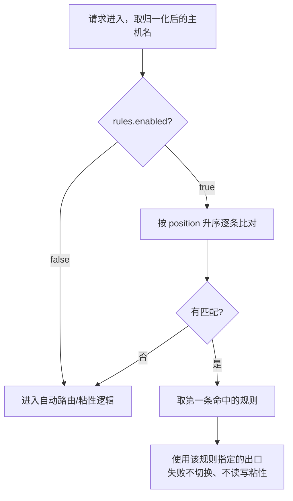

# RULES_CONFIG.md - 代理规则与配置说明

| 版本 | 日期 | 变更说明 | 作者 |
|------|------|----------|------|
| v1.0.0 | 2026-08-12 | 初始版本，参考 Privoxy actions 文件设计 | Agent |
| v1.1.0 | 2026-08-12 | 配置示例改用 `priority` 取代 `default_chain`；补充规则与优先级链的关系、Web 界面在线编辑说明 | Agent |
| v1.2.0 | 2026-08-12 | 同步 v1.3.0 的切换策略配置项；新增被墙站点是否需要写规则的说明 | Agent |
| v1.3.0 | 2026-08-13 | 评审修订：§4.2 改写匹配示例，明确「不短路、取最靠后匹配」语义；新增 §3.3.4 IPv6 与 IP 字面量匹配规则；§5.1 去除与 PRD 重复的完整配置副本；明确规则强制路由失败不切换、不写粘性 | Agent |
| v1.4.0 | 2026-08-13 | 设计评审回写：新增 §4.3.1 区分「规则指向不可用出口」的五种形态——名字不存在拒绝启动，已禁用改为告警 + 持续可见（原为一律拒绝启动），熔断与负面记忆不检查；配置示例改为 TOML | Agent |
| v2.0.0 | 2026-08-15 | **规则系统重构**：放弃 Privoxy 风格的文本规则文件，改为 Web 界面维护、`rules.db` 存储的两列规则表。匹配语义由 last-match-wins 改为 **first-match-wins**；匹配对象由「URL 或 host:port」收窄为**仅主机名**；域名后缀写法由 `.example.com` 改为 `*.example.com` 并新增通配符类型；新增 `[rules] enabled` 救场开关；删除 `rules.files` 配置键。旧格式差异见 §9 | Agent |

## 1. 概述

r-proxy 的规则系统解决一个问题：**让指定的目标主机走指定的出口**，绕过自动决策。

规则由 **Web 管理界面维护**，存储在 `rules.db`。用户不编写也不需要理解任何文本格式——界面呈现的是一张两列表格，左列写条件，右列从下拉框选出口。界面参照 [Proxy SwitchyOmega](https://github.com/FelisCatus/SwitchyOmega/wiki/Condition) 的「自动切换」规则表设计。

> **v2.0.0 之前**规则是 Privoxy 风格的文本文件（`forward` 动作行 + 模式行），由 `config.toml` 的 `rules.files` 声明多个文件按序加载。该形态已完全废弃，不提供兼容与自动导入。差异与迁移见 [§9](#9-与-v1-旧格式的差异)。

### 1.1 设计原则

| 原则 | 说明 |
|------|------|
| **首匹配优先** | 从上到下逐条比对，**第一条**命中的规则生效（first match wins） |
| **只匹配主机名** | 条件作用于目标主机名，不涉及协议、端口、路径、查询串 |
| **显式出口** | 每条规则必须指定 `direct` 或一个具名上级代理，没有「自动」这个选项 |
| **界面是唯一入口** | 规则的增删改排序全部经 Web 界面；不存在需要手工编辑的规则文件。除规则页外还有一处入口：粘性映射页的「固化为规则」，它把一条已经跑通的 `(host, 出口)` 写成规则并插到表首（[WEBUI_SPEC §2.3.1](./WEBUI_SPEC.md)） |
| **未命中即自动** | 没有任何规则命中时，流量走粘性映射与出口优先级链，具备故障自动切换能力 |

### 1.2 为什么只匹配主机名

正向代理对 HTTPS 流量只能看到 CONNECT 请求里的 `host:port`，看不到 URL 与路径。v1 的正则规则匹配完整 URL，因此**对所有 HTTPS 站点静默失效**——用户写一条 `^https://x\.com/api/`，拿 HTTP 站点测试看起来正常，一到 HTTPS 就不生效，且没有任何错误提示。

现代流量绝大多数是 HTTPS，按路径路由在正向代理里基本不可用。保留它的唯一效果是提供一个难以排查的陷阱，因此 v2.0.0 把匹配对象收窄为仅主机名，正则也改为对主机名求值。

### 1.3 两套「优先级」的区分

r-proxy 中有两个容易混淆的概念，请注意区分：

| 概念 | 作用对象 | 语义 | 定义位置 |
|------|----------|------|----------|
| **规则顺序** | 规则条目之间 | 首匹配优先（first match wins） | 界面表格中的行顺序（`rule.position`） |
| **出口优先级** | 上级代理之间 | 数字越小越优先，同值轮询 | `config.toml` 的 `upstreams[].priority` |

规则决定**选哪个出口**；出口优先级决定**自动模式下按什么顺序尝试**。**规则命中时不查询出口优先级**，直接使用规则指定的出口。

---

## 2. 存储与配置

### 2.1 规则存储在 rules.db

规则是结构化数据，存在独立的 SQLite 库中，与运行状态库、日志库分开：

| 文件 | 内容 | 唯一写者 |
|------|------|----------|
| `state.db` | 粘性映射、负面记忆、出口健康 | 写者线程 |
| `logs.db` | 请求日志、配置审计 | 写者线程 |
| **`rules.db`** | **规则表、规则版本号** | **配置写入器（Web 保存路径）** |

单独成库而不是塞进 `state.db`：`state.db` 的写连接由唯一写者线程持有，而保存规则需要「校验通过才写、事务内整体替换、同步等落盘后才能回响应、乐观锁冲突检测」这四件事，写者线程的批量合并循环一件都不做。若让配置写入器另开一个 `state.db` 写连接，就凭空多出第二个写者，违反 [PRD §4.9.5](./PRD_OVERVIEW.md) 的单一写者约束，并会让写者线程的批次落盘开始撞 `SQLITE_BUSY`。独立成库后「每个库只有一个写者」这条不变量仍然成立：`rules.db` 的唯一写者是配置写入器，代理核心只读它。

表结构与写入路径见 [DD_STORAGE.md](../design/DD_STORAGE.md) §3、§4.8。

### 2.2 config.toml 中与规则相关的部分

```toml
[rules]
# 救场开关。false 时忽略全部规则，所有流量走自动路由。
# 用途见 §2.3。默认 true。
enabled = true

[database]
state_path = "~/.r-proxy/state.db"
logs_path  = "~/.r-proxy/logs.db"
rules_path = "~/.r-proxy/rules.db"

# 规则中的出口名必须是这里定义的 name，或保留名 direct
[[upstreams]]
name = "home-proxy"
type = "http"
address = "192.168.1.100:7890"
priority = 10
enabled = true

[[upstreams]]
name = "office-proxy"
type = "http"
address = "10.0.0.1:8080"
priority = 10
enabled = true
```

完整的主配置结构以 [PRD_OVERVIEW.md](./PRD_OVERVIEW.md) §4.2.1 为准，此处只列与规则直接相关的部分，避免两份文档出现不一致的副本。

**`rules.files` 键已删除。** 若配置里仍留着它，**启动直接报错**并提示规则已改由 Web 界面管理。不静默忽略——静默忽略会让用户以为文件里的规则还在生效，而实际上所有流量都在走自动路由。

### 2.3 救场开关：[rules] enabled

规则进库后无法用文本编辑器修改，这带来一个运维风险：**r-proxy 本身在用户上网的路径上**。一条错误规则把流量全导向已经挂掉的出口，就足以让整台机器上不了网，而这时 Web 界面自己可能也访问不到。

`[rules] enabled = false` 是这种情况下的逃生口——`config.toml` 里改一个布尔值，启动与热重载时忽略全部规则，所有流量回到自动路由（带故障切换）。这恰好补回「能用编辑器救回来」这个把规则搬进数据库时放弃的性质。

| 时点 | 行为 |
|------|------|
| `enabled = false` 启动 | 内存规则集为空，`WARNING` 记录「规则已被全局禁用」 |
| Web 界面 | 规则页顶部常驻横幅提示规则当前未生效，表格仍可编辑与保存 |
| 改回 `true` | 热重载后规则立即恢复，库中数据从未被改动 |

规则数据本身不受影响，这个开关只影响是否加载。

### 2.4 备份

每次保存规则前，服务端把当前规则导出为一份**可读文本快照**写入 `backups/`，沿用 `config.toml` 现有的备份与轮转机制（保留份数由 `database.backup_keep` 控制，见 [WEBUI_SPEC.md](./WEBUI_SPEC.md) §6.2.1）。

快照格式为每行 `条件<TAB>出口名`，仅用于人工查阅与灾难恢复，**不是**受支持的输入格式——系统不从快照导入。

---

## 3. 条件语法

条件是界面表格左列里的一小段文本。类型由**写法自动推断**，用户不需要先选类型。

| 写法 | 类型 | 含义 |
|------|------|------|
| `*` | 全匹配 | 匹配所有主机。见 §3.6 的风险说明 |
| `*.google.com` | 域名及子域 | `google.com`、`www.google.com`、`a.b.google.com` 都命中 |
| `192.168.*` | 通配符 | `*` 可出现在任意位置，按整个主机名串匹配 |
| `www.google.com` | 精确主机 | 只命中这一个主机名 |
| `10.8.0.5` / `[2001:db8::1]` | IP 字面量 | 按解析后的地址比较，书写差异不影响 |
| `^cdn\d+\.corp` / `/pattern/` | 正则 | 对**主机名**求值 |

判定顺序必须互斥且无歧义，详见 [DD_RULES.md](../design/DD_RULES.md) §4.1。

### 3.1 域名及子域：`*.example.com`

```
*.example.com  →  office-proxy
```

匹配 `example.com`、`www.example.com`、`api.v2.example.com`；不匹配 `notexample.com`、`fakeexample.com`。

**`*.example.com` 包含 apex 域 `example.com` 本身。** 按通配符的一般语义 `*.example.com` 匹配不上 `example.com`（星号前那个点没有对应字符），但那不符合直觉——用户写这条规则时想表达的是「这个域名及其下所有主机」。因此这种形状被特殊识别为「域名及子域」类型，包含 apex。SwitchyOmega 的域名通配符也是这样处理的。

判定「是这种形状」的条件是：以 `*.` 开头，且其余部分不再含 `*`。`*.example.*` 不满足，按一般通配符处理，不含 apex 特例。

按点分段比较，不用字符串 `endswith`：分段法从结构上排除了 `notexample.com` 这类误伤。

### 3.2 通配符：`192.168.*`

`*` 展开为「任意字符任意次」，对整个主机名做全串匹配（首尾锚定）。

| 条件 | 命中 | 不命中 |
|------|------|--------|
| `192.168.*` | `192.168.1.10`、`192.168.31.7` | `10.192.168.1` |
| `api-*.corp` | `api-1.corp`、`api-prod.corp` | `api.corp`（缺少 `-`） |
| `*.example.*` | `www.example.com`、`a.example.co.uk` | `example.com` |

通配符补上了 v1 缺失的**网段匹配**能力。v1 只能用正则表达 `192.168.` 这类前缀（见 §9），写法别扭且容易出错。

只支持 `*` 一种元字符，不支持 `?` 与 `[abc]`。条件文本中除 `*` 以外的字符全部按字面处理，因此 `.` 就是点本身，不需要转义。

### 3.3 精确主机

```
api.github.com  →  direct
```

不含 `*`、不是 IP、不以 `^` 或 `/` 起止的条件即精确主机，只匹配完全相同的主机名。比较前统一转小写。

### 3.4 正则

```
^cdn\d+\.example\.com  →  home-proxy
/(^|\.)internal\.corp$/  →  direct
```

- 以 `^` 开头，或用 `/.../` 包裹，识别为正则
- 匹配对象是**主机名**，不是 URL；写成 `^https?://...` 的正则永不命中任何主机名
- 语义是 `re.search`，未锚定的模式会做子串匹配
- 长度上限 1000 字符；含嵌套量词（如 `(a+)+`）时给出 ReDoS 告警但不阻断

界面把正则放在「高级」提示之后：绝大多数需求用前四种类型就能表达，正则只在确实需要时使用。

### 3.5 IP 字面量与 IPv6

> 这里说的 IPv6 全部指**目标侧**。客户端一律为 IPv4，但目标站点可能是纯 IPv6（见 [PRD_OVERVIEW.md](./PRD_OVERVIEW.md) §4.2.4）。规则里出现 IPv6 字面量的场景不多——用户通常访问域名——但目标 URI 中确实可能带 IPv6 字面量，因此必须能正确匹配。

| 目标形式 | 条件写法 | 是否支持 |
|----------|----------|----------|
| IPv4 精确 | `192.168.1.10` | 是 |
| IPv4 网段 | `192.168.*` | 是（v2.0.0 新增，v1 需用正则） |
| IPv6 精确 | `[2001:db8::1]` | 是。裸写 `2001:db8::1` 也接受（条件不含端口，无分隔歧义），但**推荐带方括号**，界面产出的也是带括号形式 |
| IPv6 简写差异 | `[2001:db8::1]` 与 `[2001:0db8:0:0:0:0:0:1]` | 是，比较前先规范化，两种写法等价 |
| IPv6 前缀 | `2001:db8:*` | 是（作为通配符对主机名串匹配，非 CIDR 语义） |
| CIDR 前缀长度 | `10.0.0.0/8` | **否**，本期不支持 |
| IPv6 zone id | `[fe80::1%eth0]` | **否**，解析报错 |

规范化规则：

- 规则编译时与请求匹配时都用 `ipaddress.ip_address()` 解析，成功则以规范化后的地址比较，失败则按域名字符串处理
- 因此 IPv6 地址的大小写、前导零、`::` 压缩位置差异都不影响匹配
- 方括号是 RFC 3986 对 URL 中 IPv6 字面量的要求（`http://[2001:db8::1]:8080/`），条件中保持一致写法

**域名及子域规则不会误匹配 IP**：`*.1.10` 不会匹配 `192.168.1.10`，因为 host 被识别为 IP 后走地址比较分支，不进入后缀匹配。通配符类型则是纯字符串匹配，`192.168.*` 对 IP 主机同样生效，这是它的用途所在。

**无方括号的 IPv6 目标会被拒绝**：`CONNECT 2001:db8::1:443` 中端口边界无法无歧义确定，代理直接返回 `400`，这类请求根本到不了规则匹配阶段。

**规则不能改变目标的地址族**：规则只决定走哪个出口。若目标是纯 IPv6 而规则强制指定了 `direct`，在本机无 IPv6 能力时该请求会失败——规则是强制路由，不会回退到其他出口（见 §4.4.1 第 5 种形态与 §7 Q2）。需要访问纯 IPv6 目标时，规则应指向具备 IPv6 出口能力的上级代理。

### 3.6 条件不接受端口

条件只匹配主机名，`example.com:8443` 这类写法**保存时直接报错**。

这是刻意的：v1 中这种写法会被当成一条精确主机规则，而请求侧的主机名从不含端口，于是它永远不会命中——静默失效且极难排查。明确拒绝比默默接受一条死规则好。

判定必须放在 IP 识别之后，否则 `2001:db8::1` 会因为含冒号被误判为「带端口」。

### 3.7 `*` 全匹配的风险

`*` 是合法条件，但保存时会给出**告警**：

> 全匹配规则会让所有流量强制走指定出口，该出口故障时不会自动切换到其他出口。

原因是规则命中即强制路由、失败不切换（§4.3）。一条 `*` 规则等于给所有流量关掉故障自动切换，出口一挂全站不通。真正需要「默认走某个出口，但它挂了能自动换」的场景应该用出口优先级，而不是写一条 `*` 规则（见 §7 Q5）。

告警不阻断保存：确实存在「我明确只允许经这个出口出网」的场景。

---

## 4. 匹配语义

### 4.1 匹配流程



### 4.2 首匹配胜出

规则按界面上的行顺序（`position` 升序）比对，**第一条命中的即生效**，其后的规则不再考虑。

> **这是 v2.0.0 的语义变更。** v1 沿用 Privoxy 的 last match wins：不短路、比对全部规则、取位置最靠后的一条。改成首匹配胜出的理由是它符合直觉且与 SwitchyOmega 一致——「上面的规则更重要」是用户看到一张有序表格时的默认预期，而 last match wins 要求用户反向思考，还带来「宽规则必须写在前面」这条反直觉的约束。

示例规则表：

| # | 条件 | 出口 |
|---|------|------|
| 1 | `www.github.com` | `direct` |
| 2 | `*.github.com` | `office-proxy` |
| 3 | `192.168.*` | `direct` |

| 请求主机 | 命中 | 最终出口 |
|----------|------|----------|
| `www.github.com` | 第 1 条 | `direct` |
| `api.github.com` | 第 2 条 | `office-proxy` |
| `github.com` | 第 2 条（`*.github.com` 含 apex） | `office-proxy` |
| `192.168.1.10` | 第 3 条 | `direct` |
| `www.google.com` | 无 | 自动路由 |

窄规则要放在宽规则**之前**。若把第 2 条移到第 1 条之前，`www.github.com` 会先命中 `*.github.com`，第 1 条永远不生效——界面会在保存时对这种情况给出遮蔽告警（§6.2）。

### 4.3 未命中时的兜底

没有任何规则命中时，流量进入自动路由：粘性映射 + 出口优先级链 + 健康检查 + 故障自动切换。

界面表格底部固定显示一行**只读说明**：「其余流量：自动选择（按优先级与健康状态，失败时自动切换）」。

**这一行不是可配置的下拉框**，这是与 SwitchyOmega 的一处刻意差异。SwitchyOmega 表格末尾的「默认情景模式」可以指定一个具体代理，但在 r-proxy 里那等价于加一条 `*` 强制规则，会把整个自动故障切换机制关掉（§3.7）。做成只读说明既保留了「一屏看完全部分流逻辑」的观感，又不给出误配的机会。

### 4.4 规则与粘性的关系

| 情况 | 行为 |
|------|------|
| 规则命中 | **强制**使用规则指定出口；既不读也不写粘性映射，不参与优先级切换，失败时原样返回错误（见 [PRD_OVERVIEW.md](./PRD_OVERVIEW.md) §3.1） |
| 规则未命中 | 查内存粘性缓存（持久化副本在 `state.db` 的 `host_upstream` 表），再按**出口优先级链**补位 |
| 规则保存后热重载 | 重新匹配；规则变更可能导致出口变化，与粘性无关 |
| 规则指定的出口不可用 | 分五种情况，见 §4.4.1 |

#### 4.4.1 规则指定的出口不可用

「不可用」在系统中有五种形态，其中只有前两种在启动校验阶段可知，也只有它们涉及「要不要拒绝启动」：

| 形态 | 何时可知 | 处理 |
|------|----------|------|
| 1. 出口名**不在** `upstreams` 中（拼写错误） | 启动时，静态 | **拒绝启动**，指出规则序号与条件 |
| 2. 出口存在但 `enabled = false` | 启动时，静态 | **告警**，不阻断启动；命中时返回 `502` |
| 3. 出口处于熔断 `open` | 运行时 | **不检查**，照常尝试 |
| 4. 出口对该 host 有负面记忆 | 运行时 | **不检查**，照常尝试 |
| 5. 出口为 `direct`、目标地址为纯 IPv6、本机无 IPv6 出口能力 | 运行时 | 不发起连接，返回 `502`，原因 `ipv6_unavailable` + 规则序号 |

**为什么第 1 种拒绝启动而第 2 种不：** 第 1 种是拼写错误，不存在任何场景下它是故意的。第 2 种则是用户的刻意行为，且常见：

- 排查故障时临时禁用某出口，观察现象是否消失
- 上级代理计划维护，先禁用以免刷屏失败日志与触发熔断
- 线路暂时不用但保留配置（地址与凭据不便找回）
- 一份配置多环境使用，在家禁用 `office-proxy`，到公司再启用

这些操作中用户通常**不会同时改规则**。`enabled` 是变动频繁的运维开关，而规则表达的是稳定的路由意图，两者变化频率相差很大。要求同步修改，等于把高频操作绑死在低频配置上——排查完问题若忘了改回规则，下次启动就会失败。

> Web 界面能减轻但消除不了这个问题：界面在出口被禁用时会实时标出受影响的规则（§6.3），但用户仍可能在禁用出口后直接离开界面。

**第 3、4 种不检查的理由：** 熔断与负面记忆是系统基于历史观测做出的**推断**，而规则是用户的**明确指令**。因系统推断而拒绝执行用户指令，会让用户认为规则失效了。让它去尝试并失败，语义更清晰。

**告警必须是持续可见的状态，不能只是一行启动日志：**

| 时点 | 表现 |
|------|------|
| 启动 / 重载 | `WARNING`，形如 `规则 #12（api.partner.com）→ office-proxy 已被禁用，命中该规则的请求将返回 502` |
| Web 界面 | 常驻横幅（非一次性提示）+ 表格内该行标记，直到问题消失才撤除；数据来自 `GET /api/status` 的配置问题列表 |
| 命中该规则的请求 | `502`，`request_log` 记录 `rule_target_disabled` 与规则序号 |
| 其他流量 | 完全不受影响 |

### 4.5 决策优先级总览

```
1. 规则命中          → 使用规则指定出口（终止决策）
2. manual 粘性映射    → 使用手动绑定出口
3. auto 粘性映射      → 使用上次成功出口，失败后按优先级链补位
4. 出口优先级链       → 按 priority 升序，同优先级组内轮询
```

---

## 5. 界面操作

规则页是一张四列表格，详细交互见 [WEBUI_SPEC.md](./WEBUI_SPEC.md) §2.4。

| 列 | 内容 |
|----|------|
| 拖动手柄 | 拖拽调整顺序；同时提供上移/下移按钮，供键盘与触屏使用 |
| 条件 | 文本输入，失焦即做语法预检，出错就地标红 |
| 出口 | 下拉框，选项为 `direct` 加所有已配置出口 |
| 删除 | 移除该行 |

表格底部是 §4.3 的只读兜底说明行。「添加规则」在末尾追加空行。

保存是**整表提交**：界面把完整的有序列表发给服务端，服务端在一个事务里整体替换。因此不存在「保存了一半」的中间状态。

---

## 6. 校验与调试

### 6.1 保存时校验（错误，阻断保存）

| 检查 | 错误示例 |
|------|----------|
| 条件非空 | 空白条件 |
| 条件不含端口 | `example.com:8443` |
| 正则可编译且不超长 | `^(unclosed` |
| 方括号内是合法 IPv6 | `[2001:db8::zz]` |
| 不含 IPv6 zone id | `[fe80::1%eth0]` |
| 出口名存在于 `upstreams` 或为 `direct` | `typo-proxy` |

校验失败时**不写库**，一次返回全部问题，界面高亮所有出错行。错误定位为规则在提交列表中的下标，形如 `rules[3]`。

### 6.2 保存时告警（不阻断）

| 检查 | 告警内容 |
|------|----------|
| `*` 全匹配 | 会禁用故障切换（§3.7） |
| 条件重复 | 后出现的那条永远不会生效 |
| 条件被前面的更宽条件遮蔽 | 例如 `*.google.com` 在 `www.google.com` 之前，后者永不生效 |
| 正则含嵌套量词 | 可能导致灾难性回溯 |

遮蔽检测只覆盖可判定的组合：`*` 之后的一切、域名及子域对其下精确主机与子域、完全重复。**正则之间以及正则与其他类型的包含关系不做检测**——那在一般情况下不可判定。

### 6.3 出口禁用/删除的联动

| 操作 | 界面行为 |
|------|----------|
| 禁用某出口 | 规则页对引用它的行显示警示标记，状态页显示常驻横幅（§4.4.1） |
| 删除某出口 | 若有规则引用则**拒绝删除**，返回引用它的规则条数，详情列出各条规则的序号与条件 |

### 6.4 日志

```
[INFO] rule-match host=www.github.com → direct (rule #1: www.github.com)
[INFO] rule-match host=api.partner.com → office-proxy (rule #12: api.partner.com)
[DEBUG] no-rule host=www.google.com → sticky=home-proxy (db)
```

### 6.5 路由测试

界面与 CLI 共用同一个决策入口，保证结果与真实请求一致。

```bash
r-proxy route-test --url "http://www.github.com/foo"

# matched: rule #1 (www.github.com)
# forward: direct
# source: rule
# chain: [direct]
```

未命中规则时输出按优先级构造的完整候选链：

```
# matched: (none)
# forward: home-proxy
# source: sticky
# chain: [home-proxy(P10), office-proxy(P10), backup-proxy(P50), direct(P100)]
```

---

## 7. 常见问题

### Q1: 为什么我的正则对 HTTPS 不生效？

v2.0.0 起不会再出现这个问题：正则对**主机名**求值，HTTP 与 HTTPS 行为一致。若你从 v1 迁移，原先写成 `^https?://...` 的正则需要改掉那段协议前缀，见 §9。

### Q2: 规则指定的代理失败了怎么办？

规则是强制路由，**不自动切换**，原样返回错误。需要故障转移就不要写规则，用出口优先级（Q5）。

### Q3: 如何清空某 host 的自动粘性？

```bash
r-proxy sticky-clear example.com
```

或在 Web 界面的「粘性映射管理」中删除，也可直接操作 SQLite：

```sql
DELETE FROM host_upstream WHERE host = 'example.com';
```

### Q4: 规则和出口优先级冲突时以哪个为准？

规则优先。规则命中后直接使用其指定的出口，完全跳过优先级链与粘性逻辑。出口优先级只在**没有规则命中**时生效。

### Q5: 想让某个 host 优先走 A、A 挂了再走 B，该用规则还是优先级？

用**优先级**，不要用规则。规则是强制路由，不参与自动切换。把 A 的 `priority` 设小于 B，让该 host 走自动决策即可获得故障转移能力。

### Q6: 如何让某几个代理分担负载？

给它们配置**相同的 `priority`**。同优先级组内采用轮询，既分担负载又保留组内故障转移。

### Q7: 被墙的站点（如 google.com）要不要写规则强制走代理？

**不需要**，交给自动决策更好。首次访问时直连超时会触发切换，成功的出口写入粘性映射，此后直接命中，无需人工维护清单。

若确实想避免首次访问的等待，可给 `direct` 配置更短的 `connect_timeout`（示例中为 3 秒），比维护一份「被墙域名清单」更省心。只有在你**明确不希望**某站点走自动决策时才写规则。

### Q8: 规则会不会拖慢请求？

不会。规则在启动与热重载时编译成不可变的内存结构，精确主机、域名后缀、IP 三类走哈希查表，请求路径上**既不读文件也不查数据库**（[PRD §4.4.4](./PRD_OVERVIEW.md) 禁止热路径同步 I/O）。只有通配符与正则是线性比对，条数多且主机名长时才有可感开销。

### Q9: 规则存在数据库里，出问题了怎么救？

改 `config.toml` 的 `[rules] enabled = false` 并重载，全部规则立即停用、流量回到自动路由（§2.3）。另外 `backups/` 下有每次保存前的可读文本快照可供查阅（§2.4）。

---

## 8. 验收要点

| 场景 | 期望 |
|------|------|
| 同时匹配多条规则 | 取 `position` 最小者（首匹配胜出） |
| `*.example.com` 对 `example.com` | 匹配（含 apex） |
| `*.example.com` 对 `notexample.com` | 不匹配 |
| `*.example.*` 对 `example.com` | 不匹配（非 apex 特例形状） |
| `192.168.*` 对 `192.168.1.10` | 匹配 |
| `192.168.*` 对 `10.192.168.1` | 不匹配（全串锚定） |
| `[2001:0db8::1]` 条件 vs `[2001:db8::1]` 目标 | 规范化后匹配 |
| `[2001:db8::zz]` 条件 | 保存报错，不退化为域名 |
| `[fe80::1%eth0]` 条件 | 保存报错（zone id 不支持） |
| `example.com:8443` 条件 | 保存报错（条件不接受端口） |
| `^https?://x\.com/` 条件 + 任意请求 | 不命中（正则对主机名求值） |
| 出口名不存在 | 保存报错；启动时拒绝启动 |
| 出口被禁用 | 保存通过 + 告警；命中时 `502` |
| 多处错误 | 一次返回全部 |
| `*` 规则 | 保存通过 + 告警 |
| `*.google.com` 在 `www.google.com` 之前 | 保存通过 + 遮蔽告警 |
| 保存时 `revision` 不匹配 | `409`，库未改动 |
| 保存校验失败 | 库未改动，`revision` 不变 |
| `rules.enabled = false` | 规则集为空，全部流量走自动路由 |
| 配置中残留 `rules.files` | 启动报错并提示迁移 |
| 规则命中 | `switchable=False`，候选链长度为 1 |
| 路由测试与真实请求 | 结果一致（共用 `build_chain`） |

---

## 9. 与 v1 旧格式的差异

v1 的 Privoxy 风格文本规则已完全废弃，**不提供兼容层与自动导入**。仓库未随包发布任何 `.rules` 文件，因此没有需要迁移的默认规则。

### 9.1 逐项对照

| 项目 | v1 | v2.0.0 |
|------|----|--------|
| 存储 | `config.toml` 的 `rules.files` 声明的多个文本文件 | 单一 `rules.db` |
| 编辑方式 | 文本编辑器（服务器上或 Web 的文本框） | Web 表格界面 |
| 语法结构 | `forward <出口>` 动作行 + 若干模式行 | 每条规则一行两列：条件 + 出口 |
| 匹配顺序 | last match wins（不短路，取最靠后） | **first match wins**（短路，取最靠前） |
| 文件优先级 | 后加载的文件覆盖先加载的 | 不适用（单一有序列表） |
| 匹配对象 | 完整 URL（HTTP）或 `host:port`（CONNECT） | **仅主机名** |
| 域名后缀 | `.example.com` | `*.example.com` |
| 通配符 | 不支持 | 支持，`*` 可在任意位置 |
| 网段匹配 | 需用正则 | `192.168.*` |
| 正则匹配对象 | 完整 URL（对 CONNECT 静默失效） | 主机名 |
| 全匹配 | `*`，且必须写在最前 | `*`，保存时告警 |
| 注释 | 支持 `#` | 不支持 |
| 错误定位 | `user.rules:12` | `rules[3]` / 规则序号 |
| 并发保护 | 文件内容 sha256 前 16 位 | `rules.db` 内的整数 `revision` |
| 全局停用 | 无（需清空文件） | `[rules] enabled = false` |

### 9.2 条件写法的换算

| v1 写法 | v2 写法 | 说明 |
|---------|---------|------|
| `*` | `*` | 不变，但需注意顺序语义反了 |
| `.example.com` | `*.example.com` | 前导点改为 `*.` |
| `api.github.com` | `api.github.com` | 不变 |
| `192.168.1.10` | `192.168.1.10` | 不变 |
| `[fd00::1]` | `[fd00::1]` | 不变 |
| `^https?://([^/]+\.)?google\.com/` | `*.google.com` | 绝大多数 URL 正则的真实意图是域名匹配，直接换成域名及子域 |
| `^https?://\[fd00:` | `fd00:*` | 前缀匹配改用通配符 |
| `^https?://.*\.cn/` | `*.cn` | 同上 |

若确实需要保留正则，去掉 `^https?://` 前缀并改为对主机名的模式。

### 9.3 旧配置的处理

```toml
# v1：启动会报错
[rules]
files = ["rules/default.rules", "rules/user.rules"]

# v2：改成
[rules]
enabled = true
```

启动时若检测到 `rules.files`，报错信息明确指出该键已废弃、规则改由 Web 界面管理、以及应改成什么。`.rules` 文件本身不会被删除或读取，用户可自行备份后清理。

---

## 10. 相关文档

- [PRD_OVERVIEW.md](./PRD_OVERVIEW.md) — 产品需求总览
- [WEBUI_SPEC.md](./WEBUI_SPEC.md) — Web 管理界面需求与 REST API
- [DD_RULES.md](../design/DD_RULES.md) — 规则引擎详细设计：条件编译、匹配器、从库加载
- [DD_STORAGE.md](../design/DD_STORAGE.md) — `rules.db` 表结构与写入路径
- [SwitchyOmega Condition 文档](https://github.com/FelisCatus/SwitchyOmega/wiki/Condition) — 界面形态与条件类型的参照来源
