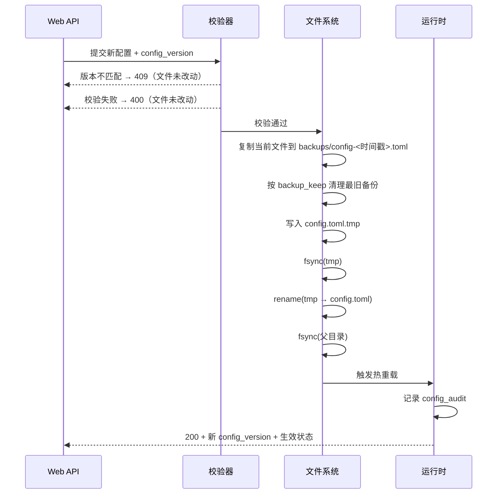

# WEBUI_SPEC.md - Web 管理界面需求说明

| 版本 | 日期 | 变更说明 | 作者 |
|------|------|----------|------|
| v1.0.0 | 2026-08-12 | 初始版本，定义五大功能模块、REST API 与安全要求 | Agent |
| v1.1.0 | 2026-08-12 | 数据库写入并入代理核心的单一写者队列；读取改用只读连接；补充 manual 绑定保护 | Agent |
| v1.2.0 | 2026-08-12 | 新增路由级负面记忆的展示与解除；设置模块补充切换限流、隧道窗口等参数与风险提示 | Agent |
| v1.3.0 | 2026-08-13 | 评审修订：固定单进程（§1.2.1）；查询强制 `to_thread`（§1.2.2）；标注基准测试条件（§1.1）；定义 `config_version` 与外部编辑检测（§6.4.1）；新增配置操作审计（§6.5）；备份改为多份保留（§6.2.1）；细化认证适用范围与 token 校验（§7.1）；拖拽优先级上限保护（§2.2） | Agent |
| v1.4.0 | 2026-08-13 | 配置格式由 YAML 改为 TOML（理由见 [PRD_OVERVIEW.md](./PRD_OVERVIEW.md) §4.2.1b）；新增 §6.2.2 要求写回使用 `tomlkit` 风格保留往返以保住用户注释 | Agent |
| v2.1.0 | 2026-08-16 | 新增「固化为规则」：§2.3 能力表补该动作并新增 §2.3.1（粘性与规则的语义差异、条件形态、插表首、重复拒绝、成功后清粘性）；§3.3 新增 `POST /api/sticky/{host}/promote` 及其请求响应示例。同时修正 §2.3：粘性来源只有 `auto`/`manual`，**没有** `rule`——命中规则的请求既不读也不写粘性映射 | Agent |
| v2.0.1 | 2026-08-16 | M5 实现回写：§6.4.2 明确 `revision` 比对做两次（锁内一次、事务内一次），并补「库不存在视同空表、读路径不建库」 | Agent |
| v2.0.0 | 2026-08-15 | **规则编辑重构为表格界面**：§2.4 由「多文件 + 文本编辑器」改写为两列表格（条件 + 出口下拉）+ 只读兜底行，参照 SwitchyOmega；§3.4 接口改为整表 `GET/PUT /api/rules`，删除 `{file_id}` 路径参数；§6.1 明确两个权威来源（`config.toml` 与 `rules.db`）；§6.2.1 备份新增规则文本快照并按来源分别计数；新增 §6.4.2 整数 `revision` 乐观锁；§6.6 说明规则写入是唯一不经写者队列的写入；§7.3 路径穿越面随规则入库整体消失；§8 新增 WT-18 ~ WT-30 | Agent |

## 1. 概述

Web 管理界面是 r-proxy 的**本期 P0 功能（G-08）**，为管理员提供浏览器端的运行监控与配置管理能力，覆盖上级代理优先级、粘性映射、路由规则与全局参数。

### 1.1 技术选型

| 层次 | 选型 | 说明 |
|------|------|------|
| 后端 | FastAPI + Uvicorn | REST API，自带 OpenAPI 文档 |
| 前端 | 静态单页应用（原生 HTML/CSS/JS 或轻量构建产物） | 由 FastAPI 的 `StaticFiles` 托管，无需独立 Web 服务器 |
| 数据读取 | SQLite 只读连接（`mode=ro`）+ 运行时内存状态 | WAL 模式下不阻塞写者，见下方基准条件 |
| 数据写入 | 投递到代理核心的单一写者队列 | **禁止**直连写库，见 §6.6 |
| 配置写入 | TOML 原子写回，保留注释 | 见 §6、§6.2.2 |

**只读查询延迟的基准条件**（数据来自 [../../study/sqlite-storage-benchmark.md](../../study/sqlite-storage-benchmark.md) §4.4）：

| 项目 | 取值 |
|------|------|
| 查询语句 | `SELECT * FROM request_log WHERE host=? ORDER BY created_at DESC LIMIT 50` |
| 索引 | `idx_log_host (host, created_at)`，为覆盖该查询而建 |
| 表规模 | 10 万行 |
| 并发条件 | 写者线程持续批量插入（每批 500 行）的同时读取 |
| 存储介质 | NVMe SSD |
| 采样 | 20 次，`avg = 0.26ms`、`max = 1.10ms` |

> 该数字**只代表走索引的单 host 分页查询**。无索引的模糊搜索、跨 host 的聚合统计（如按状态码分组计数全表）会随数据量线性变慢，不能套用此延迟。因此：分页查询必须能命中索引；聚合类统计走内存中的健康状态表，而非对 `logs.db` 做全表扫描。

### 1.2 部署形态

```bash
pip install "r-proxy[web]"    # 安装含 Web 界面的完整版
r-proxy                        # 代理 :6060 + Web :6061
r-proxy --no-web               # 仅代理，不加载 Web 模块
```

- Web 界面与代理服务运行在**同一进程、同一事件循环**的不同 asyncio 任务中，共享路由决策器与存储层实例
- `webui.enabled: false` 时不导入 FastAPI，代理核心保持零第三方依赖

#### 1.2.1 进程数必须为 1

Uvicorn 支持 `workers > 1` 多进程模式，但本项目**必须**以单进程运行：

| 约束 | 说明 |
|------|------|
| `webui.workers` | 固定为 `1`。配置为其他值时启动失败并给出明确报错，而非静默降级 |
| 启动方式 | 以编程方式在代理进程内启动 `uvicorn.Server`，**不使用** `uvicorn --workers N` 或 `--reload` 命令行 |

理由：多 worker 会 fork 出多个进程，每个进程都持有自己的写者线程与内存状态，直接摧毁三个不变量——

1. **单一写者**：多个进程同时写 `state.db` 会触发 `SQLITE_BUSY` 与丢更新（实测 4 个并发写者丢失 75% 的计数，见 [../../study/sqlite-storage-benchmark.md](../../study/sqlite-storage-benchmark.md) §4.2）
2. **内存权威**：熔断状态与粘性 LRU 缓存在各进程间不共享，出口在 worker A 已熔断而 worker B 仍在重试
3. **配置热重载**：`config.toml` 写回后只有处理该请求的 worker 重新加载，其余 worker 状态陈旧

由于 Web 界面的负载是单个管理员的浏览器，单进程的性能完全够用，多 worker 没有收益。

#### 1.2.2 数据库查询不得阻塞事件循环

`sqlite3` 是同步阻塞库。Web 与代理共用一个事件循环，若在 API 处理函数中直接调用 `cursor.execute()`，查询期间**所有代理连接的数据转发都会停摆**。

| 场景 | 要求 |
|------|------|
| 所有 `logs.db` / `state.db` 只读查询 | 必须经 `await asyncio.to_thread(...)` 放入线程池执行 |
| 只读连接的创建 | 每个线程各自创建（`sqlite3` 连接默认不可跨线程），或使用连接池 |
| 内存状态读取（健康表、熔断状态） | 直接同步读取，无 I/O，不需要 `to_thread` |
| 单次查询的行数 | 必须带 `LIMIT`，默认 50、上限 1000，防止一次拉取全表 |

即使单次查询只要 0.26ms，在 3 秒轮询 + 多个面板并发请求下累积的阻塞仍然可观，且慢查询（无索引搜索）会造成秒级停摆。这条要求没有例外。

### 1.3 访问入口

| 项目 | 值 |
|------|-----|
| 默认地址 | `http://127.0.0.1:6061` |
| API 前缀 | `/api` |
| OpenAPI 文档 | `/api/docs` |
| 静态资源 | `/` |

---

## 2. 功能模块

### 2.1 监控看板（Dashboard）

**目标**：一眼看清代理当前是否健康、流量走向哪些出口。

| 区块 | 内容 |
|------|------|
| 概览卡片 | 总请求数、成功率、平均延迟、当前活跃连接数、运行时长 |
| 出口健康表 | 每个出口的优先级、熔断状态、连续失败数、成功/失败累计、平均延迟、最近使用时间 |
| 实时请求日志 | 时间、host、URL、使用的出口、优先级、尝试序号、状态码/错误、耗时 |
| 切换事件流 | 仅展示发生了代理切换的请求，标注切换路径（如 `home-proxy(P10) → backup-proxy(P50)`） |

**交互要求：**

- 请求日志支持按 host、出口名称、状态码、时间范围筛选
- 支持分页，默认每页 50 条，按时间倒序
- 实时刷新通过轮询实现（默认 3 秒，可暂停）；不引入 WebSocket 以降低复杂度
- 出口健康表提供「手动重置熔断」按钮

### 2.2 上级代理管理（Upstreams）

**目标**：可视化管理出口及其优先级，这是自动切换顺序的唯一来源。

| 能力 | 说明 |
|------|------|
| 列表展示 | 名称、类型、地址、**优先级**、启用状态、健康状态 |
| 新增 | 创建 HTTP 上级代理或 direct 出口 |
| 编辑 | 修改地址、优先级、启用开关 |
| 删除 | 删除前检查是否被规则引用，被引用时拒绝并提示引用位置 |
| 优先级调整 | 支持直接编辑数值；同时提供拖拽排序，拖拽后自动重算优先级数值 |
| 启用/禁用 | 快捷开关，禁用后立即从候选链移除 |
| 连通性测试 | 对指定出口发起一次探测请求（目标可配置，默认 `http://www.gstatic.com/generate_204`），返回延迟与结果 |

**优先级编辑规则：**

- 数值范围 `1`–`999`，数字越小优先级越高
- 允许多个出口共用同一数值，界面明确提示「同优先级将轮询使用」
- 保存前校验：至少保留 1 个启用的出口

**拖拽重算的步长规则**：默认按 `10, 20, 30...` 分配，为后续插入预留间隔。但固定步长 10 在出口较多时会突破上限（第 100 个出口即为 `1000`），因此步长按分组数动态确定：

| 优先级分组数 | 步长 | 最大值 |
|--------------|------|--------|
| ≤ 99 | 10 | 990 |
| 100–199 | 5 | 995 |
| ≥ 200 | 1 | 999 |

拖拽后若仍超出 `999`（分组数 > 999），拒绝保存并提示手动整理优先级。这是个不会在正常使用中出现的边界，但需要有确定行为而非静默截断——静默截断会让两个本应不同优先级的出口意外合并成轮询组，改变路由行为。

拖拽只重排**分组**而非单个出口：同优先级的多个出口作为一个整体移动，避免拖拽操作意外拆散轮询组。

**界面示意：**

```
┌─ 上级代理 ────────────────────────────────────────────────┐
│ 优先级  名称           类型    地址                 状态   │
│ ──────────────────────────────────────────────────────── │
│  10  ⠿ home-proxy     http   192.168.1.100:7890   ● 正常  │
│  10  ⠿ office-proxy   http   10.0.0.1:8080        ● 正常  │
│      └ 同优先级组：轮询负载均衡                            │
│  50  ⠿ backup-proxy   http   203.0.113.50:3128    ◐ 熔断  │
│ 100  ⠿ direct         direct  —                   ● 正常  │
└──────────────────────────────────────────────────────────┘
```

### 2.3 粘性映射管理（Sticky Mappings）

**目标**：查看并干预「host → 上级代理」的自动记忆结果。

| 能力 | 说明 |
|------|------|
| 列表展示 | host、当前出口、来源（`auto`/`manual`）、最近成功时间、最近状态码、连续失败数 |
| 负面记忆展示 | 该 host 上被标记为 `route_error` 的出口及其屏蔽到期时间（对应 `route_block` 表） |
| 清除负面记忆 | 手动解除某 `(host, upstream)` 的屏蔽，立即让该出口重新参与候选 |
| 搜索 | 按 host 前缀/包含匹配 |
| 手动改绑 | 为指定 host 强制绑定某个出口，`source` 置为 `manual` |
| **固化为规则** | 把这条映射写成一条规则，见 §2.3.1 |
| 清除单条 | 删除映射，下次请求重新按优先级选择 |
| 批量清除 | 按出口名称批量清除（如某代理下线后清空其全部绑定） |
| 排序 | 按最近使用时间、失败次数排序 |

**语义约定：**

- `manual` 映射优先级高于 `auto`，且**不会**因失败被自动清除，仅在管理员手动解除或触发失败阈值时给出告警
- 来源只有 `auto` 与 `manual` 两种。**没有 `rule` 来源**：命中规则的请求既不读也不写粘性映射（[RULES_CONFIG.md](./RULES_CONFIG.md) §4），因此规则强制的绑定不会出现在这张表里

#### 2.3.1 固化为规则（Promote）

**目标**：把一次「自动学到的成功选路」升级为一条永久的路由规则。

粘性映射与规则不是「不那么持久」与「更持久」的关系，而是两种不同的东西：

| | 粘性映射 | 规则 |
|---|----------|------|
| 对候选链的作用 | 把该出口提到链首，其余候选仍在 | 候选链长度恒为 1 |
| 失败时 | 照常自动切换到下一个候选 | 原样返回 `502`，**不切换** |
| 表达能力 | 一 host 一条 | 一条 `*.example.com` 覆盖域名及子域 |
| 容量 | 受 `sticky_cache_size` LRU 淘汰 | 不淘汰 |

因此固化是一次**语义变更**：以放弃该 host 的自动故障切换为代价，换取确定性。想要「优先走它但保留兜底」的用户要的是手动改绑（`manual` 粘性），不是规则。

| 要求 | 说明 |
|------|------|
| 确认前必须说明后果 | 面板上写明「命中后强制走该出口，失败不再自动切换」。不说的话用户会以为这只是「记得更牢一点」 |
| 条件默认精确主机名，可改 | 另给一个「改为 `*.上级域`」的快捷项（`api.github.com` → `*.github.com`）。**不自动推断**：没有公共后缀表就判不出 `*.com.cn`、`*.github.io` 这类会误伤他人域名的情形 |
| 出口取该行当前使用的出口 | 想换出口就先改绑再固化，一个动作只做一件事 |
| 新规则插到规则表**首位** | 首匹配胜出下，表尾的新规则只要前面有 `*` 或更宽的 `*.apex` 就永远不会命中——保存成功却毫无效果是最难查的失败形态 |
| 条件与表内已有条件重复 | 拒绝（`409`），并告知已有那条的位置，让用户去规则页改它。不允许在表首堆出一条让原规则永不生效的死行 |
| 出口已禁用 | 拒绝（`409`）。规则指向禁用出口在路由层是死路，链上没有顺延余地 |
| 固化成功后清除该粘性映射 | 规则接管后它再也不会被读到，留着只会显示一个不再变化的命中数 |
| 校验失败时不动粘性 | 条件非法、条件重复、出口禁用都不得连带清掉一条本来有用的绑定 |
| 提示已有更宽规则 | 该 host 原先命中过某条规则时，成功提示里说明「那条从此对该 host 不再生效」 |
| 规则功能已关闭时 | `[rules] enabled = false` 时规则写得进去但不生效，提示语必须说出来 |

### 2.4 规则编辑（Rules）

**目标**：用一张表格维护路由规则，用户不接触任何文本格式。界面形态参照 [Proxy SwitchyOmega](https://github.com/FelisCatus/SwitchyOmega/wiki/Condition) 的「自动切换」规则表。

> **v2.0.0 变更**：原为「多个规则文件 + 文本编辑器」，现为「单一规则表 + 表格界面」。规则存储在 `rules.db`，不再有规则文件，文本编辑器整体移除。语义与语法详见 [RULES_CONFIG.md](./RULES_CONFIG.md)。

#### 2.4.1 表格结构

| 列 | 控件 | 说明 |
|----|------|------|
| 拖动手柄 | 拖拽 | 调整规则顺序 |
| 条件 | 文本输入 | 如 `*.google.com`、`192.168.*`、`api.github.com` |
| 出口 | 下拉框 | 选项为 `direct` 加所有已配置出口名 |
| 操作 | 上移 / 下移 / 删除 | 上下移按钮是**必需**的，不是拖拽的可选替代 |

表格底部固定一行**只读说明**：「其余流量：自动选择（按优先级与健康状态，失败时自动切换）」。

**这一行不做成可配置的下拉框**，这是与 SwitchyOmega 的刻意差异。SwitchyOmega 末尾的「默认情景模式」可指定具体代理，但在 r-proxy 里那等价于一条 `*` 强制规则，会关掉整个自动故障切换（[RULES_CONFIG.md](./RULES_CONFIG.md) §4.3）。只读说明保留了「一屏看完全部分流逻辑」的观感，又不给误配的机会。

#### 2.4.2 交互要求

| 能力 | 说明 |
|------|------|
| 添加 | 「添加规则」在表格末尾追加空行，条件聚焦 |
| 排序 | 拖拽调整；同时提供上移/下移按钮供键盘与触屏使用 |
| 即时预检 | 条件输入框失焦时做本地语法预检（六种类型的判定不需要请求后端），出错就地标红 |
| 整表提交 | 保存时提交完整有序列表，服务端在一个事务里整体替换，不存在「保存了一半」 |
| 脏状态 | 有未保存改动时显示「保存 / 放弃」，并**暂停本页轮询**（否则轮询刷新会冲掉正在编辑的内容） |
| 离开拦截 | 有未保存改动时导航离开需确认 |
| 错误定位 | 校验失败时高亮全部出错行，**不写库**；错误位置形如 `rules[3]`，与表格行一一对应 |
| 告警展示 | 遮蔽、重复、`*` 全匹配等告警以非阻断方式展示，用户可确认后继续保存 |
| 版本冲突 | 保存返回 `409` 时提示「规则已被其他会话修改」，提供「重新载入」（丢弃本地改动） |
| 出口禁用提示 | 引用了已禁用出口的行显示警示标记（[RULES_CONFIG.md](./RULES_CONFIG.md) §4.4.1） |
| 全局禁用提示 | `rules.enabled = false` 时页顶常驻横幅说明规则当前不生效，表格仍可编辑保存 |
| 路由测试 | 输入 URL，返回命中的规则（序号 + 条件）、最终出口、决策来源、候选链 |
| 自动备份 | 保存前服务端生成文本快照到 `backups/`，保存后触发热重载 |

正则条件放在「高级」提示之后：绝大多数需求用域名及子域、精确主机、通配符三类就能表达。线性规则（通配符 + 正则）超过 50 条时提示可能影响匹配开销。

#### 2.4.3 安全约束

| 约束 | 说明 |
|------|------|
| 条件与 URL 一律转义 | 条件文本、路由测试回显的 host/URL 均来自不可信输入，渲染必须转义（§7.2） |
| 无文件路径参数 | 规则接口不接受任何文件名或路径参数，路径穿越面**整体消失**（§7.3） |
| 出口名白名单 | 服务端校验出口名存在于当前配置，不接受任意字符串 |

### 2.5 全局设置（Settings）

**目标**：调整路由行为参数，无需重启服务。

| 分组 | 配置项 | 说明 |
|------|--------|------|
| 超时 | `connect_timeout`、`read_timeout` | 秒，正整数；出口可单独覆盖，在上级代理管理中编辑 |
| 切换策略 | `switch_on_status` | 触发切换的状态码集合，多选 + 自定义输入；对 `403`/`429`/`451` 显示风险提示 |
| 切换限流 | `status_switch_rate_limit.max_switches_per_host`、`window_seconds` | 防止状态码触发雪崩式遍历 |
| 路由记忆 | `route_block_ttl` | `(host, upstream)` 负面记忆有效期 |
| 隧道 | `tunnel_probe_window` | CONNECT 隧道早夭判定窗口 |
| 粘性 | `sticky_fail_threshold` | 连续失败多少次后放弃粘性 |
| 熔断 | `circuit_breaker.enabled`、`fail_threshold`、`cooldown_seconds` | 熔断开关与参数，仅统计 `upstream_error` |
| 日志 | `database.retention_days`、`database.max_log_rows` | 审计日志保留策略 |
| 监听 | `listen.host`、`listen.port`、`webui.host`、`webui.port` | **只读展示**，修改需重启，界面明确标注 |

**风险提示要求**：勾选 `403`、`429`、`451` 时界面须给出说明——这三个码可能由目标站的正常业务逻辑产生，开启后正常的权限拒绝或限流会触发出口遍历；`429` 尤其可能导致所有代理 IP 被依次限流。提示中同时说明切换限流是配套的防护措施。

**劝阻性提示**：勾选下列状态码时给出更强的警告，说明「开启后会白白遍历所有出口且不可能成功」，但不禁止（用户可能有特殊场景）：

| 状态码 | 警告内容 |
|--------|----------|
| `500`、`501`、`505` | 目标应用自身的错误，换出口必然得到相同结果 |
| `520`–`526` | Cloudflare 回源故障，收到该码证明出口已连通 CDN，故障在 CDN 与源站之间（见 [PRD_OVERVIEW.md](./PRD_OVERVIEW.md) §4.3.2.2） |
| `404`、`410` | 资源不存在，与出口无关 |

**校验要求：**

- 所有数值有合法范围，越界时前后端均拒绝
- `switch_on_status` 仅接受 `100`–`599` 的整数
- 勾选 `2xx` 或 `3xx` 时**拒绝保存**：这会把成功响应当作失败，导致每个正常请求都遍历全部出口
- 保存后立即生效并在界面提示「已生效」或「需重启生效」

---

## 3. REST API 设计

所有接口以 `/api` 为前缀，请求与响应均为 JSON。

### 3.1 状态与监控

| 方法 | 路径 | 说明 |
|------|------|------|
| `GET` | `/api/status` | 服务概览：版本、运行时长、监听地址、请求总数、成功率 |
| `GET` | `/api/health` | 所有出口的健康状态与熔断信息 |
| `POST` | `/api/health/{name}/reset` | 手动重置指定出口的熔断状态 |
| `GET` | `/api/logs` | 请求日志，支持 `host`、`upstream`、`status`、`since`、`until`、`page`、`page_size` 参数 |
| `GET` | `/api/logs/switches` | 仅返回发生过切换的请求 |

### 3.2 上级代理

| 方法 | 路径 | 说明 |
|------|------|------|
| `GET` | `/api/upstreams` | 列出所有出口（按优先级升序） |
| `POST` | `/api/upstreams` | 新增出口 |
| `PUT` | `/api/upstreams/{name}` | 更新出口（地址、优先级、启用状态） |
| `DELETE` | `/api/upstreams/{name}` | 删除出口（被规则引用时返回 `409`） |
| `PUT` | `/api/upstreams/priorities` | 批量更新优先级（拖拽排序场景） |
| `POST` | `/api/upstreams/{name}/test` | 连通性测试 |

**请求示例** — 更新优先级：

```json
PUT /api/upstreams/home-proxy
{
  "address": "192.168.1.100:7890",
  "priority": 10,
  "enabled": true
}
```

**响应示例** — 出口列表：

```json
{
  "upstreams": [
    {
      "name": "home-proxy",
      "type": "http",
      "address": "192.168.1.100:7890",
      "priority": 10,
      "enabled": true,
      "has_auth": false,
      "health": {
        "circuit_state": "closed",
        "consecutive_failures": 0,
        "total_success": 1523,
        "total_failure": 12,
        "avg_latency_ms": 84
      }
    }
  ]
}
```

> `has_auth` 仅表示是否配置了认证，**不返回**用户名与密码明文。

### 3.3 粘性映射

| 方法 | 路径 | 说明 |
|------|------|------|
| `GET` | `/api/sticky` | 列出映射，支持 `q`（host 搜索）、`upstream`、分页 |
| `PUT` | `/api/sticky/{host}` | 手动绑定 host 到指定出口（`source=manual`） |
| `POST` | `/api/sticky/{host}/promote` | 固化为规则：插到规则表首位并清除该映射（§2.3.1） |
| `DELETE` | `/api/sticky/{host}` | 清除单条映射 |
| `DELETE` | `/api/sticky` | 批量清除，body 指定 `upstream` 或 `hosts` 列表 |
| `GET` | `/api/route-blocks` | 列出 `(host, upstream)` 负面记忆及屏蔽到期时间 |
| `DELETE` | `/api/route-blocks/{host}/{upstream}` | 解除指定组合的屏蔽 |

**固化为规则：**

```json
POST /api/sticky/api.github.com/promote

{ "condition": "*.github.com", "upstream": "office-proxy" }

{
  "position": 0,
  "revision": 8,
  "rules_enabled": true,
  "sticky_cleared": true,
  "previous_match": { "position": 3, "condition": "*.github.com" },
  "issues": []
}
```

请求**不带** `revision`：服务端在同一把写锁里完成「读当前规则表 → 插入 → 整表写回」，客户端因此不需要参与乐观锁协商。一键操作没有「请刷新后重试」的合理位置——用户点的是粘性行上的一个按钮，他甚至不知道规则表长什么样。

`previous_match` 是固化**之前**该 host 命中的规则，为空表示原先没有规则管它。条件重复时返回 `409 RULE_EXISTS`，`details` 给出已有那条的 `position`、`condition` 与 `upstream`。

### 3.4 规则

| 方法 | 路径 | 说明 |
|------|------|------|
| `GET` | `/api/rules` | 获取完整规则列表与 `revision` |
| `PUT` | `/api/rules` | 整表替换（先校验，后单事务写入） |
| `POST` | `/api/rules/validate` | 仅校验，不保存 |
| `POST` | `/api/route-test` | 路由决策测试 |

> **v2.0.0 变更**：删除 `GET/PUT /api/rules/{file_id}`。规则不再分文件，接口**不接受任何文件标识或路径参数**——原先用白名单等值查找防路径穿越的那道防线，连同它要防的攻击面一起消失了。

**规则列表：**

```json
GET /api/rules

{
  "revision": 7,
  "enabled": true,
  "rules": [
    { "condition": "www.github.com", "upstream": "direct" },
    { "condition": "*.github.com",   "upstream": "office-proxy" },
    { "condition": "192.168.*",      "upstream": "direct" }
  ]
}
```

`enabled` 反映 `config.toml` 的 `[rules] enabled`，供界面决定是否显示「规则当前未生效」横幅。数组顺序即匹配顺序（首匹配胜出）。

**整表替换：**

```json
PUT /api/rules

{
  "revision": 7,
  "rules": [
    { "condition": "*.github.com", "upstream": "office-proxy" },
    { "condition": "192.168.*",    "upstream": "direct" }
  ]
}

→ 200  { "revision": 8, "issues": [ ... 告警 ... ] }
```

`revision` 是乐观锁：不等于库内当前值即返回 `409`（§6.4）。请求体里不含行 id——整表替换不需要标识单行，`position` 由数组下标决定。

校验失败返回 `400`（与配置校验同一档：业务级校验失败用 `400`，`422` 留给 Pydantic 的模型校验），`details` 中每项的 `location` 形如 `rules[3]`，对应请求数组的下标：

```json
→ 400
{
  "error": {
    "code": "INVALID_RULES",
    "message": "规则校验未通过，规则未改动",
    "details": [
      { "code": "E_RULE_CONDITION", "location": "rules[1]",
        "level": "error", "message": "条件只匹配主机名，不能带端口" },
      { "code": "E_RULE_TARGET", "location": "rules[2]",
        "level": "error", "message": "出口不存在: typo-proxy" }
    ]
  }
}
```

`details` 沿用配置校验的 `ValidationIssue` 形状（`code` / `level` / `message` / `location`），只是 `location` 从「配置键路径」换成 `rules[i]`。`E_RULE_TARGET` 与启动校验用的是同一个校验码（[DD_CONFIG §4.2](../design/DD_CONFIG.md)），保证两处口径一致。

告警（`level: "warning"`）**不阻断保存**，随 `200` 一并返回供界面展示。

**路由测试响应示例：**

```json
POST /api/route-test  { "url": "http://www.github.com/foo" }

{
  "url": "http://www.github.com/foo",
  "host": "www.github.com",
  "decision": "rule",
  "upstream": "direct",
  "matched_rule": { "position": 0, "condition": "www.github.com" },
  "candidate_chain": ["direct"]
}
```

`matched_rule` 由 `position` + `condition` 构成，替代 v1 的 `file` + `line` + `pattern`。

未命中规则时：

```json
{
  "url": "http://www.google.com/",
  "host": "www.google.com",
  "decision": "sticky",
  "upstream": "home-proxy",
  "matched_rule": null,
  "candidate_chain": ["home-proxy", "office-proxy", "backup-proxy", "direct"]
}
```

### 3.5 设置与配置

| 方法 | 路径 | 说明 |
|------|------|------|
| `GET` | `/api/settings` | 获取当前生效的路由与存储设置 |
| `PUT` | `/api/settings` | 更新设置并写回 config.toml |
| `POST` | `/api/reload` | 重载 config.toml 与 `rules.db` 中的规则表 |
| `GET` | `/api/config/backups` | 列出配置备份（文件名、时间、大小） |
| `POST` | `/api/config/restore` | 从指定备份恢复，恢复前先备份当前文件 |
| `GET` | `/api/audit` | 查询配置操作审计记录，支持按 `action` 与时间范围筛选，见 §6.5 |
| `GET` | `/api/healthz` | 存活探针，仅返回 `ok`，不需要认证 |

`GET /api/settings` 的响应携带 `ETag` 头与 `config_version` 字段；`PUT /api/settings` 必须回传该值，不匹配返回 `409`（见 §6.4.1）。

### 3.6 错误响应约定

```json
{
  "error": {
    "code": "UPSTREAM_IN_USE",
    "message": "无法删除 backup-proxy：仍被 2 条规则引用",
    "details": [
      { "position": 3, "condition": "*.example.com" },
      { "position": 7, "condition": "api.partner.com" }
    ]
  }
}
```

`message` 只给概括（条数），`details` 负责枚举，两者不重叠——把第一条也塞进 `message` 会让界面渲染出重复一遍的文案。

| HTTP 状态 | 使用场景 |
|-----------|----------|
| `400` | 业务级校验失败（配置校验、规则条件语法错误） |
| `404` | 资源不存在 |
| `409` | 状态冲突（如删除被引用的出口） |
| `422` | FastAPI 模型校验失败 |
| `500` | 服务内部错误，**响应体不含堆栈与路径信息** |

---

## 4. 页面结构

```
/                    监控看板
/upstreams           上级代理管理
/sticky              粘性映射管理
/rules               规则编辑
/settings            全局设置
```

采用左侧导航 + 右侧内容区的单页布局，深色/浅色主题跟随系统偏好。

---

## 5. 非功能需求

| 项目 | 要求 |
|------|------|
| 性能 | Web 界面的数据查询不得阻塞代理请求处理；查询走独立的 `mode=ro` 只读连接并经 `asyncio.to_thread` 执行，见 §1.2.2 |
| 进程数 | 固定单进程，`webui.workers` 只允许为 `1`，见 §1.2.1 |
| 响应时间 | 常规 API 响应 < 200ms（本地，10 万条日志规模） |
| 降级顺序 | 资源紧张时优先保障代理转发：Web 请求可排队或返回 `503`，不得为 Web 查询挤占代理的连接与内存预算 |
| 兼容性 | 支持 Chrome / Firefox / Safari 最近两个大版本 |
| 可用性 | Web 界面异常不得导致代理服务中断；Web 任务崩溃时记录错误并保持代理运行 |
| 无障碍 | 表单元素具备 label，关键操作支持键盘访问 |

---

## 6. 配置持久化机制

### 6.1 单一事实来源

配置有两个权威来源，各自互不重叠：

| 内容 | 权威来源 | 编辑方式 | 并发保护 |
|------|----------|----------|----------|
| 出口、超时、切换策略、监听地址等 | `config.toml` | 界面表单 + 允许手工编辑 | 内容 `sha256` 前 16 位（§6.4.1） |
| 路由规则 | `rules.db` 的 `rule` 表 | **仅界面表格** | `rule_meta` 里的整数 `revision`（§6.4.2） |

同一份内容只有一个权威来源，不存在需要同步的副本，因此没有「文件与数据库不一致」问题。

> **v2.0.0 变更**：规则原先是 `rules.files` 声明的文本文件，现改为 `rules.db`。理由与代价见 [RULES_CONFIG.md](./RULES_CONFIG.md) §2.1，`rules.files` 键已删除且残留时启动报错。规则不可手工编辑，对应的救场手段是 `[rules] enabled = false`（[RULES_CONFIG.md](./RULES_CONFIG.md) §2.3）。

### 6.2 原子写入流程



`rename` 之后还需对父目录 `fsync`，否则崩溃时目录项可能未落盘，出现「新文件内容已写但目录仍指向旧文件」。

#### 6.2.1 备份保留策略

| 项目 | 取值 |
|------|------|
| 备份目录 | `~/.r-proxy/backups/` |
| 命名 | `config-YYYYMMDD-HHMMSS.toml`；规则快照为 `rules-YYYYMMDD-HHMMSS` |
| 保留份数 | `database.backup_keep`，默认 `10`，**按来源分别计数**，按时间倒序保留 |
| 触发时机 | 每次写回前，无论改动大小 |
| 恢复 | `POST /api/config/restore` 指定备份文件名；恢复本身也先备份当前文件 |

保留份数按来源（`config` / `rules`）分别计数：两者共用一个目录，混在一起数会让频繁改规则冲掉全部配置备份。

规则的备份是**导出的文本快照**（每行 `条件<TAB>出口名`），因为规则本身存在数据库里，没有可复制的源文件。快照仅供人工查阅与灾难恢复，**不是**受支持的输入格式，系统不从快照导入，`POST /api/config/restore` 也不接受它。这份快照顺带补回了「规则出问题时有个可读文件能看」这个把规则搬进数据库时放弃的性质。

> 早期版本描述的单个 `config.toml.bak` 已废弃：连续两次误改会让原始配置被第二次备份覆盖，失去回退能力。改为按时间戳保留多份。

#### 6.2.2 注释与格式保留

结构化编辑（如 `PUT /api/settings`、`PUT /api/upstreams/{name}`）的输入是 JSON，写回时需要把内存中的配置重新序列化为 TOML。若使用「解析成字典 → 修改 → 全量重新序列化」的朴素做法，用户手写的注释与分组会全部丢失。

因此写回**必须**使用风格保留型往返：

| 项 | 要求 |
|----|------|
| 库 | `tomlkit`（`[web]` extra 的一部分，见 [PRD_OVERVIEW.md](./PRD_OVERVIEW.md) §4.2.1b） |
| 方式 | 载入原文档对象 → **只修改被改动的键** → 写出 |
| 保留 | 注释、空行、键顺序、缩进风格 |
| 禁止 | `tomllib.loads` + 全量 `dumps` 的往返（会丢注释） |

代理核心读配置时仍用标准库 `tomllib`，不引入 `tomlkit`。两者读出的数据结构等价，只有写回路径需要风格保留能力。

新增出口（`POST /api/upstreams`）时追加一个 `[[upstreams]]` 表；删除出口时移除对应的表及其紧邻的注释块。

### 6.3 热重载范围

| 配置项 | 是否热生效 |
|--------|-----------|
| 上级代理（增删改、优先级、启用状态） | 是 |
| 规则（`rules.db`） | 是 |
| `[rules] enabled` 开关 | 是 |
| 超时、切换状态码、粘性阈值、熔断参数 | 是 |
| 日志保留策略 | 是 |
| `listen.*`、`webui.*` | **否**，需重启，界面明确标注 |

### 6.4 并发写保护

- 配置与规则写入共用同一把进程内 `asyncio.Lock`，避免多个请求同时写
- 保存请求必须携带客户端读取时的版本标识，不匹配返回 `409`，提示「已被其他会话修改，请刷新后重试」
- `config.toml` 用 `config_version`（内容哈希，§6.4.1），规则用 `revision`（整数计数器，§6.4.2）

#### 6.4.1 config_version 的定义

版本号必须能反映**任何**来源的改动，包括管理员直接用编辑器改文件，否则 Web 会用陈旧内容覆盖掉手工修改。

| 项目 | 定义 |
|------|------|
| 计算方式 | 对文件字节做 `sha256`，取前 16 个十六进制字符 |
| 计算时机 | 每次读取文件后（启动加载、热重载、`GET /api/settings`） |
| 传递方式 | `GET` 响应的 `ETag` 头与 JSON 中的 `config_version` 字段；`PUT` 通过 `If-Match` 头或请求体字段回传 |
| 校验时机 | 在持有写锁之后、备份之前，重新读一次磁盘文件并计算哈希，与客户端提交值比对 |
| 覆盖范围 | 仅 `config.toml`。规则用 §6.4.2 的 `revision` |

不使用 mtime 或文件大小：mtime 在同秒内的两次修改可能相同，文件大小对等长改动不敏感。内容哈希能捕获所有情况，且配置文件规模小（KB 级），计算成本可忽略。

> 校验必须在获得写锁后**重读磁盘**，而不是比对内存中缓存的版本号。否则外部编辑器的改动不会被发现——内存版本号是上次加载时的值，与客户端提交的值一致，校验会通过并静默覆盖磁盘上的新内容。

#### 6.4.2 规则的 revision

规则不需要内容哈希，因为它没有「外部编辑器改动」这条路径——`rules.db` 的唯一写者就是 Web 保存流程本身。乐观锁要回答的问题因此退化为「我读到之后有没有人写过」，一个整数计数器正好表达这个。

| 项目 | 定义 |
|------|------|
| 存放位置 | `rules.db` 的 `rule_meta` 表，`key = 'revision'` |
| 初值 | 建库时为 `0` |
| 递增时机 | 每次成功的整表替换，**在同一事务内** SQL 侧自增 |
| 传递方式 | `GET /api/rules` 响应中的 `revision`；`PUT /api/rules` 请求体回传 |
| 校验时机 | 持有写锁后先比对一次（挡下过期请求，避免白做编译与备份），**事务内再比对一次**（只有它与写入原子） |
| 库不存在 | 视同 `revision = 0` 的空规则表，不建库；建库只发生在启用规则的启动时 |

用计数器而非内容哈希还避开了一类**假冲突**：把某行上移再移回原位，内容哈希会先变后复原，若中途另一会话读到了中间态就会误报冲突；而 `revision` 只表达「写过两次」，语义始终正确。

校验失败或写入失败时 `revision` 不变，客户端可直接重试。

### 6.5 操作审计

配置写入是高影响操作，需要可追溯「谁在什么时候改了什么」，尤其在绑定非回环地址、多人可访问的部署中。

审计记录写入 `logs.db` 的 `config_audit` 表（与请求日志同库，均属可轮转数据）：

| 字段 | 类型 | 说明 |
|------|------|------|
| `id` | INTEGER PK | 自增 |
| `created_at` | INTEGER | 时间戳 |
| `actor` | TEXT | 操作来源，如 `web:127.0.0.1` 或 `web:token-<前 8 位哈希>`；**不记录完整 token** |
| `action` | TEXT | `upstream.create` / `upstream.update` / `upstream.delete` / `settings.update` / `rules.update` / `sticky.bind` / `sticky.clear` / `circuit.reset` / `config.restore` |
| `target` | TEXT | 目标标识，如出口名称、host；规则整表替换固定记 `rules` |
| `diff` | TEXT | 变更摘要（JSON），仅记录改动字段的前后值 |
| `config_version_before` | TEXT | 变更前版本号 |
| `config_version_after` | TEXT | 变更后版本号 |
| `result` | TEXT | `ok` / `rejected`，被校验拒绝的尝试同样记录 |

要求：

- 记录经同一个写者队列落盘，不新增写者
- `diff` 中的 `auth.password`、`auth_token` 等敏感字段一律替换为 `***`，只记录「该字段已变更」
- 保留策略与请求日志一致（`retention_days`），但审计记录**不参与**队列满时的丢弃——写队列满时审计记录必须保留
- 监控看板提供「操作历史」视图，支持按 `action`、时间范围筛选

### 6.6 数据库访问约定

Web 界面与代理核心运行在同一进程，共享存储层。为避免出现第二个写者（会导致 `SQLITE_BUSY` 与丢更新，实测数据见 [../../study/sqlite-storage-benchmark.md](../../study/sqlite-storage-benchmark.md) §4.2），约定如下：

| 操作 | 通道 |
|------|------|
| 查询日志、粘性映射、健康统计、规则列表 | 独立的 `mode=ro` 只读连接，经 `asyncio.to_thread` 查询 |
| 手动改绑 / 清除粘性映射 | 投递到代理核心的写者队列，**不得**直连写库 |
| 重置熔断状态 | 直接修改内存状态，落盘由写者线程负责 |
| 保存规则 | 配置写入器持有的 `rules.db` 写连接（该库的唯一写者），见下 |

**规则写入是唯一不经写者队列的写入。** 这不是破例：约束的实质是「每个库只有一个写者」，而 `rules.db` 的唯一写者就是配置写入器，写者线程从不碰它。之所以不复用写队列，是因为保存规则需要「校验通过才写、单事务整表替换、同步等落盘才能回响应、乐观锁冲突检测」四件事，而写队列是为计数器设计的 fire-and-forget 批量合并，一件都不做。详见 [DD_STORAGE.md](../design/DD_STORAGE.md) §2.1、§4.8。

**manual 绑定保护**：手动绑定写入 `source='manual'`。代理的自动写入使用 `ON CONFLICT(host) DO UPDATE ... WHERE host_upstream.source != 'manual'`，确保飞行中的请求成功后不会覆盖管理员刚做的手动绑定（对应 [PRD_OVERVIEW.md](./PRD_OVERVIEW.md) §4.9.2 的 RC-04）。

**写入确认语义**：由于写入是异步入队的，API 返回 `200` 表示「变更已被接受并已在内存中生效」，不代表已落盘。界面上的粘性列表读取内存状态，因此用户能立即看到结果。

---

## 7. 安全要求

Web 界面具备配置写入能力，安全要求高于纯代理服务。以下为**强制**要求。

### 7.1 网络暴露控制

- 默认 `webui.host: 127.0.0.1`，仅本地可访问
- 若配置为 `0.0.0.0` 或其他非回环地址，**必须**同时配置 `webui.auth_token`，否则**拒绝启动**并输出明确错误
- token 通过 `webui.auth_token` 或环境变量 `R_PROXY_WEB_TOKEN` 提供，后者优先

#### 7.1.1 认证适用范围

认证是**全局开关**，不按接口区分读写。绑定地址决定是否需要 token：

| 绑定地址 | `auth_token` | 结果 |
|----------|--------------|------|
| 回环地址（`127.0.0.1` / `::1`） | 未配置 | 正常启动，`/api/*` 无需认证 |
| 回环地址 | 已配置 | 正常启动，`/api/*` **全部**需要认证 |
| 非回环地址 | 未配置 | **拒绝启动** |
| 非回环地址 | 已配置 | 正常启动，`/api/*` **全部**需要认证 |

启用认证时的具体范围：

| 路径 | 是否需要 token |
|------|----------------|
| `/api/*`（含所有 `GET` 查询接口） | 是 |
| `/api/docs`、`/api/openapi.json` | 是 |
| `/`、静态资源（HTML/CSS/JS） | 否，静态文件不含敏感数据 |
| `/api/healthz`（存活探针，仅返回 `ok`） | 否 |

只读接口同样需要认证的理由：请求日志包含用户访问过的完整 URL，出口列表包含内网地址，这些本身就是敏感数据，泄露的危害不低于配置被改。

#### 7.1.2 Token 校验要求

| 要求 | 说明 |
|------|------|
| 传递方式 | `Authorization: Bearer <token>` 请求头 |
| 比较方式 | 必须使用 `secrets.compare_digest` 等**常量时间**比较，避免通过响应时间差逐字节爆破 |
| 最小长度 | 少于 32 字符时启动告警，少于 16 字符拒绝启动 |
| 失败响应 | `401` + `WWW-Authenticate: Bearer`，响应体不区分「token 缺失」与「token 错误」 |
| 日志 | **不得**记录 token 明文；审计中只记录其哈希前 8 位（见 §6.5） |
| 前端存储 | 存于 `sessionStorage` 而非 `localStorage`，关闭标签页即失效 |

> 前端不通过 Cookie 携带凭据，因此不存在 CSRF 攻击面（跨站请求无法读取 `sessionStorage`，也无法自动附加 `Authorization` 头）。若后续改为 Cookie 会话，必须同时引入 `SameSite=Strict` 与 CSRF token。

### 7.2 输出转义（XSS 防护）

请求日志中的 `host`、`url` 来自**不可信的客户端流量**，可能包含恶意脚本片段。

- 前端渲染一律使用 `textContent` 或框架的自动转义机制，**禁止**使用 `innerHTML` 拼接日志内容
- API 返回原始值，转义在渲染层完成
- 规则条件文本进入 `<input value>` 是安全的，但错误与告警提示中**回显**条件文本时同样必须转义

### 7.3 路径穿越防护

- **规则接口不接受任何文件标识或路径参数**：规则存在 `rules.db` 中，`/api/rules` 没有 `file_id` 一类的定位参数，这个攻击面整体不存在
- 配置备份恢复限定在预设备份目录内，采用**白名单等值查找**——只在列出的备份文件名里按相等匹配，不做路径拼接
- 不采用「拼接后 `resolve()` 再校验目录归属」：那需要正确处理符号链接、大小写不敏感文件系统、`..` 规范化等细节，任何一处疏漏都是漏洞

> **v2.0.0 变更**：原先规则文件通过 `file_id` 白名单定位。规则改为入库后，这条防线连同它要防的攻击面一起消失了。

### 7.4 SSRF 防护

「连通性测试」功能会由服务端发起外部请求，存在 SSRF 风险。

- 测试目标 URL 从**服务端配置**读取，不接受客户端任意指定
- 若后续开放自定义目标，必须限制协议为 `http`/`https`，并禁止指向回环、链路本地与内网保留网段

### 7.5 敏感数据保护

- 上级代理的认证凭据**不通过 API 返回明文**，仅返回 `has_auth` 布尔标记
- 更新时若未提交新凭据，保留原值
- 日志与错误响应中不输出 `Authorization`、`Proxy-Authorization` 头内容
- `500` 错误响应不包含堆栈、文件路径或配置内容

### 7.6 请求防护

- 所有变更操作使用 `POST`/`PUT`/`DELETE` + `Content-Type: application/json`，服务端拒绝 `application/x-www-form-urlencoded`，以阻断简单表单 CSRF
- 校验 `Origin`/`Referer`，仅接受同源请求
- 对配置写入类接口施加速率限制（如每分钟 30 次）

### 7.7 输入校验

- 所有 API 入参通过 Pydantic 模型校验类型与范围
- 上级代理 `address` 校验为合法 `host:port`，端口范围 `1`–`65535`
- 正则规则编译时设置复杂度保护，避免灾难性回溯导致的 ReDoS

---

## 8. 验收测试场景

| 编号 | 场景 | 期望结果 |
|------|------|----------|
| WT-01 | 访问 `http://127.0.0.1:6061` | 看板正常加载，展示出口健康状态 |
| WT-02 | 新增上级代理并设置 priority=20 | 配置写回 config.toml，新请求候选链包含该出口且位置正确 |
| WT-03 | 将两个出口设为同一优先级 | 界面提示「同优先级轮询」，实际请求交替使用 |
| WT-04 | 拖拽调整出口顺序 | 优先级重算为 10/20/30…，保存后立即生效 |
| WT-05 | 禁用某出口 | 该出口从候选链移除，界面状态更新 |
| WT-06 | 删除被规则引用的出口 | 返回 409，消息给出引用条数，详情列出各规则序号与条件 |
| WT-07 | 手动绑定 host 到指定出口 | `source` 变为 `manual`，后续请求使用该出口 |
| WT-08 | 提交含正则语法错误的规则 | 返回 400 并定位 `rules[i]`，库未改动、`revision` 不变 |
| WT-09 | 路由测试 URL | 返回命中规则（序号 + 条件）、最终出口与完整候选链 |
| WT-10 | 修改超时设置 | 立即生效，无需重启 |
| WT-11 | 修改监听端口 | 保存成功但提示「需重启生效」 |
| WT-12 | `webui.host` 设为 `0.0.0.0` 且未配置 token | 启动失败并输出明确错误提示 |
| WT-13 | 日志中包含 `<script>` 字样的 URL | 界面按纯文本展示，不执行脚本 |
| WT-14 | 通过 API 提交 `../../etc/passwd` 作为备份文件名 | 返回 404，不触碰目标路径 |
| WT-15 | 两个浏览器标签同时修改配置 | 后提交者收到 409 版本冲突提示 |
| WT-16 | `--no-web` 启动 | 6061 端口未监听，代理功能正常 |
| WT-17 | 未安装 web extra 但 `enabled: true` | 输出安装提示，代理服务仍正常启动 |
| WT-18 | 表格中拖拽调整规则顺序并保存 | `position` 重新编号 `0..N-1`，匹配顺序随之改变 |
| WT-19 | 用上移/下移按钮调整顺序（不用鼠标拖拽） | 与拖拽等效，键盘可完成全部操作 |
| WT-20 | 两个标签同时保存规则 | 后提交者收到 409，库中是先提交者的内容 |
| WT-21 | 提交条件 `example.com:8443` | 返回 400，提示条件不接受端口 |
| WT-22 | 提交条件 `*.google.com` 位于 `www.google.com` 之前 | 保存成功，返回遮蔽告警 |
| WT-23 | 提交 `*` 全匹配规则 | 保存成功，返回「会禁用故障切换」告警 |
| WT-24 | 提交指向不存在出口的规则 | 返回 400，库未改动 |
| WT-25 | 保存规则后查看 `backups/` | 新增一份文本快照，按 `backup_keep` 轮转且不影响 config 备份份数 |
| WT-26 | `config.toml` 残留 `rules.files` 键 | 启动报错，明确提示该键已废弃及应改成什么 |
| WT-27 | `[rules] enabled = false` 后重载 | 规则全部停用、流量走自动路由；界面显示未生效横幅，表格仍可编辑保存 |
| WT-28 | 编辑规则期间后台轮询 | 轮询暂停，正在编辑的内容不被冲掉 |
| WT-29 | 有未保存改动时切换页面 | 弹出确认提示 |
| WT-30 | 条件中含 `<script>` 的告警回显 | 按纯文本展示，不执行脚本 |
| WT-31 | 在粘性页固化一条映射 | 规则出现在表格首行，该粘性映射同时消失，无需刷新即生效 |
| WT-32 | 对同一条件连续固化两次 | 第二次返回 409 并指出已有规则的位置，规则表不变 |
| WT-33 | 固化时把条件改成非法值（如带端口） | 返回 400，规则表不变，**粘性映射仍在** |
| WT-34 | 固化一个已被 `*.apex` 规则覆盖的 host | 成功，提示原规则对该 host 不再生效 |
| WT-35 | `[rules] enabled = false` 时固化 | 成功写入，提示「规则功能已关闭，暂不生效」 |

---

## 9. 相关文档

- [PRD_OVERVIEW.md](./PRD_OVERVIEW.md) — 产品需求总览
- [RULES_CONFIG.md](./RULES_CONFIG.md) — 规则语法与配置说明
